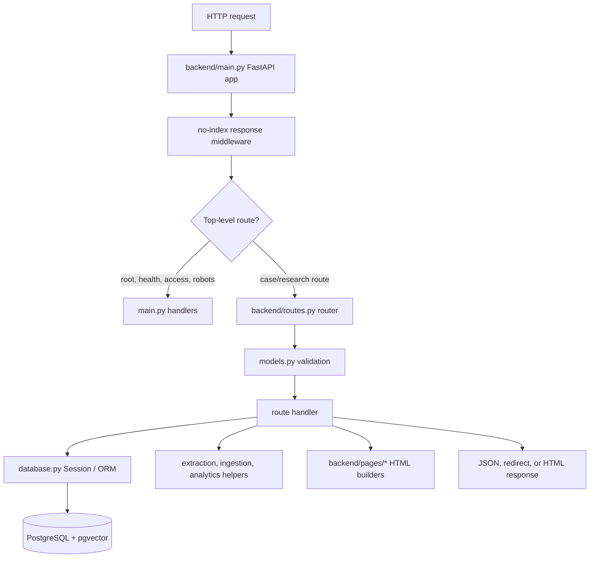

# API and Route Flow

This walkthrough explains how an HTTP request moves through the active FastAPI
application. The central architectural fact is that `backend/routes.py` owns
both a large portion of the API contract and generated research UI pages. It is
therefore the first module to map carefully before attempting organization or
extraction from the file.

## Entry Point

`backend/main.py` creates the FastAPI application and includes the router from
`backend/routes.py`:

```text
backend/main.py
  -> FastAPI()
  -> startup event
  -> init_db()
  -> app.include_router(router)
  -> root/health/access/robots routes
```

The startup event initializes database behavior before normal requests are
served. The root route redirects to `/data-explorer`; `/health` returns the
backend health payload. The access helpers and no-index middleware are also
owned by `main.py`, not by the cases router.



## Module Roles

| Module | Responsibility | Safe refactoring boundary |
| --- | --- | --- |
| `backend/main.py` | Application creation, startup, health, access helpers, robots response, and router inclusion | Keep process/application lifecycle separate from domain route handlers |
| `backend/routes.py` | API routes, request orchestration, database queries, analytics delegation, and selected generated UI responses | Split only after route ownership and shared helper dependencies are inventoried |
| `backend/models.py` | Pydantic request and response contracts | Preserve field names, bounds, defaults, and response compatibility |
| `backend/database.py` | SQLAlchemy engine, session dependency, ORM entities, and environment-backed DB selection | Do not change schema or connection precedence as part of a route-only refactor |
| `backend/citations.py` | Case/statute extraction, offset validation, resolution, and metrics | Keep extraction separate from route formatting and browser behavior |
| `backend/citation_map.py` | Read-oriented authority graph and citation intelligence calculations | Routes should delegate bounded analytics rather than duplicate graph logic |
| `backend/ingestion.py` | Provenance-aware create/merge behavior | Route imports must preserve source identity, priority, hashes, and conflicts |
| `backend/pages/` | Page-specific HTML builders for Data Explorer, Citation Map, Citation Pass, Live Analysis, Judge Outcomes, and prototype surfaces | Move page rendering without changing API payload contracts |

## Route Families

`routes.py` exposes several coherent families. The generated reference at
`docs/API_REFERENCE.generated.md` is the complete route inventory and should
be regenerated after contract changes.

### Core Case And Search Routes

- `POST /ingest` creates a case through the canonical ingest path.
- `POST /ingest/merge` merges a source record using provenance and source priority.
- `GET /cases/{case_id}` returns a canonical case.
- `POST /search` performs case-level search using semantic, lexical, hybrid, or metadata modes.
- `POST /search/chunks` retrieves matching passages.
- `POST /search/chunks/grouped` groups passage results by parent case.
- `GET /analytics/search/cases` powers the active case-search interface.
- `GET /analytics/search/cases/{case_id}` returns the inline reader payload.

Case search requests use `CaseSearchRequest` from `models.py`. Important controls
include search mode, semantic/lexical weights, candidate-pool bounds, page
size bounds, dates, court, source, language, processing status, tag filters,
citation filters, and citing-count ranges. Hybrid mode rejects a zero combined
weight, and tag filters must use `category:value` syntax.

### Citation And Legislation Routes

- Case reader and citation-pass routes expose stored citation rows, chunk links,
  offsets, normalized references, resolution state, and target context.
- Citation Intelligence and Citation Map routes delegate graph calculations to
  `backend/citation_map.py`.
- Legislation routes resolve canonical instrument keys and pinpoints through the
  separate statute-reference layer.
- CSV companions exist for selected graph and analytics views.

The route layer must not reinterpret stored evidence. Citation offsets belong to
backend extraction/chunk data. Case citations and IRPA/IRPR or other statute
references remain separate payload and persistence layers.

### Research UI Routes

The active UI is served through HTML responses assembled by page modules and
route helpers:

| Route | Status | Role |
| --- | --- | --- |
| `/data-explorer` | Active | Main research interface and inline case reader |
| `/citation-map` | Active | Citation graph and authority analytics workbench |
| `/live-analysis` | Active prototype | In-memory DOCX/text-PDF extraction and review |
| `/citation-pass` | QA only | Deterministic extraction and offset comparison |
| `/case-reader` | Compatibility | Redirects legacy bookmarks into the active reader workflow |
| `/quick-search` | Supporting | Lightweight search interface |
| `/testing`, `/prototype` | Test/legacy | Do not treat as the active product contract |

`backend/routes.py` imports page builders such as
`data_explorer_page_html`, `citation_map_html`, `citation_pass_page_html`, and
`live_analysis_page_html`. The generated frontend markup, CSS, and JavaScript
are coupled to their API payload shape until browser-level tests are stronger.

### Live Analysis Boundary

`POST /live-analysis/analyze` accepts a multipart file and delegates extraction
to `backend/live_analysis.py`. It returns text, paragraph/page locations, case
citation rows, statute rows, and summary counts without creating database
records. `POST /live-analysis/resolve` is a separate batched, read-only local
match against case metadata. Neither route should call external resolution
services or persist uploads.

## Request Processing Pattern

Most route handlers follow this pattern:

1. FastAPI matches the path and HTTP method.
2. Pydantic validates path, query, body, or multipart parameters.
3. `Depends(get_db)` supplies a SQLAlchemy session where database access is needed.
4. The handler applies route-specific bounds and chooses a helper or query path.
5. A helper performs extraction, ingestion, search, or analytics work.
6. ORM rows or computed dictionaries are shaped into the declared response model.
7. FastAPI returns JSON, HTML, a redirect, or a controlled `HTTPException`.

Do not hide validation in the UI. Request bounds and semantic distinctions must
remain enforceable at the API boundary.

## Dependency And Ownership Risks

1. `routes.py` is a high-blast-radius module: API handlers and embedded UI
	behavior can fail independently while still returning an HTTP 200 response.
2. `routes.py` imports several source-specific or operational helpers, so a
	simple module split can introduce import cycles or startup failures.
3. Search, reader, citation, statute, metadata, and analytics response shapes
	are consumed by generated JavaScript and tests.
4. Database query behavior depends on PostgreSQL JSON operators and pgvector;
	SQLite-style assumptions are not valid for production route behavior.
5. `/case-reader`, `/citation-pass`, `/testing`, and `/prototype` contain legacy
	or QA semantics that must not displace `/data-explorer` as the active path.
6. Access-page settings currently provide a login surface but no general route
	enforcement; no-index headers are not authentication.

## Refactoring Sequence

1. Preserve `main.py` and router import behavior while inventorying route groups.
2. Extract one cohesive route family with its schemas and tests, keeping shared
	helpers in a clearly named module.
3. Move page rendering independently from query/response assembly.
4. Add route-level tests for successful, invalid, bounded, and empty-result cases.
5. Add browser smoke coverage before changing generated UI wrappers or scripts.
6. Regenerate `docs/API_REFERENCE.generated.md` after public contract changes.
7. Update `SYSTEM_REFERENCE.md`, `DOCS_INDEX.md`, and this walkthrough when
	ownership or active route status changes.

## Validation Checkpoint

Run the narrowest check for the touched route family first:

```powershell
.\venv\Scripts\python.exe -m py_compile backend\main.py backend\routes.py backend\models.py
.\venv\Scripts\python.exe -m pytest tests\test_api.py -q
```

For generated UI changes, also run:

```powershell
.\venv\Scripts\python.exe -m pytest tests\test_feature_tabs.py -q
```

Then perform a bounded browser check for `/data-explorer`, search-to-reader,
and the affected route. Do not call the route refactor complete based only on
Python import success.

<SwmMeta version="3.0.0" repo-id="Z2l0aHViJTNBJTNBTGl0SW50ZWxwcm9qZWN0JTNBJTNBZ3JleXN0b25lLWRhbg==" repo-name="LitIntelproject"><sup>Powered by [Swimm](https://app.swimm.io/)</sup></SwmMeta>
