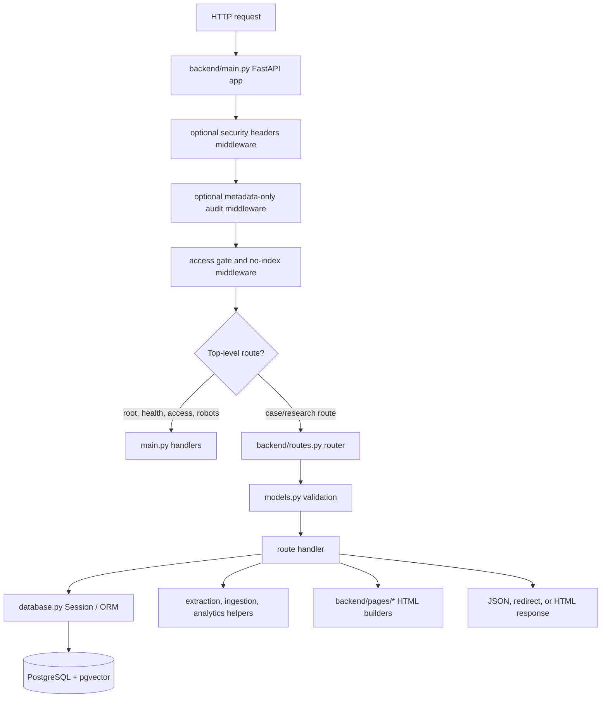

# API and Route Flow

This walkthrough explains how an HTTP request moves through the active FastAPI
application. The central architectural fact is that `backend/routes.py` owns
both a large portion of the API contract and generated research UI pages. It is
therefore the first module to map carefully before attempting organization or
extraction from the file.

## Entry Point

`backend/main.py` creates the FastAPI application and includes the router from
`backend/routes.py`:

```text
backend/main.py
  -> FastAPI()
  -> startup event
  -> init_db()
  -> app.include_router(router)
  -> root/health/access/robots routes
```

The startup event initializes database behavior before normal requests are
served. The root route redirects to `/data-explorer`; `/health` returns the
backend health payload. The access helpers and no-index middleware are also
owned by `main.py`, not by the cases router.

`main.py` also registers the pure-ASGI `RequestAuditMiddleware` from
`backend/audit.py`. It is a pass-through unless `CASELIBRARY_AUDIT_LOG` names a
file. Enabled auditing wraps only the response status, without consuming
request or response bodies, and writes one JSON metadata record after the
request completes. Route templates replace user-supplied path parameters;
unknown paths use `<unmatched>`. Query strings, filenames, headers, cookies,
and document content are never included, on sensitive routes or elsewhere.
Client addresses use HMAC-SHA256 with a random process-local key; raw addresses
require the separate `CASELIBRARY_AUDIT_LOG_RAW_ADDRESS=true` opt-in.
The rotating file retains three 5 MiB backups. Configuration and write errors
are suppressed without replacing responses or application exceptions.
This remains distinct from Uvicorn/proxy access logs and does not add
authentication. Operator setup is in [SETUP.md](../SETUP.md#optional-request-audit-log);
focused coverage is in `tests/test_audit.py`.

When `CASELIBRARY_SECURITY_HEADERS=1`, `main.py` registers the pure-ASGI
`SecurityHeadersMiddleware` from `backend/security_headers.py` outermost, ahead
of audit and the access/no-index middleware. It adds headers on response-start
messages without inspecting or buffering streaming bodies, and it leaves any
route-set headers in place. It remains disabled by default. HSTS depends on an
HTTPS ASGI scheme or `X-Forwarded-Proto: https`; CSP is report-only by default,
with enforcement an explicitly opt-in, untested mode. The CSP origins are
derived from current generated-page output under `backend/pages/`; re-scan page
output and review browser console findings as those pages change. Activation
and report review are documented in
[`docs/SECURITY_HEADERS.md`](../docs/SECURITY_HEADERS.md); focused coverage is
in [`tests/test_security_headers.py`](../tests/test_security_headers.py).


```mermaid
flowchart TD
	 Request[HTTP request] --> App[backend/main.py FastAPI app]
	 App --> SecurityHeaders[optional security headers middleware]
	 SecurityHeaders --> Audit[optional metadata-only audit middleware]
	 Audit --> Middleware[access gate and no-index middleware]
	 Middleware --> TopLevel{Top-level route?}
	 TopLevel -->|root, health, access, robots| MainRoutes[main.py handlers]
	 TopLevel -->|case/research route| Router[backend/routes.py router]
	 Router --> Validate[models.py validation]
	 Validate --> Handler[route handler]
	 Handler --> Database[database.py Session / ORM]
	 Handler --> Helpers[extraction, ingestion, analytics helpers]
	 Handler --> PageModules[backend/pages/* HTML builders]
	 Database --> PostgreSQL[(PostgreSQL + pgvector)]
	 Handler --> Response[JSON, redirect, or HTML response]
```

## Module Roles

| Module | Responsibility | Safe refactoring boundary |
| --- | --- | --- |
| `backend/main.py` | Application creation, startup, health, access helpers, robots response, and router inclusion | Keep process/application lifecycle separate from domain route handlers |
| `backend/audit.py` | Optional rotating metadata-only request audit log | Keep logging fail-open and never inspect document content |
| `backend/security_headers.py` | Opt-in pure-ASGI response headers, HTTPS-aware HSTS, and CSP | Preserve existing headers and streaming; default disabled |
| `backend/routes.py` | API routes, request orchestration, database queries, analytics delegation, and selected generated UI responses | Split only after route ownership and shared helper dependencies are inventoried |
| `backend/models.py` | Pydantic request and response contracts | Preserve field names, bounds, defaults, and response compatibility |
| `backend/database.py` | SQLAlchemy engine, session dependency, ORM entities, and environment-backed DB selection | Do not change schema or connection precedence as part of a route-only refactor |
| `backend/citations.py` | Case/statute extraction, offset validation, resolution, and metrics | Keep extraction separate from route formatting and browser behavior |
| `backend/citation_map.py` | Read-oriented authority graph and citation intelligence calculations | Routes should delegate bounded analytics rather than duplicate graph logic |
| `backend/ingestion.py` | Provenance-aware create/merge behavior | Route imports must preserve source identity, priority, hashes, and conflicts |
| `backend/pages/` | Page-specific HTML builders for Data Explorer, Citation Map, Citation Pass, Live Analysis, and prototype surfaces | Move page rendering without changing API payload contracts |

## Route Families

`routes.py` exposes several coherent families. The generated reference at
`docs/API_REFERENCE.generated.md` is the complete route inventory and should
be regenerated after contract changes.

### Core Case And Search Routes

- `POST /ingest` creates a case through the canonical ingest path.
- `POST /ingest/merge` merges a source record using provenance and source priority.
- `GET /cases/{case_id}` returns a canonical case.
- `POST /search` performs case-level search using semantic, lexical, hybrid, or metadata modes.
- `POST /search/chunks` retrieves matching passages.
- `POST /search/chunks/grouped` groups passage results by parent case.
- `GET /api/ai-mode` reports the configured enhanced API mode (`off`, `local`, or
  `hosted`). Off is the default; API search then defaults to lexical and
  `/research` returns a clear disabled response without retrieval or generation.
- `GET /analytics/search/cases` powers the active case-search interface.
- `GET /analytics/search/cases/{case_id}` returns the inline reader payload.
- `GET /issue-brief?tag=category:value` builds a read-only tagged-decision brief.
- `/issue-brief-ui?tag=category:value` renders the corresponding print-oriented
  page through `backend/pages/issue_brief.py`; an empty tag has an explicit empty
  state. It shows at most 12 tagged-decision links and discloses the shown/total
  count; the JSON response retains the complete decision list.

Case search requests use `CaseSearchRequest` from `models.py`. Important controls
include search mode, semantic/lexical weights, candidate-pool bounds, page
size bounds, dates, court, source, language, processing status, tag filters,
citation filters, and citing-count ranges. Hybrid mode rejects a zero combined
weight, and tag filters must use `category:value` syntax.

The issue brief matches one exact `category:value` in the active tag taxonomy
and counts tagged cases once. It reads yearly decision outcomes from
`reader_extracted` metadata; each percentage uses all tagged decisions in the
year as its denominator and includes the unclassified count and denominator in
the response. Top authorities count stored citation occurrences with resolved
case targets, while distinct tagged source decisions are counted separately.
Unresolved citations and statute references are outside that authority query.
Decision and authority links point to `/case-reader?case_id=…`, keeping the
brief traceable to canonical case records.
### Saved Search Routes

- `POST /saved-searches` creates a saved query with a default empty filter object.
- `GET /saved-searches` returns all saved searches and returns `[]` when none exist.
- `GET /saved-searches/{search_id}` returns its persisted case alerts.
- `PUT` and `DELETE /saved-searches/{search_id}` update or remove a saved query.
- `POST /saved-searches/{search_id}/check` returns recent recorded alerts and
  advances the last-check timestamp; alert discovery itself is not scheduled
  or performed by this route.

These endpoints use dedicated saved-search and alert tables and do not alter
the established `POST /search` request or result behavior.

### Citation And Legislation Routes

- Case reader and citation-pass routes expose stored citation rows, chunk links,
  offsets, normalized references, resolution state, and target context.
- Citation Intelligence and Citation Map routes delegate graph calculations to
  `backend/citation_map.py`.
- Legislation routes resolve canonical instrument keys and pinpoints through the
  separate statute-reference layer.
- CSV companions exist for selected graph and analytics views.

### Read-only analytics cache

The About statistics, FC activity analytics, and Judge Profile list handlers
delegate their repeated read work to `backend/analytics_service.py`, which owns
the small process-local TTL cache. Keys use the endpoint and its complete
validated query-parameter set. A successful response reports `X-Cache: hit` only
when this worker supplied a prior cached result; a first request, expired entry,
or disabled cache reports `miss`. Failures are not stored, and the clear helper
is available for isolated tests and maintenance. Exact TTL configuration and
freshness boundaries are documented in
[`SYSTEM_REFERENCE.md`](../SYSTEM_REFERENCE.md#analytics-cache-settings);
focused coverage is in [`tests/test_analytics_cache.py`](../tests/test_analytics_cache.py).

The route layer must not reinterpret stored evidence. Citation offsets belong to
backend extraction/chunk data. Case citations and IRPA/IRPR or other statute
references remain separate payload and persistence layers.

### Research UI Routes

The active UI is served through HTML responses assembled by page modules and
route helpers:

| Route | Status | Role |
| --- | --- | --- |
| `/data-explorer` | Active | Main research interface and inline case reader |
| `/citation-map` | Active | Citation graph and authority analytics workbench |
| `/live-analysis` | Active prototype | In-memory DOCX/text-PDF extraction and review |
| `/citation-pass` | QA only | Deterministic extraction and offset comparison |
| `/case-reader` | Compatibility | Redirects legacy bookmarks into the active reader workflow |
| `/quick-search` | Supporting | Lightweight search interface |
| `/testing`, `/prototype` | Test/legacy | Do not treat as the active product contract |

`backend/routes.py` imports page builders such as
`data_explorer_page_html`, `citation_map_html`, `citation_pass_page_html`, and
`live_analysis_page_html`. The generated frontend markup, CSS, and JavaScript
are coupled to their API payload shape until browser-level tests are stronger.

### Live Analysis Boundary

`POST /live-analysis/analyze` accepts a multipart file and delegates extraction
to `backend/live_analysis.py`. It returns text, paragraph/page locations, case
citation rows, statute rows, and summary counts without creating database
records; resolved statute rows now carry local authority document and section
details while unresolved rows keep an explicit status. `POST /live-analysis/resolve`
is a separate batched, read-only local match against case metadata. Neither
route should call external resolution services or persist uploads.

Both successful POST responses return the extracted source text and must use
`Cache-Control: no-store` and `Pragma: no-cache`; focused coverage is in
`tests/test_live_analysis.py`. These headers do not authenticate the caller.
Route handlers read upload bytes in bounded chunks and share parser/resource
caps with memo analysis and de-identification. The canonical defaults and
environment override names live in `backend/resource_limits.py`; route-level
HTTP 413 errors explain which cap was exceeded. Starlette multipart parsing can
spool bytes before a route starts reading, so these checks do not replace an
upstream request-body limit. See
[`docs/reports/privacy-security-review.md`](../docs/reports/privacy-security-review.md)
for the scoped storage, parser, error, and de-identification limits. Deployment
access control remains a separate boundary; the app's no-index middleware is
not authentication.

`backend/pages/live_analysis.py` renders this response as a temporary reader.
Its Case citations and Statutes inspector tabs group only the response rows
(case authority/reference and statute authority document respectively), retain
the source `offset_start` for scroll-back, and never create browser-owned
replacement spans. Canonical-case-only reader features such as metadata tabs,
chunk mode, linked authority panes, assessment overlays, and graph analytics
remain in `/data-explorer`; an upload is not a canonical case.

### Memo Suggestion Boundary

[`backend/memo_citation_check.py`](../backend/memo_citation_check.py) preserves
the legacy memo treatment/related/missing outputs and adds a separate
`suggestions` projection from
[`backend/memo_authority_suggestions.py`](../backend/memo_authority_suggestions.py).
Reuse the already extracted document and statute rows; never persist/log the
memo or send it to another service. The helper queries only derived signals and
canonical metadata/edges, never candidate decision text.

The rationale is traceable co-citation frequency, not popularity of an
authority's own tags or an inference about its holding. Shared V3 tags and exact
statute identities form an OR cohort; repeated source/target citations count
once. A why explanation identifies shared signals from the actual citing
decisions. Exact memo citation identities/IDs exclude already cited authorities.
Incomplete nested statute extraction must not silently broaden the signal.

Contrary means a strict majority of the authority's citing decisions have a
stored Minister-relative loss, with at least five citing decisions. Unknown
outcomes are unclassified and remain in the denominator. Do not substitute
applicant-relative `outcome_status`, infer outcomes from the uploaded draft, or
label this citation treatment. Capped coverage is not a representative sample.

[`backend/memo_suggestion_models.py`](../backend/memo_suggestion_models.py)
owns the additive contract;
[`backend/pages/memo_authority_suggestions.py`](../backend/pages/memo_authority_suggestions.py)
owns its escaped descriptive renderer. The existing route needs no edit.
The new page section says **Suggestions, not legal advice**; legacy output is
unchanged. Statistical definitions and residual limits live in
[`docs/reports/memo-missing-authority.md`](../docs/reports/memo-missing-authority.md)
and the canonical [system reference](../SYSTEM_REFERENCE.md).

Focused validation is `python -m pytest -q
tests/test_memo_authority_suggestions.py tests/test_memo_suggestion_integration.py
tests/test_memo_citation_check.py`. Use invented fixtures/compiled SQL and disable
dotenv and non-fixture database connections before imports; do not probe a live
database. Fixture-only browser or static UI assertions cover the additive page.

## Request Processing Pattern

Most route handlers follow this pattern:

1. FastAPI matches the path and HTTP method.
2. Pydantic validates path, query, body, or multipart parameters.
3. `Depends(get_db)` supplies a SQLAlchemy session where database access is needed.
4. The handler applies route-specific bounds and chooses a helper or query path.
5. A helper performs extraction, ingestion, search, or analytics work.
6. ORM rows or computed dictionaries are shaped into the declared response model.
7. FastAPI returns JSON, HTML, a redirect, or a controlled `HTTPException`.

Do not hide validation in the UI. Request bounds and semantic distinctions must
remain enforceable at the API boundary.

## Dependency And Ownership Risks

1. `routes.py` is a high-blast-radius module: API handlers and embedded UI
	behavior can fail independently while still returning an HTTP 200 response.
2. `routes.py` imports several source-specific or operational helpers, so a
	simple module split can introduce import cycles or startup failures.
3. Search, reader, citation, statute, metadata, and analytics response shapes
	are consumed by generated JavaScript and tests.
4. Database query behavior depends on PostgreSQL JSON operators and pgvector;
	SQLite-style assumptions are not valid for production route behavior.
5. `/case-reader`, `/citation-pass`, `/testing`, and `/prototype` contain legacy
	or QA semantics that must not displace `/data-explorer` as the active path.
6. Access enforcement is off by default. A non-empty `CASELIBRARY_ACCESS_PASSWORD`
	enables signed-cookie checks for every route except `/access`, `/access/login`,
	`/health`, and mounted static assets, without a localhost bypass. HTML requests
	redirect to login and API requests receive `401`; `POST /access/logout` clears
	the browser cookie. No-index headers are not authentication. See
	`SYSTEM_REFERENCE.md` for opt-in configuration and cookie limitations.

## Route-Family Contracts

Treat each family as a candidate module only after its shared dependencies are
listed:

| Family | Main inputs | Main outputs | Primary risk |
| --- | --- | --- | --- |
| Ingestion | source payload, source identity, session | canonical case/source rows | duplicate or conflicting identity |
| Case/search | filters, query, paging, mode | bounded cases or chunks | altered defaults or database semantics |
| Reader | case ID, enrichment rows, provenance | evidence payload and HTML | offset/highlight mismatch |
| Citation/statute | case text, chunks, filters | separate derived rows | layer contamination or span drift |
| Analytics | case graph and filters | bounded metrics/maps/exports | unbounded joins or stale metrics |
| Live analysis | uploaded bytes | ephemeral extracted payload | accidental persistence or external calls |

The handler should validate and orchestrate. Query construction belongs in a
query/service module, response shaping in a mapper, and HTML/CSS/JavaScript in
the page surface. This is the desired direction, not a license to move all
helpers at once.

## Characterization Checklist

Before extracting a family, capture its paths and methods, request defaults and
bounds, success/empty/error responses, database writes, generated-page names,
and callers from tests/scripts. Preserve imports through a temporary wrapper,
then remove the wrapper only after the focused API and feature tests pass.

## Refactoring Sequence

1. Preserve `main.py` and router import behavior while inventorying route groups.
2. Extract one cohesive route family with its schemas and tests, keeping shared
	helpers in a clearly named module.
3. Move page rendering independently from query/response assembly.
4. Add route-level tests for successful, invalid, bounded, and empty-result cases.
5. Add browser smoke coverage before changing generated UI wrappers or scripts.
6. Regenerate `docs/API_REFERENCE.generated.md` after public contract changes.
7. Update `SYSTEM_REFERENCE.md`, `DOCS_INDEX.md`, and this walkthrough when
	ownership or active route status changes.

## Validation Checkpoint

Run the narrowest check for the touched route family first:

```powershell
.\venv\Scripts\python.exe -m py_compile backend\main.py backend\routes.py backend\models.py
.\venv\Scripts\python.exe -m pytest tests\test_api.py -q
```

For generated UI changes, also run:

```powershell
.\venv\Scripts\python.exe -m pytest tests\test_feature_tabs.py -q
```

Then perform a bounded browser check for `/data-explorer`, search-to-reader,
and the affected route. Do not call the route refactor complete based only on
Python import success.

<SwmMeta version="3.0.0" repo-id="Z2l0aHViJTNBJTNBTGl0SW50ZWxwcm9qZWN0JTNBJTNBZ3JleXN0b25lLWRhbg==" repo-name="LitIntelproject"><sup>Powered by [Swimm](https://app.swimm.io/)</sup></SwmMeta>
