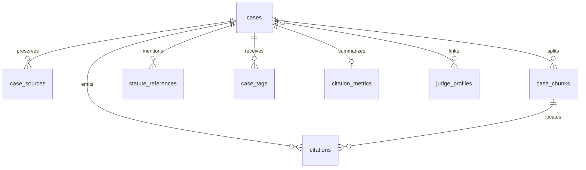

# Database and Schema

## Ownership

`backend/database.py` owns the SQLAlchemy engine, environment-backed database
selection, ORM declarations, session dependency, and database initialization.
`alembic/` owns deployable schema evolution. The generated reference at
`docs/SCHEMA_REFERENCE.generated.md` describes the ORM metadata but is not a
migration substitute.

## Storage Layers

| Layer | Main responsibility |
| --- | --- |
| PostgreSQL | Canonical cases, derived research records, source provenance, and operational state |
| pgvector | 1536-dimensional case/OpenAI vectors and model-versioned local chunk vectors |
| SQLite/Parquet/JSONL | Source-specific staging and acquisition artifacts |
| `lotd` schema | Isolated Luck of the Draw III side-project data |
| `data/reference_library` | Separate legislation, guidance, and reference documents |

## Core Relationships

`Case` is the canonical parent. It owns sources, chunks, citations, statute
references, tags, judge links, and optional citation metrics. `Citation` stores
an occurrence from a source case, an optional resolved target, chunk identity,
exact offsets, provenance, and unresolved state. `StatuteReference` is an
independent occurrence layer and must not be treated as a case citation.

Saved searches are a separate research-preference layer. `SavedSearch` stores a
named query, mode, and JSON filter object; `SearchAlert` records a case match
and optional chunk. `FCActivityAlert` is separate activity-alert storage. These
tables are created by the chained Alembic revision; alert checks do not alter
case-search or citation evidence.


```mermaid
erDiagram
	cases ||--o{ case_sources : preserves
	cases ||--o{ case_chunks : splits
	cases ||--o{ citations : emits
	cases ||--o{ statute_references : mentions
	cases ||--o{ case_tags : receives
	cases ||--o| citation_metrics : summarizes
	cases }o--o{ judge_profiles : links
	case_chunks ||--o{ citations : locates
```

## Connection Rules

- Project-root `.env` is loaded before `backend/.env`, both with `override=True`;
  dotenv values override the shell and the latter file wins when both exist.
- Any explicit `POSTGRES_*` setting takes precedence over inherited `DATABASE_URL`.
- Disposable migration validation refuses either dotenv path, including
  symlinks, before importing database settings and supplies all five
  `POSTGRES_*` settings. Shell settings alone cannot isolate a database when
  dotenv overrides exist.
- The engine uses `pool_pre_ping=True` and SQLAlchemy sessions are supplied through `get_db`.
- [`backend/db_limits.py`](../backend/db_limits.py) supplies only opt-in engine
  kwargs. No variables means exactly `{}`, preserving SQLAlchemy defaults.
  PostgreSQL receives per-connection statement/lock options; SQLite omits these
  and QueuePool-only kwargs without replacing its in-memory pool.
- Configuration belongs to each engine/process, not the database globally.
  [`engine_without_timeout()`](../backend/db_limits.py) builds a separate script
  engine without either query timeout, retaining configured pool settings.
  Its URL import is lazy; an explicit URL avoids database-module initialization.
  Script sessions must use this engine explicitly, close/rollback appropriately,
  and dispose it. Server/role limits remain in force.
- Accepted ranges, small-server suggestions, dotenv precedence, and lifecycle
  are maintained in the canonical
  [configuration reference](../docs/CONFIGURATION_REFERENCE.md#opt-in-database-limits);
  mocked, connection-free checks are in
  [`tests/test_db_limits.py`](../tests/test_db_limits.py).
- Vector dimensions are schema contracts: common OpenAI vectors use 1536 and local BGE-M3 chunk vectors use 1024.
- Canonical full-text hashes are calculated from stored text, not trusted client input.

## Per-model vector table scaffold

The current vector tables remain unchanged. There is no `backend/embedding_registry.py`
yet, and no runtime path invokes the proposed
[`backend/vector_tables.py`](../backend/vector_tables.py) helper. Given a future
registry entry, the helper builds SQLAlchemy metadata with the registry's fixed
vector dimensions, enforces exact `chunk_embeddings_<slug>` table names, and
adds non-null per-row `model_name` and `model_version` columns. It compiles
PostgreSQL table/index DDL only; it never creates an engine, connects, or
executes statements. The focused tests validate only compiled SQL, including
rejection of arbitrary and legacy `case_chunk_embeddings_*` names.

There is no embedding registry on the current main branch. Future search should
resolve the requested model/version through that registry, select its table and
dimensions, and reject unknown models or query-width mismatches rather than
falling back to another model's vectors. A separately authorized one-time bulk
job could embed approved chunks on rented compute and load validated
`chunk_id`, vector, model-name, and model-version rows before building the ANN
index; this helper does not implement or run that workflow.

The design alternatives, model-identity and provenance boundaries, and a
non-Alembic migration template are documented in
[`docs/proposed-migrations/embedding-per-model-tables.md`](../docs/proposed-migrations/embedding-per-model-tables.md)
and the adjacent `.py.txt` template. Both are proposals, not current schema or
deployment instructions. Any future schema change requires separate review and
a real migration prepared against the then-current single Alembic head.

## Migration Discipline

For a model change, update the ORM and API contract as needed, create an
Alembic migration, inspect nullability/index/foreign-key behavior, test the
affected routes, and regenerate the schema reference:

```powershell
.\venv\Scripts\python.exe scripts\generate_schema_reference.py
python -m alembic current
python -m alembic heads
```

Do not edit `docs/SCHEMA_REFERENCE.generated.md` manually. For production or
corpus-scale changes, document upgrade duration, locks, backfill scope, and
recovery before running a writer.

### Empty-database bootstrap and preservation

The deployable graph must also work without startup `create_all()`.
`alembic/versions/0001_case_metadata.py` checks table existence before column
inspection and preserves cosine HNSW creation on its fresh-table path before
returning. `alembic/versions/0015_fc_activity_classifications.py` creates a
missing activity parent before its foreign-key child using a frozen historical
schema, not live ORM metadata. Existing parent tables remain untouched.
`alembic/versions/0027_fc_activity_source_provenance.py` remains the owner of
later provenance additions; including those columns in the historical bootstrap
would break that upgrade. Revision `0037_cases_docket_number` adds the nullable
case docket number and declared index only when missing; it does not replace
pre-existing objects, and its downgrade is intentionally a no-op because the
revision cannot know which objects it created.

See `tests/test_migrations.py` for missing/existing-table guards, preserved
parent data/indexes through upgrade and downgrade, the real later provenance
upgrade, and single-head/multiple-head graph checks. The expected single head is
`0039_citation_refinement`, following `0038_search_indexes`. The PostgreSQL-gated docket test requires explicit
disposable test configuration, refuses dotenv overrides, and compares an
isolated empty schema migrated from zero with the `Case` model.
The independent migration
job in `.github/workflows/tests.yml` exercises empty PostgreSQL with pgvector,
extension availability, upgrade/current, graph-to-database head agreement, and
repeat upgrade. Its dotenv refusal is a database-isolation boundary, not a
change to application configuration precedence.

Historical revision identities are preserved. Already-stamped databases do
not rerun these repaired revisions; no production mutation or broad drift
repair is implied. The classification downgrade leaves its parent intact,
including a parent created by the bootstrap.

### Separate refinement storage (issue #281)

[`0039_citation_refinement`](../alembic/versions/0039_citation_refinement.py)
owns four additive tables and copies frozen base occurrence fields without
copying their target/offset/provision indexes. The standalone models in
[`backend/database.py`](../backend/database.py) introduce no ORM relationships
or runtime refinement wiring. The two refined occurrence tables index only
`source_case_id`; the status table uses that field as its primary key.
`source_citation_id` is deliberately not a foreign key: base citation rebuilds
must not delete refinement evidence. Paragraph-link deletion cascades from the
refined citation, not from a base citation.

The upgrade skips every pre-existing table entirely, including its indexes;
it is not schema reconciliation. The downgrade deliberately preserves all four
tables because their origin is unknowable. `init_db()` remains unchanged:
existing `create_all()` and metadata-based readiness include the new models.
No writer, reader, route, resolver, or backfill is enabled.
Integration with main preserves `0038_search_indexes` followed by this revision,
without renumbering either migration. Live Analysis's heuristic back-reference
links remain separate from these storage tables.
The [canonical current-state explanation](../SYSTEM_REFERENCE.md#refinement-storage-scaffold)
and [generated schema](../docs/SCHEMA_REFERENCE.generated.md) describe the
storage boundary; exact fields remain authoritative in code and migration.
[`tests/test_citation_refinement_migration.py`](../tests/test_citation_refinement_migration.py)
checks repeat upgrade, partial/pre-existing table preservation, no-op downgrade,
model/migration/base-field parity, PostgreSQL DDL compilation, indexes and keys
without executing a database migration. It also includes a gated integration test:
`CASELIBRARY_PGVECTOR_TESTS=1` requires complete disposable `POSTGRES_*` settings,
refuses root/backend dotenv overrides without reading them, and skips unavailable
PostgreSQL. In an isolated schema cleaned in `finally`, it upgrades from zero,
checks columns/types/nullability and key/index parity, invokes the real upgrade
function twice, and verifies no-op downgrade/re-upgrade preservation. This gated
test was skipped, not database-validated, during this change's focused checks.

## Refactoring Risks

The ORM file is a broad coupling point: routes, scripts, migrations, tests,
and generated schema docs depend on model names and relationships. Split model
declarations only with an import-safe base/model registration strategy. Never
move side-project tables into canonical models as a convenience, and never
use staging artifacts as proof of canonical capture.

## Model Responsibilities

The database module currently carries several responsibilities that should be
documented separately before movement:

1. Configuration precedence chooses the effective database URL and vector
	settings.
2. Engine/session setup controls connection lifecycle and dependency injection.
3. ORM declarations define canonical, derived, activity, and side-project
	persistence shapes.
4. Relationships and foreign keys define deletion and ownership behavior.
5. Initialization supports local startup but does not replace migrations.

The safe modularization direction is a settings/session boundary, a canonical
model package, derived-layer model modules, and isolated side-project models,
all registered on one metadata base. Alembic imports must continue to discover
every model needed for migration comparison.

## Schema Change Checklist

For every model change record the affected tables, nullable/default behavior,
indexes, foreign keys, vector dimensions, migration operation, backfill need,
and rollback. Confirm both a fresh schema and an existing populated database;
these are different checks. A generated schema document describes declared ORM
metadata, while the deployed database may still require inspection for drift.

## Validation

Use `tests/test_ingestion_merge.py`, importer tests, affected API tests, the
schema generator, and controlled migration inspection. A successful import is
not proof that an existing database matches the declared schema; inspect the
running database when drift is possible.

<SwmMeta version="3.0.0" repo-id="Z2l0aHViJTNBJTNBTGl0SW50ZWxwcm9qZWN0JTNBJTNBZ3JleXN0b25lLWRhbg==" repo-name="LitIntelproject"><sup>Powered by [Swimm](https://app.swimm.io/)</sup></SwmMeta>
