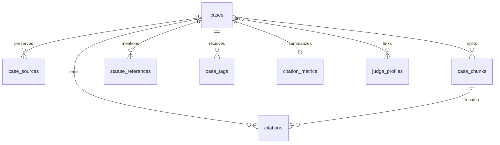

# Database and Schema

## Ownership

`backend/settings.py` owns grouped environment-backed configuration and dotenv
precedence. `backend/database.py` consumes its database settings and owns the
SQLAlchemy engine, ORM declarations, session dependency, and database
initialization.
`alembic/` owns deployable schema evolution. The generated reference at
`docs/SCHEMA_REFERENCE.generated.md` describes the ORM metadata but is not a
migration substitute.

## Storage Layers

| Layer | Main responsibility |
| --- | --- |
| PostgreSQL | Canonical cases, derived research records, source provenance, and operational state |
| pgvector | 1536-dimensional case/OpenAI vectors and model-versioned local chunk vectors |
| SQLite/Parquet/JSONL | Source-specific staging and acquisition artifacts |
| `lotd` schema | Isolated Luck of the Draw III side-project data |
| `data/reference_library` | Separate legislation, guidance, and reference documents |

## Core Relationships

`Case` is the canonical parent. It owns sources, chunks, citations, statute
references, tags, judge links, and optional citation metrics. `Citation` stores
an occurrence from a source case, an optional resolved target, chunk identity,
exact offsets, provenance, and unresolved state. `StatuteReference` is an
independent occurrence layer and must not be treated as a case citation.

Saved searches are a separate research-preference layer. `SavedSearch` stores a
named query, mode, and JSON filter object; `SearchAlert` records a case match
and optional chunk. `FCActivityAlert` is separate activity-alert storage. These
tables are created by the chained Alembic revision; alert checks do not alter
case-search or citation evidence.


```mermaid
erDiagram
	cases ||--o{ case_sources : preserves
	cases ||--o{ case_chunks : splits
	cases ||--o{ citations : emits
	cases ||--o{ statute_references : mentions
	cases ||--o{ case_tags : receives
	cases ||--o| citation_metrics : summarizes
	cases }o--o{ judge_profiles : links
	case_chunks ||--o{ citations : locates
```

## Connection Rules

- `backend/settings.py` loads `backend/.env` then project-root `.env` using
  `override=False`: exported environment values win over both files, while
  `backend/.env` retains precedence if both files define the same key.
- Any explicit `POSTGRES_*` setting takes precedence over inherited `DATABASE_URL`.
- Disposable migration validation refuses either dotenv path, including
  symlinks, before importing database settings and supplies all five
  `POSTGRES_*` settings. Process environment values are no longer overwritten
  by dotenv during ordinary application startup.
- `backend/search_service.py`, `backend/text_generation_providers.py`,
  `backend/embedding_providers.py`, and the `/research` route use grouped
  embedding/chat settings for the migrated AI values. Access, audit, rollout,
  citation, source, and resource-limit consumers remain at their existing
  owners; see `docs/CONFIGURATION_REFERENCE.md` for the remaining inventory.
- The engine uses `pool_pre_ping=True` and SQLAlchemy sessions are supplied through `get_db`.
- Vector dimensions are schema contracts: common OpenAI vectors use 1536 and local BGE-M3 chunk vectors use 1024.
- Canonical full-text hashes are calculated from stored text, not trusted client input.

## Migration Discipline

For a model change, update the ORM and API contract as needed, create an
Alembic migration, inspect nullability/index/foreign-key behavior, test the
affected routes, and regenerate the schema reference:

```powershell
.\venv\Scripts\python.exe scripts\generate_schema_reference.py
python -m alembic current
python -m alembic heads
```

Do not edit `docs/SCHEMA_REFERENCE.generated.md` manually. For production or
corpus-scale changes, document upgrade duration, locks, backfill scope, and
recovery before running a writer.

### Empty-database bootstrap and preservation

The deployable graph must also work without startup `create_all()`.
`alembic/versions/0001_case_metadata.py` checks table existence before column
inspection and preserves cosine HNSW creation on its fresh-table path before
returning. `alembic/versions/0015_fc_activity_classifications.py` creates a
missing activity parent before its foreign-key child using a frozen historical
schema, not live ORM metadata. Existing parent tables remain untouched.
`alembic/versions/0027_fc_activity_source_provenance.py` remains the owner of
later provenance additions; including those columns in the historical bootstrap
would break that upgrade.

See `tests/test_migrations.py` for missing/existing-table guards, preserved
parent data/indexes through upgrade and downgrade, the real later provenance
upgrade, and single-head/multiple-head graph checks. The expected single head is
`0031_paragraph_similarity`, which adds the bounded similarity posting indexes.
The independent migration
job in `.github/workflows/tests.yml` exercises empty PostgreSQL with pgvector,
extension availability, upgrade/current, graph-to-database head agreement, and
repeat upgrade. Its dotenv refusal is a database-isolation boundary, not a
change to application configuration precedence.

Historical revision identities are preserved. Already-stamped databases do
not rerun these repaired revisions; no production mutation or broad drift
repair is implied. The classification downgrade leaves its parent intact,
including a parent created by the bootstrap.

## Refactoring Risks

The ORM file is a broad coupling point: routes, scripts, migrations, tests,
and generated schema docs depend on model names and relationships. Split model
declarations only with an import-safe base/model registration strategy. Never
move side-project tables into canonical models as a convenience, and never
use staging artifacts as proof of canonical capture.

## Model Responsibilities

The database module currently carries several responsibilities that should be
documented separately before movement:

1. `backend/settings.py` centralizes grouped settings and configuration
	precedence; database and AI consumers use it incrementally.
2. Engine/session setup controls connection lifecycle and dependency injection.
3. ORM declarations define canonical, derived, activity, and side-project
	persistence shapes.
4. Relationships and foreign keys define deletion and ownership behavior.
5. Initialization supports local startup but does not replace migrations.

The safe modularization direction is a settings/session boundary, a canonical
model package, derived-layer model modules, and isolated side-project models,
all registered on one metadata base. Alembic imports must continue to discover
every model needed for migration comparison.

## Schema Change Checklist

For every model change record the affected tables, nullable/default behavior,
indexes, foreign keys, vector dimensions, migration operation, backfill need,
and rollback. Confirm both a fresh schema and an existing populated database;
these are different checks. A generated schema document describes declared ORM
metadata, while the deployed database may still require inspection for drift.

## Validation

Use `tests/test_ingestion_merge.py`, importer tests, affected API tests, the
schema generator, and controlled migration inspection. A successful import is
not proof that an existing database matches the declared schema; inspect the
running database when drift is possible.

<SwmMeta version="3.0.0" repo-id="Z2l0aHViJTNBJTNBTGl0SW50ZWxwcm9qZWN0JTNBJTNBZ3JleXN0b25lLWRhbg==" repo-name="LitIntelproject"><sup>Powered by [Swimm](https://app.swimm.io/)</sup></SwmMeta>
