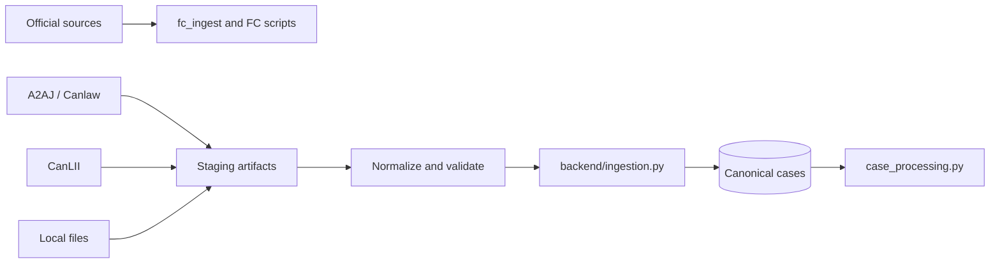

# Ingestion Pipeline

## Purpose

Ingestion preserves source material first, then enriches it through explicit
canonical and derived stages. Source acquisition is intentionally separated
from the canonical PostgreSQL case store so discovery, staging, import, and
processing can be measured independently.

## Source Families

| Family | Boundary | Key rule |
| --- | --- | --- |
| Federal Court | `fc_ingest/`, `scripts/fc_*`, `scripts/import_fc_decisions.py` | Discovery, retrieval, capture, and canonical import are separate states |
| A2AJ | `scripts/ingest_a2aj_*`, `scripts/curate_a2aj_*` | Unofficial dataset; preserve source identity and licence metadata |
| CanLII | `scripts/crawl_canlii.py`, seed importers, citation client | Respect access controls and retain secondary-source provenance |
| Canlaw | `canlaw/` and `scripts/import_canlaw_staging.py` | Staging database bridges through canonical ingestion; it does not write canonical tables directly |
| Reference library | `data/reference_library/` | Never insert reference documents into judicial case tables |

## Canonical Merge

`backend/ingestion.py` applies source priority only for conflict resolution.
Official-family sources outrank secondary sources, which outrank datasets and
synthetic records, but priority is not proof of legal accuracy. Conflicting
values remain visible in metadata. Every import should preserve source type,
name, stable ID, URL, retrieval time, hashes, licence/terms, and source-specific
metadata where available.

## Processing Handoff

After canonical write, processing may run independently and resumably:

1. Metadata and full-text hash.
2. Overall chunks.
3. Heading/paragraph chunks.
4. Case citations.
5. Statute and instrument references.

Target resolution is a later local pass. It must not be folded into source
extraction or treated as proof that an upstream citation was authoritative.

## Adapter Versus Merge Boundary

An adapter may fetch, parse, validate, and stage a source-specific record. It
should not decide that the record is the canonical case or overwrite a higher
priority value. `backend/ingestion.py` owns canonical identity, source
precedence, field merge behavior, conflict retention, source rows, and hashes.

The handoff payload should make source name/type, stable source ID, URL,
retrieval timestamp, licence/terms, raw/full-text content, content hashes,
source-specific metadata, and capture status explicit. Missing values and
conflicts are data-quality signals, not invitations to invent values.

## Failure States

Track discovery, fetch, parse, validation, staging, canonical merge, and
processing failures independently. A successful HTTP fetch is not successful
parsing; a staged row is not a canonical case; a canonical case is not fully
processed. Retry only the failed state when the job supports it, and preserve
the input scope and checkpoint so a recovery run is auditable.

## First Modularization Target

The lowest-risk extraction is a source adapter interface around one importer,
backed by a fixture and a dry-run report. Keep the existing merge function and
database writes unchanged until the adapter output is characterized. Then
extract merge policy from orchestration with conflict fixtures.

## Safety Controls

Use `--help`, bounded `--limit`, dry-run, preflight, checkpoints, state files,
and resume support where provided. Do not run competing PostgreSQL writers.
Never call a discovered or staged Federal Court record a captured judgment.

## Validation

Run importer-specific tests, `tests/test_ingestion_merge.py`, and a bounded
dry-run before broad writes. Record input scope, records seen, created/updated
counts, skipped/error reasons, provenance checks, and sampled canonical output.

<SwmMeta version="3.0.0" repo-id="Z2l0aHViJTNBJTNBTGl0SW50ZWxwcm9qZWN0JTNBJTNBZ3JleXN0b25lLWRhbg==" repo-name="LitIntelproject">Powered by [Swimm](https://app.swimm.io/)</SwmMeta>
