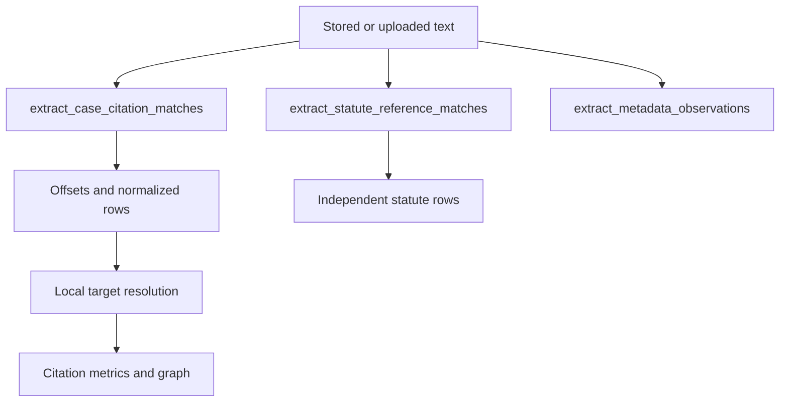

# Citation and Statute Extraction

## Separation Contract

`backend/citations.py` contains deterministic extraction and supporting
resolution helpers. The system has three distinct evidence layers:

1. Case-law citations in `citations`.
2. Statute and instrument references in `statute_references`.
3. Metadata observations and tags in their own payload/storage structures.

Extraction must not require a hosted AI call. Local target resolution happens
after extraction and may remain unresolved when the local corpus has no match.



## Case Citation Layer

Supported forms include neutral citations, reported decisions, named cases,
grounded aliases, bounded short forms, parentheticals, and source-specific
aliases. Rows retain citation kind, exact source/chunk offsets, normalized text,
provenance, optional target case, and unresolved state. Overlap handling and
party plausibility rules prevent narrative text from becoming a false citation.

## Statute Layer

IRPA and IRPR are the current quality priority. Nested provisions such as
`34(1)(f)`, running-text references, headings, punctuation-terminated forms,
plural provisions, Charter/Criminal Code references, and selected instruments
are handled independently from case-law matching. A higher row count is not an
improvement if precision or span integrity falls.

## Evidence Invariants

- `offset_start` and `offset_end` must identify the stored source text exactly.
- Chunk association must remain consistent with the source case and text.
- Statute rows must not be inserted into `citations`.
- Resolution must never rewrite the extracted occurrence or its provenance.
- Browser highlights consume backend offsets; they do not calculate replacements.

## QA Protocol

Every rule change needs a positive fixture, a negative/near-miss fixture, and
exact offset assertions. Run focused citation tests, then a bounded real-case
audit grouped by form, missing rows, unexpected rows, and span errors. Record
rough pickup and cleanliness separately; the current handoff records an
approximately 98.7% cohort pickup estimate and a more conservative 93.1%
case-level cleanliness signal.

```powershell
.\venv\Scripts\python.exe -m pytest tests\test_citations.py tests\test_citation_pipeline.py -q
```

## Refactoring Boundary

Keep regex/candidate logic, normalization, persistence orchestration, and
reader formatting separable. Preserve public helper names until callers and
focused tests have moved. Update citation QA docs whenever semantics change.

<SwmMeta version="3.0.0" repo-id="Z2l0aHViJTNBJTNBTGl0SW50ZWxwcm9qZWN0JTNBJTNBZ3JleXN0b25lLWRhbg==" repo-name="LitIntelproject"><sup>Powered by [Swimm](https://app.swimm.io/)</sup></SwmMeta>
