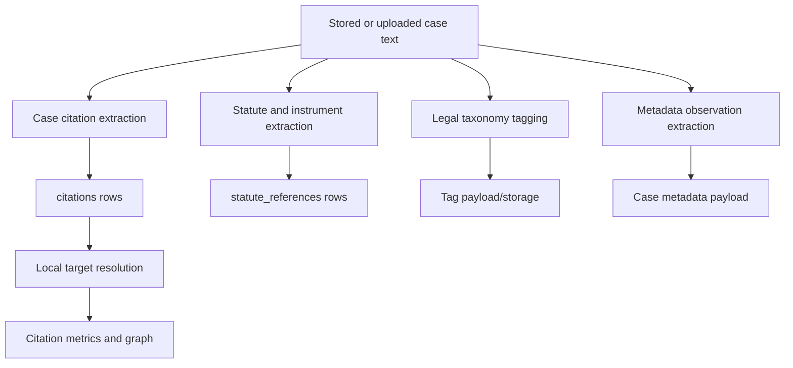

# Citation, Statute, and Tag Extraction

## Separation Contract

Case text is the shared input, but citation extraction, statute/instrument
extraction, and legal tagging are separate derived processes. They have
different rule sets, outputs, persistence paths, and quality measures. The
system has four distinct derived layers:

1. Case-law citations in `citations`.
2. Statute and instrument references in `statute_references`.
3. Metadata observations in the case metadata payload.
4. Legal taxonomy tags in their tag payload/storage structures.

`backend/citations.py` contains deterministic case-law and statute/instrument
extraction plus supporting resolution helpers. `backend/legal_tagger.py` and
`backend/legal_tagger_v2.py` apply the legal taxonomy independently. None of
these text-derived layers should require a hosted AI call. Local case-target
resolution happens after case-citation extraction and may remain unresolved
when the local corpus has no match.



## Shared Input And Processing Model

The processes normally run over the canonical case text, or over text supplied
by an upload-specific workflow. They may run in the ordered case-processing
pipeline, but ordering does not make their outputs one combined layer:

1. Metadata and full-text hash are refreshed.
2. Overall and heading/paragraph chunks are rebuilt.
3. Case citations are extracted and persisted.
4. Statute and instrument references are extracted and persisted.
5. Tags are applied by the legal taxonomy workflow.

Chunks provide source context and can provide chunk IDs. The original text
remains authoritative for evidence spans; a citation row, statute row, or tag
must not manufacture a new text location simply because another process found
one.

## Case Citation Extraction

The public case-layer entry point is `extract_case_citation_matches`. The
feature-flagged v2 path gathers candidates from structured pipeline rules and
regex candidates, promotes compatible case-name/neutral-citation pairs, adds
bounded short forms, ranks overlapping candidates, and keeps the best
non-overlapping spans. A legacy path remains available as a fallback and can
also use eyecite when installed.

Supported or partially supported forms include neutral citations such as
`2024 FC 100`, CanLII citations, reported reporter citations, full party-name
citations, case-name aliases, bounded short forms, parentheticals, paragraph
pinpoints, and source-specific aliases. Normalization standardizes whitespace,
reporter casing, party formatting, and numeric citation components without
changing the original `citation_text`.

Persistence is handled by `extract_citations_from_text` for a text fragment and
`rebuild_citations_for_case` for a case rebuild. Rows retain citation kind,
exact source/chunk offsets, original text, normalized text, optional target
case, and unresolved state. Self-case filtering prevents a case from linking to
itself through its own title. Overlap ranking and party-plausibility checks
reduce false positives from ordinary narrative text.

### Case Citation Resolution

Resolution is deliberately after extraction. Neutral citations first query the
local canonical case citation and secondary-citation fields, including the
`FC`/`FCT` compatibility variant. If local resolution fails, an optional
CanLII client may look up a neutral citation and feed returned citation values
back through local resolution. Short-form and case-name rows use normalized
term variants against case title and citation fields. A failed lookup leaves a
valid extracted occurrence marked unresolved; it must not delete or rewrite the
occurrence.

## Statute And Instrument Extraction

The public law-layer entry point is `extract_statute_reference_matches`. It
collects statute/instrument candidates from deterministic rules, adds anchored
provision candidates where a heading or contextual anchor supplies the legal
instrument, then applies the same best non-overlapping selection principle.
`extract_statute_references_from_text` converts selected matches into
`StatuteReference` rows, and `parse_legislation_citation` derives an optional
instrument key, pinpoint, and legislation URL.

IRPA and IRPR are the current quality priority. Covered forms include:

- Abbreviations and punctuation variants: `IRPA s. 34(1)(f)`, `IRPA, s. 34(1)(f)`, and `IRPR s 245(1)(c)`.
- Nested provisions: `34(1)(f)`, subsection and paragraph forms, and lists or ranges.
- Long forms: the Immigration and Refugee Protection Act/Regulations with
  Canadian statute identifiers.
- Other Canadian laws: the Charter, Criminal Code, Federal Courts Act, Orders,
  Rules, and SOR/SI citation forms.
- International instruments: Refugee Convention and Vienna Convention
  articles, Can. T.S. references, and selected named instruments.
- French provision forms such as `L'article 112 de la Loi...` and
  `paragraphe 320.13(1) du Code criminel`.
- Anchored article or section subheadings that need context propagation.

What is working well is the explicit statute layer, positive coverage for
nested forms including `34(1)(f)`, normalization to expandable legislation
identity, exact span assertions, exclusion of procedural-order noise, and
separation from case-law rows. What still needs improvement is broader corpus
measurement for each form, stronger false-positive controls for generic
`section ... of the ...` language, consistent deduplication across chunk sets,
and fuller support for citation styles not represented in the current fixtures.
Extraction pickup and cleanliness must be measured separately; a higher row
count is not automatically better.

## Legal Tagging

Tagging is a separate classification process over case text. It applies the
project's deterministic legal taxonomy through `backend/legal_tagger.py` and
the versioned v2 implementation in `backend/legal_tagger_v2.py`. Tags describe
legal topics or procedural concepts; they are not citations, statute rows,
metadata observations, or proof that a cited authority was correctly resolved.

The tagger's output should retain taxonomy/version context and remain
independently reviewable. Tag rules can use the same canonical text and chunk
context as extraction, but a tag change must not alter citation spans, statute
identity, source provenance, or target-case resolution. Tag QA therefore needs
its own positive examples, negative near-misses, label-conflict review, and
before/after distribution checks.

Current improvement priorities are to make v2 adoption and versioning explicit,
measure precision and recall by tag family, identify tags triggered only by
incidental text, and keep the core whitelist synchronized with its evaluation
fixtures. Taxonomy expansion should be incremental and evidence-backed rather
than inferred from citation or statute counts.

## Evidence Invariants

- `offset_start` and `offset_end` must identify the stored source text exactly.
- Chunk association must remain consistent with the source case and text.
- Statute rows must not be inserted into `citations`.
- Tags must not be used as substitutes for citations, statutes, or metadata.
- Resolution must never rewrite the extracted occurrence or its provenance.
- Browser highlights consume backend offsets; they do not calculate replacements.

## QA Protocol

Every extraction rule change needs a positive fixture, a negative/near-miss
fixture, and exact offset assertions. Tag changes need positive and negative
classification fixtures plus label-distribution checks. Run the focused
citation/statute tests, then a bounded real-case audit grouped by form, missing
rows, unexpected rows, unresolved targets, duplicate/overlap rows, and span
errors. Record rough pickup and cleanliness separately; the current handoff
records an approximately 98.7% cohort pickup estimate and a more conservative
93.1% case-level cleanliness signal. These figures do not measure tag quality.

```powershell
.\venv\Scripts\python.exe -m pytest tests\test_citations.py tests\test_citation_pipeline.py -q
```

## Improvement Queue

1. Make the v2 feature flag and fallback behavior observable in extraction
	reports.
2. Build a form-by-form gold set for IRPA/IRPR, especially nested provisions,
	punctuation variants, headings, lists, and negative near-misses.
3. Add corpus audits for duplicate spans, chunk-set duplication, unresolved
	case aliases, and generic statute false positives.
4. Separate and version tag evaluation from citation/statute evaluation, with
	precision/recall by taxonomy family.
5. Add explicit persistence and reader-contract checks for all three derived
	layers before route or chunk refactoring.

## Refactoring Boundary

Keep candidate/rule logic, normalization, resolution, persistence orchestration,
tag application, and reader formatting separable. Preserve public helper names
until callers and focused tests have moved. Update citation, statute, and tag QA
docs whenever semantics change.

<SwmMeta version="3.0.0" repo-id="Z2l0aHViJTNBJTNBTGl0SW50ZWxwcm9qZWN0JTNBJTNBZ3JleXN0b25lLWRhbg==" repo-name="LitIntelproject"><sup>Powered by [Swimm](https://app.swimm.io/)</sup></SwmMeta>
