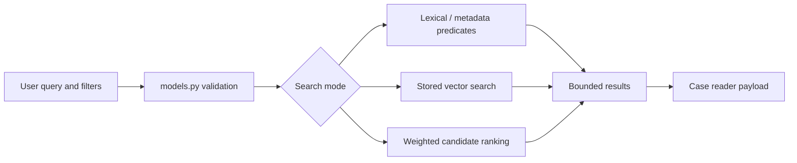

# Search and Retrieval

## Request Path

Search begins at `backend/routes.py`, validates through `CaseSearchRequest` or
the chunk-search contracts in `backend/models.py`, queries canonical records
through `backend/database.py`, and returns bounded case or passage results.

## Modes And Controls

- `metadata` emphasizes structured filters and text predicates.
- `lexical` avoids embedding generation.
- `semantic` uses stored vectors when available.
- `hybrid` combines lexical and semantic scoring with validated weights.

Candidate pools, page numbers, page sizes, date ranges, source filters,
language, processing status, tag filters, cited/citing filters, and citation
counts are bounded at the request boundary. Hybrid weights must have a positive
combined value. Full decision text matching is opt-in on the active Case Search
workflow because it can be slower and noisier than title/citation matching.

## Chunk Retrieval

`POST /search/chunks` returns passage-level evidence. The grouped endpoint
collapses passages under parent cases for user-facing retrieval. Local BGE-M3
chunk vectors are model-versioned and dimension-checked; OpenAI-compatible
case vectors use their separate contract. Search scores are ranking signals,
not legal relevance or correctness judgments.

## Reader Handoff

The active Data Explorer opens a reader payload containing case identity,
source/provenance, chunks, stored citation rows, statute rows, tags, and
metrics. Citation links and highlights use stored backend evidence locations.
The reader must not reconstruct offsets from rendered HTML.

## Failure And Empty States

Missing embeddings should produce a controlled fallback or empty state according
to the selected mode. Invalid ranges return validation errors. Missing targets,
missing chunks, and incomplete enrichment remain explicit rather than silently
fabricated. Expensive graph expansion and result limits remain bounded.

## Retrieval Contract

The route boundary owns validation and bounds; the retrieval implementation owns
candidate generation and ranking; the reader owns presentation of the returned
evidence. A result should carry enough information to explain its parent case,
score, matching mode, and passage or case identity. Search scores must not be
described as legal authority, factual correctness, or citation resolution.

Candidate-pool size, page size, offset, weights, and graph expansion limits are
part of the contract. Record representative query cases for title-only,
full-text, lexical, semantic, hybrid, metadata, no-embedding, and no-result
paths before modularizing query code.

## Modularization Direction

Separate request normalization, filter construction, candidate retrieval, score
combination, grouping, pagination, and response mapping. Keep PostgreSQL and
pgvector-specific expressions behind the retrieval boundary so tests can
characterize behavior without making the API layer own SQL details. Preserve
the distinction between case vectors and model-versioned chunk vectors.

## Quality Gaps

The system needs fixed query sets with relevance judgments, p50/p95 latency,
candidate counts, result bounds, and missing-embedding rates. Add these before
optimizing or splitting search code; otherwise a faster query can silently
reduce recall or change filter semantics.

## Validation

Use focused `tests/test_api.py` search cases, model validation tests, retrieval
evaluation fixtures, and a fixed representative query set. Track relevance
metrics and latency separately; do not treat more results as automatic quality.

<SwmMeta version="3.0.0" repo-id="Z2l0aHViJTNBJTNBTGl0SW50ZWxwcm9qZWN0JTNBJTNBZ3JleXN0b25lLWRhbg==" repo-name="LitIntelproject">Powered by [Swimm](https://app.swimm.io/)</SwmMeta>
