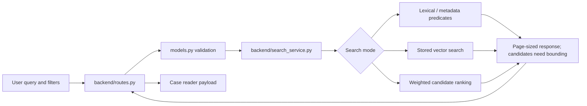

# Search and Retrieval

## Request Path

Search begins at `backend/routes.py`, validates through `CaseSearchRequest` or
the chunk-search contracts in `backend/models.py`, delegates execution to
`backend/search_service.py`, queries canonical records through `backend/database.py`,
and returns case pages or passage results. A case result page does not imply a
bounded SQL candidate set: current case search materializes matching candidates
before scoring and slicing, as recorded in the [Issue #56 query-performance
review](../docs/reports/query-performance-review.md).

The active Data Explorer case search in
[`backend/pages/data_explorer.py`](../backend/pages/data_explorer.py) calls
`GET /analytics/search/cases` with query parameters for query, citations,
outcomes, minister, judge, court, year, full-text mode, sort order, and result
limit. Its initially hidden **Download Word** anchor is rendered in the same
`.search-actions` group as search/export controls; the control script serializes
`searchValues()` rather than maintaining a second filter-name map.
`GET /search/export.docx` accepts those
same parameter names and delegates retrieval to
`fetch_analytics_search_cases` using at most two 100-result offset pages (200
cases maximum). A **Download Word** link appears with the search actions only
after a nonempty successful case search and carries the current filter values;
editing a filter hides it until another successful search. It stays hidden for
RAG, empty, loading, and failed searches. Late case-search responses are ignored
so an older result set cannot re-enable a mismatched link. The Download CSV
button and Download Word link share this action group with separate IDs and
their existing query-state handlers.

The optional power-user syntax includes inclusive year ranges as
`year:2018..2022` (the earlier `year:2018-2022` form remains supported). Its
plain-language echo describes either form as “2018 through 2022 (inclusive).”
The query is parsed by the pure
[`backend/query_syntax.py`](../backend/query_syntax.py) module into a Boolean
expression tree and a user-facing echo. The active analytics service compiles
only the fixed AST node and supported field types into SQL predicates, binding
all query values; ordinary queries without operators continue through the
legacy search predicate. Both CSV and DOCX routes call the same analytics
search function, so exports retain the operator query and matching semantics.
Malformed quotes and unknown fields remain visible as echo warnings rather than
becoming SQL.

The route builds on
`backend/deidentify.py` `text_to_docx` and `python-docx`: its metadata paragraph
records query, active filters, UTC date, and count, and its table carries
citation, title, court, date, and outcome. It returns a sanitized attachment
filename and `Cache-Control: no-store`; the existing CSV export remains
separate.
`tests/test_api.py::test_search_export_uses_analytics_filters_and_caps_docx_at_two_pages`
opens the export and checks query forwarding, page bounds, table content, and
response safety; `tests/test_feature_tabs.py` checks the UI contract.

```mermaid
flowchart LR
	Query[User query and filters] --> Routes[backend/routes.py]
	Routes --> Contract[models.py validation]
	Contract --> Service[backend/search_service.py]
	Service --> Mode{Search mode}
	Mode --> Lexical[Lexical / metadata predicates]
	Mode --> Semantic[Stored vector search]
	Mode --> Hybrid[Weighted candidate ranking]
	Lexical --> Results[Page-sized response; candidates need bounding]
	Semantic --> Results
	Hybrid --> Results
	Results --> Routes
	Routes --> Reader[Case reader payload]
```

## Modes And Controls

### Query Embedding Provider

Query embedding selection and answer generation are independent provider
choices. Query embeddings are disabled by default; semantic/hybrid search falls
back to lexical ranking until an operator explicitly opts into `openai` or
`local`. OpenAI query inference is an explicit opt-in and sends query text
off-machine. Local query inference uses the explicit
`QUERY_EMBEDDING_PROVIDER=local` setting. The read-only
[`GET /api/search-embedding-status`](../backend/routes.py) route reports the
configured query provider/model/dimensions, whether query text leaves the
machine, and `TEXT_GENERATION_PROVIDER` without constructing or downloading a
model. Provider selection and vector validation live in
[`backend/query_embedding_providers.py`](../backend/query_embedding_providers.py);
the search boundary checks that the resulting vector matches the indexed
dimension contract in [`backend/search_service.py`](../backend/search_service.py).

The standard hosted semantic index expects 1536-dimensional vectors, whereas
the default local BGE-M3 model emits 1024 dimensions. A mismatch is rejected
before retrieval; dimensions alone do not prove that different models share a
compatible vector space. Model-versioned local chunk retrieval remains a
separate path. See the [configuration reference](../docs/CONFIGURATION_REFERENCE.md)
and [local query embedding report](../docs/reports/local-query-embeddings.md)
for the operational limits and the distinction between local query inference
and first-use model-artifact downloads.

RAG retrieval can opt into `case_cohort: "recent_5000"`, which deterministically
limits the SQL candidate set to the newest 5,000 decisions by decision date and
ID. This bounded path uses existing hosted paragraph vectors and can use an
optional dedicated artifact table (`recent_case_chunk_embeddings`) with a
cohort-scoped IVFFlat cosine index (`lists=200`). When the artifact is absent,
search falls back to exact scan over canonical paragraph rows. Generation
remains a separate provider choice;
local Ollama generation does not imply local retrieval embeddings are present.
The full hosted paragraph corpus also has a partial IVFFlat cosine index, built
with a bounded session memory setting; its approximately 15 GB size is an
explicit local-storage tradeoff, and exact retrieval remains the fallback.

For corpus backfill, `scripts/embed_openai_chunks.py` is the hosted embedding
writer. It selects only pending paragraph rows within an explicit cohort using
bounded keyset queries, and stores one 1536-dimensional `text-embedding-3-small`
vector per unchanged paragraph. Short paragraphs use the direct API response;
long paragraphs use temporary token windows and a token-weighted, normalized
merge. Windowing changes only the embedding representation, never chunk
identity, text, citations or offsets. Every request respects the input, count
and aggregate-token caps, including paragraphs larger than a whole request.

One shared temporary-piece buffer packs short paragraphs and long-paragraph
windows together and retains its tail across keyset fetch pages. Indexed
responses feed each paragraph's expected/received-window state and token-weighted
vector accumulator; a short paragraph retains its direct response without
normalization. Only fully received paragraphs are written, promptly after a
response, even if the same request also contains unfinished paragraphs. ORM
expiration is disabled only for the packing run, then restored, so commits do
not induce per-row reads of buffered chunks. No paragraph rows are split or
replaced.

One worker avoids independently competing API clients. Successful requests have
no default voluntary pacing; actual 429 responses trigger Retry-After/backoff.
The shared OS lock releases when the process exits and prevents competing run
directories from starting writers. The append-only ledger retains spend across
restart, including received responses whose vectors were not committed; these
null rows can be retried without erasing the prior cost. Ambiguous in-flight
reservations or unvalidated usage stop restart for operator reconciliation.
Mixed-request commit records count each completed paragraph once while keeping
unfinished requests recoverable; superseding received work on restart preserves
both earlier commits and the full charged request cost. Reuse the same matching
run directory to retain its budget history, rather than resetting spend with
repeated fresh directories.

The original independent-worker run does not have a verified cumulative billing
checkpoint. Starting a new packed-run ledger cannot assert an unused original
budget: reconcile earlier spend or obtain a separately approved continuation cap.
The recovery task record owns that operational decision and launch status.
The user subsequently approved an additional continuation cap; the packed
remaining run has launched. `../OVERNIGHT.md` contains the exact command and
ledger-first recovery procedure, and the task record retains launch evidence.
Use the durable events for live progress; do not treat launch as completion.

Retry checkpoint (2026-09-30): the remaining ledger stopped after 278,035 saved
paragraphs with a PermissionError. Complete replay retained $1.1254703, including
ten uncertain reserves and one usage-only request. The authorized retry uses a
separate ledger with a $20.8745297 cap, so the combined conservative allowance
remains $22. The old ledger is not rewritten or treated as refunded. Null-vector
selection preserves saved work. Published limits now configure 5,000 RPM and
1,000,000 TPM instead of an arbitrary throttle; the Batch queue TPD entry is
not assumed to govern synchronous requests. The exact local permission failure
remains unproven because the runner logged only the exception type.

The retry passed all 28 focused tests and a 100-paragraph dry-run (13,563 tokens,
zero blockers), then committed at least 600 fresh paragraphs in the continuation
ledger. These startup checks establish successful continuation, not complete
coverage or a permanent fix for the earlier PermissionError.

Monitored recovery (2026-10-01): the second run also stopped with PermissionError
after 830,683 commits. Full replay retains $3.42153698 across both paid runs,
including unresolved reserves. The user authorized sequential restart; the
terminal-owned monitor deducts all previous attempt costs before each fresh
ledger and never alters old charges. Its initial remainder is $18.57846302 under
the same $22 approval. It permits at most five PermissionError attempts, stops
on different failures, and checks frozen-cohort pending vectors at child exit.
This is operational recovery, not a fix for the unlocated permission failure.
`../OVERNIGHT.md` owns the attempt naming and stop boundaries.

Completion evidence: the first monitored attempt saved the final 143,373
paragraphs. PostgreSQL independently confirms all 1,987,620 frozen-cohort
paragraphs have expected-model vectors and zero remain pending. No restart is
needed after complete coverage. Outside-cohort rows are not covered by this
acceptance. Conservative retained cost is $1.27709902 for this attempt and
$4.698636 across the three recovery runs; uncertain reserves are not refunds.
Runner accounting status remained blocked, and ledger-only replay failed on one
usage record with a reserve present only in events.log. Read-only cross-artifact
replay verified cost and committed count without rewriting either file. Coverage
completion must therefore remain separate from ledger integrity, permission
failure diagnosis, and provider billing reconciliation.

Index resource diagnosis (2026-10-01): read-only checks place PostgreSQL and
website files on the same local C: drive, but other database client sessions
were idle. The drive had ample free space and substantial read activity.
Diagnostic-session defaults expose 64 MiB maintenance_work_mem, which suggests
a disk-heavy HNSW build but does not establish the active builder's settings or
prove a spill. Progress advanced 928 tuples over about 26 seconds; the main
builder has no lock blockers, while a second session waits on it. The live
command reports CREATE INDEX; concurrent migration edits do not retrofit an
already-running build. No tuning or cancellation was performed. Exact resource
measurements and their limitations are recorded in `../OVERNIGHT.md`.

Authorized memory cleanup closed unused Steam and Claude desktop processes,
while preserving VS Code, SQL/PostgreSQL and system services. A read-only check
confirmed the same builder remained active and unblocked; free RAM increased.
This is a memory mitigation, not evidence of faster construction or an increased
builder memory limit. Measurements and recovery boundaries remain in
`../OVERNIGHT.md`. Never cancel an active build to apply tuning without explicit
approval: its partially built graph cannot resume, although stored vectors remain.

The implementation and offline request/commit checks live in
`scripts/embed_openai_chunks.py` and `tests/test_openai_chunk_embeddings.py`.
The deterministic processing runner must be terminal before this PostgreSQL
writer starts. Offline fake-client checks validate representation and recovery,
not actual provider throughput. The later packed 5,000-paragraph live benchmark
completed cleanly with ID/model/dimension verification, and its measured timing,
requests and costs are retained in the recovery task record below. It confirms
bounded execution, not a controlled speedup across identical input paragraphs or
full-cohort completion. Merged-vector retrieval quality remains unmeasured until
a judged query set exists.

The bounded packing checks cover mixed indexed responses, cross-fetch tails,
huge paragraphs spanning requests, prompt neighbor commits, budget/commit
failures, cost-preserving null-row restart, and zero success-path sleeps. A
synthetic ten-paragraph alternating short/long fixture uses four requests versus
the former ten (60% fewer); this is an offline packing result, not measured
provider speed. An isolated SQLite ORM check verifies no per-row reloads across
commits. Runner summaries expose elapsed seconds, paragraph throughput, and
successful-request input/token counts for the manager-owned paid benchmark.

The authorized 1,000-paragraph live canary is recorded in
`../.github/project-manager/tasks/hosted-embedding-completion-recovery.md`.
Its selected vectors were independently verified by ID. A retried connection
failure left an ambiguous cost reservation, so coverage succeeded but accounting
requires reconciliation before ledger resume. This is a deliberate distinction
between persistence and billing safety, not grounds to repeat completed writes.

Candidate-pool settings, page numbers, page sizes, date ranges, source filters,
language, processing status, tag filters, cited/citing filters, and citation
counts are bounded at the request boundary. This does not bound the current
case-search SQL candidate result before scoring and page slicing; see the
Issue #56 report. Hybrid weights must have a positive combined value. Full
decision text matching is opt-in on the active Case Search workflow because it
can be slower and noisier than title/citation matching.

The report-only four-index trigram migration draft is at
`../docs/proposed-migrations/indexes.py.txt`; it is not an Alembic version and
must be checked against a representative database before adoption. Its offline
syntax and model-column check is `../tests/test_proposed_index_migration.py`.

## Chunk Retrieval

`POST /search/chunks` returns passage-level evidence. The grouped endpoint
collapses passages under parent cases for user-facing retrieval. Local BGE-M3
chunk vectors are model-versioned and dimension-checked; OpenAI-compatible
case vectors use their separate contract. Search scores are ranking signals,
not legal relevance or correctness judgments.

## Reader Handoff

The active Data Explorer opens a reader payload containing case identity,
source/provenance, chunks, stored citation rows, statute rows, tags, and
metrics. Citation links and highlights use stored backend evidence locations.
The reader must not reconstruct offsets from rendered HTML.

The reader also builds a derived evidence summary for cases with paragraph
chunks. Query-count, caching, and freshness questions for this work—and the
separate reader and analytics candidates—are tracked in the linked Issue #56
review rather than duplicated here.

## Failure And Empty States

Missing embeddings should produce a controlled fallback or empty state according
to the selected mode. Invalid ranges return validation errors. Missing targets,
missing chunks, and incomplete enrichment remain explicit rather than silently
fabricated. Expensive graph expansion and result limits remain bounded.

## Retrieval Contract

Case identity matching is shared in `backend/search_matching.py`. Case-level
Python search uses Citation > Party name > Title > Full text > fallback for
identity queries (citation-shaped queries or any candidate citation/party hit),
with legacy scores within each bucket before pagination. Topic queries without
identity hits retain exactly their legacy score order. Active Case Search uses
`backend/analytics_service.py` through `/analytics/search/cases`; its parameterized
PostgreSQL predicates rank citation/party hits before its unchanged legacy
title-before-body ordering and LIMIT/OFFSET, and also drive `matched_on` labels.
Captions split around v/v./vs/versus; stored reader `style of cause` and `between`
fields provide party context where available. Baker does not match Bakery as a
party, and citation mentions in body text do not become citation identity hits.
Reported citations can coexist with neutral citations in either citation field;
dotted S.C.R. spelling is normalized consistently in Python and SQL.
Non-identity topic ranking, full-text opt-in, other filters and explicit sorts
remain unchanged. The active result card displays the label, not guessed offsets.

The route boundary owns validation and bounds; the retrieval implementation owns
candidate generation and ranking; the reader owns presentation of the returned
evidence. A result should carry enough information to explain its parent case,
score, matching mode, and passage or case identity. Search scores must not be
described as legal authority, factual correctness, or citation resolution.

Candidate-pool size, page size, offset, weights, and graph expansion limits are
part of the contract. Record representative query cases for title-only,
full-text, lexical, semantic, hybrid, metadata, no-embedding, and no-result
paths before modularizing query code.

## Modularization Direction

Separate request normalization, filter construction, candidate retrieval, score
combination, grouping, pagination, and response mapping. Keep PostgreSQL and
pgvector-specific expressions behind the retrieval boundary so tests can
characterize behavior without making the API layer own SQL details. Preserve
the distinction between case vectors and model-versioned chunk vectors.

## Quality Gaps

The system needs fixed query sets with relevance judgments, p50/p95 latency,
candidate counts, result bounds, and missing-embedding rates. Add these before
optimizing or splitting search code; otherwise a faster query can silently
reduce recall or change filter semantics.

## Validation

Use focused `tests/test_api.py` search cases, model validation tests, retrieval
evaluation fixtures, and a fixed representative query set. Track relevance
metrics and latency separately; do not treat more results as automatic quality.

<SwmMeta version="3.0.0" repo-id="Z2l0aHViJTNBJTNBTGl0SW50ZWxwcm9qZWN0JTNBJTNBZ3JleXN0b25lLWRhbg==" repo-name="LitIntelproject">Powered by [Swimm](https://app.swimm.io/)</SwmMeta>
