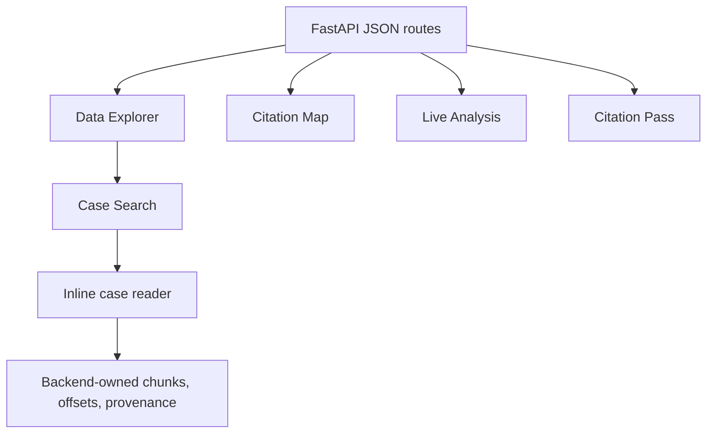

# Frontend and UI Surfaces

## Architecture

The active frontend is generated by Python page builders and route helpers,
with substantial HTML/CSS/JavaScript assembled around `backend/routes.py`.
This is a functional coupling point: a route can return HTTP 200 while its
browser script, tab state, or reader interaction is broken.

## Active Surfaces

| Surface | Role | Status |
| --- | --- | --- |
| `/data-explorer` | About, Case Search, inline reader, Citation Intelligence, judge views, inventory, FC History, Legal Themes & Statutes | Active |
| `/citation-map` | Authority graph and analytics | Active |
| `/live-analysis` | Temporary DOCX/text-PDF review | Active prototype |
| `/citation-pass` | Extraction and offset QA | QA only |
| `/case-reader` | Compatibility redirect | Legacy boundary |
| `/quick-search` | Lightweight search | Supporting |
| `/testing`, `/prototype` | Test/legacy exploration | Not the active product contract |

## Evidence Rendering Rules

The backend owns citation/statute/metadata offsets. The browser may render
highlights and linked authority context but must not infer substitute spans,
reparse the decision, or silently change evidence. Source HTML is presentation;
chunk text and persisted offsets remain the evidence location of record.

## UI Refactoring Rules

Separate page construction, API payload assembly, and browser behavior only
after contract tests identify their dependencies. Preserve empty states,
long-text scrolling, linked-authority navigation, independent panes, hover
previews, and responsive stacking. Do not duplicate a legacy reader to fix the
active one; `/data-explorer` is the canonical research workflow.

## Page And Browser Responsibilities

Page builders should produce stable page shells and predictable element names;
browser code should manage interaction state and call documented API routes;
the API should provide complete evidence payloads. A browser highlight is a
rendering of an offset supplied by the backend, not an extraction result.

The active reader depends on case identity, source/provenance, chunks, citation
rows, statute rows, tags, metrics, and linked authority context. Empty,
unresolved, incomplete, and unavailable states need distinct rendering. Long
decisions require stable scrolling and independently usable context panes.

## Case Reader Evidence Layers

The inline reader keeps three evidence layers visually distinct:

- **Green:** legal tags from stored or inferred taxonomy records. The Tags panel
	groups entries by unique category/value and expands to show each occurrence,
	evidence excerpt, source, score, taxonomy version, and backend offset when
	available.
- **Purple:** statutes and regulations from the independent statute-reference
	layer, including IRPA/IRPR provisions.
- **Yellow:** case-to-case citation occurrences and linked authorities.

The color treatment is a rendering aid only. Backend-owned offsets, provenance,
and layer separation remain authoritative. A missing highlight or occurrence
does not justify inventing a browser-side span.

Browser validation on a Vavilov search result confirmed the reader displays all
three layers together: green tag highlights, purple statute highlights, and
yellow citation highlights. The Tags panel rendered 19 unique tags across 111
stored or inferred occurrences, while the Citations and Acts / Regs panels
continued to show grouped citation occurrences and persisted statute rows.

The source pane includes a persistent legend for the three colors. The Tags
panel reports unique groups separately from total occurrence rows, preserving
sparse cases as returned by the backend rather than inventing additional tag
instances.

The source pane also provides a `Show evidence details` control. When enabled,
selecting an existing citation, statute, or tag highlight opens a compact
inspector using the backend-provided authority and target attributes. This is a
rendering aid over existing evidence, not a browser-side offset or resolution
system.

Reader-inferred tags use one canonical text representation when available and
retain repeated matches up to a bounded per-tag limit. In the OU v. Canada
audit, 18 standalone `ID` tokens produced 27 `forum: id` matches because the
same rule also recognizes the full phrase `Immigration Division`; the UI shows
all of those evidence rows under one unique tag group.

Source HTML normalization is being introduced as a separate pipeline foundation
in `backend/document_structure.py`. It derives sanitized display HTML, headings,
paragraphs, list items, table rows, and canonical text ranges without mutating
the acquired source. Chunking and evidence integration remain a later stage
until the plain-text-to-source mapping is carried through citations, statutes,
and tags.

The source-preserving mapper records HTML block paths and canonical text ranges
for future pretty rendering. It does not yet replace the reader's evidence text
or chunk boundaries; only mapped, confidence-checked ranges may do that in a
later integration slice.

The three reader chunk layers are now populated by the operational writer. Cases
with confidently mapped HTML receive HTML-informed section and paragraph
boundaries; text-only cases use the existing deterministic fallback. Both paths
preserve canonical text for citation, statute, and tag evidence.

The same structural document contract must serve the live user-document path:
inventory HTML and live DOCX/PDF inputs may use different adapters, but both
should emit headings, paragraphs, larger sections, canonical text ranges, and
formatting metadata before citations, statutes, tags, or reader highlights are
produced. Live analysis remains ephemeral and separate from canonical inventory
writes.

The reader can select the paragraph layer for precise evidence while retaining
section and full-case layers for larger context. The operational chunk writer
creates all three named layers; paragraph and section rows carry readable labels
and paragraph metadata where the source text supports them.

The Legal Themes & Statutes tab calls `/analytics/themes` and
`/analytics/statute-tag-matrix`. Its Precedents reader panel calls the bounded
`/analytics/cases/{case_id}/thematic-cluster` route. These displays remain
derived research signals; browser code does not create offsets or replace
persisted citation/statute provenance.

## Modularization Direction

Move one page family at a time: page shell, styles, browser behavior, route
payload assembly, then query helpers. Keep compatibility routes and payload
field names until feature tests and a browser smoke check cover the new owner.
Do not move the legacy `/case-reader` into the active reader module as a shortcut.

## UI Risk Inventory

The dangerous regressions are HTTP-success/JavaScript-failure, stale tab state,
missing mobile stacking, clipped long text, duplicate event handlers, incorrect
highlight spans, and reader links that lose source context. These require
browser evidence; Python compilation alone cannot disprove them.

## Validation

Run `tests/test_feature_tabs.py`, affected API tests, Python compilation, and a
manual browser check. Browser validation must cover Data Explorer load, search
to reader, highlight rendering, linked authority behavior, return/close flow,
and mobile-width layout. Add Playwright coverage before major UI extraction.

<SwmMeta version="3.0.0" repo-id="Z2l0aHViJTNBJTNBTGl0SW50ZWxwcm9qZWN0JTNBJTNBZ3JleXN0b25lLWRhbg==" repo-name="LitIntelproject">Powered by [Swimm](https://app.swimm.io/)</SwmMeta>
