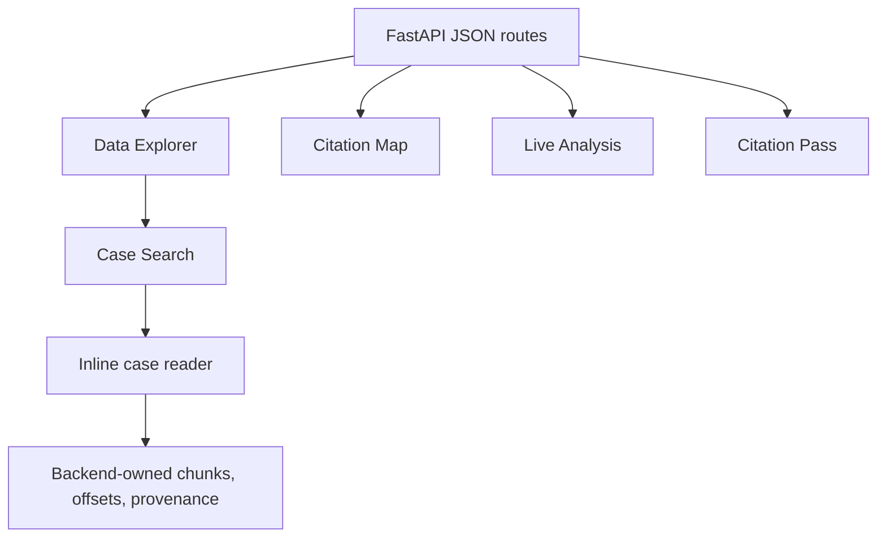

# Frontend and UI Surfaces

## Architecture

The active frontend is generated by Python page builders and route helpers,
with substantial HTML/CSS/JavaScript assembled around `backend/routes.py`.
This is a functional coupling point: a route can return HTTP 200 while its
browser script, tab state, or reader interaction is broken.

## Active Surfaces

| Surface | Role | Status |
| --- | --- | --- |
| `/data-explorer` | About, Case Search, inline reader, Citation Intelligence, judge views, inventory, FC History, Legal Themes & Statutes | Active |
| `/citation-map` | Authority graph and analytics | Active |
| `/live-analysis` | Temporary DOCX/text-PDF review | Active prototype |
| `/citation-pass` | Extraction and offset QA | QA only |
| `/case-reader` | Compatibility redirect | Legacy boundary |
| `/quick-search` | Lightweight search | Supporting |
| `/testing`, `/prototype` | Test/legacy exploration | Not the active product contract |

## Evidence Rendering Rules

The backend owns citation/statute/metadata offsets. The browser may render
highlights and linked authority context but must not infer substitute spans,
reparse the decision, or silently change evidence. Source HTML is presentation;
chunk text and persisted offsets remain the evidence location of record.

## UI Refactoring Rules

Separate page construction, API payload assembly, and browser behavior only
after contract tests identify their dependencies. Preserve empty states,
long-text scrolling, linked-authority navigation, independent panes, hover
previews, and responsive stacking. Do not duplicate a legacy reader to fix the
active one; `/data-explorer` is the canonical research workflow.

## Page And Browser Responsibilities

Page builders should produce stable page shells and predictable element names;
browser code should manage interaction state and call documented API routes;
the API should provide complete evidence payloads. A browser highlight is a
rendering of an offset supplied by the backend, not an extraction result.

The active reader depends on case identity, source/provenance, chunks, citation
rows, statute rows, tags, metrics, and linked authority context. Empty,
unresolved, incomplete, and unavailable states need distinct rendering. Long
decisions require stable scrolling and independently usable context panes.

The Legal Themes & Statutes tab calls `/analytics/themes` and
`/analytics/statute-tag-matrix`. Its Precedents reader panel calls the bounded
`/analytics/cases/{case_id}/thematic-cluster` route. These displays remain
derived research signals; browser code does not create offsets or replace
persisted citation/statute provenance.

## Modularization Direction

Move one page family at a time: page shell, styles, browser behavior, route
payload assembly, then query helpers. Keep compatibility routes and payload
field names until feature tests and a browser smoke check cover the new owner.
Do not move the legacy `/case-reader` into the active reader module as a shortcut.

## UI Risk Inventory

The dangerous regressions are HTTP-success/JavaScript-failure, stale tab state,
missing mobile stacking, clipped long text, duplicate event handlers, incorrect
highlight spans, and reader links that lose source context. These require
browser evidence; Python compilation alone cannot disprove them.

## Validation

Run `tests/test_feature_tabs.py`, affected API tests, Python compilation, and a
manual browser check. Browser validation must cover Data Explorer load, search
to reader, highlight rendering, linked authority behavior, return/close flow,
and mobile-width layout. Add Playwright coverage before major UI extraction.

<SwmMeta version="3.0.0" repo-id="Z2l0aHViJTNBJTNBTGl0SW50ZWxwcm9qZWN0JTNBJTNBZ3JleXN0b25lLWRhbg==" repo-name="LitIntelproject">Powered by [Swimm](https://app.swimm.io/)</SwmMeta>
