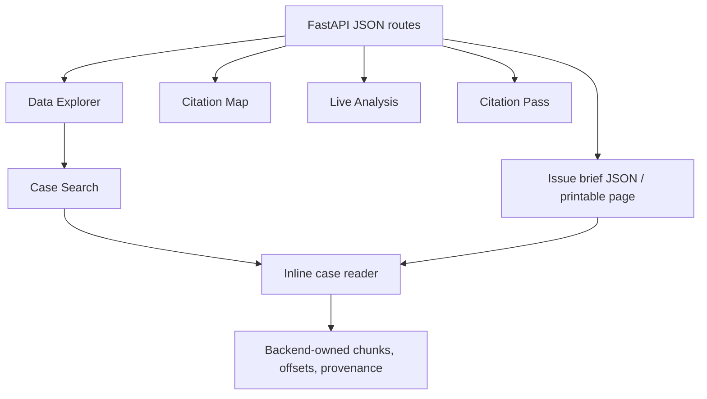

# Frontend and UI Surfaces

## Architecture

The active formatted `/data-explorer` reader's paragraph-level **Similar
paragraphs** control calls `GET /cases/{case_id}/paragraphs/{n}/similar`.
`backend/paragraph_similarity.py` verifies stored exact canonical tag/citation
spans and numbered paragraph chunks, with indexed posting and row budgets.
Scoring is shared active V3 tags + twice shared cited case authorities; statutes
remain separate; distinct signals count once and ties use case ID then paragraph.
Bare-numbered SCC chunks require bounded actual canonical prefix context,
including the `Decision Content` marker and preceding sequence; insufficient
or ambiguous context is omitted rather than fabricated. Unresolved authority
discovery uses sorted-label ordered equality seeks sharing one postings budget
and one lookahead per signal, followed by deterministic candidate-ID merging.
Unvisited labels at budget exhaustion are reported as partial coverage. These
rules and context limits live in `backend/paragraph_similarity.py`; regressions
live in `tests/test_paragraph_similarity.py`.
The UI guards stale responses, explains bounded coverage and
opens returned case/paragraph deep links. Chunk indices and citation target
pinpoints are never treated as citing paragraph numbers. Migration
`0031_paragraph_similarity` mirrors its composite indexes in ORM metadata.

The active frontend is generated by Python page builders and route helpers,
with substantial HTML/CSS/JavaScript assembled around `backend/routes.py`.
This is a functional coupling point: a route can return HTTP 200 while its
browser script, tab state, or reader interaction is broken.

```mermaid
flowchart TD
	API[FastAPI JSON routes] --> Explorer[Data Explorer]
	Explorer --> Search[Case Search]
	Search --> Reader[Inline case reader]
	API --> Brief[Issue brief JSON / printable page]
	Brief --> Reader
	API --> Map[Citation Map]
	API --> Live[Live Analysis]
	API --> QA[Citation Pass]
	Reader --> Evidence[Backend-owned chunks, offsets, provenance]
```

## Active Surfaces

### Two-decision comparison

`/case-compare` is an independent, read-only research surface with two
citation/name pickers using the existing `/analytics/search/cases` contract.
`backend/pages/case_compare.py` renders responsive decision cards and separate
per-case tag, statute and authority lists; textual shared/unique badges accompany
distinct backgrounds and borders. Search requests are debounced, abortable and
sequence guarded; labels are inserted with `textContent`, and stored page values
are HTML escaped. Editing a search clears the previously selected ID.

`backend/case_comparison.py` owns the stored-evidence comparison projection.
It deduplicates active taxonomy category/value pairs, resolved authority target
IDs and unresolved stored neutral/reporter identifiers. Stored short-form
anchors supply their unresolved identity; explicit trailing paragraph/page
pinpoints are excluded from fallback identity labels. No unresolved/resolved
or neutral/reporter equivalence is inferred. Statute instrument/provision
identities use the existing provision normalizer, retaining ranges and lists
(otherwise normalized labels). These layers stay separate and do
not trigger extraction or resolution. Latest outcome assignment selection
matches the reader's updated-time/ID order; only missing assignments fall back
to explicitly attributed reader metadata. Unclassified outcomes and raw labels
remain visible. Assignment evidence is displayed as stored, not re-verified;
reader links let the researcher verify the source.

`backend/routes.py` registers `/cases/compare` before `/cases/{case_id}` and
maps unknown IDs to a clear 404. Empty `/case-compare?a=&b=` opens the pickers.
The comparison does not change reader offsets, startup, schema or canonical rows.
The optional reader-header shortcut is intentionally omitted to avoid expanding
the active reader implementation.

See [SYSTEM_REFERENCE.md](../SYSTEM_REFERENCE.md) for behavior,
[docs/ARCHITECTURE.md](../docs/ARCHITECTURE.md) for the backend file inventory, and
[tests/test_case_comparison.py](../tests/test_case_comparison.py) for SQLite
fixtures covering distinct signals, provenance, unclassified outcomes,
escaping, read-only queries and HTTP route precedence. Focused validation:
`python -m pytest tests/test_case_comparison.py tests/test_feature_tabs.py -q`.
Chromium fixture HTTP checks at desktop and mobile widths additionally cover
picker selection/submission, highlighted signals, reader links, search
empty/error states and long-label wrapping without accessing the live database.

### Canonical judge comparison

The Judge Profile panel embeds a read-only comparison as a **sibling** of
`judgeProfileContent` in `backend/pages/data_explorer.py`. This keeps the
existing profile wrappers' positional `.ci-table` selectors unchanged.
The form uses canonical slug suggestions, prefills the open judge, and calls
`GET /judges/compare`; `backend/routes.py` registers this before the slug
redirect and maps unknown canonical slugs to an explicit HTTP 404.

`fetch_judge_comparison` in `backend/analytics_service.py` owns the exact
aggregation contract. Canonical links, not raw judge metadata, define membership.
Stored `Case.issues` string lists alone define issues; whitespace/case
normalization deduplicates labels per decision, without metadata fallback.
Shared issues require at least five distinct decisions for each judge. The
renderer leads with these issue outcomes, retains unclassified outcomes, and
prints denominators for every count. Year/tag/authority counts use all linked
decisions, while issue outcomes use the issue set. Repeated occurrences never
inflate tag or authority decision counts. Comparison ignores profile Minister
filters and makes no ranking or harshness inference.
Overall outcomes and per-judge coverage each use a comparison-scoped responsive
grid: two columns above 760px and one column at or below 760px. Issue-first
ordering and legacy profile table selectors remain unchanged. Fixture render
assertions and desktop/mobile browser geometry checks cover both grids.

See `docs/RESEARCH_UI_GUIDE.md` for interpretation and `SYSTEM_REFERENCE.md`
for current behavior. SQLite fixtures and HTTP/renderer checks in
`tests/test_judge_comparison.py` exercise thresholds, duplicates, unknown
judges, empty coverage, denominator contracts and read-only execution.
Focused command:
`python -m pytest tests/test_judge_comparison.py tests/test_judge_influence.py tests/test_feature_tabs.py -q`.

Issue #87 checkpoint (2026-10-03): comparison/influence fixtures passed
(15 tests). Chromium fixture-backed checks at 1440x1000 and 390x844 verified
profile prefill, suggestions, comparison submission, shared-issue-first order,
denominators, unknown/empty results, unchanged profile tables, and no page
overflow. Production data and live PostgreSQL were not exercised. An existing
injected Tag Analytics script syntax error also occurs in the HEAD builder;
the comparison/main script passes Node syntax validation. Full workflow CI
is not green: navigation/tagging failures and missing local-embedding tooling /
tokenizer DNS access remain outside this slice. See the issue-87 JSON task
record under `.github/project-manager/tasks/` for exact commands/results.

### Judge issue outcome table

The active Judge Profile snapshot adds a separate issue-first outcome table;
it leaves profile summaries and existing comparisons unchanged. The section is
loaded only after the researcher requests **Load issue outcomes**. Its endpoint
calls `fetch_judge_profile_issues`, re-exported by `backend/analytics_service.py`
for compatibility; the aggregation is owned by `backend/judge_issue_record.py`.
It uses canonical judge-profile links and stored issue lists only. It normalizes
whitespace and case, counts each decision once per issue, and requires at least
ten distinct judge-linked decisions to show an issue. It reports the number of
issues hidden, with an explicit notice that each has fewer than ten decisions,
without returning their labels.

The per-issue Federal Court baseline matches stored court values `FC`, `Federal
Court`, and `Federal Court of Canada`. Outcomes come from stored
`reader_extracted.government outcome`: `won` is Minister win, `lost` applicant
win, `mixed` other, and undetermined/missing/unrecognized values unclassified.
Each category percentage uses all decisions recorded for that issue in that
cohort, including unclassified outcomes; decision coverage separately gives the
issue count and the full judge-linked or courtwide denominator. The profile
Minister filter does not scope this endpoint. Issue mentions do not establish
causation; the output makes no ranking or harshness inference.

SQLite/API fixtures in `tests/test_judge_comparison.py` cover the threshold,
hidden issue count, outcome categories, denominator semantics, Federal Court
baseline, and unknown-slug 404. `tests/test_feature_tabs.py` checks that the
section is lazy-loaded and discloses its method and denominator. Focused checks:
`python -m pytest -q tests/test_judge_comparison.py -k judge_issue` and
`python -m pytest -q tests/test_feature_tabs.py -k judge_issue_outcomes_are_lazy_loaded`.

The `/data-explorer` shell uses four top-left primary groups: Info, Research,
Workbench, and Testing. `backend/pages/data_explorer.py` owns the group state,
secondary navigation, and panel visibility. Research / Case search is the
default; reader/search IDs and evidence handlers are preserved.

For the plain-language analyst path from case search and reading through
Citation Intelligence, Judge Profile, FC History, and memo citation checking,
see the repository's [iLit Analyst Quick Start](../docs/ANALYST_QUICK_START.md).
The canonical behavior and limitation reference remains
[`docs/RESEARCH_UI_GUIDE.md`](../docs/RESEARCH_UI_GUIDE.md).
Judge Profile is the sole active judge workflow; its Minister filter scopes
linked decisions and is not a Minister-specific performance measure.

Info contains About and Site Architecture. Research contains Case search,
Citation Intelligence, Judge Profile, FC History, and Legal Themes & Statutes.
Workbench retains the existing Citation Map and Live Analysis route links.
Testing contains the Research Bench prototype, Discussion Units Sandbox, and
Citation Pass QA so unfinished work stays separate from active research.
Group controls are buttons with pressed state and controlled-navigation IDs;
secondary rows wrap on mobile and support arrow/Home/End focus movement.
Route links remain links rather than being intercepted as embedded tabs.

`activateResearchTab` and `restoreResearchNavigation` preserve existing
`?tab=` deep links and browser history. A selected tab determines its owning
group even when `?group=` conflicts; `?tab=info` aliases About. A fresh load
without a tab uses the requested group's default, or Research / Case search.
The narrow regression command is
`venv/Scripts/python.exe -m pytest tests/test_feature_tabs.py -q`, followed by
builder compilation and a browser check for keyboard and responsive behavior.

Acceptance checkpoint (2026-09-30): all 48 feature-tab tests passed. Live
Playwright checks on the updated local server passed at 1440x1000 and 390x844,
covering group visibility, legacy deep links, keyboard activation, button
non-overlap, horizontal overflow, and uncaught page errors. Screenshots live in
`data/copilot_review/primary-navigation-groups/`. Builder compilation passed
with the existing invalid-escape warning; end-to-end accuracy of standalone
tools was outside this navigation-only checkpoint.

About contains an interactive architecture graph
from source material through research evidence, alongside its live inventory
shell. The graph exposes staging, canonical ingestion, the ordered processing
pipeline, citation extraction and separate resolution, live functions, and the
active research workflow. Selecting a node highlights connected nodes and
expands the selected box inside the graph, revealing connected child boxes and
plain-language detail in the same canvas. Reduced-motion preferences disable
the route animation.
Site Architecture retains the former About overview alongside the data-model
explanation; both surfaces read inventory totals from `/api/about/stats`.
The former visible Data explorer tab is retired, while its compatibility route
and internal analytics endpoint remain available to existing links.

The Case Search surface uses a dominant query row with adjacent Search cases
and Clear actions. Advanced options remain collapsed by default and group
authority/outcome, people/court/time, and result-display controls. The control
shows the number of active optional filters and stacks cleanly on narrow
screens; existing query parameter IDs and title/citation-first behavior remain
unchanged.

The primary query is an accessible combobox. After two characters it issues a
debounced, cancellable request to the existing case-search endpoint with a
five-result limit and no full-text flag. Suggestions support mouse, arrow-key,
Enter, and Escape interaction. Submitted results separate legal identity and
case context from outcome labels and citation metrics, then open the existing
inline reader without changing evidence or offset ownership.

The main query field also supports quoted phrases, Boolean AND/OR/NOT,
leading-minus exclusions, and court/year/judge/cites/outcome fields. Inclusive
year ranges use `year:2018..2022`; the legacy `year:2018-2022` form remains
supported, and the echo reads “2018 through 2022 (inclusive).” The interpreted
plain-language query appears above results, and **Search tips**
opens a native popover with examples. Echo text is inserted as text, not HTML;
stale search responses cannot overwrite the current query echo. See the linked
[search/retrieval walkthrough](5.b49ftjal.sw.md) for the parser-to-parameterized
SQL and export boundary. Operator-free queries remain on the established search
path.

Accessibility checkpoint (2026-10-03): the static UI review and scope
limitations are recorded in
[`docs/reports/accessibility-audit.md`](../docs/reports/accessibility-audit.md);
the user workflow note is [`docs/RESEARCH_UI_GUIDE.md`](../docs/RESEARCH_UI_GUIDE.md).
The Data Explorer builders now provide stronger keyboard focus visibility for
search, result, and reader-information controls, and programmatic pressed state
for the reader-information view buttons and Citation Map mode/detail controls.
Citation Map search has an explicit accessible name and visible keyboard focus.
The reader's cited-paragraph shading uses `#202522` text on `#fff9e8`
(`14.8:1`), and linked-case pinpoint shading uses the same text on `#fff4c2`
(`14.06:1`); both are calculated contrast ratios. Its extracted case summary
remains a separate control.
Its dynamic graph still needs browser/screen-reader review; no WCAG conformance
is claimed. The narrow builder check is
`python -m pytest -q tests/test_accessibility_builders.py
tests/test_case_formatter.py`.

Case Search has an explicit **Save current search** action that stores the
current query and selected filters, plus a link to `/saved-searches-ui`. Saved
criteria are not applied automatically, so an empty collection leaves the
existing search path unchanged. The standalone page lists saved searches and
their recorded alerts; route and model details are linked from the API and
database walkthroughs.

Case Search also provides a Download CSV action driven by the same current
search values as the result request. The API owns the bounded export, fixed
columns, UTF-8 BOM, spreadsheet-safe value handling, and active reader links;
see [`backend/routes.py`](../backend/routes.py) and its
[route/escaping tests](../tests/test_api.py) for the executable contract.

Navigation checkpoint (2026-09-30): `docs/RESEARCH_UI_GUIDE.md` and
`SYSTEM_REFERENCE.md` describe the grouped shell. Older seven-tab descriptions
in the documentation index describe embedded views, not current primary
navigation. Historical Judge Outcomes and Data Explorer implementation notes
remain historical or compatibility context rather than active tabs.

| Surface | Role | Status |
| --- | --- | --- |
| `/data-explorer` | About, Case Search, inline reader, Citation Intelligence, judge views, inventory, FC History, Legal Themes & Statutes | Active |
| `/memo-citation-check` | Draft citation scan and local matches/treatment data where available | Separate document workflow; verify results |
| `/discussion-units-sandbox` | Full-parity Case Search and inline reader limited to the Discussion Unit core 300 cohort | Experimental; isolated |

The standalone `/issue-brief-ui?tag=category:value` is a print-oriented research
page, with `/issue-brief?tag=category:value` as its JSON data contract. It
summarizes decisions per year, outcomes, courts, and the ten most cited resolved
case authorities, and links up to 12 tagged decisions plus the authorities to
the case reader. It discloses the shown/total decision-link count; the JSON
response retains the complete list.
Outcome percentages are calculated over every tagged decision in the year,
including unclassified outcomes, and display the unclassified count and
denominator beside each percentage. Citation-occurrence and distinct-citing-
decision counts are separate; statutes and unresolved references do not enter
the authority ranking. An empty tag has a safe empty state. This is a standalone
page, not a new Data Explorer navigation tab.

The paragraph-level Discussion Unit review is report-only and provenance
preserving. A valid model response may be incomplete: indexed assessments that
belong to supplied source paragraphs are retained in source order, while
missing paragraphs receive an explicit `Not found` row. Duplicate or unknown
paragraph indices are counted as unmatched, and malformed responses are
salvaged when complete assessment objects can be recovered; a response with no
recoverable objects remains rejected so recovery never invents evidence.
Recovery can use an explicit case allowlist with bounded parallel workers; the
parent runner owns ledger updates to keep concurrent results resumable.

The active `/data-explorer` workflow now exposes the same completed work without
making it a separate product surface. `Display core cases` loads the 300-case
allowlisted cohort through ordinary search result cards. The inline reader's
off-by-default `Show paragraph assessments` control reads
`/cases/{case_id}/paragraph-assessments` only when requested and matches report
rows to backend-owned `paragraph_start` values; it never writes assessment data
to the database or invents browser offsets.

The sandbox also exposes the report-only paragraph assessments through
`/discussion-units-sandbox/cases/{case_id}/paragraph-assessments`. The reader's
“Show paragraph assessments” control is off by default and renders matching
topic, role, confidence, and explanation beside source-preserved paragraphs.
In the active reader, matching assessments use a compact indented amber rail
with a small topic label, role/confidence metadata, and readable explanation;
the source paragraph remains visually primary and the rail returns to full width
on narrow screens.
This endpoint and overlay are experimental only; production reader routes and
payloads are unchanged.
| `/citation-map` | Authority graph and analytics | Active |
| `/live-analysis` | Temporary DOCX/text-PDF review | Active prototype |
| `/citation-pass` | Extraction and offset QA | QA only |
| `/case-reader` | Compatibility redirect | Legacy boundary |
| `/quick-search` | Lightweight search | Supporting |
| `/testing`, `/prototype` | Test/legacy exploration | Not the active product contract |

## Evidence Rendering Rules

The backend owns citation/statute/metadata offsets. The browser may render
highlights and linked authority context but must not infer substitute spans,
reparse the decision, or silently change evidence. Source HTML is presentation;
chunk text and persisted offsets remain the evidence location of record.

Chunk and full-text rendering use different overlap precedence: chunk mode
renders citation spans before applying tag marks, while full text resolves the
combined range set. Overlapping evidence may therefore produce different DOM
mark counts; browser smoke validation checks that both modes retain visible
tag evidence rather than requiring identical counts.

Chunk mode keeps each stored chunk as a structural article for evidence and
ordering, but presents the articles as a continuous judgment with compact body
padding and subtle separators. Visible chunk labels, ordinal fallbacks,
chunk-set names, and character counts are suppressed. Citation and statute
marks inherit the surrounding judgment font size and line height; their color,
link behavior, evidence attributes, and backend-owned offsets remain unchanged.

### Most cited paragraphs

`backend/pages/data_explorer.py` owns the native, initially collapsed
`readerMostCited` disclosure. It ranks positive `format_blocks` paragraph
integer counts by descending count, then ascending numeric paragraph number,
keeping the earliest block for each paragraph number before ranking at most
five. `backend/reader_service.py` already deduplicates other
citing case IDs for paragraph shading; `backend/case_formatter.py` attaches
those counts and canonical code-point spans. The panel consumes that payload
without another query or new API fields.

Excerpts slice the stored full text by those code-point spans and are escaped.
Jump links prevent default fragment navigation and force normalized formatting,
then scroll (respecting reduced motion) and visibly focus the formatter's
`decision-source-<block.start>` anchor inside `decisionBody`. The panel and
extracted case summary share these backend-block anchors; the panel's mode
wrapper must not overwrite their IDs with paragraph-number IDs. Linked context
is never selected as a jump target. Open/load failure/close wrappers clear stale disclosure
content. `tests/test_feature_tabs.py::test_reader_most_cited_paragraphs_ranking_jumps_and_reset`
executes the controller with Node, including ties, empty state, Unicode,
escaping, source-only anchors, mode changes, and resets. Usage is documented
in `docs/RESEARCH_UI_GUIDE.md`; count semantics remain in `SYSTEM_REFERENCE.md`.

Issue #85 validation checkpoint: the focused controller regression and 14
adjacent reader/formatter/API checks passed, as did Python compilation and
generated-reference checks. Synthetic local Chromium checks exercised native
Enter/Space disclosure, Tab navigation, source-only jumps, focus/scroll,
chunk/plain-to-formatted switching, and empty/failure/close resets. The full CI
command ran with 978 passed, 8 failed, and 3 deselected: five unrelated
navigation/tagging failures reproduced with the unchanged HEAD builder, and
three needed unavailable model/tokenizer downloads. Browser validation also
identified the unchanged injected tag-analytics `renderTrends` syntax error;
that separate owner remains outside this panel checkpoint.

Main merge checkpoint (2026-10-04): both extracted-summary and most-cited
controllers are retained, with a combined Node regression for their shared
anchors. Focused reader/summary/navigation checks passed (27 passed, one
optional browser skip before Playwright installation); subsequent reader/API/
formatter checks passed (17 passed, including Chromium source-link acceptance).
Final full feature-tab validation passed all 55 checks; AST comparison confirms
every test function from both merge parents is retained.
A combined synthetic Chromium fixture passed at 1280x900 and 390x844 for
Enter/Space/Tab, both evidence links, chunk-to-formatted switching, and
empty/close resets, with no page errors. This is not a live database check.
The exact `.github/workflows/tests.yml` pytest command produced 1,034 passed,
three failed, three deselected, and one xfailed: the local chunk-search model
and two embedding-tokenizer checks could not download uncached resources
because `huggingface.co` and `openaipublic.blob.core.windows.net` did not resolve.
`python scripts/check_generated_docs.py`, builder/test compilation, and
`git diff --check` passed; compilation retains the existing invalid-escape
warning. The full CI run is not green in this environment.

## UI Refactoring Rules

Separate page construction, API payload assembly, and browser behavior only
after contract tests identify their dependencies. Preserve empty states,
long-text scrolling, linked-authority navigation, independent panes, hover
previews, and responsive stacking. Do not duplicate a legacy reader to fix the
active one; `/data-explorer` is the canonical research workflow.

## Page And Browser Responsibilities

Page builders should produce stable page shells and predictable element names;
browser code should manage interaction state and call documented API routes;
the API should provide complete evidence payloads. A browser highlight is a
rendering of an offset supplied by the backend, not an extraction result.

The active reader depends on case identity, source/provenance, chunks, citation
rows, statute rows, tags, metrics, and linked authority context. Empty,
unresolved, incomplete, and unavailable states need distinct rendering. Long
decisions require stable scrolling and independently usable context panes.

## Case Reader Evidence Layers

The inline reader keeps three evidence layers visually distinct:

- **Green:** legal tags from stored or inferred taxonomy records. The Tags panel
	groups entries by unique category/value and expands to show each occurrence,
	evidence excerpt, source, score, taxonomy version, and backend offset when
	available.
- **Purple:** statutes and regulations from the independent statute-reference
	layer, including IRPA/IRPR provisions.
- **Yellow:** case-to-case citation occurrences and linked authorities.

The color treatment is a rendering aid only. Backend-owned offsets, provenance,
and layer separation remain authoritative. A missing highlight or occurrence
does not justify inventing a browser-side span.

Browser validation on a Vavilov search result confirmed the reader displays all
three layers together: green tag highlights, purple statute highlights, and
yellow citation highlights. The Tags panel rendered 19 unique tags across 111
stored or inferred occurrences, while the Citations and Acts / Regs panels
continued to show grouped citation occurrences and persisted statute rows.

The full-text reader also shades a numbered paragraph when stored incoming
case-citation evidence has a pinpoint for it, with a tooltip such as
“Cited by 12 cases”. The backend counts distinct citing cases and maps only the
existing pinpoint to a formatter-produced paragraph; this display cue does not
change source citation offsets or create browser-side spans. Missing or
unmatched pinpoints leave paragraphs in their normal style. See
[`backend/reader_service.py`](../backend/reader_service.py) and
[`backend/case_formatter.py`](../backend/case_formatter.py).

### Keyboard navigation and print

The inline reader supports `j`/`n` for the next formatted paragraph and `k`/`p`
for the previous one. Navigation focuses and visibly marks the current paragraph;
it switches to formatted text when paragraph anchors are not present in the
current reader mode. The `?` control or key opens the shortcut list, and Escape
closes it. Keyboard actions are ignored while a text-entry or editable control
has focus. Printing keeps the case title, citation, and paragraph numbers while
hiding reader navigation, side panels, and controls; paragraph blocks are kept
together across pages where possible. These are presentation behaviors only:
paragraph identity and evidence offsets continue to come from the backend
formatter. See [`backend/pages/data_explorer.py`](../backend/pages/data_explorer.py)
and [`docs/RESEARCH_UI_GUIDE.md`](../docs/RESEARCH_UI_GUIDE.md).

### Extracted summary above the source text

The active reader adds an always-visible, compact **Extracted case summary**
only when verified source facts exist. This is distinct from the optional technical
**Show case summary** control. The reader service selects the latest stored
`CaseOutcome` and adds a dedicated `extracted_summary` evidence projection
alongside the existing extracted metadata;
it does not invoke the outcome classifier in
[`backend/metadata_outcomes.py`](../backend/metadata_outcomes.py).
The page renders only this verified projection, never raw court/date/judge/tag
fallbacks. Every fact has an individual link. Court and date must match explicit
source-header forms; judge also requires existing extraction evidence and a
judge-labelled header match. Header links are labelled **Source header** because
these formatter blocks need not be numbered. Unsupported formats/abbreviations
are omitted, not searched for in unrelated body paragraphs.
Judge headers accept only prefixes already supported by the judge normalizer in
[`fc_ingest/document_scraper.py`](../fc_ingest/document_scraper.py), such as
`The Honourable` before stored `Paul U.C. Rouleau`. The exact stored name remains
the captured evidence span; prefixes do not change its offsets or formatter
source-link identity. Arbitrary prefix text is not accepted.
At most three distinct stored tags with exact document evidence offsets inside
numbered paragraphs are selected by score with category/value tie-breaks.
Inferred tags and stale/partial offsets are excluded. These are stored signals,
not newly generated labels or prose.

A disposition quotation requires the stored evidence offsets to reproduce
the stored evidence exactly in canonical full text and fall within a numbered
formatter paragraph (including its continuation blocks). The quotation is a
verbatim source slice, escaped for display. Unverified, unnumbered, or
cross-paragraph evidence is omitted rather than assigned a guessed location.
Outcome and its displayed stored extraction source reuse this same verified
paragraph link; neither appears if evidence is invalid. A quotation can remain
without an outcome label. Source links switch to formatted mode and focus the
backend formatter block start with its paragraph identity, avoiding ambiguity
from repeated paragraph numbers. The browser only copies supplied block starts
into anchors; it does not calculate or search for replacement evidence offsets.
The summary is remounted above source text when reader modes change.

Implementation remains in
[`backend/reader_service.py`](../backend/reader_service.py) and
[`backend/pages/data_explorer.py`](../backend/pages/data_explorer.py), with the
additive response contract in [`backend/models.py`](../backend/models.py).
Focused projection/serialization coverage is in
[`tests/test_reader_service.py`](../tests/test_reader_service.py), with rendering,
escaping, tag limits, and mode-remount checks in
[`tests/test_feature_tabs.py`](../tests/test_feature_tabs.py). Run
`python -m pytest -q tests/test_reader_service.py tests/test_feature_tabs.py`.
Browser acceptance should also open cases with and without stored outcomes,
compare the quotation to source text, follow the paragraph link from chunk
mode, and check sparse/mobile rendering. Source records and formatter offsets
must remain unchanged.
The optional `test_extracted_summary_browser_source_links` in the UI tests
uses locally available Playwright/Chromium, backend-projected synthetic stored
text, and the actual renderer/click handler. It checks desktop/mobile focus
for every item from chunk mode, missing/invalid outcomes, and empty summaries.
It does not query a live database or verify an end-to-end search deployment;
without existing browser tooling it is explicitly skipped, not installed.

The source pane includes a persistent legend for the three colors. The Tags
panel reports unique groups separately from total occurrence rows, preserving
sparse cases as returned by the backend rather than inventing additional tag
instances.

The source pane also provides a `Show evidence details` control. When enabled,
selecting an existing citation, statute, or tag highlight opens a compact
inspector using the backend-provided authority and target attributes. This is a
rendering aid over existing evidence, not a browser-side offset or resolution
system.

Reader-inferred tags use one canonical text representation when available and
retain repeated matches up to a bounded per-tag limit. In the OU v. Canada
audit, 18 standalone `ID` tokens produced 27 `forum: id` matches because the
same rule also recognizes the full phrase `Immigration Division`; the UI shows
all of those evidence rows under one unique tag group.

Source HTML normalization is being introduced as a separate pipeline foundation
in `backend/document_structure.py`. It derives sanitized display HTML, headings,
paragraphs, list items, table rows, and canonical text ranges without mutating
the acquired source. Chunking and evidence integration remain a later stage
until the plain-text-to-source mapping is carried through citations, statutes,
and tags.

The source-preserving mapper records HTML block paths and canonical text ranges
for future pretty rendering. It does not yet replace the reader's evidence text
or chunk boundaries; only mapped, confidence-checked ranges may do that in a
later integration slice.

The three reader chunk layers are now populated by the operational writer. Cases
with confidently mapped HTML receive HTML-informed section and paragraph
boundaries; text-only cases use the existing deterministic fallback. Both paths
preserve canonical text for citation, statute, and tag evidence.

The same structural document contract must serve the live user-document path:
inventory HTML and live DOCX/PDF inputs may use different adapters, but both
should emit headings, paragraphs, larger sections, canonical text ranges, and
formatting metadata before citations, statutes, tags, or reader highlights are
produced. Live analysis remains ephemeral and separate from canonical inventory
writes.

The reader can select the paragraph layer for precise evidence while retaining
section and full-case layers for larger context. The operational chunk writer
creates all three named layers; paragraph and section rows carry readable labels
and paragraph metadata where the source text supports them.

## Table of Authorities Builder

The standalone `GET /table-of-authorities` page is built in
[`backend/pages/table_of_authorities.py`](../backend/pages/table_of_authorities.py).
Submitting the paste sends a `POST /table-of-authorities/build` form request
handled by [`backend/routes.py`](../backend/routes.py), then downloaded directly
as a DOCX. The JSON API `POST /table-of-authorities` accepts an object with
newline-separated `text` (one local case ID or citation per nonblank line) and
returns the same DOCX response. Its Pydantic contract is
[`TableOfAuthoritiesRequest`](../backend/models.py). The parser and deterministic
local resolver live in
[`backend/table_of_authorities.py`](../backend/table_of_authorities.py).

The route rejects more than 200 nonblank lines before querying citation metadata.
For accepted text, numeric-only positive lines are treated as local case IDs;
other lines use case-citation extraction and retain adjacent paragraph
references. ID lookup filters by those IDs and citation lookup filters by parsed
citation values. The route does not write to the database, call external
services, retain the paste, or log its content. Distinct ambiguous citation
matches remain unresolved. Resolved authorities are grouped by stable court
precedence and alphabetized by title. Unmatched IDs and citations stay visible
in a dedicated not-found section, and any other nonblank line that yields no
case citation is retained there as unresolved source text. Blank lines do not
create entries. A CanLII link is emitted only for a resolved record with a
validated CanLII source URL.

Empty/unsupported references can remain unmatched; oversized submissions receive
a clear 422 response. The DOCX response and UI use no-store headers. Focused
offline validation uses `python -m pytest tests/test_table_of_authorities.py -q`,
which covers both POST contracts, ID/citation resolution, local-query filters,
court order, alphabetization, paragraph references, the line boundary, generated
DOCX content/links, and request privacy. It does not exercise a production
database or a live browser. The existing browser form endpoint remains available
alongside the JSON route.

The Legal Themes & Statutes tab calls `/analytics/themes` and
`/analytics/statute-tag-matrix`. Its Precedents reader panel calls the bounded
`/analytics/cases/{case_id}/thematic-cluster` route. These displays remain
derived research signals; browser code does not create offsets or replace
persisted citation/statute provenance.

## Modularization Direction

Move one page family at a time: page shell, styles, browser behavior, route
payload assembly, then query helpers. Keep compatibility routes and payload
field names until feature tests and a browser smoke check cover the new owner.
Do not move the legacy `/case-reader` into the active reader module as a shortcut.

## UI Risk Inventory

The dangerous regressions are HTTP-success/JavaScript-failure, stale tab state,
missing mobile stacking, clipped long text, duplicate event handlers, incorrect
highlight spans, and reader links that lose source context. These require
browser evidence; Python compilation alone cannot disprove them.

## Validation

Run `tests/test_feature_tabs.py`, affected API tests, Python compilation, and a
manual browser check. Browser validation must cover Data Explorer load, search
to reader, highlight rendering, linked authority behavior, return/close flow,
and mobile-width layout. Add Playwright coverage before major UI extraction.

<SwmMeta version="3.0.0" repo-id="Z2l0aHViJTNBJTNBTGl0SW50ZWxwcm9qZWN0JTNBJTNBZ3JleXN0b25lLWRhbg==" repo-name="LitIntelproject">Powered by [Swimm](https://app.swimm.io/)</SwmMeta>
