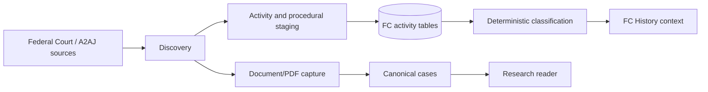

# Federal Court Activity

## Scope

Federal Court data has two distinct meanings in this project: decision/source
capture and procedural/activity intelligence. Activity records are context and
must not be represented as judgment reasons or proof that a full decision was
captured.

## Components

| Component | Role |
| --- | --- |
| `fc_ingest/` | Federal Court discovery, item retrieval, PDF handling, and SQLite staging |
| `scripts/fc_portal_collector.py` | Checkpointed portal collection and import-ready staged rows |
| `scripts/import_fc_decisions.py` | Validated bridge from staged decisions to canonical ingestion |
| `backend/fc_activity.py` | Normalizes activity records and document entries |
| `fc_activity_cases` | Stable activity-case identity and source fields |
| `fc_activity_documents` | Deduplicated docket/activity documents |
| `fc_activity_classifications` | Versioned deterministic classification results |
| `fc_procedural_history` | IMM-linked procedural history and conflict indicators |

## Trust Boundaries

Discovery, page retrieval, document capture, PDF capture, and canonical import
are separate states. An identifier or source URL alone does not prove a full
judgment exists. Preserve source URL, identifier, retrieval time, hashes,
metadata evidence, and failure state. Activity classifications are research
signals, not judicial outcomes.

## State Model

Use explicit state transitions for each record:

`discovered -> retrieved -> staged -> validated -> imported -> processed`

Activity-only records may stop at `staged` or `classified` and remain outside
the canonical judgment path. A failed retrieval, invalid PDF, duplicate source,
or uncertain IMM correlation should retain its failure or review state rather
than being promoted by inference.

## Modularization Direction

Separate portal discovery, item retrieval, document parsing, SQLite staging,
classification, and canonical import. The stable handoff between them is a
source-keyed record with capture status, hashes, metadata evidence, and error
details. This allows a collector or classifier to be replaced without changing
canonical merge policy.

## Quality Measures

Track discovery-to-capture conversion, valid document rate, duplicate rate,
English/French classification agreement, unresolved IMM links, missing hashes,
and canonical import outcomes by source and time scope. Counts must identify
whether they refer to portal items, documents, activity records, or judgments.

## Operational Rules

Use bounded month/year scopes, retries, checkpoints, JSONL/SQLite staging, and
resume support. Respect robots and source access controls. Do not run a bulk
import alongside another PostgreSQL writer. Keep activity context separate from
canonical decision text and distinguish IMM correlation from case identity.

## Validation

Run `tests/test_fc_ingest_db.py`, `tests/test_fc_ingest_pipeline.py`,
`tests/test_fc_portal_collector.py`, `tests/test_hf_fc_activity_ingest.py`,
and `tests/test_classify_fc_activity.py` for the touched layer. Verify sampled
source keys, document dedupe, English/French classifications, and explicit
discovery/capture status.

<SwmMeta version="3.0.0" repo-id="Z2l0aHViJTNBJTNBTGl0SW50ZWxwcm9qZWN0JTNBJTNBZ3JleXN0b25lLWRhbg==" repo-name="LitIntelproject">Powered by [Swimm](https://app.swimm.io/)</SwmMeta>
