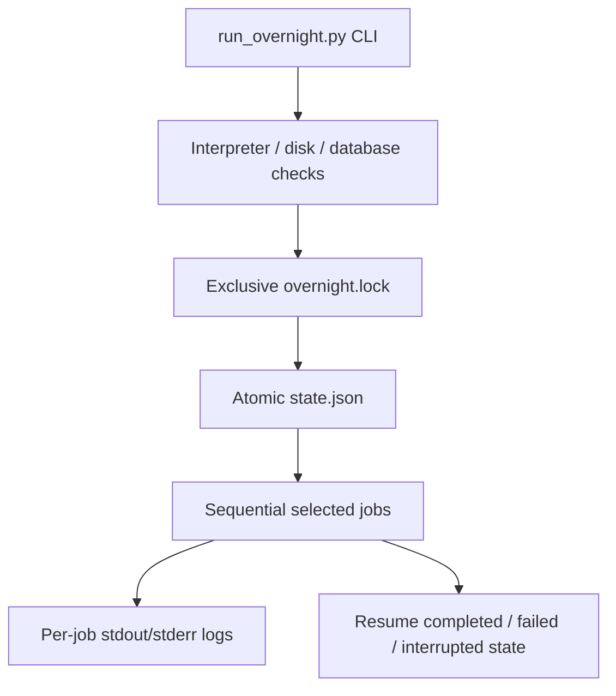

# Operations and Overnight Jobs

## Job Contract

The overnight runner is a coordinator, not a replacement for source-specific
or enrichment scripts. Each job has a stable name, description, command,
profile membership, database requirement, and network flag. It reports status,
attempts, timestamps, exit code, and log name in the run state.

The repository-wide ownership map and complete command/recovery guidance live
in [OVERNIGHT.md](../OVERNIGHT.md). This walkthrough focuses on the runner's
control flow and failure boundaries.

## Operating Model



Profiles are ordered dependency sets: `pull` acquires Federal Court material,
`enrich` verifies references and builds tags, chunks, citations, and local
embeddings, `safe` combines those sets, `pipeline` selects the complete
resumable V2 runner, and `verify` runs the regression suite. The `pipeline`
profile invokes `scripts/run_v2_pipeline.py` and executes source HTML, chunks,
metadata, outcome, case citations, statutes, and V3 tags under its own
per-case quarantine/state contract. The overnight `tag_cases` job is routed to
`scripts/tag_cases_v3.py`; legacy taggers and the combined citation job stay
outside the active V2 path. Database writers must not run concurrently with
another large writer.

The lock records the owning process. A stale lock can be removed only after
checking that the recorded process and any child overnight process are no
longer active. State writes use a temporary file and replacement so a process
failure does not intentionally leave a half-written JSON document.

## Recovery Boundary

Resume skips completed jobs and retries failed or interrupted jobs. Individual
Federal Court collectors and imports may have their own SQLite, page, record,
or checkpoint state. A successful preflight is not a successful run: inspect
`state.json`, the job exit codes, and the corresponding logs.

## Validation

Start with the runner help and preflight, then run the focused tests before any
bounded writer execution:

```powershell
.\venv\Scripts\python.exe scripts\run_overnight.py --help
.\venv\Scripts\python.exe scripts\run_overnight.py --profile safe --preflight
.\venv\Scripts\python.exe -m pytest tests\test_run_overnight.py -q
```

## Active Reader Browser Check

The active reader is embedded in `/data-explorer`; `/case-reader` remains a
compatibility redirect. The bounded Playwright smoke harness validates the
search-to-reader path, reader tabs, hover evidence tooltip, full-text tag
highlights, chunk-local case citation/statute spans, distinct highlight colors,
and the mobile Themes shell:

```powershell
.\venv\Scripts\python.exe scripts\browser_smoke.py --base-url http://127.0.0.1:8000 --query B010
```

The `B010` validation fixture produced 95 tag highlights, 110 case-citation
highlights, and 153 statute highlights. Hover text was present and citation
yellow and statute purple computed colors differed. These are read-only browser
checks; they do not run overnight jobs or write corpus data.

The reader highlight path is intentionally compact: one chunk renderer projects
stored citation/statute spans and one offset-based helper projects stored tags.
The older text-search tag overlay and duplicate renderer aliases were removed
after the Mason offset review.

Evidence review tabs use the same compact grouping principle: the reader opens
with an Info tab for normalized case facts and an Advanced tab for raw metadata,
provenance, processing state, and record counts. Tags group unique
category/value entries and show their occurrences; Acts / Regs expands from
source to section to every persisted occurrence. The B010 direct reader check
showed 7 sources, 7 sections, and 41 statute occurrences, plus 2 tag groups and
3 tag occurrences.

Acts / Regs now follows the Citations visual language for disclosure summaries
and occurrence rows. The nested source and section levels preserve the statute
drill-down while using the same compact spacing, typography, and borders.


When a job changes, validate its owning subsystem as well. Preserve run IDs,
failed job names, exit codes, log paths, and recovery commands in the handoff
or changelog. Never claim a bulk job succeeded from a test or preflight alone.

<SwmMeta version="3.0.0" repo-id="Z2l0aHViJTNBJTNBTGl0SW50ZWxwcm9qZWN0JTNBJTNBZ3JleXN0b25lLWRhbg==" repo-name="LitIntelproject"><sup>Powered by [Swimm](https://app.swimm.io/)</sup></SwmMeta>
