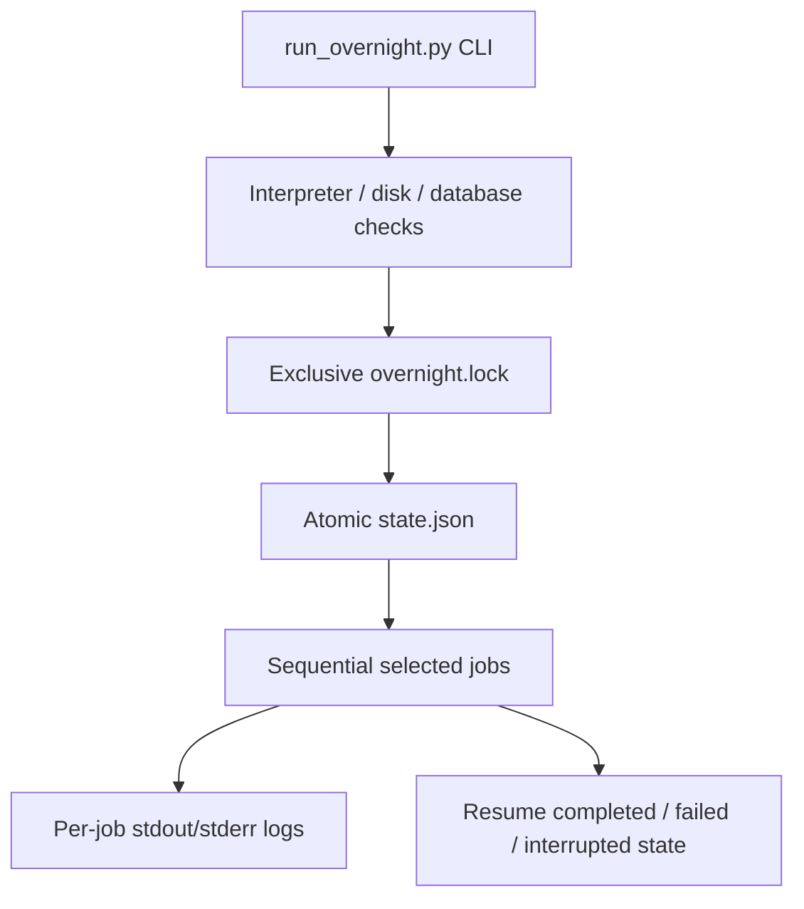

# Operations and Overnight Jobs

## Job Contract

The overnight runner is a coordinator, not a replacement for source-specific
or enrichment scripts. Each job has a stable name, description, command,
profile membership, database requirement, and network flag. It reports status,
attempts, timestamps, exit code, and log name in the run state.

The repository-wide ownership map and complete command/recovery guidance live
in [OVERNIGHT.md](../OVERNIGHT.md). This walkthrough focuses on the runner's
control flow and failure boundaries.

## Operating Model



Profiles are ordered dependency sets: `pull` acquires Federal Court material,
`enrich` verifies references and builds tags, chunks, citations, and local
embeddings, `safe` combines those sets, and `verify` runs the regression suite.
Database writers must not run concurrently with another large writer.

The lock records the owning process. A stale lock can be removed only after
checking that the recorded process and any child overnight process are no
longer active. State writes use a temporary file and replacement so a process
failure does not intentionally leave a half-written JSON document.

## Recovery Boundary

Resume skips completed jobs and retries failed or interrupted jobs. Individual
Federal Court collectors and imports may have their own SQLite, page, record,
or checkpoint state. A successful preflight is not a successful run: inspect
`state.json`, the job exit codes, and the corresponding logs.

## Validation

Start with the runner help and preflight, then run the focused tests before any
bounded writer execution:

```powershell
.\venv\Scripts\python.exe scripts\run_overnight.py --help
.\venv\Scripts\python.exe scripts\run_overnight.py --profile safe --preflight
.\venv\Scripts\python.exe -m pytest tests\test_run_overnight.py -q
```

When a job changes, validate its owning subsystem as well. Preserve run IDs,
failed job names, exit codes, log paths, and recovery commands in the handoff
or changelog. Never claim a bulk job succeeded from a test or preflight alone.

<SwmMeta version="3.0.0" repo-id="Z2l0aHViJTNBJTNBTGl0SW50ZWxwcm9qZWN0JTNBJTNBZ3JleXN0b25lLWRhbg==" repo-name="LitIntelproject"><sup>Powered by [Swimm](https://app.swimm.io/)</sup></SwmMeta>
