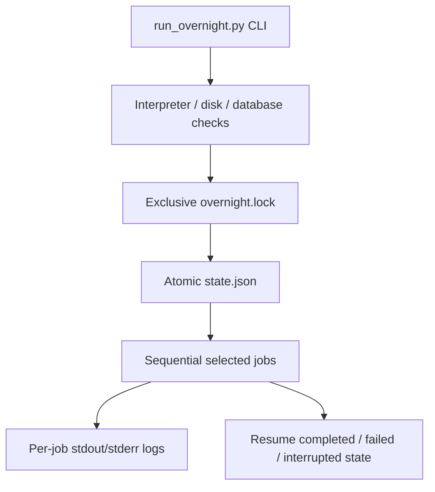

# Operations and Overnight Jobs

The long-term direction for this work is recorded in
[`docs/LONG_TERM_INTELLIGENCE_VISION.md`](../docs/LONG_TERM_INTELLIGENCE_VISION.md).
It describes how the current read-only Discussion Unit and sub-theme evidence
could eventually support citation-treatment intelligence and Argument Packets;
it does not promote those deferred projections to runtime behavior.

## Job Contract

The overnight runner is a coordinator, not a replacement for source-specific
or enrichment scripts. Each job has a stable name, description, command,
profile membership, database requirement, and network flag. It reports status,
attempts, timestamps, exit code, and log name in the run state.

The repository-wide ownership map and complete command/recovery guidance live
in [OVERNIGHT.md](../OVERNIGHT.md). This walkthrough focuses on the runner's
control flow and failure boundaries.

## Operating Model



Profiles are ordered dependency sets: `pull` acquires Federal Court material,
`enrich` verifies references and builds tags, chunks, citations, and local
embeddings, `safe` combines those sets, `pipeline` selects the complete
resumable V2 runner, and `verify` runs the regression suite. The `pipeline`
profile invokes `scripts/run_v2_pipeline.py` and executes source HTML, chunks,
metadata, outcome, case citations, statutes, and V3 tags under its own
per-case quarantine/state contract. The overnight `tag_cases` job is routed to
`scripts/tag_cases_v3.py`; legacy taggers and the combined citation job stay
outside the active V2 path. Database writers must not run concurrently with
another large writer.

The lock records the owning process. A stale lock can be removed only after
checking that the recorded process and any child overnight process are no
longer active. State writes use a temporary file and replacement so a process
failure does not intentionally leave a half-written JSON document.

## Contextual Authority Phase 0

Contextual authority analysis is an additive layer over canonical chunks and
citation occurrences. The Phase 0 package, `backend/contextual_authority/`,
generates sentence, paragraph, fixed-window, and citation-burst candidates
without changing canonical evidence. Each candidate retains chunk identity,
local offsets, source hashes, method/version, configuration identity, and
citation membership. The `0026_contextual_authority_phase0` migration provides
staged snapshots, units, evidence placeholders, and a separate active-snapshot
publication control.

Use the bounded inspector for read-only validation. It defaults to one case and
never writes contextual or canonical rows:

```powershell
.\venv\Scripts\python.exe scripts/inspect_context_variants.py --limit 1
```

Do not attach this layer to the canonical processing stage order until the
snapshot hash, offset, reconstruction, and publication checks have passed.

## Discussion Unit V1 Inspection

The first Discussion Unit implementation is a pure, deterministic layer over
existing `CaseChunk` rows. The read-only
`scripts/inspect_discussion_units.py` command accepts one case and one chunk
set, reconstructs paragraph features and canonical citation/statute/tag
memberships, validates source hashes, and emits optional JSON and Markdown
artifacts. It does not write canonical or contextual database rows.

V1 currently uses structural chunk boundaries plus adjacent authority,
statute, tag, content-word overlap, heading, and signal-density continuity.
Weak lexical overlap is neutral; explicit in-text cues such as `II. Background`,
`III. Issues`, and uppercase `JUDGMENT` create explainable boundaries. It does
not use embeddings, clustering, themes, treatment inference, or external AI.
The current database exposes `paragraph`, `section`, and `full_case` chunk
sets, so the inspector reports the selected set instead of assuming a
`heading_chunks` set. Case `1093` is the compact review fixture at
`data/eval/discussion_units_case_1093.md`; its JSON companion preserves the 40
paragraph hashes, text-overlap components, and four deterministic unit ranges.
Human review of those boundaries is the gate before any later segmentation
method is considered. Discussion Unit generation version 1.2 adds a
deterministic signal-vacuum boundary for sustained low-overlap paragraph runs
with no citation, statute, or tag signals when an input has at least 50
paragraphs. Eight consecutive vacuum pairs trigger the boundary; paragraph
identity and source hashes remain intact, and small cases stay outside the gate
to avoid over-segmentation around isolated heading and order spans.
The expanded read-only cohort adds cases `53515`, `53516`, `53517`, `53518`,
`62`, `853`, `1046`, `3267`, `7341`, `10047`, `12718`, and `13610` to the
original four review fixtures. All packets preserve paragraph hashes and report
zero canonical/contextual writes. The cohort exposed a 56-paragraph collapse in
`53518`; the eight-pair, 50-paragraph gate changed that case to three units and
kept `18674` bounded at 72 units. Shorter cases still contain some one- or
two-paragraph heading/order spans, which remain a human-review limitation.
The bounded external review of the 16-case V1.2 cohort confirmed source
integrity, smaller-case preservation, and improved large-case boundaries. It
identified a separate next slice for sub-theme quality: clarify weak role cues
and governing-rule context in exact sub-themes such as `677:3`, `1093:1`,
`1171:2`, and `18674:72`; this remains review-only and runtime-disabled.

## Sub-themes And Argument Evidence V1.4

The next bounded layer stays inside each reviewed Discussion Unit. The pure
`backend/contextual_authority/subthemes.py` contract extracts explicit text
cues for issue/question, party position, evidence/fact, governing rule,
reasoning/application, counterargument/limitation, and disposition. V1.1
suppresses metadata-only spans, requires actor context for party positions,
limits disposition to operative outcomes, and requires local contrast context
for limitation cues. Each cue is accompanied by its complete source sentence,
exact local offsets, original chunk identity, canonical source hash, rationale,
and method/version.

V1.3 retains the seven-role contract while tightening two precision boundaries.
Procedural claim nouns such as `refugee claims`, `on this claim`, and `claim for
refugee protection` are excluded from party-position evidence, while explicit
advocacy forms such as `claims that`, `argues`, and `submits` remain eligible
with actor context. Non-doctrinal `under` phrases such as `under the laws of
Yukon` and `under their own agenda` are excluded from governing-rule evidence,
while statutory and test references remain eligible. Soft contrast cues are
checked against a bounded local anchor window, and procedural `although the
parties' arguments` language is excluded. The changes are covered by
adversarial tests and remain read-only and source-preserving.

Contiguous sub-themes use deterministic content-term signatures, role
continuity, and explicit issue cues. Raw key terms remain inspectable while a
filtered display-term layer reduces party and administrative boilerplate
without deleting evidence. The read-only inspector adds the sub-theme and
argument evidence hierarchy to JSON and Markdown without canonical or
contextual writes. Each sub-theme also carries a deterministic explanation
with observed position, authority, application, and outcome context when
present, while stating that it is not a legal conclusion. V1.4 explicitly marks
sub-themes with no argument evidence as metadata or cue-free text, so
heading-only spans are distinguishable from missing extraction cues. The refreshed review
set includes cases `677`, `1093`, `1171`, and the larger heterogeneity check
`18674`; the external prompt names the OneDrive packet paths and requires the
response to be pasted back into chat. Human review must confirm whether those evidence groupings and
explanations correspond to useful argument moves before embeddings, corpus
clustering, AI labels, or runtime activation are considered.

## Reader Evidence Summary Projection

The active `/data-explorer` reader now offers a separate `Show case structure`
toggle. The reader service adds an optional `evidence_summary` projection when
preferred paragraph chunks are present, regenerating deterministic units and
sub-themes from canonical text and existing memberships without reading
evaluation packets or writing canonical/contextual rows. Collapsible groups
show roles, explanations, and evidence with paragraph index, chunk ID, local
offsets, context text, and source hash. The ordinary reader remains the
verification surface; this is a low-trust coded aid, not an AI-generated legal
summary or semantic conclusion.

The reader keeps this technical structure view separate from `Show case
summary`. The case summary projection uses the fixed deterministic role order
issue, party positions, facts/evidence, governing law, reasoning,
limitations/counterarguments, and disposition. It displays controlled
sub-theme explanations, paragraph ranges, and exact evidence spans where
available. Any section without a matching role is explicitly marked `Not
detected in available evidence`; no prose is inferred and no legal conclusion
is asserted.

Heading alignment is source-span based. If a canonical paragraph contains
leading prose followed by `II. Background`, `III. Issues`, or an explicit
uppercase `JUDGMENT` marker, the inspector splits that chunk into derived local
spans. It retains the original chunk identity and hash, and the next Discussion
Unit starts at the heading span rather than at the beginning of the containing
paragraph. This prevents a visually plausible but offset-wrong boundary from
passing review.

Treatment training is offline-first. The bounded fixture builder prioritizes
citations in the latter half of each case by chunk order, and the preparation
script writes a request payload with an estimated cost but makes no network
call. OpenAI is an optional development-time teacher only; runtime treatment
highlighting must use reviewed local rules or models. Candidate windows are
deliberately asymmetric: they retain bounded context before the citation and
twice as much after it, so a citation, party argument, and subsequent judicial
explanation can be reviewed together. Rule, comparison, authority-strength,
agreement, application, limitation, explanation, and party-position signals
help prioritize examples but do not label treatment; candidates remain
`review_required`. The approved sender in
`scripts/run_treatment_teacher_batch.py` checkpoints raw responses and accepts
only source-reconstructible treatment phrases, with unique-occurrence offset
repair recorded explicitly. Its output is still provisional teacher evidence,
not runtime authority treatment. The local-only
`scripts/build_treatment_distillation.py` report revalidates teacher spans,
groups repeated phrases, and writes `proposed_review_required` candidates with
source hashes and evidence text. Its first report yielded 19 repeated phrase
candidates from 106 confidence-qualified labels; the supportive-label skew
means review and held-out validation are required before any runtime use.
`scripts/build_treatment_review_packet.py` presents the candidate as a separate
Markdown and JSON queue. It surfaces sparse non-supportive labels and repaired
spans first, followed by repeated phrase rules; the current packet has 19
repeated rules and 90 priority labels. Decisions remain human-entered and the
packet remains runtime-disabled. The Markdown view starts with ten items and
defines each treatment in plain language; a reviewer can return item IDs with
`approve`, `reject`, or `unclear` and a short reason without editing JSON.
Each review item includes the fixture-backed decision passage plus citation and
proposed-treatment offsets, allowing treatment to be judged from the actual
decision context rather than an isolated phrase.

Discussion Unit Detection V1 is the next bounded analytical direction. It
starts with one decision and deterministic paragraph features, then stores
adjacent authority/statute/tag overlap and heading-boundary continuity
components separately before creating reviewer-inspectable boundaries. The
layer is additive and source-reconstructable; it does not alter canonical
evidence. Embeddings, clustering, theme labels, and treatment inference remain
out of scope until boundary quality is reviewed.
The method hierarchy is intentionally conservative: structural boundaries and
deterministic overlap/density first; statistical similarity and topic
segmentation later; corpus-level co-occurrence, frequent-pattern, graph, or
hierarchical discovery after that; AI labels only as non-authoritative metadata
at the end. Each later stage must be justified by reviewed boundary quality.

## Recent-Case Theme Discovery (Report Only)

`scripts/discover_recent_case_themes.py` is a bounded, additive discovery layer
for decisions dated `2020-09-22` through `2026-09-22`, inclusive. It uses a
controlled registry rather than clustering: text phrases, metadata subjects,
legal tags, and statute provisions provide explainable candidate evidence, while
the existing read-only `inspect_case()` Discussion Unit/sub-theme output can
add argument-role evidence and paragraph references. The default input is the
existing `paragraph` chunk set; the report records its Discussion Unit
configuration and preserves generation evidence rather than publishing rows.

Candidates are classified as `central_issue`, `material_issue`, or `mentioned`.
Each match records classification factors: weighted role score, independent
evidence kinds, and the threshold branch that produced the status. Role evidence is only matched when a controlled theme phrase occurs in the
sub-theme text or key terms. Provision-specific themes require a matching
provision; a broad IRPA reference is not enough. Citation counts are retained
as context but do not independently create a theme. The JSON report is
report-only: no canonical/contextual writes, migration, tag/statute/metadata
changes, embeddings, external calls, or UI activation follow from it. The
initial smoke cohort produced 21 themed cases and 84 Discussion Units across
25 cases; these are bounded validation counts and require human review before
any persisted or user-facing theme layer.

The next bounded slice, `backend/contextual_authority/observations.py`, emits
deterministic disposition, issue, and government-party cues from those source
segments. Observations retain exact chunk-local evidence offsets and hashes,
rule provenance, confidence, and method version. Citation presence does not by
itself become a treatment or merits conclusion; treatment extraction remains a
later experiment requiring directional linkage and review.

Weak-supervision preparation is limited to the pure voting substrate in
`backend/contextual_authority/voting.py`. It retains all rule votes, turns
below-threshold votes into explicit abstentions, reports conflicts instead of
silently resolving them, and hashes the vote/config provenance. The report is
for calibration and audit only; no pseudo-labels, model training, or corpus
writes occur in this phase.

## Recovery Boundary

Resume skips completed jobs and retries failed or interrupted jobs. Individual
Federal Court collectors and imports may have their own SQLite, page, record,
or checkpoint state. A successful preflight is not a successful run: inspect
`state.json`, the job exit codes, and the corresponding logs.

## Validation

### Judge identity audit (read-only, 2026-09-22)

Judge Outcomes currently groups every non-empty
`metadata_json.reader_extracted.judge` value, while Judge Profile depends on
the separately populated `judge_profiles` and `case_judge_profiles` tables.
The audit recorded 61,261 cases, 52,484 non-empty raw judge values, 8,777
missing judges, and 21,160 raw-judge cases without a profile link. It also
confirmed contamination in the raw field, including 2,993 normalized exact
`Certified true translation` values and thousands of Ottawa/Ontario location
values. See the detailed counts and ownership boundary in
[`SYSTEM_REFERENCE.md`](../SYSTEM_REFERENCE.md#judge-identity-audit-2026-09-22).

This was a read-only diagnostic. Do not backfill, delete, or normalize judge
values until a bounded remediation task defines source evidence, accepted
name shapes, profile-link reconciliation, and rollback evidence.

The follow-up code contract now rejects known court, location, province,
translation, certification, and copy labels during extraction and profile
eligibility, and Judge Outcomes applies the same rejection pattern. Invalid
new candidates are omitted from the extracted judge field. Existing stored
rows remain unchanged until a separate dry-run remediation is approved.

The follow-up read-only report at
`data/eval/reports/judge_reconciliation_2026-09-22.json` found 5,652 invalid
stored judge values, 19,095 valid raw judges without profile links, 3,587
invalid values with existing links, and 28,583 raw-name/link mismatches. It
also exposed letter-spaced location labels such as `O T T A W A, Ontario`;
the shared junk predicate now rejects that form and the focused judge suite
passes. The report made no database writes. Review its bounded samples before
planning a checkpointed metadata/profile remediation.

The parser now also has inline `CORAM` and `REASONS FOR ORDER` /
`ASSESSMENT` fallbacks. The focused judge tests pass (`31 passed`) and
`py_compile` passes. The read-only stored post-2005 baseline is 41,123 cases:
34,471 nonempty, 31,582 profileable, 2,889 invalid, 31,334 with
profileability confidence from 0.92 through 0.98, and 7,199 valid values
without profile links. A bounded fresh sample reached 93/100 profileable with
zero invalid values. The full fresh evaluation timed out at 120 seconds and
remains pending; this does not yet establish the 95% gate. No database writes,
backfill, or live-pipeline rollout occurred. The next operation is a batched
read-only fresh evaluation, followed by separate approval for any dry-run or
write.

Start with the runner help and preflight, then run the focused tests before any
bounded writer execution:

```powershell
.\venv\Scripts\python.exe scripts\run_overnight.py --help
.\venv\Scripts\python.exe scripts\run_overnight.py --profile safe --preflight
.\venv\Scripts\python.exe -m pytest tests\test_run_overnight.py -q
```

## Active Reader Browser Check

The active reader is embedded in `/data-explorer`; `/case-reader` remains a
compatibility redirect. The bounded Playwright smoke harness validates the
search-to-reader path, reader tabs, hover evidence tooltip, full-text tag
highlights, chunk-local case citation/statute spans, distinct highlight colors,
and the mobile Themes shell:

```powershell
.\venv\Scripts\python.exe scripts\browser_smoke.py --base-url http://127.0.0.1:8000 --query B010
```

The `B010` validation fixture produced 95 tag highlights, 110 case-citation
highlights, and 153 statute highlights. Hover text was present and citation
yellow and statute purple computed colors differed. These are read-only browser
checks; they do not run overnight jobs or write corpus data.

The reader highlight path is intentionally compact: one chunk renderer projects
stored citation/statute spans and one offset-based helper projects stored tags.
The older text-search tag overlay and duplicate renderer aliases were removed
after the Mason offset review.

Evidence review tabs use the same compact grouping principle: the reader opens
with an Info tab for normalized case facts and an Advanced tab for raw metadata,
provenance, processing state, and record counts. Tags group unique
category/value entries and show their occurrences; Acts / Regs expands from
source to section to every persisted occurrence. The B010 direct reader check
showed 7 sources, 7 sections, and 41 statute occurrences, plus 2 tag groups and
3 tag occurrences.

Acts / Regs now follows the Citations visual language for disclosure summaries
and occurrence rows. The nested source and section levels preserve the statute
drill-down while using the same compact spacing, typography, and borders.


When a job changes, validate its owning subsystem as well. Preserve run IDs,
failed job names, exit codes, log paths, and recovery commands in the handoff
or changelog. Never claim a bulk job succeeded from a test or preflight alone.

<SwmMeta version="3.0.0" repo-id="Z2l0aHViJTNBJTNBTGl0SW50ZWxwcm9qZWN0JTNBJTNBZ3JleXN0b25lLWRhbg==" repo-name="LitIntelproject"><sup>Powered by [Swimm](https://app.swimm.io/)</sup></SwmMeta>
