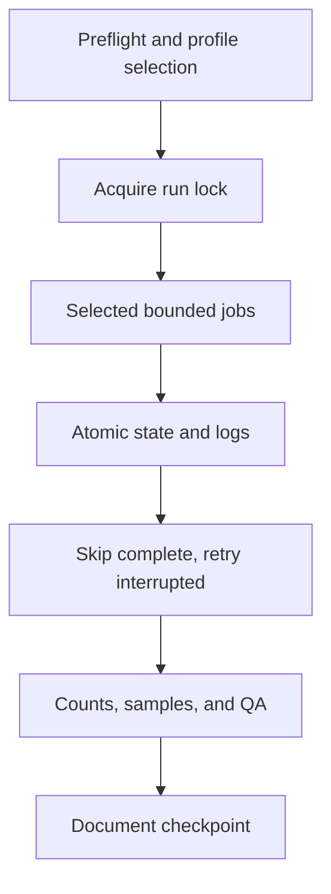

# Operations and Overnight Jobs

## Operating Model

`scripts/run_overnight.py` orchestrates acquisition and enrichment jobs using
profiles, locks, state files, logs, preflight checks, and resume behavior. It
is an orchestration boundary, not a place to hide domain logic.

## Job Classes

- Acquisition jobs write source-specific staging artifacts.
- Import jobs bridge validated records into canonical PostgreSQL.
- Enrichment jobs update metadata, chunks, citations, statutes, tags, or embeddings.
- Evaluation jobs produce reports and templates without changing canonical data.
- Documentation generators refresh API, schema, script, or work-history references.

## Safety Contract

Every writer should expose `--help` and, where appropriate, bounded limits,
dry-run, preflight, resume, state, and log output. Never run competing bulk
writers against the same canonical database. Record command, run ID, scope,
before/after counts, errors, sampled verification, and recovery instructions.

## Recovery

Inspect stale locks, state files, logs, and database counts before restarting.
Resume supported jobs rather than blindly repeating them. Treat partial source
capture, failed enrichment, and canonical import as different recovery states.
Keep large raw artifacts, backups, secrets, and logs out of ordinary Git history.

## Validation

Start with `scripts/run_overnight.py --list-jobs`, then use `--help` and
`--profile safe --preflight`. Run `tests/test_run_overnight.py` and review the
generated state/log artifacts before any bounded writer execution.

<SwmMeta version="3.0.0" repo-id="Z2l0aHViJTNBJTNBTGl0SW50ZWxwcm9qZWN0JTNBJTNBZ3JleXN0b25lLWRhbg==" repo-name="LitIntelproject">Powered by [Swimm](https://app.swimm.io/)</SwmMeta>
