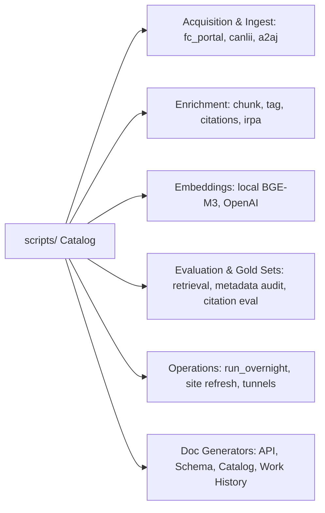

# Repository Component Catalog and Directory Map

This walkthrough is the comprehensive repository component catalog and directory
map for AI CaseLibrary. It provides future agents and engineers with an immediate,
deep understanding of what every directory, subsystem, module, and file family
does, how they interact, where they persist data, and how to validate changes
without needing to read hundreds of raw code files.

## 1. High-Level Repository Topology

```mermaid
flowchart TD
    Root[AI CaseLibrary Root]
    Root --> Backend[backend/ : FastAPI, ORM, Pipeline, Analytics, Pages]
    Root --> FCIngest[fc_ingest/ : Federal Court Scraper & SQLite Staging]
    Root --> CanLaw[canlaw/ : CanLaw Staging & Embedding Tooling]
    Root --> Alembic[alembic/ : Versioned DB Migrations]
    Root --> Scripts[scripts/ : 50+ Operational, Enrichment & Generation Tools]
    Root --> Data[data/ : Raw, Staging, Reference, Evaluation & Logs]
    Root --> Tests[tests/ : Pytest Suite, Contracts, Offsets & Regressions]
    Root --> SideProj[side_projects/ : Isolated Datasets e.g. LOTD III]
    Root --> PM[.github/ : Project Manager Agent, Prompts & Task Records]
    Root --> Swimm[.swm/ : Swimm Architectural Walkthroughs & Documentation]
```

---

## 2. `backend/` Subsystems and Modules

The `backend/` directory is the active runtime application powering FastAPI,
SQLAlchemy ORM models, deterministic pipeline stages, retrieval algorithms,
and generated research interfaces.

| File / Subpackage | Role & Scope | Inputs & Outputs | Key Invariants & Boundaries |
| --- | --- | --- | --- |
| `main.py` | Application entry point, lifespan/startup, no-index middleware, health and private access routes | ASGI requests -> HTTP responses | Keeps server lifecycle separate from domain route handlers. Middleware adds `X-Robots-Tag: noindex`. |
| `routes.py` | Central API router, request orchestration, SQL queries, analytics endpoints, and interface dispatch | HTTP payloads -> Pydantic/HTML responses | Couples API contracts and UI page serving; forwards requests to domain helpers and page modules. |
| `models.py` | Pydantic request and response schemas (500+ lines) | JSON payloads <-> Validated Python dataclasses | Field validation, search filters, pagination bounds, response models for cases, chunks, citations, metrics. |
| `database.py` | Database engine, connection pooling, session dependency (`get_db`), and SQLAlchemy ORM models | Environment variables -> DB Sessions & Entities | Precedence: `POSTGRES_*` overrides `DATABASE_URL`. Models define `Case`, `CaseSource`, `CaseChunk`, `Citation`, `StatuteReference`, `CaseTag`, `CitationMetrics`, etc. |
| `ingestion.py` | Canonical ingest service, deduplication, HTML sanitization, and source priority merge | `CaseIngestRequest` -> Canonical `Case` + `CaseSource` | Priority: Official (400) > Secondary/CanLII (300) > Datasets (200) > Synthetic (10). Conflicts preserved in `_source_conflicts`. |
| `case_processing.py` | Ordered 5-stage deterministic case processing orchestrator | `case_id` -> Populated derived DB tables | Stages: (1) metadata -> (2) overall_chunks -> (3) heading_chunks -> (4) case_citations -> (5) statutes. |
| `citations.py` | Deterministic citation & statute extraction, span validation, normalization, resolution, and graph metrics | Decision text / chunks -> `Citation` & `StatuteReference` rows | Separates case citations from statutes. Normalizes neutral, CanLII, and reported forms. Nested IRPA/IRPR (e.g. `34(1)(f)`). |
| `citation_map.py` | Read-only citation network analytics, graph traversal, and intelligence algorithms | Resolved citations -> Graph nodes, metrics, shifts, CSVs | Computes in-degree, out-degree, PageRank, co-citations, hidden bridges, authority lifecycles, and issue shifts. |
| `metadata.py` | Regex & heuristic metadata extraction (judges, dates, dockets, parties, outcomes) | Full text / HTML -> `reader_extracted` metadata dictionary | Produces field confidence scores, quality flags, and extraction evidence. |
| `legal_tagger.py` / `legal_tagger_v2.py` | Deterministic legal taxonomy classification | Case text / metadata -> `case_tags` entries | Implements `ca_legal_v2` taxonomy covering immigration, refugee law, inadmissibility, tribunals, and remedies. |
| `live_analysis.py` | In-memory ephemeral document analysis (.docx / text .pdf) | Uploaded file bytes -> Highlighted text & extracted citations | Completely in-memory; persists no cases, chunks, or citation rows to PostgreSQL. |
| `fc_activity.py` | Federal Court procedural and docket activity normalization | Activity records -> Structured timeline & classification | Maps docket context without conflating activity records with official judgment capture. |
| `embedding_providers.py` | Embedding provider abstraction (OpenAI / Local BGE-M3) | Text strings -> Vector float arrays | Validates dimensions (1536 for OpenAI, 1024 for BGE-M3). |
| `search_service.py` | Query validation, filter assembly, tsvector lexical ranking, cosine distance semantic search, and chunk grouping | `CaseSearchRequest` + DB Session -> Search response models | Encapsulates SQL ranking and vector scoring. Supports semantic, lexical, hybrid, and metadata modes. |
| `reader_service.py` | Case reader payload assembly (`/cases/{id}/reader-data`), metadata pass formatting, HTML citation wrapping, and citation-pass details | `case_id` + DB Session -> `CaseReaderDataResponse` & Pass models | Formats multi-layer evidence payloads without mutating database records. Supports live and stored citation overlays. |
| `analytics_service.py` | SQL aggregations for judge outcomes, yearly trends, data explorer cross-tabulations, judge profiles, and FC activity timelines | Query params + DB Session -> Aggregated metrics & distributions | Encapsulates complex reporting queries and outcome ratios. Re-exported through routes for clean API routing. |
| `citation_pipeline/` | Modular citation parsing rules, models, and external CanLII client | Citation strings -> Structured candidate objects | Separates parsing rules (`rules.py`) from external lookup clients (`canlii.py`). |
| `pages/` | Modular HTML/CSS/JS page builders for research UIs | Backend data -> Self-contained HTML strings | Cleanly separated from routing logic. Contains builders for Data Explorer, Quick Search, Citation Map, etc. |

---

## 3. `backend/pages/` UI Page Builders

The `backend/pages/` directory extracts large HTML/CSS/JavaScript client applications
out of `routes.py` into dedicated modules.

| Page Module | URL Route | Features & User Experience |
| --- | --- | --- |
| `data_explorer.py` | `/data-explorer` | The primary 8-tab research interface: About, Case Search (with inline reader & highlight inspector), Site Architecture, Citation Intelligence, Judge Outcomes, Judge Profile, Data Explorer, and FC History. |
| `quick_search.py` | `/quick-search` | Lightweight single-card semantic and hybrid chunk retrieval page with instant snippet previews. |
| `citation_map.py` | `/citation-map` | Radial multi-authority citation graph workbench and network visualization. |
| `citation_pass.py` | `/citation-pass` | Side-by-side QA surface comparing stored database citation rows against live regex extraction spans. |
| `live_analysis.py` | `/live-analysis` | Temporary document inspector for uploaded briefs and judgments with ephemeral citation resolution. |
| `judge_outcomes.py` | `/judge-outcomes` | Analytical visualizer for judge ruling distributions and government win/loss rates. |
| `testing.py` | `/testing` | API test bench for manual query evaluation and retrieval inspection. |
| `prototype.py` | `/prototype` | Legacy prototype cohort explorer. |

---

## 4. `fc_ingest/` & `canlaw/` Staging Packages

Source acquisition pipelines stage raw court records and secondary datasets into
local stores (SQLite/JSONL) before bridging them into canonical PostgreSQL.

### `fc_ingest/` (Federal Court Portal Ingestion)
- `__main__.py`: CLI runner (`python -m fc_ingest`).
- `ingest_pipeline.py`: Main orchestrator handling discovery, item parsing, document capture, and SQLite persistence.
- `index_scraper.py`: Queries the Lexum-backed Federal Court portal using recursive date windows (≤500 results cap).
- `item_scraper.py`: Parses item landing pages to discover associated document versions and metadata.
- `document_scraper.py`: Extracts decision metadata, citations, judge, and PDF links from document pages.
- `pdf_downloader.py`: Validates MIME signatures and downloads decision PDFs with exponential backoff.
- `db.py`: SQLite storage layer (`fc_decisions.db`) managing staged items, document records, and schema upgrades.
- `models.py`: Dataclasses for staged items (`ItemData`, `DocumentData`).
- `errors.py`: Exceptions including `HumanValidationRequired` when encountering CAPTCHAs or source blocks.

### `canlaw/` (Legal Data Staging & Model Tooling)
- `cli.py`: CLI dispatcher for court ingestion, batch embeddings, and staging repair.
- `config.py`: Local configuration for Hugging Face datasets (`a2aj/canadian-case-law`), court filters, and model paths.
- `db.py`: Staging SQLite database access and metadata normalization.
- `hf_loader.py`: Downloads and parses court batches from remote/local Hugging Face datasets.
- `embeddings.py`: Generates local embeddings for staged court records.

---

## 5. `scripts/` Operational & Maintenance Catalog

The `scripts/` directory contains 50+ focused CLI scripts categorized by operational domain:

### Major Script Families

1. **Orchestration & Operations**:
   - `run_overnight.py`: Lock-protected, sequential, stateful runner executing overnight profiles (`pull`, `enrich`, `safe`, `verify`).
   - `refresh_site.ps1` / `run_local_with_tunnel.ps1`: Restarts local Uvicorn and binds Cloudflare tunnels (`www.ilit.ca`).
   - `setup_cloudflare_tunnel.ps1`: Configures Cloudflare named tunnel for secure exposure.

2. **Acquisition & Staging**:
   - `fc_portal_collector.py`: Checkpointed collector for IMM prefix decisions with detail expansion.
   - `ingest_canlii_seed_cases.py`: Resilient CanLII scraper with A2AJ API fallback when blocked by anti-bot.
   - `ingest_a2aj_parquet.py` / `ingest_a2aj_api.py`: Bulk and stream ingestion from A2AJ datasets.
   - `import_fc_decisions.py`: Bridges staged SQLite Federal Court decisions into canonical PostgreSQL `cases`.
   - `download_reference_library.py`: Manifest-driven downloader for legislation, policy manuals, and rules.

3. **Enrichment & Extraction**:
   - `chunk_cases.py`: Builds fixed-size legacy chunks, section chunks, and paragraph chunks.
   - `tag_cases.py` / `tag_cases_v2.py`: Applies deterministic legal taxonomy tags (`ca_legal_v2`).
   - `extract_citation_network.py`: Full-corpus case citation, statute reference, and graph metrics rebuilder.
   - `extract_irpa_irpr_references.py`: Dedicated extractor for nested IRPA/IRPR provisions (e.g., `34(1)(f)`).
   - `resolve_citation_targets.py` / `resolve_short_citation_targets.py`: Local 2-pass target resolution.
   - `backfill_judge_profiles.py`: Resolves judge aliases to canonical `judge_profiles`.

4. **Embeddings & Search**:
   - `embed_local_chunks.py`: Generates 1024-d BGE-M3 vectors for pending chunks using CPU/accelerator.
   - `embed_openai_chunks.py` / `embed_a2aj_cases.py`: Generates 1536-d OpenAI vectors.
   - `evaluate_retrieval.py`: Evaluates retrieval recall, precision, and MRR against benchmark questions.
   - `quick_search_engine.py`: Terminal search client for testing hybrid queries.

5. **QA, Evaluation & Fixture Builders**:
   - `verify_citation_extraction.py`: Samples corpus extractions for precision/recall validation.
   - `evaluate_fc_citation_extraction.py`: Benchmark runner against gold citation fixtures.
   - `build_fc_citation_gold_template.py` / `build_fc_metadata_gold_set.py`: Scaffolds gold datasets.
   - `audit_fc_metadata_extraction.py` / `adjudicate_fc_metadata.py`: Audits metadata confidence and applies LLM fallback.

6. **Documentation Generators (Do Not Edit Generated Outputs Manually)**:
   - `generate_api_reference.py` -> `docs/API_REFERENCE.generated.md`
   - `generate_schema_reference.py` -> `docs/SCHEMA_REFERENCE.generated.md`
   - `generate_script_catalog.py` -> `docs/SCRIPT_CATALOG.generated.md`
   - `generate_work_history.py` -> `WORK_HISTORY.md` & `docs/work_history_*.json`

---

## 6. `data/` Directory Topology & Data Isolation

| Path | Contents & Purpose | Version Control & Isolation Rule |
| --- | --- | --- |
| `data/raw/` | Raw downloads, scraped PDFs, SQLite staging (`fc/fc_decisions.db`) | Local only (`.gitignore`). Never committed. |
| `data/eval/` | Benchmark questions, gold templates, candidate CSVs, evaluation reports | Version-controlled (large files tracked with Git LFS). |
| `data/reference_library/` | Official legislation, IRB guidelines, policy documents | `manifest.json` is authoritative; `inventory.csv` is generated. Never inserted into case tables. |
| `data/overnight_runs/` | Run logs (`<job>.log`), `state.json`, and `overnight.lock` | Operational logs only (`.gitignore`). Never treated as canonical case data. |
| `data/static/` | Static application assets, icons, and taxonomy candidate JSON files | Version-controlled static assets. |
| `data/copilot_exports/` | Session debug logs used to generate `WORK_HISTORY.md` | Local session history. |

---

## 7. `alembic/` Database Migrations

Alembic is the sole deployment authority for PostgreSQL schema evolution.
Revisions live in `alembic/versions/` and trace migrations from `0001_case_metadata`
to `0016_case_source_html`.

**Rules:**
1. Never run `Base.metadata.create_all()` in production.
2. Always generate or inspect migrations via `alembic revision --autogenerate` or explicit scripts.
3. Apply migrations using `alembic upgrade head`.
4. Run `python scripts/generate_schema_reference.py` immediately after any ORM/migration change.

---

## 8. `tests/` Test Suite & Validation Routing

| Test File | Target Subsystem | Key Invariants Tested |
| --- | --- | --- |
| `tests/test_api.py` | `backend/routes.py`, `models.py` | API request/response contracts, search modes, search bounds, reader payload structure. |
| `tests/test_feature_tabs.py` | `backend/routes.py`, `backend/pages/` | HTML status codes, navigation tabs, embedded scripts, query parameter parsing. |
| `tests/test_citations.py` | `backend/citations.py` | Exact character offsets, party filtering, short-form aliases, IRPA/IRPR `34(1)(f)` exact spans, positive/negative cases. |
| `tests/test_ingestion_merge.py` | `backend/ingestion.py` | Source precedence (400 vs 300 vs 200), field merge, conflict logging, sanitization. |
| `tests/test_run_overnight.py` | `scripts/run_overnight.py` | Profile job selection, exclusive locking, stale lock recovery, state serialization. |
| `tests/test_fc_ingest_db.py` | `fc_ingest/db.py` | SQLite schema creation, PDF metadata upsert, legacy column migrations. |
| `tests/test_fc_portal_collector.py` | `scripts/fc_portal_collector.py` | Portal HTML parsing, prefix rotation, import-ready payload generation. |
| `tests/test_download_reference_library.py` | `scripts/download_reference_library.py` | PDF MIME validation, SHA-256 checksums, resumable downloads. |

---

## 9. `side_projects/` & `legacy/` Isolation Contracts

- **`side_projects/luck_of_the_draw_iii/`**:
  - Contains data processing and export tooling for the *Luck of the Draw III* immigration judge study.
  - **Strict isolation rule**: Writes exclusively to the PostgreSQL schema `lotd`. It must never write to or read from the canonical `cases` tables.
- **`legacy/` & `backend/legacy/`**:
  - Archived scripts and deprecated prototypes.
  - Must never be imported by active runtime packages or executed by `run_overnight.py`.

---

## 10. Project Manager Agent Workflow & Autonomy Guide

The `.github/` directory provides the autonomous project-manager agent scaffold:
- **`.github/agents/project-manager.agent.md`**: Defines the `AI CaseLibrary Project Manager` agent with permissions for execution, file edits, todo management, and subagent delegation.
- **`.github/prompts/managed-task.prompt.md`**: Launch prompt for starting managed outcomes.
- **`.github/project-manager/TASK_TEMPLATE.md`**: Standard durable task record template.
- **`.github/project-manager/tasks/`**: Active and completed task logs.

Whenever an autonomous task is executed:
1. One owning surface is selected.
2. A falsifiable hypothesis and smallest test command are recorded.
3. The smallest safe slice is implemented.
4. Validation is executed and recorded as evidence.
5. Canonical docs and Swimm maps are updated in the same commit.

<SwmMeta version="3.0.0" repo-id="Z2l0aHViJTNBJTNBTGl0SW50ZWxwcm9qZWN0JTNBJTNBZ3JleXN0b25lLWRhbg==" repo-name="LitIntelproject">Powered by [Swimm](https://app.swimm.io/)</SwmMeta>
