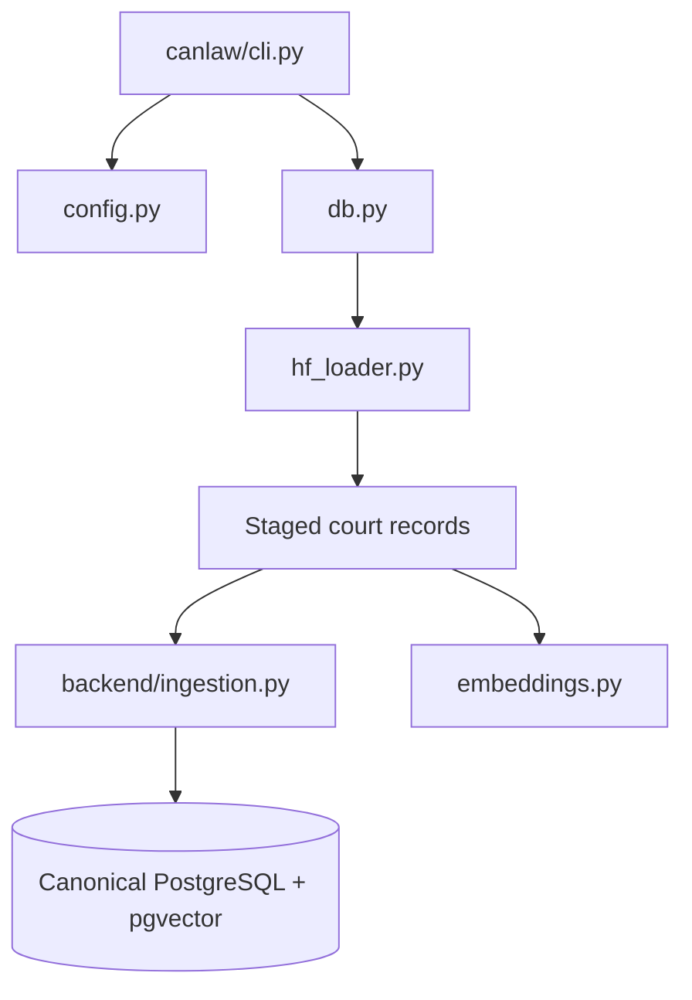

# CanLaw Staging And Model Helpers

## Scope

`canlaw/` contains source-specific staging, configuration, model-loading, and
CLI helpers. It supports local legal-data workflows without becoming a second
canonical case store. Any deliberate bridge into canonical cases must pass
through provenance-aware ingestion.


```mermaid
flowchart TD
    CLI[canlaw/cli.py] --> Config[config.py]
    CLI --> Staging[db.py]
    Staging --> Load[hf_loader.py]
    Load --> Cases[Staged court records]
    Cases --> Canonical[backend/ingestion.py]
    Cases --> Vectors[embeddings.py]
    Canonical --> Postgres[(Canonical PostgreSQL + pgvector)]
```

## Component Ownership

| Component | Responsibility | Boundary |
| --- | --- | --- |
| `cli.py` | Commands for court ingestion, embedding, and staging repair | Commands must make scope and write behavior visible |
| `config.py` | Source/model and local workflow configuration | Secrets belong in environment configuration, not source |
| `db.py` | Local staging access and metadata repair helpers | Staging writes stay distinct from canonical merge policy |
| `hf_loader.py` | Loads and processes selected court records from local/Hugging Face sources | Preserves source identity before any bridge |
| `embeddings.py` | Optional embeddings for staged court records | Model/version and provider must remain observable |
| `README.md` | Package-specific operating notes | Does not override root architecture authority |

## Data And Provenance Boundary

CanLaw staging records can be incomplete, duplicated, or source-specific. Keep
source name, source identifier, source URL, court, citation, retrieval context,
and content hashes with each record. Do not infer official status merely from a
successful load. Do not merge staged records directly by title or overwrite
canonical fields without the source-priority rules in `backend/ingestion.py`.

Embeddings are derived artifacts, not identity. A staged vector cannot replace
canonical case text, provenance, citation extraction, statute extraction, or
review status. Reference and side-project material remains outside canonical
case tables unless an explicit migration/bridge is documented.

## Operational Rules

- Run from the repository root with the project virtual environment.
- Use the CLI command and court filters to bound ingestion or embedding scope.
- Inspect `--help` before a new command or changed option.
- Keep hosted credentials and database settings in ignored environment files.
- Record source, model, batch size, limits, created/updated counts, and failures.
- Do not run a large PostgreSQL writer beside overnight or another importer.
- Treat repair operations as writes and validate before broad execution.

The current A2AJ freshness check is a source-contract question, not an
automatic bulk-refresh authorization. On 2026-09-30 the canonical database
contained 60,849 `a2aj_parquet` cases, newest dated 2026-07-24, while the local
staging archive was last modified in August. The paginated API importer exists,
but one bounded unauthenticated probe returned HTTP 400 for the attempted
search shape. Reconcile the live API contract and run a read-only date/citation
comparison before any acquisition or canonical bridge write.

The 2026-09-30 scoped probe confirmed that the live Hugging Face source exposes
FC, FCA, and SCC Parquet partitions. Their approximate remote sizes are 850 MB,
145 MB, and 365 MB respectively; only the older FC Parquet file is present in
`data/raw/a2aj/`, while local SQLite staging contains the older three-court
snapshot. Downloading the current partitions and importing them remains a
separate bulk-operation checkpoint requiring source metadata capture, a dry-run
delta review, and explicit approval.

That bounded acquisition completed on 2026-09-30 in
`data/raw/a2aj/refresh-20260930/`. The refreshed partitions contain FC 35,990
rows through 2026-09-25, FCA 7,813 through 2026-09-24, and SCC 10,893 through
2026-09-18. Court-filtered dry-runs identified 206 FC, 33 FCA, and 4 SCC
deduplication candidates; 200 are dated after the July 24 canonical baseline.
All three files matched their upstream linked SHA-256 values. No canonical
write was made; candidate review and import remain separate approval-gated
steps.

The approved new-case import completed on 2026-09-30 using the date-filtered
Parquet importer. It added 168 FC, 28 FCA, and 4 SCC records after the July 24
baseline, increasing canonical `a2aj_parquet` cases from 60,849 to 61,049.
The write did not replace or enrich existing cases. Citation-network enrichment
and official HTML snapshots remain separate follow-up work.

Example command shape:

```powershell
.\venv\Scripts\python.exe -m canlaw --help
.\venv\Scripts\python.exe -m canlaw ingest_courts --courts FC FCA --batch-size 16
```

Use a bounded court selection or fixture for validation before a broad run.

## Modularization Direction

The stable seams are CLI parsing, configuration, staging persistence, source
loading, and embedding. Keep source adapters independent from canonical identity
and merge decisions. Keep embedding provider selection independent from text
identity and from citation/statute processing. A future bridge should be an
explicit, auditable operation with a dry run and rollback or checkpoint story.

## Validation

Start with CLI help, then run the relevant staging, importer, and embedding
fixture tests. Confirm that source fields and hashes survive staging and that a
repair or embedding run does not create canonical records unexpectedly.

```powershell
.\venv\Scripts\python.exe -m canlaw --help
.\venv\Scripts\python.exe -m pytest tests -q -k "canlaw or staging or embedding"
```

The filtered command is a discovery check, not a substitute for the focused
test named by the changed component. For network or database work, use a
bounded dry run and inspect resulting counts and logs.

<SwmMeta version="3.0.0" repo-id="Z2l0aHViJTNBJTNBTGl0SW50ZWxwcm9qZWN0JTNBJTNBZ3JleXN0b25lLWRhbg==" repo-name="LitIntelproject"><sup>Powered by [Swimm](https://app.swimm.io/)</sup></SwmMeta>
