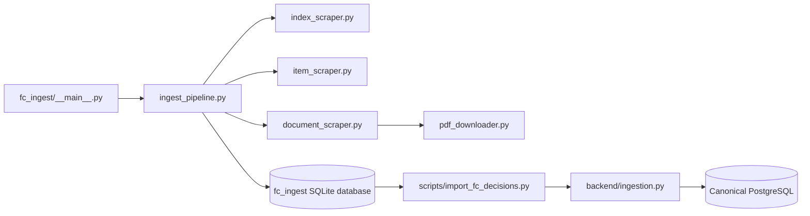

# Federal Court Source Pipeline

## Scope

`fc_ingest/` is the Federal Court source-specific acquisition and SQLite
staging package. It is not the canonical case database and it does not decide
whether a staged record should replace a canonical field. That policy belongs
to `backend/ingestion.py`.



## Component Ownership

| Component | Responsibility | Boundary |
| --- | --- | --- |
| `__main__.py` | Package CLI entry point and command dispatch | Keeps module execution reproducible |
| `ingest_pipeline.py` | Coordinates discovery, item retrieval, document capture, and staged output | Does not own canonical merge policy |
| `index_scraper.py` | Finds result pages and item identifiers, including bounded date windows | Discovery is not capture |
| `item_scraper.py` | Parses source item pages and item metadata | Retains source-native identifiers and evidence |
| `document_scraper.py` | Extracts document links and metadata from source pages | Invalid or incomplete documents remain reviewable failures |
| `pdf_downloader.py` | Retrieves and validates PDF payloads | MIME/signature and hash checks precede acceptance |
| `db.py` | SQLite connection, schema, upsert, and legacy upgrade behavior | SQLite is staging persistence, not canonical authority |
| `models.py` | Typed staged item/document records | Keeps parser output explicit between steps |
| `errors.py` | Source and human-review failure types | Failures must not be promoted to successful capture |

## State And Provenance

Keep these states distinct:

`discovered -> retrieved -> staged -> validated -> imported -> processed`

A discovered item may have an identifier without a usable document. A staged
PDF may still fail validation. An imported record may still need canonical
processing for metadata, chunks, citations, statutes, tags, or embeddings.
Every bridge record should preserve its source identifier, source URL, retrieval
information, hashes, metadata evidence, and failure/review details.

The Federal Court activity layer is also distinct from judgment capture. An
activity or procedural record may be useful context while remaining outside the
canonical judgment path.

## Operational Rules

- Use bounded date/month or prefix scopes, delays, retries, and checkpoints.
- Respect robots, source terms, and remote access limits.
- Treat source blocks and empty payloads as explicit failures.
- Use JSONL/SQLite staging and resume support before attempting a bridge import.
- Never run a bulk canonical import alongside another PostgreSQL writer.
- Verify sampled source keys, document hashes, capture status, and import counts.

## Modularization Direction

The safe seams are discovery, item parsing, document parsing, PDF validation,
SQLite staging, and canonical import. Their handoff should remain a source-keyed
record with capture status, provenance, hashes, metadata evidence, and error
fields. A collector can change without moving source merge, case identity, or
citation semantics into the source adapter.

## Validation

Start with the package help command and a bounded parser/database test. For the
full source slice, run:

```powershell
.\venv\Scripts\python.exe -m fc_ingest --help
.\venv\Scripts\python.exe -m pytest tests\test_fc_ingest_db.py tests\test_fc_ingest_pipeline.py tests\test_fc_portal_collector.py -q
```

Validate source behavior with a bounded dry run or fixture, not an unrestricted
collection. Confirm that a discovered ID is not reported as a captured judgment
unless the document and validation evidence exist.

<SwmMeta version="3.0.0" repo-id="Z2l0aHViJTNBJTNBTGl0SW50ZWxwcm9qZWN0JTNBJTNBZ3JleXN0b25lLWRhbg==" repo-name="LitIntelproject"><sup>Powered by [Swimm](https://app.swimm.io/)</sup></SwmMeta>
