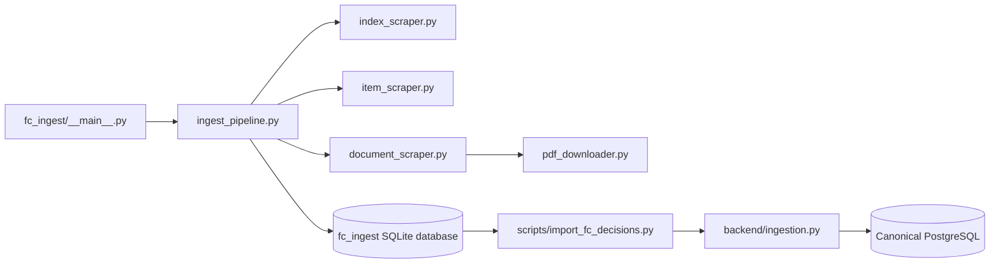

# Federal Court Source Pipeline

## Scope

`fc_ingest/` is the Federal Court source-specific acquisition and SQLite
staging package. It is not the canonical case database and it does not decide
whether a staged record should replace a canonical field. That policy belongs
to `backend/ingestion.py`.


```mermaid
flowchart LR
    CLI[fc_ingest/__main__.py] --> Pipeline[ingest_pipeline.py]
    Pipeline --> Index[index_scraper.py]
    Pipeline --> Item[item_scraper.py]
    Pipeline --> Document[document_scraper.py]
    Document --> PDF[pdf_downloader.py]
    Pipeline --> SQLite[(fc_ingest SQLite database)]
    SQLite --> Bridge[scripts/import_fc_decisions.py]
    Bridge --> Canonical[backend/ingestion.py]
    Canonical --> Postgres[(Canonical PostgreSQL)]
```

## Component Ownership

| Component | Responsibility | Boundary |
| --- | --- | --- |
| `__main__.py` | Package CLI entry point and command dispatch | Keeps module execution reproducible |
| `ingest_pipeline.py` | Coordinates discovery, item retrieval, document capture, and staged output | Does not own canonical merge policy |
| `index_scraper.py` | Finds result pages and item identifiers, including bounded date windows | Discovery is not capture |
| `item_scraper.py` | Parses source item pages and item metadata | Retains source-native identifiers and evidence |
| `document_scraper.py` | Extracts document links and metadata from source pages | Invalid or incomplete documents remain reviewable failures |
| `pdf_downloader.py` | Retrieves and validates PDF payloads | MIME/signature and hash checks precede acceptance |
| `db.py` | SQLite connection, schema, upsert, and legacy upgrade behavior | SQLite is staging persistence, not canonical authority |
| `models.py` | Typed staged item/document records | Keeps parser output explicit between steps |
| `errors.py` | Source and human-review failure types | Failures must not be promoted to successful capture |

## State And Provenance

Keep these states distinct:

`discovered -> retrieved -> staged -> validated -> imported -> processed`

A discovered item may have an identifier without a usable document. A staged
PDF may still fail validation. An imported record may still need canonical
processing for metadata, chunks, citations, statutes, tags, or embeddings.
Every bridge record should preserve its source identifier, source URL, retrieval
information, hashes, metadata evidence, and failure/review details.

The Federal Court activity layer is also distinct from judgment capture. An
activity or procedural record may be useful context while remaining outside the
canonical judgment path.

## Beta Motion Taxonomy Checkpoint

The Beta comparison led to a bounded implementation in
`scripts/classify_fc_activity.py`. Motion events retain evidence-backed
subtypes and explicit results including partial grants, abandonment, and
discontinuance; unknown categories remain visible. The pure
`validate_fc_activity_classification()` function reports leave/JR/date
contradictions without persistence. Focused motion tests passed 4 cases and
the existing classifier regression suite passed 49 cases. A fixed seeded
100-record measurement then found 8 motion cases and 22 motion events, with
22/22 events retaining complete source evidence. Subtype coverage was 5/22
(22.73%) and result coverage was 4/22 (18.18%); unknowns remained visible at
17 subtypes and 18 results. The artifact is
`data/eval/fc_activity_motion_coverage_20260928.json`, with
`network_called=false` and `database_written=false`. This is extraction
coverage rather than accuracy; the unknown majority is the next fixture and
rule-review signal, and raw Activity/canonical case writes remain outside the
slice.

## Corpus Pattern Checkpoint

The seeded 1,000-record FC Activity evaluation found 139 motion cases and 950
motion events. Subtype coverage was 250/950 (26.32%), leaving 700 unknown
subtypes. Result coverage was 127/950 (13.37%), including 78 granted, 37
refused, 6 abandoned, 5 discontinued, and 1 granted in part; 818 results were
unknown. The deterministic artifact is
`data/eval/fc_activity_motion_patterns_20260928.json` and recorded no network
call or database write.

A user-authorized, review-only OpenAI batch audited 10 seeded cases at an
estimated `$0.0014555` using `gpt-4.1-nano`. It returned three advisory
findings concerning originating-application capture, a French leave decision,
and a judge/date signal. The audit artifact is
`data/eval/fc_activity_openai_motion_review_20260928.json`; it recorded
`network_called=true` and `database_written=false`. No rule or production data
was changed. These findings require source-backed fixture review before any
classifier update.

## Unknown Motion Review Matrix

The independent report over the fixed 1,000-record artifact confirmed 700
unknown-subtype motion events. Conservative phrase families measured
`motion_record_reference` 441, `unresolved_motion` 242,
`motion_order_without_subject` 12, and `hearing_motion_reference` 5. The
30-row review matrix is stored at
`data/eval/fc_activity_motion_unknowns_20260928.json` with case/document IDs,
outcomes, dates, and bounded source evidence. Rows remain unknown and
`rules_promoted=false`; no classifier, Activity, or canonical data changed.
The family labels are triage aids only and require linked-document review
before fixture or rule promotion.

## Full Unknown-Motion OpenAI Enrichment

The fixed corpus contained 700 unknown-subtype motion events. The review-only
event adapter sent all 700 in 70 sequential batches using `gpt-4.1-nano`, with
a `$5.00` hard budget and resumable checkpoints. The initial projected cost was
`$0.041059`; actual combined spend after retrying responses without structured
suggestions was `$0.0316852`.

The result is stored at
`data/eval/fc_activity_motion_unknowns_openai_20260928.json`. The run made a
network call but wrote no database data and promoted no classifier rules. It
contains 698 structured advisory suggestions; 2 events remain unresolved after
the bounded retry. These outputs are review signals only, not a gold set and
not classifier truth. A stale organization/project setting in `.env` caused the
first authentication attempt to fail; the adapter now removes those optional
variables before creating the client.

## Advisory-Derived Classifier Improvements

The 700-event advisory review produced a bounded deterministic improvement
slice rather than automatic rule promotion. Classifier `fc_activity_v5` now
covers explicit removal-stay gerunds, French sursis and consent-judgment
phrases, and `extend time` wording. A motion filing description now links to
later entries through explicit `Doc. N`, `Motion Doc. N`, or `Requête Doc. N`
references. A primary `Notice of Motion` may use its source `docno` as the
filing reference; `re_no` is only a fallback. The FC Activity row/document
identity remains an entry identifier, not a logical motion. The anchor entry
and source text are retained; generic `stay`, conflicting anchors, and
unrelated documents remain conservative.

The same seeded 1,000-case read-only evaluation now links filing context across
the 952 motion events, raising event subtype coverage to 521/952 (54.83%). The
grouped report contains 568 candidates: 202 explicit motion-document groups
and 366 `re_no` fallbacks, with 218/568 (38.38%) grouped subtype coverage and
10 conflicts. The rerun made no network call and no database write. The
advisory adapter also now keeps
cumulative retry/pass history, usage, spend, and unresolved event keys for
reproducible review without another API call.

## Progression-Aware Applicability

FC Activity coverage separates evidence absence from procedural
non-applicability. The classifier preserves raw evidence and emits
`field_applicability` for leave, judicial-review result, judicial-review final
decision, and the generic final-decision marker. Each status is `known`,
`pending`, `not_applicable`, or `not_observed`.

The state rules treat discontinuance or withdrawal before leave as no applicable
leave decision; leave refusal as making substantive judicial-review fields not
applicable; and withdrawal or discontinuance after leave grant as making the
substantive final decision not applicable. Leave N/A records include a reason
and explanation: direct judicial review does not require leave, an unperfected
application cannot reach leave, and terminal closure after perfection but
before a leave decision is recorded is reported separately. A generic
final-decision marker is kept separate because it may be the leave dismissal.
A substantive judicial review result supports inferred leave grant, and a
granted production order is retained as a lower-confidence supporting signal.

The bounded 1,000-case report counted 278 cases with leave not applicable:
152 were not perfected before discontinuance, 121 were discontinued after
perfection but before leave, 4 were administratively terminated before
perfection, and 1 was direct judicial review. It counted 672 cases with
judicial-review result and final decision not applicable, 20 pending
judicial-review results, and 22 pending judicial-review final decisions.
These are applicability-aware denominators, not accuracy estimates.

The same model now covers application perfection and hearings. In the bounded
report, application perfection was known in 529 cases, pending in 309, and
not applicable in 286; hearing status was known in 516, pending in 220, not
observed in 6, and not applicable in 258. Perfection N/A reasons distinguish
leave refusal, no originating application, direct judicial review, and
terminal closure before perfection. Hearing N/A reasons distinguish leave refusal from
discontinuance or administrative termination before leave. Explicit hearing
signals remain authoritative, including not-held and reserved outcomes.

### Pending Applicability Review

A bounded read-only review sampled the 185 pending application-perfection cases
and 220 pending hearing cases. No deterministic inference was promoted.
Leave refusal is now a separate perfection N/A reason: without explicit
perfection evidence, a refused-leave case is no longer pending perfection;
the human-readable explanation is `Not applicable: leave refused.` Explicit
perfection evidence remains known. Pending perfection was concentrated
in unresolved or unknown leave and leave-pending paths. Pending hearing was
concentrated in unresolved or unknown leave (89), leave-pending (79), and
corresponding perfected-application subsets (28 and 24). These are evidence
gaps or unresolved progression states, not reliable signals that perfection
occurred or that no hearing occurred. Source revalidation is required before
adding rules.

### IMM-15 Coverage Checkpoint

A bounded sample selected 1,000 cases through the indexed
`FCActivityClassification.imm_number` suffix `15`; all were 2015 cases. The
sample retained cases classified as active: 964 were closed and 36 active. No
database writes occurred. Leave was determinate in 98.3% of cases, perfection
in 98.4%, hearing in 98.6%, judicial-review result in 98.3%, and
judicial-review final decision in 96.4%. The artifact is
`data/eval/fc_activity_imm_suffix_15_20260928.json`.

The sample contained 2,794 motion events across 267 cases. Event-level subtype
coverage was 51.36% and result coverage 12.56%; grouped motion coverage was
34.17% for subtype and 6.19% for result. The evaluator now applies the IMM
suffix in the database query and loads documents only for the selected sample,
avoiding whole-population classification during bounded runs.

## Motion Coverage Denominators

The deterministic evaluation preserves its document-level motion metrics, but
now also reports grouped motion candidates. Grouping first uses explicit
`Motion Doc` or French `Requête Doc` references within a case, then falls back
to case-scoped `re_no`; records without a usable link remain singleton groups.
Subtype and outcome conflicts are exposed rather than silently merged.

The seeded 1,000-case run contains 952 document events and 568 grouped motion
candidates. The explicit groups come from motion-document references in the
entry text, with the primary filing `docno` used only for a `Notice of Motion`;
the remaining groups use `re_no`. Grouped subtype coverage is 38.38%
(218/568), compared with 54.83% (521/952) document-level coverage after filing
context is propagated. The grouped number is useful for motion-level review,
but it still excludes relationships that are not explicit in source text or
identifiers.

## Independent Activity Worker

The preparation contract for a future independent Federal Court activity worker
is documented in `docs/FC_ACTIVITY_ORACLE_WORKER_RUNBOOK.md`. The worker may
stage portal/API discovery and deterministic classification away from the public
website, while preserving raw payloads, checkpoints, provenance, and source
status. Canonical PostgreSQL import remains a separate exclusive operation.

Oracle Always Free is an approval-gated hosting option, not an implemented
deployment. Account access, VM/network creation, credentials, protected-data
hosting, and remote execution require explicit operator approval and the
security, privacy, backup, and recovery decisions described by the runbook.

## Bounded Run Evidence

On 2026-09-25, the decision-portal collector was tested but is not the FC
Activity acquisition path: IMM-only and default-prefix runs were each limited
to one page and five records, exited with code 0, but reported
`Scanned=0 Written=0` and created neither JSONL nor checkpoint output.

The FC Activity endpoint path was then tested separately with a bounded
sequential dry-run. Five candidates were attempted and 63 activity records were
returned with exit code 0, confirming endpoint reachability. No database tables
were written. The endpoint adapter now supports an explicit
`--write-activity` mode. That mode uses a stable IMM-based case key, stable
entry hashes, preserves the endpoint payload and source IMM, and writes only
`fc_activity_cases` and `fc_activity_documents`; it does not write
`fc_procedural_history` or canonical cases. The next bounded slice is the live
Activity-only write and rerun-deduplication verification. Before that write, the
harvester enforces a 2-second default inter-candidate floor with optional
jitter and caps API attempts including retries. A bounded dry-run diagnostic may
explicitly use `--diagnostic-allow-sub-2000ms-delay` to probe faster rates; this
does not change the routine collection default. Explicit `--adaptive-delay` mode
can process 20-case checkpoints, pause 5 seconds after an issue, and double the
delay up to its ceiling before continuing. The Court does not publish a robots
policy; these local controls are the reviewed safety policy.
The harvester also supports `--log-file` for line-buffered operator monitoring;
the log mirrors candidate progress, warnings, adaptive pauses, checkpoints, and
final request totals.

The Activity normalization checkpoint is deterministic and read-only over raw
`fc_activity_documents`. It emits evidence-backed procedural observations for
filing/perfection, notices of appearance, leave, judges, motions, stays, hearings, decisions, and
procedural markers without turning an Activity row into a canonical case or
citation. Explicit semantic filing/hearing/decision dates are kept separate
from the source `DOC_DT`; unknown and ambiguous signals remain visible.

The 2026-09-26 evaluation checkpoint used a fixed 100-record cross-year sample
with seven-year weighting and a bounded 12-record `gpt-4.1-nano` audit at
75-percent recent-year weighting. The deterministic report and audit JSON are
stored under `data/eval/`. The audit made no database writes and cost an
estimated `$0.001548`; its remaining improvement signals concern final
decision-marker clarity and explicit filing-date labeling. The runbook remains
the operational procedure for reproducing this checkpoint.

The next bounded classifier improvement recognizes explicit removal-cancellation
wording as an implicit granted-stay signal under `stay_cancellation`. The event
retains source evidence and does not alter raw Activity rows. This is deliberately
not a categorical judicial disposition: administrative cancellation wording and
French equivalents require additional source-backed review before statistics are
exposed as final outcomes.

Explicit stay-motion wording such as `removal order scheduled for
26-FEB-2007 to Nigeria` is also retained as optional
`removal_scheduled_date` and `removal_destination` metadata on the derived
event. These fields support future procedural-delay metrics while preserving
the source document date and avoiding any inference that removal occurred.

The deterministic report now aggregates these explicit dates into additive
filing-to-removal and motion-to-removal delay metrics. Complete intervals are
summarized separately from missing scheduled dates and ambiguous date order; the
fixed 100-record checkpoint produced three valid intervals for each metric and
one ambiguous case. Coverage counts and rates are included so the small valid
sample is not mistaken for a population estimate; current coverage is 3%.

On 2026-09-27, a five-record real-data smoke classification completed with no
write, followed by a seeded 100-record deterministic evaluation. The coverage
rerun reported 84 closed and 16 active records, 32% final-decision judge-stage
coverage, 67% unknown decision subjects, and 2% valid removal-delay coverage.
Explicit `refugee_protection` markers now cover 21 records; rows without an
explicit subject marker remain unknown. No Activity or canonical database
writes were performed.
The follow-up stay-pattern pass also recognizes explicit month-first removal
dates such as `on Monday January 31, 2023`; the same report remained at 2%
valid delay coverage because the added date did not form another complete
filing/removal interval.
The next deterministic judge pass added explicit French and English judicial
title forms, including `Monsieur le juge`, `BEFORE The Honourable ... Justice`,
initials, and hearing metadata delimiters. The seeded 100-record rerun raised
judge-identified cases from 43 to 63, with final-decision coverage rising from
32% to 42%. Hearing status remains unknown where the docket has no explicit
hearing signal.
The evaluator's full-inventory sampling was corrected from an O(N2) list scan
to set-based cohort splitting before this checkpoint. A bounded local review of
one captured Activity entry returned source-linked JSON through Ollama
`qwen3:4b`; it remained review-only and wrote no production fact.

The 2026-09-27 bounded OpenAI feedback loop reviewed three 100-record batches
at a combined estimated cost of `$0.0219956`. Two early batches used the same
100-record artifact and therefore had complete overlap; the corrected
1,000-record corpus produced a zero-overlap third sample. The audit path was
then changed to include bounded source-document excerpts, since extracted
events alone cannot support missed-event review. One source-supported gap was
promoted: explicit filed or served notices of appearance now emit
`appearance_filed` with subtype `notice_of_appearance`. Model suggestions about
hearings, finality, and judge/date fields were not promoted where the
deterministic record already contained the signal or the proposed semantics
were ambiguous. All batches remained review-only with no database writes.

The next manual-audit checkpoint exported 10 real Activity cases using one
case per available year and a reproducible seed. The package contains 83
documents and 7 persisted `fc_activity_v3` classifications; one selected case
has no documents and three selected cases have no persisted classification. The
companion `audit_report.md` and `audit_report.json` present 27 evidence-linked
findings, case summaries, and 47 explicit audit gaps. The report supports both
the older persisted classification shape and the newer `procedural_events`
shape, while preserving the raw JSONL package as the source of truth.

The classifier also emits evidence-linked judge observations grouped by
procedural stage (`leave`, `motion`, `hearing`, and `final_decision`), separates
challenged-decision maker type from subject, and assigns a conservative
lifecycle state (`closed`, `abeyance`, `active`, or `unknown`). The active
state means substantive activity exists without a terminal signal and is
marked as inferred; elapsed age alone is not a closure rule. Explicit
no-personal-appearance wording is excluded from held-hearing extraction. The
bounded deterministic evaluator reports stage, decision-field, lifecycle, and
delay coverage with explicit denominators before any bulk write or local-LLM
review.

The stabilized JSON now groups application, leave, motion, hearing,
final-decision, and closure observations under stage-aware
`milestone_rollups`. Challenged decisions retain separate decision-maker,
underlying-tribunal, and subject taxonomy fields with conservative unknowns.
Hearing semantics distinguish scheduled, held, reserved, and not-held text;
English/French negation remains negative evidence rather than an affirmative
event. The evaluator exposes queryable analytics dimensions and optional
seeded JSON gold-set coverage/accuracy/disagreement metrics without changing
the Activity schema. The local provider remains review-only and abstaining;
the 2026-09-27 probe was blocked by HTTP 404 from the configured localhost
chat endpoint, so no LLM-derived facts were accepted.

## Claude Activity Handoff

The read-only `scripts/export_fc_activity_package.py` exporter creates a
portable handoff for Claude without exposing PostgreSQL credentials. It writes
streamed UTF-8 JSONL layers for Activity cases, procedural documents, and
deterministic classifications, plus a manifest containing counts, joins,
classifier versions, provenance, and limitations. Raw `raw_payload` and
`raw_document` evidence stays separate from derived classification. Use
`--limit` for a bounded review; the limit applies to case rows and retains all
linked child rows. The full export is appropriate only after disk-space review.
The package is for designing and evaluating transformations, not for asserting
legal outcomes or treating procedural Activity as canonical judgment data.

## Operational Rules

- Use bounded date/month or prefix scopes, delays, retries, and checkpoints.
- Respect source terms and remote access limits.
- Treat source blocks and empty payloads as explicit failures.
- Use JSONL/SQLite staging and resume support before attempting a bridge import.
- Never run a bulk canonical import alongside another PostgreSQL writer.
- Verify sampled source keys, document hashes, capture status, and import counts.

Decision entries preserve distinct date meanings: an explicit rendered/order
date becomes the decision event date, an explicit later filed date is retained
as `filing_date`, and the source registry `DOC_DT` remains
`source_document_date`. Filing, motion, and stay events continue to prefer
their explicit filing date. These derived fields stay inside the Activity
layer and are not canonical judgment dates.

Subject extraction remains explicit-only. SPR/SAR/PRRA and full French
refugee-protection wording produce `refugee_protection`; H&C/Humanitarian
Migration produces `humanitarian_and_compassionate`; explicit Express Entry
or family/spousal program wording produces `permanent_residence`; and
Visitor's Visa produces `temporary_residence`. Generic visa-office, IRCC,
CBSA, and IRB references remain unknown when no subject is stated. The
2010-present-weighted 500-case checkpoint reduced unknown subjects from 335 to
304 with evidence completeness unchanged.

The classifier now searches the full linked Activity history for explicit
subject and decision-maker evidence. The originating entry remains the source
for application metadata and parsed maker text; later records can fill the
typed subject or maker category and retain their supporting document id/text.
In the 1,000-case recent-weighted checkpoint, subject unknowns fell from 658 to
547 and maker unknowns from 237 to 130 without changing event counts or
evidence completeness. Generic agency and tribunal references remain unknown
when they do not state the legal subject.

Reports now distinguish explicit subjects from generic institutional evidence
and from no subject evidence. Generic labels such as IRCC CPC, visa office,
embassy/consulate, IRB/IAD, CBSA, MPSEP, GTEC, and French agency names remain
available as `decision_subject_label` without being promoted to a legal
subject. The final 1,000-case audit contained 461 explicit subjects, 437
generic-only cases, and 8 cases with no subject evidence.

The leave classifier follows the VBA-derived priority ladder: explicit English
or French leave outcomes win; a later judicial-review outcome can expose
`inferred_granted`; discontinuance, withdrawal, termination, and direct review
remain not applicable; and an unresolved leave application is surfaced as
`leave_context.status = pending`. In the fixed 1,000-case comparison, 14 prior
unknown results became explicit outcomes, with no event-count change.

## Beta VBA Comparison Checkpoint

The read-only comparison in `docs/FC_ACTIVITY_BETA_VBA_COMPARISON.md` confirms
that the current JRU Beta workbook is a useful rule and QA reference, not a
replacement extractor. Its strongest additions are normalized motion subtypes
(including stays, abeyance, s.37 CEA, s.87 IRPA, consent, confidentiality,
production, and intervention), cross-field validation findings, and a simple
cases-to-review queue. The current Python layer remains stronger on event-level
source evidence, semantic versus registry dates, stage-specific judges, and
typed challenged-decision subjects.

The Beta source also has limitations that must remain visible: its motion
result normalizer is not called by the array-based motion extractor, JSON is
parsed by string search, and judge/decision-maker extraction is first-match
and aggregate-only. The next bounded experiment is a 20-30 case motion fixture
set followed by a pure structured validation function; raw Activity rows and
canonical case records remain unchanged.

## Modularization Direction

The safe seams are discovery, item parsing, document parsing, PDF validation,
SQLite staging, and canonical import. Their handoff should remain a source-keyed
record with capture status, provenance, hashes, metadata evidence, and error
fields. A collector can change without moving source merge, case identity, or
citation semantics into the source adapter.

## Validation

Start with the package help command and a bounded parser/database test. For the
full source slice, run:

```powershell
.\venv\Scripts\python.exe -m fc_ingest --help
.\venv\Scripts\python.exe -m pytest tests\test_fc_ingest_db.py tests\test_fc_ingest_pipeline.py tests\test_fc_portal_collector.py -q
```

Validate source behavior with a bounded dry run or fixture, not an unrestricted
collection. Confirm that a discovered ID is not reported as a captured judgment
unless the document and validation evidence exist.

<SwmMeta version="3.0.0" repo-id="Z2l0aHViJTNBJTNBTGl0SW50ZWxwcm9qZWN0JTNBJTNBZ3JleXN0b25lLWRhbg==" repo-name="LitIntelproject"><sup>Powered by [Swimm](https://app.swimm.io/)</sup></SwmMeta>
