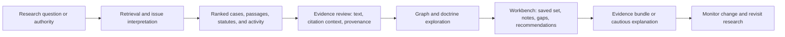
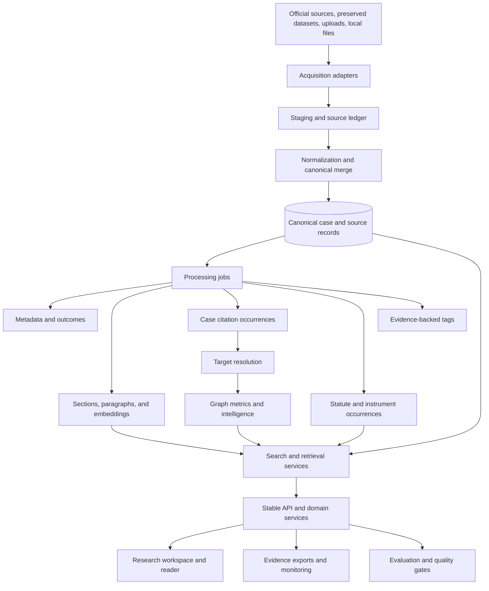
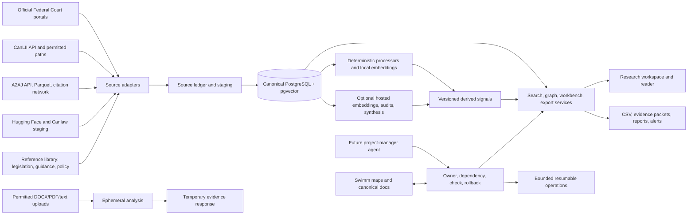
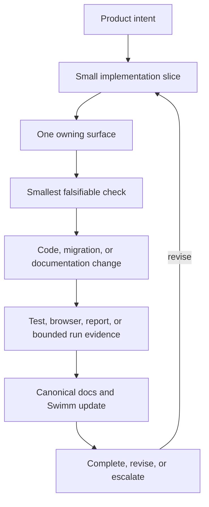

# Product North Star and Future State

This walkthrough describes where AI CaseLibrary is intended to go. It is a
product and architecture target, not a second current-state inventory. The
current implementation and live route contracts remain documented in
[SYSTEM_REFERENCE.md](../SYSTEM_REFERENCE.md). The forward-looking authority
for this document is [GUIDANCE.md](../GUIDANCE.md), with delivery sequencing in
[ROADMAP.md](../ROADMAP.md) and the broader citation-intelligence backlog in
[MASTER_IDEAS.md](../MASTER_IDEAS.md).

## The End State In One Sentence

AI CaseLibrary should become a provenance-first litigation research workspace
that helps a researcher move from a question to a defensible set of
authorities, while showing why each result matters, where its evidence came
from, what is uncertain, and how the law is changing over time.

It is a research aid, not legal advice. Generated explanations must remain
bounded by retrieved authority and must never conceal uncertainty or invent a
source.

## Product Goals

### 1. Make research faster

A researcher should be able to start with a natural-language issue, a citation,
a statute provision, a judge, a procedural event, or a known authority and
reach useful primary material without searching several disconnected sources.
The system should support both a quick answer path and a deliberate evidence
review path.

### 2. Make research more complete

The product should reveal authorities that are easy to miss: related cases,
co-cited authorities, indirect citation paths, foundational decisions, newer
replacement authorities, and gaps in the current research set. Completion must
be presented as a suggestion with evidence and confidence, never as a claim
that the system has found every relevant authority.

### 3. Make every result explainable

A result should answer more than “what matched.” It should show the matching
text or issue, the authority relationship, the relevant citation context, the
court and date, the source record, and the ranking signals used. A researcher
must be able to move from an insight back to the exact stored evidence.

### 4. Make legal-data processing trustworthy

Source preservation comes first. Derived metadata, tags, chunks, embeddings,
case citations, statute references, outcomes, and graph metrics remain separate
layers with provenance, model or rule versions, confidence, and review state
where applicable.

### 5. Make repeated research cumulative

Research should not disappear when a browser tab closes. A researcher should be
able to save a question, collect authorities, add notes, preserve evidence
snippets, resume the thread, and export a reviewable evidence bundle.

### 6. Make the system operable at corpus scale

Acquisition, enrichment, extraction, embedding, graph calculation, evaluation,
and reporting should be bounded, resumable, idempotent, observable, and safe
to retry. Quality and performance gates should make regressions visible before
large jobs or releases.

## The Future Researcher Experience

The final product is a connected workflow rather than a collection of
independent pages:

### Start with any research object

The entry point may be:

- a plain-language legal issue;
- a case name, neutral citation, CanLII citation, or short form;
- an IRPA, IRPR, Charter, Criminal Code, or other instrument provision;
- a judge, court, date range, party, outcome, or procedural event;
- a saved research thread or previously reviewed authority.

The system should understand the object without forcing the researcher to
choose the correct internal index first.

### Retrieve with transparent ranking

Retrieval should combine semantic similarity, exact terms, citation
relationships, structured metadata, court hierarchy, recency, and issue
signals according to the selected research mode. Ranking weights should be
configurable and evaluated against fixed litigation questions. The interface
should expose enough signal to explain a ranking without pretending that a
score is a legal conclusion.

The final retrieval layer should support:

- case, passage, statute, judge, and activity retrieval;
- lexical, semantic, hybrid, citation-only, and metadata-first modes;
- stable pagination and reproducible ordering;
- filters for court, jurisdiction, date, issue, judge, outcome, source, and
  legal provision;
- related-case and authority recommendations;
- saved benchmark questions for measuring non-regression.

### Review evidence in context

The reader should keep source text, structured metadata, chunks, citation
occurrences, statute occurrences, and tags visibly connected but semantically
separate. A researcher should be able to inspect:

- the exact passage containing a case-law reference;
- the surrounding citation context and inferred citation purpose;
- the statute or instrument provision and exact span;
- the source URL, source identity, version, hash, and provenance;
- resolution state, confidence, quality flags, and review history;
- linked authority text without losing the originating decision.

Offsets and evidence spans remain backend-owned. Browser rendering may
highlight them, but it must not invent replacement positions.

### Explore authority and doctrine

The citation graph should mature into a jurisprudence atlas. It should support
case neighborhoods, co-citation, authority families, influence and salience,
procedural lineage, cross-court movement, hidden paths, inheritance chains,
foundational authorities, and issue or doctrine clusters.

The researcher should be able to ask:

- Which authorities form the backbone of this issue?
- Which newer cases are replacing or narrowing an older authority?
- Where does an authority travel across courts?
- Which cases rely on the same authorities but reach different outcomes?
- Which important authority or line of reasoning appears absent from this set?

Graph views must remain evidence views: every node, edge, score, and suggested
relationship should have a traceable basis and a clear distinction between
observed data and inferred analysis.

### Save, collaborate, and return

A future research workbench should provide durable entities for:

- research questions and saved searches;
- case and authority collections;
- pinned passages and statute provisions;
- researcher notes and issue labels;
- unresolved questions and suggested research gaps;
- exportable evidence packets with source references and timestamps;
- comparison of findings across research sessions.

The workbench should preserve the evidence state that produced an insight, not
only a list of case IDs. It should make a later review possible even when
ranking models, source records, or graph metrics have changed.

### Explain cautiously or monitor change

A future explanation layer may produce a concise synthesis grounded in selected
sources. Each answer should include the authorities used, relevant excerpts or
holdings, structured issues or legal tests where appropriate, uncertainty when
coverage is incomplete or conflicting, and the research-aid disclaimer.

The same evidence base should support monitoring: new authorities, changes in
citation velocity, emerging or declining influence, authority replacement,
shifts in doctrine, and anomalies in the network should generate reviewable
signals rather than opaque alerts.

## Target System Structure

The final architecture should be modular by responsibility, with explicit
contracts between stages:

### Acquisition and source ledger

Every input should enter through an adapter that records source identity,
access time, licence or terms, raw and normalized hashes, parser version, and
staging status. Discovered activity, reference documents, uploaded material,
and official judgments should remain distinguishable. A discovered record is
never silently promoted to an official captured judgment.

### Canonical merge boundary

A canonical merge service should decide identity, deduplication, field
precedence, conflicts, and source promotion. It should be independent of
source-specific adapters. Reprocessing the same source should be idempotent;
conflicting values should remain inspectable rather than being discarded.

### Processing layers

Processing should remain an ordered, restartable pipeline:

1. metadata and outcome observations;
2. section and paragraph chunking;
3. case-law citation extraction;
4. statute and instrument extraction;
5. target resolution and graph calculations;
6. tags, embeddings, and optional model-derived signals.

The exact implementation may evolve, but the contracts must preserve separate
layers, source-relative offsets, rule/model versions, and processing status.
Case citations must never be merged with statute references; tags and metadata
must never become substitutes for either.

### Retrieval and explanation services

Search, graph analytics, workbench persistence, evidence assembly, and optional
RAG generation should be separate services or modules with stable contracts.
The API should orchestrate them, not contain every query, ranking rule, page
builder, and domain policy in one route module. Generated explanations should
consume an evidence packet with source IDs and spans, so citations are a
required output of the generation boundary rather than an afterthought.

### User interface surfaces

The active research workspace should converge around one coherent experience:

- a universal research entry point;
- ranked results with visible reason signals;
- an inline evidence reader;
- citation and doctrine exploration;
- judge, court, statute, and activity context;
- a saved research workbench;
- exports and monitoring.

Specialized QA, prototype, and compatibility surfaces may remain available for
operators, but they should be visibly distinct from the primary researcher
workflow.

## Target Data Model

The future model should preserve the current separation of concerns while
adding durable research and explanation objects:

| Layer | Future responsibility |
| --- | --- |
| Source ledger | Source identity, terms, hashes, retrieval events, parser versions |
| Canonical cases | Stable case identity, normalized metadata, full text, source links |
| Documents and chunks | Source-relative text sections, paragraphs, pages, and embeddings |
| Case citations | Occurrences, exact spans, normalized forms, targets, anchors, context |
| Statute references | Independent instrument/provision occurrences and exact spans |
| Metadata and tags | Observations, taxonomy versions, confidence, review state |
| Authority graph | Edges, metrics, roles, inheritance, lifecycle, issue relationships |
| Research workbench | Questions, saved searches, collections, notes, pins, evidence packets |
| Evaluation and monitoring | Gold sets, benchmark runs, quality reports, performance budgets, alerts |

Future schema additions should be introduced through migrations, with generated
schema references refreshed and compatibility preserved until callers have
moved. A stable external identifier may eventually supplement the internal
primary key, but identity changes must not break source or citation lineage.

## Trust And Safety Contract

The end state is successful only if a researcher can challenge its output.
Every recommendation, graph insight, or generated explanation should make it
possible to answer:

1. What source material supports this?
2. Which extraction, ranking, or model step produced the signal?
3. What did the system fail to resolve or retrieve?
4. How confident is the signal, and what evidence was reviewed?
5. Can the result be reproduced or exported?

Required safeguards include:

- no invented citations or unsupported holdings;
- explicit unresolved and low-confidence states;
- provenance for source and generated artifacts;
- separate handling of confidential or uploaded material;
- retention and access policies before accepting sensitive documents;
- no authentication claims based solely on indexing headers;
- bounded external lookups with rate-limit and failure recording;
- human review for high-impact or ambiguous classifications.

## Delivery Horizon

The destination is delivered through evidence-bearing increments, not one large
rewrite:

### Horizon 1: Reliability and measurement

Establish gold evaluation sets, extraction and graph integrity audits,
performance budgets, endpoint contracts, browser smoke journeys, and release
quality gates. This creates the ability to tell whether later intelligence
actually improves research.

### Horizon 2: Citation context and explanation

Persist context windows, classify citation purpose, expose evidence in reader
and graph views, and add distinguishing or negative-treatment signals. Measure
accuracy on labeled decisions before broadening automation.

### Horizon 3: Research completion and workbench

Add issue-level gap detection, citation-only discovery, authority
recommendations, saved research threads, notes, pinned authorities, and
reviewable evidence exports.

### Horizon 4: Jurisprudence intelligence and monitoring

Add boilerplate versus novel reasoning, authority replacement and lifecycle
signals, doctrine evolution, trend forecasting, network health monitoring, and
reviewable alerts.

### Horizon 5: Responsible explanation layer

Introduce optional grounded synthesis only after retrieval quality,
provenance, context evidence, and failure reporting meet release thresholds.
The explanation layer must remain downstream of evidence, never the source of
truth.

## Capability Atlas

The finished product is a layered research system: acquisition, canonical
records, legal structure, retrieval, evidence review, authority intelligence,
workbench persistence, explanation, monitoring, and governance each have an
explicit contract and evidence trail.

| Capability family | Finished-system behavior | Evidence required |
| --- | --- | --- |
| Acquisition | Collect official decisions, secondary copies, datasets, procedural activity, reference documents, and permitted user material | Source ID, terms, timestamps, hashes, retrieval state |
| Canonical library | Deduplicate and merge without losing competing values | Stable identity, precedence, conflicts, provenance history |
| Legal structure | Extract metadata, parties, judges, outcomes, issues, chunks, case citations, statutes, instruments, and tags | Exact spans, rule/model versions, confidence, review state |
| Retrieval | Find cases and passages through issue, text, metadata, citation, statute, judge, court, and activity signals | Query, filters, ranking components, candidate scope |
| Evidence reader | Show decisions and authority context with synchronized highlights and links | Backend-owned offsets, source links, chunk/page context |
| Authority graph | Explain neighborhoods, influence, inheritance, movement, gaps, and change | Resolved edges, path membership, formulas, corpus scope |
| Research completion | Suggest related cases, missing authorities, recommendations, and open questions | Peer set, supporting occurrences, confidence, absence caveat |
| Workbench | Save questions, searches, authorities, notes, pins, comparisons, and evidence bundles | Snapshot timestamp, source references, action history |
| Explanation | Produce optional synthesis grounded in selected evidence | Evidence packet, citations, excerpts, uncertainty, model/version |
| Monitoring | Detect new authorities, doctrine shifts, replacement, anomalies, and network changes | Baseline, time window, threshold, reviewable alert evidence |
| Governance | Measure extraction, retrieval, performance, provenance, privacy, and release health | Gold sets, benchmark runs, quality reports, audit trail |

## Integration Map

External systems provide material or computation; AI CaseLibrary remains
responsible for identity, evidence lineage, domain contracts, and presentation.

### Source and legal-data integrations

- Official Federal Court portals and court-origin documents provide decisions,
  PDFs, docket identifiers, and procedural history.
- CanLII API and compliant paths provide secondary coverage and permitted
  citation-resolution support. Terms, quotas, and anti-bot controls remain
  binding constraints.
- A2AJ API, Parquet exports, curated cohorts, and the separate A2AJ citation
  network provide broad Canadian coverage and network enrichment.
- Canlaw and Hugging Face staging provide resilient local acquisition and repair,
  but are bridged into canonical ingestion rather than writing PostgreSQL
  directly.
- Reference-library publishers provide legislation, policy, tribunal guidance,
  court procedure, and background documents. They remain a separate corpus and
  are never silently converted into judgments.
- Federal Court activity and procedural-history sources provide docket context;
  they do not prove decision-text capture or a merits outcome.
- Permitted DOCX, text-PDF, and text inputs support ephemeral review. Uploaded
  material stays outside canonical cases unless explicitly promoted with a
  provenance contract.

Every adapter should emit a common source envelope: source class, stable ID,
URL, retrieval status, terms/licence, raw and normalized hashes, parser version,
and bounded retry/checkpoint state.

### Platform and model integrations

| Integration | Intended role | Required boundary |
| --- | --- | --- |
| PostgreSQL | Durable system of record for cases, sources, derived layers, workbench, and reports | Migrations, constraints, provenance, transaction boundaries |
| pgvector | Model-versioned case and passage similarity | Dimensions, indexes, model names, and query behavior change together |
| SQLite/JSONL/Parquet/raw files | Source-specific staging and operational artifacts | Explicit promotion; no silent canonical identity |
| Local BGE-M3 or equivalent | Private, repeatable chunk embeddings | Versioned dimensions and resource budget |
| OpenAI-compatible embeddings | Optional case/chunk retrieval vectors | Credentials, cost, model, and dimension controls |
| OpenAI-compatible chat | Optional grounded synthesis | Evidence packet input, citations, uncertainty, no uncontrolled corpus access |
| Audit/adjudication model | Sampled citation or metadata review | Budget ceiling, redaction policy, human-review queue |
| Azure Container Apps/App Service | Possible hosted FastAPI deployment with Azure PostgreSQL | Secrets, access control, migration and health checks |
| Reverse proxy or tunnel | Controlled private exposure | Real authentication; indexing headers are not access control |

Deterministic extraction must remain useful without hosted credentials. Model
artifacts record model, configuration, input scope, timestamp, cost class, and
review state. A failed optional integration cannot corrupt independent
deterministic processing.

## Full Citation-Intelligence Horizon

The citation program is intended to become a legal-reasoning atlas, not merely
a list of “cites” edges. It must distinguish observed mentions, inferred
relationships, and generated interpretations.

### Graph foundation and research acceleration

The atlas should provide citation edges, authority explorers, neighborhoods,
co-citation analysis, weighted and explainable similarity, authority families,
influence scores, bridges between topics, jurisprudence clusters, procedural
lineage, related cases not directly cited, citation-pattern search, missing
authority detection, citation completion, and issue-specific recommendations.

### Location, salience, and context

Each occurrence should support position tracking, frequency, persistence,
gravity, salience, framework-versus-substantive classification, heat maps,
authority roles, outcome-adjacent citations, context windows, citation-purpose
labels, usage profiles, context clustering, novelty, reinterpretation,
distinguishing language, negative treatment, and purpose evolution.

### Boilerplate, originality, and reasoning inheritance

The system should distinguish routine legal-test language from unusual reasoning,
estimate originality and distinctiveness, compress repetitive boilerplate for
navigation, and surface non-standard authority use. Multi-hop exploration
should show contextual inheritance, authority transmission, hidden paths,
dependency graphs, lineages, foundational decisions, hidden landmarks, and
authority relationships across arguments.

### Jurisprudential evolution and advanced intelligence

Time-aware analytics should provide citation timelines, velocity, decay,
replacement candidates, lifecycle stages, emerging-authority alerts, change
alerts, landmark candidates, and trend forecasts. Longer-term ideas include
surprise and unexpected-authority detection, neighborhood anomalies,
legal-concept evolution, jurisprudential fingerprints, a legal knowledge graph,
case-to-legislation-policy-guidance overlays, cross-court flow, and network
health monitoring. Every signal states its corpus scope and comparison window.

## End-State Goals And Measures

| Goal | End-state signal |
| --- | --- |
| Research quality | Fixed litigation questions improve recall, precision, MRR, and hit@k without hiding unresolved cases |
| Explainability | Top recommendations expose source, exact context, ranking reasons, and confidence |
| Citation trust | Gold fixtures preserve full spans, nested IRPA/IRPR forms, anchor provenance, and unresolved states |
| Retrieval speed | Search and grouped-chunk endpoints meet measured p50/p95 budgets at representative scale |
| Data health | Reports track orphan links, duplicate edges, malformed citations, null metadata, stale embeddings, and conflicts |
| Workflow completion | Users save, resume, annotate, compare, and export without manual database work |
| Operational resilience | Jobs are preflighted, locked, checkpointed, resumable, idempotent, logged, and safe after partial failure |
| Source governance | Records trace to source, version, terms, parser/rule/model, and retrieval time |
| Release safety | Unit, integration, browser, quality, performance, and contract gates block critical regressions |
| Responsible AI | Grounded answers contain citations and uncertainty and never fabricate authority |
| Modular delivery | A route, processor, adapter, or page changes behind a stable contract with focused tests and rollback |

## Integration Safety Rules

1. Source priority resolves merge conflicts; it does not prove a proposition.
2. A discovered ID, staging row, activity item, or secondary copy is not an
   official captured judgment by itself.
3. External lookups are bounded, rate-limited, permission-aware, and recorded
   as success, failure, or unavailable.
4. Reference documents and side-project data remain isolated from canonical
   case workflows unless a deliberate bridge is designed and tested.
5. AI output cites retrieved evidence and discloses incomplete, conflicting, or
   unresolved source coverage.

## Project-Manager Agent Readiness

The future manager-agent scaffold coordinates this architecture; it does not
replace domain ownership:

It should coordinate dependencies, acceptance checks, evidence, documentation,
and rollback plans; distinguish code changes from data operations and release
decisions; preserve unrelated worktree changes; request a new check before
crossing an ownership boundary; and stop at genuine blockers.

## Definition Of The Finished Product

AI CaseLibrary is at its intended end state when:

- a researcher can move from question to reviewed evidence in one coherent
  workflow;
- retrieval supports conceptual, exact, structured, and citation-based
  research with measured ranking quality;
- every top recommendation exposes source, context, and reason signals;
- the graph reveals authority relationships without hiding inference behind a
  visual score;
- saved work preserves questions, notes, authorities, and evidence packets;
- ingestion and enrichment are resumable, idempotent, observable, and
  provenance-preserving;
- model and rule changes are evaluated against gold sets and benchmark
  questions;
- releases are blocked by critical data-quality, performance, or contract
  regressions;
- generated explanations are cautious, source-linked, reproducible, and
  clearly not legal advice;
- the code is modular enough that each ownership boundary can be changed and
  tested without reopening the entire application.

## Decision Rules For Future Work

Before adding a feature, ask:

1. Which researcher decision does this improve?
2. Which owning module or data layer should hold it?
3. What source evidence supports the result?
4. Is it observed, extracted, resolved, ranked, inferred, or generated?
5. What is the smallest falsifiable quality check?
6. What must be migrated, regenerated, documented, or rolled back?

Do not introduce a new intelligence layer by collapsing existing ones. Extend
the evidence model, preserve public contracts during modularization, and let
measured research quality decide whether a feature belongs in the product.

<SwmMeta version="3.0.0" repo-id="Z2l0aHViJTNBJTNBTGl0SW50ZWxwcm9qZWN0JTNBJTNBTGl0SW50ZWxwcm9qZWN0JTNBJTNBTGl0SW50ZWxwcm9qZWN0JTNBJTNBTGl0SW50ZWxwcm9qZWN0JTNBJTNBTGl0SW50ZWxwcm9qZWN0JTNBJTNBTGl0SW50ZWxwcm9qZWN0JTNBJTNBTGl0SW50ZWxwcm9qZWN0JTNBJTNBTGl0SW50ZWxwcm9qZWN0JTNBJTNBTGl0SW50ZWxwcm9qZWN0JTNBJTNBTGl0SW50ZWxwcm9qZWN0JTNBJTNBTGl0SW50ZWxwcm9qZWN0JTNBJTNBTGl0SW50ZWxwcm9qZWN0JTNBJTNBTGl0SW50ZWxwcm9qZWN0JTNBJTNBTGl0SW50ZWxwcm9qZWN0JTNBJTNBTGl0SW50ZWxwcm9qZWN0JTNBJTNBTGl0SW50ZWxwcm9qZWN0JTNBJTNBTGl0SW50ZWxwcm9qZWN0JTNBJTNBTGl0SW50ZWxwcm9qZWN0JTNBJTNBTGl0SW50ZWxwcm9qZWN0JTNBJTNBTGl0SW50ZWxwcm9qZWN0JTNBJTNBTGl0SW50ZWxwcm9qZWN0JTNBJTNBTGl0SW50ZWxwcm9qZWN0JTNBJTNBTGl0SW50ZWxwcm9qZWN0JTNBJTNBTGl0SW50ZWxwcm9qZWN0JTNBJTNBTGl0SW50ZWxwcm9qZWN0JTNBJTNBTGl0SW50ZWxwcm9qZWN0JTNBJTNBTGl0SW50ZWxwcm9qZWN0JTNBJTNBTGl0SW50ZWxwcm9qZWN0JTNBJTNBTGl0SW50ZWxwcm9qZWN0JTNBJTNBTGl0SW50ZWxwcm9qZWN0JTNBJTNBTGl0SW50ZWxwcm9qZWN0JTNBJTNBTGl0SW50ZWxwcm9qZWN0JTNBJTNBTGl0SW50ZWxwcm9qZWN0JTNBJTNBTGl0SW50ZWxwcm9qZWN0JTNBJTNBTGl0SW50ZWxwcm9qZWN0JTNBJTNBTGl0SW50ZWxwcm9qZWN0JTNBJTNBTGl0SW50ZWxwcm9qZWN0JTNBJTNBTGl0SW50ZWxwcm9qZWN0JTNBJTNBTGl0SW50ZWxwcm9qZWN0JTNBJTNBTGl0SW50ZWxwcm9qZWN0JTNBJTNBTGl0SW50ZWxwcm9qZWN0JTNBJTNBTGl0SW50ZWxwcm9qZWN0JTNBJTNBTGl0SW50ZWxwcm9qZWN0JTNBJTNBTGl0SW50ZWxwcm9qZWN0JTNBJTNBTGl0SW50ZWxwcm9qZWN0JTNBJTNBTGl0SW50ZWxwcm9qZWN0JTNBJTNBTGl0SW50ZWxwcm9qZWN0JTNBJTNBTGl0SW50ZWxwcm9qZWN0JTNBJTNBTGl0SW50ZWxwcm9qZWN0JTNBJTNBTGl0SW50ZWxwcm9qZWN0JTNBJTNBTGl0SW50ZWxwcm9qZWN0JTNBJTNBTGl0SW50ZWxwcm9qZWN0JTNBJTNBTGl0SW50ZWxwcm9qZWN0JTNBJTNBTGl0SW50ZWxwcm9qZWN0JTNBJTNBTGl0SW50ZWxwcm9qZWN0JTNBJTNBTGl0SW50ZWxwcm9qZWN0JTNBJTNBTGl0SW50ZWxwcm9qZWN0JTNBJTNBTGl0SW50ZWxwcm9qZWN0JTNBJTNBTGl0SW50ZWxwcm9qZWN0JTNBJTNBTGl0SW50ZWxwcm9qZWN0JTNBJTNBTGl0SW50ZWxwcm9qZWN0JTNBJTNBTGl0SW50ZWxwcm9qZWN0JTNBJTNBTGl0SW50ZWxwcm9qZWN0JTNBJTNBTGl0SW50ZWxwcm9qZWN0JTNBJTNBTGl0SW50ZWxwcm9qZWN0JTNBJTNBTGl0SW50ZWxwcm9qZWN0JTNBJTNBTGl0SW50ZWxwcm9qZWN0JTNBJTNBTGl0SW50ZWxwcm9qZWN0JTNBJTNBTGl0SW50ZWxwcm9qZWN0JTNBJTNBTGl0SW50ZWxwcm9qZWN0JTNBJTNBTGl0SW50ZWxwcm9qZWN0JTNBJTNBTGl0SW50ZWxwcm9qZWN0JTNBJTNBTGl0SW50ZWxwcm9qZWN0JTNBJTNBTGl0SW50ZWxwcm9qZWN0JTNBJTNBTGl0SW50ZWxwcm9qZWN0JTNBJTNBTGl0SW50ZWxwcm9qZWN0JTNBJTNBTGl0SW50ZWxwcm9qZWN0JTNBJTNBTGl0SW50ZWxwcm9qZWN0JTNBJTNBTGl0SW50ZWxwcm9qZWN0JTNBJTNBTGl0SW50ZWxwcm9qZWN0JTNBJTNBTGl0SW50ZWxwcm9qZWN0JTNBJTNBTGl0SW50ZWxwcm9qZWN0JTNBJTNBTGl0SW50ZWxwcm9qZWN0JTNBJTNBTGl0SW50ZWxwcm9qZWN0JTNBJTNBTGl0SW50ZWxwcm9qZWN0JTNBJTNBTGl0SW50ZWxwcm9qZWN0JTNBJTNBTGl0SW50ZWxwcm9qZWN0JTNBJTNBTGl0SW50ZWxwcm9qZWN0JTNBJTNBTGl0SW50ZWxwcm9qZWN0JTNBJTNBTGl0SW50ZWxwcm9qZWN0JTNBJTNBTGl0SW50ZWxwcm9qZWN0JTNBJTNBTGl0SW50ZWxwcm9qZWN0JTNBJTNBTGl0SW50ZWxwcm9qZWN0JTNBJTNBTGl0SW50ZWxwcm9qZWN0JTNBJTNBTGl0SW50ZWxwcm9qZWN0JTNBJTNBTGl0SW50ZWxwcm9qZWN0JTNBJTNBTGl0SW50ZWxwcm9qZWN0JTNBJTNBTGl0SW50ZWxwcm9qZWN0JTNBJTNBTGl0SW50ZWxwcm9qZWN0JTNBJTNBTGl0SW50ZWxwcm9qZWN0JTNBJTNBTGl0SW50ZWxwcm9qZWN0JTNBJTNBTGl0SW50ZWxwcm9qZWN0JTNBJTNBTGl0SW50ZWxwcm9qZWN0JTNBJTNBTGl0SW50ZWxwcm9qZWN0JTNBJTNBTGl0SW50ZWxwcm9qZWN0JTNBJTNBTGl0SW50ZWxwcm9qZWN0JTNBJTNBTGl0SW50ZWxwcm9qZWN0JTNBJTNBTGl0SW50ZWxwcm9qZWN0JTNBJTNBTGl0SW50ZWxwcm9qZWN0JTNBJTNBTGl0SW50ZWxwcm9qZWN0JTNBJTNBTGl0SW50ZWxwcm9qZWN0JTNBJTNBTGl0SW50ZWxwcm9qZWN0JTNBJTNBTGl0SW50ZWxwcm9qZWN0JTNBJTNBTGl0SW50ZWxwcm9qZWN0JTNBJTNBTGl0SW50ZWxwcm9qZWN0JTNBJTNBTGl0SW50ZWxwcm9qZWN0JTNBJTNBTGl0SW50ZWxwcm9qZWN0JTNBJTNBTGl0SW50ZWxwcm9qZWN0JTNBJTNBTGl0SW50ZWxwcm9qZWN0JTNBJTNBTGl0SW50ZWxwcm9qZWN0JTNBJTNBTGl0SW50ZWxwcm9qZWN0JTNBJTNBTGl0SW50ZWxwcm9qZWN0JTNBJTNBTGl0SW50ZWxwcm9qZWN0JTNBJTNBTGl0SW50ZWxwcm9qZWN0JTNBJTNBTGl0SW50ZWxwcm9qZWN0JTNBJTNBTGl0SW50ZWxwcm9qZWN0JTNBJTNBTGl0SW50ZWxwcm9qZWN0JTNBJTNBTGl0SW50ZWxwcm9qZWN0JTNBJTNBTGl0SW50ZWxwcm9qZWN0JTNBJTNBTGl0SW50ZWxwcm9qZWN0JTNBJTNBTGl0SW50ZWxwcm9qZWN0JTNBJTNBTGl0SW50ZWxwcm9qZWN0JTNBJTNBTGl0SW50ZWxwcm9qZWN0JTNBJTNBTGl0SW50ZWxwcm9qZWN0JTNBJTNBTGl0SW50ZWxwcm9qZWN0JTNBJTNBTGl0SW50ZWxwcm9qZWN0JTNBJTNBTGl0SW50ZWxwcm9qZWN0JTNBJTNBTGl0SW50ZWxwcm9qZWN0JTNBJTNBTGl0SW50ZWxwcm9qZWN0JTNBJTNBTGl0SW50ZWxwcm9qZWN0JTNBJTNBTGl0SW50ZWxwcm9qZWN0JTNBJTNBTGl0SW50ZWxwcm9qZWN0JTNBJTNBTGl0SW50ZWxwcm9qZWN0JTNBJTNBTGl0SW50ZWxwcm9qZWN0JTNBJTNBTGl0SW50ZWxwcm9qZWN0JTNBJTNBTGl0SW50ZWxwcm9qZWN0JTNBJTNBTGl0SW50ZWxwcm9qZWN0JTNBJTNBTGl0SW50ZWxwcm9qZWN0JTNBJTNBTGl0SW50ZWxwcm9qZWN0JTNBJTNBTGl0SW50ZWxwcm9qZWN0JTNBJTNBTGl0SW50ZWxwcm9qZWN0JTNBJTNBTGl0SW50ZWxwcm9qZWN0JTNBJTNBTGl0SW50ZWxwcm9qZWN0JTNBJTNBTGl0SW50ZWxwcm9qZWN0JTNBJTNBTGl0SW50ZWxwcm9qZWN0JTNBJTNBTGl0SW50ZWxwcm9qZWN0JTNBJTNBTGl0SW50ZWxwcm9qZWN0JTNBJTNBTGl0SW50ZWxwcm9qZWN0JTNBJTNBTGl0SW50ZWxwcm9qZWN0JTNBJTNBTGl0SW50ZWxwcm9qZWN0JTNBJTNBTGl0SW50ZWxwcm9qZWN0JTNBJTNBTGl0SW50ZWxwcm9qZWN0JTNBJTNBTGl0SW50ZWxwcm9qZWN0JTNBJTNBTGl0SW50ZWxwcm9qZWN0JTNBJTNBTGl0SW50ZWxwcm9qZWN0JTNBJTNBTGl0SW50ZWxwcm9qZWN0JTNBJTNBTGl0SW50ZWxwcm9qZWN0JTNBJTNBTGl0SW50ZWxwcm9qZWN0JTNBJTNBTGl0SW50ZWxwcm9qZWN0JTNBJTNBTGl0SW50ZWxwcm9qZWN0JTNBJTNBTGl0SW50ZWxwcm9qZWN0JTNBJTNBTGl0SW50ZWxwcm9qZWN0JTNBJTNBTGl0SW50ZWxwcm9qZWN0JTNBJTNBTGl0SW50ZWxwcm9qZWN0JTNBJTNBTGl0SW50ZWxwcm9qZWN0JTNBJTNBTGl0SW50ZWxwcm9qZWN0JTNBJTNBTGl0SW50ZWxwcm9qZWN0JTNBJTNBTGl0SW50ZWxwcm9qZWN0JTNBJTNBTGl0SW50ZWxwcm9qZWN0JTNBJTNBTGl0SW50ZWxwcm9qZWN0JTNBJTNBTGl0SW50ZWxwcm9qZWN0JTNBJTNBTGl0SW50ZWxwcm9qZWN0JTNBJTNBTGl0SW50ZWxwcm9qZWN0JTNBJTNBTGl0SW50ZWxwcm9qZWN0JTNBJTNBTGl0SW50ZWxwcm9qZWN0JTNBJTNBTGl0SW50ZWxwcm9qZWN0JTNBJTNBTGl0SW50ZWxwcm9qZWN0JTNBJTNBTGl0SW50ZWxwcm9qZWN0JTNBJTNBTGl0SW50ZWxwcm9qZWN0JTNBJTNBTGl0SW50ZWxwcm9qZWN0JTNBJTNBTGl0SW50ZWxwcm9qZWN0JTNBJTNBTGl0SW50ZWxwcm9qZWN0JTNBJTNBTGl0SW50ZWxwcm9qZWN0JTNBJTNBTGl0SW50ZWxwcm9qZWN0JTNBJTNBTGl0SW50ZWxwcm9qZWN0JTNBJTNBTGl0SW50ZWxwcm9qZWN0JTNBJTNBTGl0SW50ZWxwcm9qZWN0JTNBJTNBTGl0SW50ZWxwcm9qZWN0JTNBJTNBTGl0SW50ZWxwcm9qZWN0JTNBJTNBTGl0SW50ZWxwcm9qZWN0JTNBJTNBTGl0SW50ZWxwcm9qZWN0JTNBJTNBTGl0SW50ZWxwcm9qZWN0JTNBJTNBTGl0SW50ZWxwcm9qZWN0JTNBJTNBTGl0SW50ZWxwcm9qZWN0JTNBJTNBTGl0SW50ZWxwcm9qZWN0JTNBJTNBTGl0SW50ZWxwcm9qZWN0JTNBJTNBTGl0SW50ZWxwcm9qZWN0JTNBJTNBTGl0SW50ZWxwcm9qZWN0JTNBJTNBTGl0SW50ZWxwcm9qZWN0JTNBJTNBTGl0SW50ZWxwcm9qZWN0JTNBJTNBTGl0SW50ZWxwcm9qZWN0JTNBJTNBTGl0SW50ZWxwcm9qZWN0JTNBJTNBTGl0SW50ZWxwcm9qZWN0JTNBJTNBTGl0SW50ZWxwcm9qZWN0JTNBJTNBTGl0SW50ZWxwcm9qZWN0JTNBJTNBTGl0SW50ZWxwcm9qZWN0JTNBJTNBTGl0SW50ZWxwcm9qZWN0JTNBJTNBTGl0SW50ZWxwcm9qZWN0JTNBJTNBTGl0SW50ZWxwcm9qZWN0JTNBJTNBTGl0SW50ZWxwcm9qZWN0JTNBJTNBTGl0SW50ZWxwcm9qZWN0JTNBJTNBTGl0SW50ZWxwcm9qZWN0JTNBJTNBTGl0SW50ZWxwcm9qZWN0JTNBJTNBTGl0SW50ZWxwcm9qZWN0JTNBJTNBTGl0SW50ZWxwcm9qZWN0JTNBJTNBTGl0SW50ZWxwcm9qZWN0JTNBJTNBTGl0SW50ZWxwcm9qZWN0JTNBJTNBTGl0SW50ZWxwcm9qZWN0JTNBJTNBTGl0SW50ZWxwcm9qZWN0JTNBJTNBTGl0SW50ZWxwcm9qZWN0JTNBJTNBTGl0SW50ZWxwcm9qZWN0JTNBJTNBTGl0SW50ZWxwcm9qZWN0JTNBJTNBTGl0SW50ZWxwcm9qZWN0JTNBJTNBTGl0SW50ZWxwcm9qZWN0JTNBJTNBTGl0SW50ZWxwcm9qZWN0JTNBJTNBTGl0SW50ZWxwcm9qZWN0JTNBJTNBTGl0SW50ZWxwcm9qZWN0JTNBJTNBTGl0SW50ZWxwcm9qZWN0JTNBJTNBTGl0SW50ZWxwcm9qZWN0JTNBJTNBTGl0SW50ZWxwcm9qZWN0JTNBJTNBTGl0SW50ZWxwcm9qZWN0JTNBJTNBTGl0SW50ZWxwcm9qZWN0JTNBJTNBTGl0SW50ZWxwcm9qZWN0JTNBJTNBTGl0SW50ZWxwcm9qZWN0JTNBJTNBTGl0SW50ZWxwcm9qZWN0JTNBJTNBTGl0SW50ZWxwcm9qZWN0JTNBJTNBTGl0SW50ZWxwcm9qZWN0JTNBJTNBTGl0SW50ZWxwcm9qZWN0JTNBJTNBTGl0SW50ZWxwcm9qZWN0JTNBJTNBTGl0SW50ZWxwcm9qZWN0JTNBJTNBTGl0SW50ZWxwcm9qZWN0JTNBJTNBTGl0SW50ZWxwcm9qZWN0JTNBJTNBTGl0SW50ZWxwcm9qZWN0JTNBJTNBTGl0SW50ZWxwcm9qZWN0JTNBJTNBTGl0SW50ZWxwcm9qZWN0JTNBJTNBTGl0SW50ZWxwcm9qZWN0JTNBJTNBTGl0SW50ZWxwcm9qZWN0JTNBJTNBTGl0SW50ZWxwcm9qZWN0JTNBJTNBTGl0SW50ZWxwcm9qZWN0JTNBJTNBTGl0SW50ZWxwcm9qZWN0JTNBJTNBTGl0SW50ZWxwcm9qZWN0JTNBJTNBTGl0SW50ZWxwcm9qZWN0JTNBJTNBTGl0SW50ZWxwcm9qZWN0JTNBJTNBTGl0SW50ZWxwcm9qZWN0JTNBJTNBTGl0SW50ZWxwcm9qZWN0JTNBJTNBTGl0SW50ZWxwcm9qZWN0JTNBJTNBTGl0SW50ZWxwcm9qZWN0JTNBJTNBTGl0SW50ZWxwcm9qZWN0JTNBJTNBTGl0SW50ZWxwcm9qZWN0JTNBJTNBTGl0SW50ZWxwcm9qZWN0JTNBJTNBTGl0SW50ZWxwcm9qZWN0JTNBJTNBTGl0SW50ZWxwcm9qZWN0JTNBJTNBTGl0SW50ZWxwcm9qZWN0JTNBJTNBTGl0SW50ZWxwcm9qZWN0JTNBJTNBTGl0SW50ZWxwcm9qZWN0JTNBJTNBTGl0SW50ZWxwcm9qZWN0JTNBJTNBTGl0SW50ZWxwcm9qZWN0JTNBJTNBTGl0SW50ZWxwcm9qZWN0JTNBJTNBTGl0SW50ZWxwcm9qZWN0JTNBJTNBTGl0SW50ZWxwcm9qZWN0JTNBJTNBTGl0SW50ZWxwcm9qZWN0JTNBJTNBTGl0SW50ZWxwcm9qZWN0JTNBJTNBTGl0SW50ZWxwcm9qZWN0JTNBJTNBTGl0SW50ZWxwcm9qZWN0JTNBJTNBTGl0SW50ZWxwcm9qZWN0JTNBJTNBTGl0SW50ZWxwcm9qZWN0JTNBJTNBTGl0SW50ZWxwcm9qZWN0JTNBJTNBTGl0SW50ZWxwcm9qZWN0JTNBJTNBTGl0SW50ZWxwcm9qZWN0JTNBJTNBTGl0SW50ZWxwcm9qZWN0JTNBJTNBTGl0SW50ZWxwcm9qZWN0JTNBJTNBTGl0SW50ZWxwcm9qZWN0JTNBJTNBTGl0SW50ZWxwcm9qZWN0JTNBJTNBTGl0SW50ZWxwcm9qZWN0JTNBJTNBTGl0SW50ZWxwcm9qZWN0JTNBJTNBTGl0SW50ZWxwcm9qZWN0JTNBJTNBTGl0SW50ZWxwcm9qZWN0JTNBJTNBTGl0SW50ZWxwcm9qZWN0JTNBJTNBTGl0SW50ZWxwcm9qZWN0JTNBJTNBTGl0SW50ZWxwcm9qZWN0JTNBJTNBTGl0SW50ZWxwcm9qZWN0JTNBJTNBTGl0SW50ZWxwcm9qZWN0JTNBJTNBTGl0SW50ZWxwcm9qZWN0JTNBJTNBTGl0SW50ZWxwcm9qZWN0JTNBJTNBTGl0SW50ZWxwcm9qZWN0JTNBJTNBTGl0SW50ZWxwcm9qZWN0JTNBJTNBTGl0SW50ZWxwcm9qZWN0JTNBJTNBTGl0SW50ZWxwcm9qZWN0JTNBJTNBTGl0SW50ZWxwcm9qZWN0JTNBJTNBTGl0SW50ZWxwcm9qZWN0JTNBJTNBTGl0SW50ZWxwcm9qZWN0JTNBJTNBTGl0SW50ZWxwcm9qZWN0JTNBJTNBTGl0SW50ZWxwcm9qZWN0JTNBJTNBTGl0SW50ZWxwcm9qZWN0JTNBJTNBTGl0SW50ZWxwcm9qZWN0JTNBJTNBTGl0SW50ZWxwcm9qZWN0JTNBJTNBTGl0SW50ZWxwcm9qZWN0JTNBJTNBTGl0SW50ZWxwcm9qZWN0JTNBJTNBTGl0SW50ZWxwcm9qZWN0JTNBJTNBTGl0SW50ZWxwcm9qZWN0JTNBJTNBTGl0SW50ZWxwcm9qZWN0JTNBJTNBTGl0SW50ZWxwcm9qZWN0JTNBJTNBTGl0SW50ZWxwcm9qZWN0JTNBJTNBTGl0SW50ZWxwcm9qZWN0JTNBJTNBTGl0SW50ZWxwcm9qZWN0JTNBJTNBTGl0SW50ZWxwcm9qZWN0JTNBJTNBTGl0SW50ZWxwcm9qZWN0JTNBJTNBTGl0SW50ZWxwcm9qZWN0JTNBJTNBTGl0SW50ZWxwcm9qZWN0JTNBJTNBTGl0SW50ZWxwcm9qZWN0JTNBJTNBTGl0SW50ZWxwcm9qZWN0JTNBJTNBTGl0SW50ZWxwcm9qZWN0JTNBJTNBTGl0SW50ZWxwcm9qZWN0JTNBJTNBTGl0SW50ZWxwcm9qZWN0JTNBJTNBTGl0SW50ZWxwcm9qZWN0JTNBJTNBTGl0SW50ZWxwcm9qZWN0JTNBJTNBTGl0SW50ZWxwcm9qZWN0JTNBJTNBTGl0SW50ZWxwcm9qZWN0JTNBJTNBTGl0SW50ZWxwcm9qZWN0JTNBJTNBTGl0SW50ZWxwcm9qZWN0JTNBJTNBTGl0SW50ZWxwcm9qZWN0JTNBJTNBTGl0SW50ZWxwcm9qZWN0JTNBJTNBTGl0SW50ZWxwcm9qZWN0JTNBJTNBTGl0SW50ZWxwcm9qZWN0JTNBJTNBTGl0SW50ZWxwcm9qZWN0JTNBJTNBTGl0SW50ZWxwcm9qZWN0JTNBJTNBTGl0SW50ZWxwcm9qZWN0JTNBJTNBTGl0SW50ZWxwcm9qZWN0JTNBJTNBTGl0SW50ZWxwcm9qZWN0JTNBJTNBTGl0SW50ZWxwcm9qZWN0JTNBJTNBTGl0SW50ZWxwcm9qZWN0JTNBJTNBTGl0SW50ZWxwcm9qZWN0JTNBJTNBTGl0SW50ZWxwcm9qZWN0JTNBJTNBTGl0SW50ZWxwcm9qZWN0JTNBJTNBTGl0SW50ZWxwcm9qZWN0JTNBJTNBTGl0SW50ZWxwcm9qZWN0JTNBJTNBTGl0SW50ZWxwcm9qZWN0JTNBJTNBTGl0SW50ZWxwcm9qZWN0JTNBJTNBTGl0SW50ZWxwcm9qZWN0JTNBJTNBTGl0SW50ZWxwcm9qZWN0JTNBJTNBTGl0SW50ZWxwcm9qZWN0JTNBJTNBTGl0SW50ZWxwcm9qZWN0JTNBJTNBTGl0SW50ZWxwcm9qZWN0JTNBJTNBTGl0SW50ZWxwcm9qZWN0JTNBJTNBTGl0SW50ZWxwcm9qZWN0JTNBJTNBTGl0SW50ZWxwcm9qZWN0JTNBJTNBTGl0SW50ZWxwcm9qZWN0JTNBJTNBTGl0SW50ZWxwcm9qZWN0JTNBJTNBTGl0SW50ZWxwcm9qZWN0JTNBJTNBTGl0SW50ZWxwcm9qZWN0JTNBJTNBTGl0SW50ZWxwcm9qZWN0JTNBJTNBTGl0SW50ZWxwcm9qZWN0JTNBJTNBTGl0SW50ZWxwcm9qZWN0JTNBJTNBTGl0SW50ZWxwcm9qZWN0JTNBJTNBTGl0SW50ZWxwcm9qZWN0JTNBJTNBTGl0SW50ZWxwcm9qZWN0JTNBJTNBTGl0SW50ZWxwcm9qZWN0JTNBJTNBTGl0SW50ZWxwcm9qZWN0JTNBJTNBTGl0SW50ZWxwcm9qZWN0JTNBJTNBTGl0SW50ZWxwcm9qZWN0JTNBJTNBTGl0SW50ZWxwcm9qZWN0JTNBJTNBTGl0SW50ZWxwcm9qZWN0JTNBJTNBTGl0SW50ZWxwcm9qZWN0JTNBJTNBTGl0SW50ZWxwcm9qZWN0JTNBJTNBTGl0SW50ZWxwcm9qZWN0JTNBJTNBTGl0SW50ZWxwcm9qZWN0JTNBJTNBTGl0SW50ZWxwcm9qZWN0JTNBJTNBTGl0SW50ZWxwcm9qZWN0JTNBJTNBTGl0SW50ZWxwcm9qZWN0JTNBJTNBTGl0SW50ZWxwcm9qZWN0JTNBJTNBTGl0SW50ZWxwcm9qZWN0JTNBJTNBTGl0SW50ZWxwcm9qZWN0JTNBJTNBTGl0SW50ZWxwcm9qZWN0JTNBJTNBTGl0SW50ZWxwcm9qZWN0JTNBJTNBTGl0SW50ZWxwcm9qZWN0JTNBJTNBTGl0SW50ZWxwcm9qZWN0JTNBJTNBTGl0SW50ZWxwcm9qZWN0JTNBJTNBTGl0SW50ZWxwcm9qZWN0JTNBJTNBTGl0SW50ZWxwcm9qZWN0JTNBJTNBTGl0SW50ZWxwcm9qZWN0JTNBJTNBTGl0SW50ZWxwcm9qZWN0JTNBJTNBTGl0SW50ZWxwcm9qZWN0JTNBJTNBTGl0SW50ZWxwcm9qZWN0JTNBJTNBTGl0SW50ZWxwcm9qZWN0JTNBJTNBTGl0SW50ZWxwcm9qZWN0JTNBJTNBTGl0SW50ZWxwcm9qZWN0JTNBJTNBTGl0SW50ZWxwcm9qZWN0JTNBJTNBTGl0SW50ZWxwcm9qZWN0JTNBJTNBTGl0SW50ZWxwcm9qZWN0JTNBJTNBTGl0SW50ZWxwcm9qZWN0JTNBJTNBTGl0SW50ZWxwcm9qZWN0JTNBJTNBTGl0SW50ZWxwcm9qZWN0JTNBJTNBTGl0SW50ZWxwcm9qZWN0JTNBJTNBTGl0SW50ZWxwcm9qZWN0JTNBJTNBTGl0SW50ZWxwcm9qZWN0JTNBJTNBTGl0SW50ZWxwcm9qZWN0JTNBJTNBTGl0SW50ZWxwcm9qZWN0JTNBJTNBTGl0SW50ZWxwcm9qZWN0JTNBJTNBTGl0SW50ZWxwcm9qZWN0JTNBJTNBTGl0SW50ZWxwcm9qZWN0JTNBJTNBTGl0SW50ZWxwcm9qZWN0JTNBJTNBTGl0SW50ZWxwcm9qZWN0JTNBJTNBTGl0SW50ZWxwcm9qZWN0JTNBJTNBTGl0SW50ZWxwcm9qZWN0JTNBJTNBTGl0SW50ZWxwcm9qZWN0JTNBJTNBTGl0SW50ZWxwcm9qZWN0JTNBJTNBTGl0SW50ZWxwcm9qZWN0JTNBJTNBTGl0SW50ZWxwcm9qZWN0JTNBJTNBTGl0SW50ZWxwcm9qZWN0JTNBJTNBTGl0SW50ZWxwcm9qZWN0JTNBJTNBTGl0SW50ZWxwcm9qZWN0JTNBJTNBTGl0SW50ZWxwcm9qZWN0JTNBJTNBTGl0SW50ZWxwcm9qZWN0JTNBJTNBTGl0SW50ZWxwcm9qZWN0JTNBJTNBTGl0SW50ZWxwcm9qZWN0JTNBJTNBTGl0SW50ZWxwcm9qZWN0JTNBJTNBTGl0SW50ZWxwcm9qZWN0JTNBJTNBTGl0SW50ZWxwcm9qZWN0JTNBJTNBTGl0SW50ZWxwcm9qZWN0JTNBJTNBTGl0SW50ZWxwcm9qZWN0JTNBJTNBTGl0SW50ZWxwcm9qZWN0JTNBJTNBTGl0SW50ZWxwcm9qZWN0JTNBJTNBTGl0SW50ZWxwcm9qZWN0JTNBJTNBTGl0SW50ZWxwcm9qZWN0JTNBJTNBTGl0SW50ZWxwcm9qZWN0JTNBJTNBTGl0SW50ZWxwcm9qZWN0JTNBJTNBTGl0SW50ZWxwcm9qZWN0JTNBJTNBTGl0SW50ZWxwcm9qZWN0JTNBJTNBTGl0SW50ZWxwcm9qZWN0JTNBJTNBTGl0SW50ZWxwcm9qZWN0JTNBJTNBTGl0SW50ZWxwcm9qZWN0JTNBJTNBTGl0SW50ZWxwcm9qZWN0JTNBJTNBTGl0SW50ZWxwcm9qZWN0JTNBJTNBTGl0SW50ZWxwcm9qZWN0JTNBJTNBTGl0SW50ZWxwcm9qZWN0JTNBJTNBTGl0SW50ZWxwcm9qZWN0JTNBJTNBTGl0SW50ZWxwcm9qZWN0JTNBJTNBTGl0SW50ZWxwcm9qZWN0JTNBJTNBTGl0SW50ZWxwcm9qZWN0JTNBJTNBTGl0SW50ZWxwcm9qZWN0JTNBJTNBTGl0SW50ZWxwcm9qZWN0JTNBJTNBTGl0SW50ZWxwcm9qZWN0JTNBJTNBTGl0SW50ZWxwcm9qZWN0JTNBJTNBTGl0SW50ZWxwcm9qZWN0JTNBJTNBTGl0SW50ZWxwcm9qZWN0JTNBJTNBTGl0SW50ZWxwcm9qZWN0JTNBJTNBTGl0SW50ZWxwcm9qZWN0JTNBJTNBTGl0SW50ZWxwcm9qZWN0JTNBJTNBTGl0SW50ZWxwcm9qZWN0JTNBJTNBTGl0SW50ZWxwcm9qZWN0JTNBJTNBTGl0SW50ZWxwcm9qZWN0JTNBJTNBTGl0SW50ZWxwcm9qZWN0JTNBJTNBTGl0SW50ZWxwcm9qZWN0JTNBJTNBTGl0SW50ZWxwcm9qZWN0JTNBJTNBTGl0SW50ZWxwcm9qZWN0JTNBJTNBTGl0SW50ZWxwcm9qZWN0JTNBJTNBTGl0SW50ZWxwcm9qZWN0JTNBJTNBTGl0SW50ZWxwcm9qZWN0JTNBJTNBTGl0SW50ZWxwcm9qZWN0JTNBJTNBTGl0SW50ZWxwcm9qZWN0JTNBJTNBTGl0SW50ZWxwcm9qZWN0JTNBJTNBTGl0SW50ZWxwcm9qZWN0JTNBJTNBTGl0SW50ZWxwcm9qZWNCTJ9</SwmMeta>
