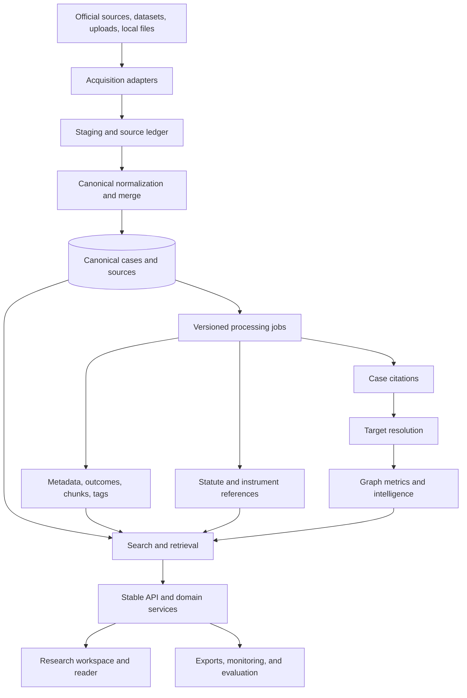
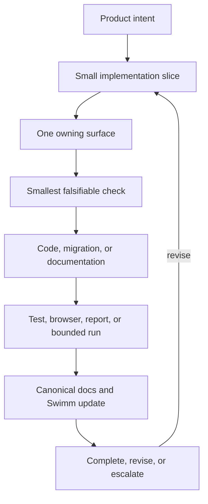

# Product North Star and Future State

This document defines the intended product and architecture destination for AI
CaseLibrary. It is forward-looking, not a current-state inventory. For current
implementation, read [SYSTEM_REFERENCE.md](../SYSTEM_REFERENCE.md). The future
roadmap is grounded in [GUIDANCE.md](../GUIDANCE.md), [ROADMAP.md](../ROADMAP.md),
and [MASTER_IDEAS.md](../MASTER_IDEAS.md).

## End State In One Sentence

AI CaseLibrary should become a provenance-first litigation research workspace
that helps researchers move from a question to a defensible set of authorities,
while showing why each result matters, where its evidence came from, what is
uncertain, and how the law is changing over time.

It remains a research aid, not legal advice. Generated explanations must be
bounded by retrieved authority and must never invent or conceal uncertainty.

## Product Goals

1. **Faster research:** start from an issue, citation, statute provision, judge,
   procedural event, or known authority and reach useful primary material.
2. **More complete research:** reveal related, co-cited, indirect, foundational,
   replacement, and potentially missing authorities as evidence-backed
   suggestions, never as claims of completeness.
3. **Explainable results:** expose matching text, citation context, source,
   court/date, provenance, and ranking signals, with a path back to exact
   stored evidence.
4. **Trustworthy processing:** keep metadata, tags, chunks, embeddings, case
   citations, statute references, outcomes, and graph metrics as separate,
   versioned, reviewable layers.
5. **Cumulative research:** let researchers save questions, authorities, notes,
   evidence snippets, comparisons, and reviewable evidence bundles.
6. **Corpus-scale operations:** make acquisition, enrichment, extraction,
   embedding, graph work, evaluation, and reporting bounded, resumable,
   idempotent, observable, and safe to retry.
7. **Government-ready integration:** integrate responsibly with relevant
   Government of Canada systems, data standards, identity boundaries, and
   approved information-sharing workflows without treating external systems
   as an unverified source of truth.
8. **CBSA litigation-analyst adoption:** make the system useful in real analyst
   workflows, with fast authority discovery, defensible evidence packages,
   repeatable research threads, training, feedback, and measurable time saved.
9. **Enterprise security and privacy:** protect legal research, operational,
   personal, and uploaded information through least privilege, encryption,
   auditability, retention controls, threat modeling, and explicit data
   classification.
10. **Hosted and portable operation:** move from a laptop-bound prototype to a
    managed, monitored, backed-up environment that can be deployed, upgraded,
    recovered, and moved between approved hosting environments.

## Future Researcher Experience

The entry point should accept plain-language issues, case names and citations,
IRPA/IRPR/Charter provisions, judges, courts, dates, parties, outcomes,
procedural events, or saved research threads. Retrieval should support lexical,
semantic, hybrid, citation-only, and metadata-first modes with reproducible
ordering and visible reason signals.

The reader should connect source text, metadata, chunks, case citations,
statutes, tags, confidence, review history, and linked authorities without
collapsing their meanings. Backend-owned offsets remain authoritative; browser
rendering may highlight them but must not invent replacement positions.

A future workbench should save questions, searches, collections, pinned
passages, statute provisions, notes, unresolved questions, comparisons, and
evidence packets. It should preserve the evidence state that produced an
insight, not only a list of case IDs.

## Target Architecture

Each adapter records source identity, access time, terms, raw and normalized
hashes, parser version, and staging status. Canonical merge owns identity,
deduplication, precedence, conflicts, and idempotence. Reprocessing a source
must not silently erase competing values.

Processing remains ordered and restartable: metadata/outcomes, section and
paragraph chunks, case-law citations, statute/instrument references, target
resolution and graph calculations, then tags, embeddings, and optional model
signals. Case citations never become statute rows, and tags never substitute
for evidence.

Search, graph analytics, workbench persistence, evidence assembly, and optional
RAG generation should become separate services or modules with stable contracts.
The API should orchestrate these responsibilities rather than contain every
query, ranking rule, page builder, and domain policy in one route module.

## Future Data Layers

| Layer | Responsibility |
| --- | --- |
| Source ledger | Identity, terms, hashes, retrieval events, parser versions |
| Canonical cases | Stable identity, normalized metadata, text, source links |
| Documents/chunks | Sections, paragraphs, pages, hashes, embeddings |
| Case citations | Occurrences, spans, normalized forms, targets, context |
| Statute references | Independent instrument/provision occurrences and spans |
| Metadata/tags | Observations, taxonomy versions, confidence, review state |
| Authority graph | Edges, metrics, roles, inheritance, lifecycle, issue relationships |
| Research workbench | Questions, searches, collections, notes, pins, evidence packets |
| Evaluation/monitoring | Gold sets, benchmark runs, reports, performance budgets, alerts |

Future schema additions require migrations, generated schema refreshes, and
compatibility preservation until callers move. Reference-library, activity,
synthetic, uploaded, staged, and side-project data remain distinguishable from
canonical judgments.

## Integration Map

External systems may provide material or computation; AI CaseLibrary remains
responsible for identity, evidence lineage, domain contracts, and presentation.

| Integration | Intended role | Required boundary |
| --- | --- | --- |
| Federal Court portals | Official decisions, PDFs, identifiers, procedural history | Discovery is not capture; preserve status and hashes |
| CanLII | Secondary coverage and permitted citation support | Terms, quotas, and anti-bot controls apply |
| A2AJ | Broad case data and citation network | Preserve source family and conversion provenance |
| CanLaw/Hugging Face | Local staging, repair, and selected acquisition | Bridge through canonical ingestion |
| Reference library | Legislation, policy, guidance, procedure | Separate corpus; never silently create judgments |
| DOCX/text-PDF uploads | Temporary review and extraction | In-memory by default; explicit promotion only |
| PostgreSQL/pgvector | Durable records and model-versioned similarity | Migrations, constraints, dimensions, transactions |
| Local BGE-M3 | Private repeatable embeddings | Version, resource budget, and coverage |
| OpenAI-compatible APIs | Optional embeddings, audits, and synthesis | Credentials, cost, model, evidence packet, uncertainty |
| Azure/tunnel/proxy | Possible deployment or controlled exposure | Real authentication and secrets management |
| Swimm/manager agent | Maps, planning, checks, rollback, evidence | Must preserve domain ownership |

Every external operation is bounded, permission-aware, rate-limited where
needed, and recorded as success, failure, or unavailable. A failed optional
integration cannot corrupt independent deterministic processing.

## Institutional Adoption And Government Integration

The eventual institutional audience includes Government of Canada teams and
CBSA litigation analysts. Adoption is a product and governance problem, not
just an API connection. The system must earn trust through useful workflows,
clear authority, predictable performance, and accountable handling of data.

### Government of Canada integration direction

Future integration may include approved connections to Government of Canada
identity, document, records, analytics, notification, and data-exchange
services. The exact systems, classifications, hosting requirements, and
authority to connect must be confirmed through security and departmental
architecture review before implementation.

The integration contract should provide:

- documented APIs, schemas, versioning, and ownership for every exchange;
- explicit source classification and authority for imported records;
- one-way or least-privilege access wherever two-way synchronization is not
  necessary;
- data lineage, exchange logs, reconciliation, retry, and failure states;
- export formats suitable for approved records, reporting, and review systems;
- a kill switch and degraded local mode when an external service is unavailable.

External government data may enrich the library, but it must not silently
overwrite source-preserved judgments, citation evidence, or analyst decisions.
Every integration must pass privacy, security, legal, records-management, and
operational approval before production use.

### CBSA litigation-analyst adoption

The product should be designed with analysts through observed tasks and
feedback rather than assuming that a general legal-search interface transfers
directly to operational work. Priority workflows include finding controlling
and persuasive authorities, comparing outcomes, tracing citation support,
reviewing procedural history, assembling evidence packages, and returning to
an earlier research thread.

Adoption gates should include:

1. A representative analyst cohort completes defined research tasks without
   manual database workarounds.
2. Analysts can verify every surfaced authority and export its source context.
3. Training materials, support ownership, accessibility, and escalation paths
   exist before wider rollout.
4. Feedback is captured as product evidence, with false positives, misses,
   unresolved citations, and workflow friction tracked separately.
5. Time saved is measured alongside accuracy, trust, and review burden; speed
   alone is not an adoption success criterion.

## Security, Privacy, And Trustworthy Hosting

Security is a target operating requirement, not a deployment afterthought. The
hosted system should have an approved data classification, threat model,
identity and access model, audit plan, incident response plan, retention policy,
backup/recovery design, and exit plan before it receives institutional data.

Required controls include:

- managed identity or approved SSO with MFA and role-based least privilege;
- separate development, test, staging, and production environments;
- encryption in transit and at rest, managed secrets, key rotation, and no
  credentials in source, logs, exports, or prompts;
- immutable or access-controlled audit events for login, source access,
  exports, administrative actions, and data changes;
- classification-aware handling of personal, confidential, privileged, and
  operational information;
- retention, deletion, legal hold, backup, disaster recovery, and data-residency
  rules appropriate to the approved hosting context;
- input validation, dependency scanning, patching, rate limits, network
  segmentation, monitoring, alerting, and tested incident response;
- explicit controls for hosted AI providers, including data-use terms,
  redaction, residency, retention, budget, and human review.

No-index headers, a tunnel, or a password page alone constitute authentication.
The hosted target must enforce access at the application and infrastructure
boundaries and must demonstrate anonymous denial, authorized use, auditability,
and recovery in tests.

## Hosted Migration And Portability

The laptop is a development environment, not the eventual production home.
Migration should be incremental and reversible:

1. **Externalize configuration:** remove machine-specific assumptions, define
   typed settings, secret management, environment separation, and health checks.
2. **Containerize and automate:** build a reproducible application image,
   migration job, CI checks, infrastructure definition, and deployment process.
3. **Establish managed services:** use approved managed PostgreSQL/pgvector,
   object storage for governed artifacts, centralized logs/metrics, backups,
   alerting, and identity controls.
4. **Prove migration:** rehearse export/import, schema migration, checksum
   reconciliation, rollback, restore, and performance at representative scale.
5. **Cut over safely:** run a bounded parallel validation period, freeze or
   reconcile writes, verify evidence counts and hashes, then switch users with
   an explicit rollback window.

The application should remain portable across approved environments by keeping
deployment configuration separate from domain logic, using migrations rather
than machine-created schemas, documenting provider-specific dependencies, and
maintaining an exportable source/provenance ledger. Hosted migration is not
complete until the laptop can be offline without interrupting the production
service or losing recoverable work.

## Citation-Intelligence Horizon

The citation program should mature into an evidence-based jurisprudence atlas.
It should support neighborhoods, co-citation, authority families, influence,
procedural lineage, cross-court movement, hidden paths, inheritance chains,
foundational decisions, issue clusters, related cases, missing-authority
suggestions, and citation completion.

Each occurrence should eventually support position, frequency, persistence,
salience, context windows, citation purpose, authority role, novelty,
distinguishing language, negative treatment, reinterpretation, and purpose
evolution. Time-aware analysis may provide velocity, decay, replacement
candidates, lifecycle stages, emerging-authority alerts, doctrine shifts,
anomalies, and network health. Every signal must state corpus scope, comparison
window, observed-versus-inferred status, and traceable evidence.

## Delivery Horizons

1. **Reliability and measurement:** gold sets, extraction audits, endpoint
   contracts, browser smoke journeys, performance budgets, and release gates.
2. **Citation context:** context windows, citation purpose, evidence views, and
   distinguishing or negative-treatment signals measured on labeled decisions.
3. **Research workbench:** issue-level gaps, recommendations, saved threads,
   notes, pinned authorities, and evidence exports.
4. **Jurisprudence intelligence:** originality, authority lifecycle, doctrine
   evolution, trend signals, replacement, and reviewable alerts.
5. **Responsible explanation:** grounded synthesis only after retrieval quality,
   provenance, context evidence, and failure reporting meet release thresholds.
6. **Institutional readiness:** complete security classification, approved
   government integration design, analyst pilot, training/support model, and
   hosted migration rehearsal before production adoption.

## Trust And Safety Contract

Every recommendation, graph insight, or generated explanation must answer:

1. What source material supports it?
2. Which extraction, ranking, or model step produced it?
3. What failed to resolve or retrieve?
4. How confident is it and what was reviewed?
5. Can it be reproduced or exported?

Required safeguards are no invented citations or holdings, explicit unresolved
and low-confidence states, source and artifact provenance, privacy and
retention rules for uploaded material, bounded external lookups, real access
control, and human review for high-impact or ambiguous classifications.

## End-State Measures

| Goal | Measure |
| --- | --- |
| Research quality | Recall, precision, MRR, and hit@k on fixed litigation questions |
| Explainability | Source, exact context, ranking reasons, and confidence on recommendations |
| Citation trust | Full spans, nested IRPA/IRPR forms such as `34(1)(f)`, anchors, unresolved states |
| Retrieval speed | Measured p50/p95 budgets at representative corpus scale |
| Data health | Orphans, duplicate edges, malformed citations, null metadata, stale vectors, conflicts |
| Workflow completion | Saved, resumed, annotated, compared, and exported research threads |
| Resilience | Preflighted, locked, checkpointed, resumable, idempotent, logged jobs |
| Source governance | Source, version, terms, parser/rule/model, and retrieval time lineage |
| Release safety | Unit, integration, browser, quality, performance, and contract gates |
| Responsible AI | Grounded answers with citations, uncertainty, and no fabricated authority |
| Modular delivery | Stable contracts, focused tests, and rollback for each ownership surface |
| Institutional adoption | Analyst task success, verification rate, trust, time saved, support burden, and feedback closure |
| Government integration | Approved data exchanges, reconciliation accuracy, audit completeness, and degraded-mode recovery |
| Security posture | Access-control tests, patch/incident metrics, audit coverage, retention compliance, and recovery objectives |
| Hosted reliability | Availability, backup/restore success, migration rehearsal, latency budgets, and zero laptop production dependency |

## Project-Manager Agent Readiness

The future manager agent coordinates dependencies, acceptance checks, evidence,
documentation, and rollback. It distinguishes code changes from data operations
and release decisions, preserves unrelated worktree changes, requests a new
check before crossing an ownership boundary, and stops at genuine blockers.

## Definition Of Finished

The product is at its intended end state when a researcher can move from
question to reviewed evidence in one coherent workflow; retrieval and graph
signals are measured and explainable; saved work preserves evidence; ingestion
and enrichment are resumable and provenance-preserving; model/rule changes are
evaluated against gold sets; critical regressions block releases; and any
generated explanation is cautious, source-linked, reproducible, and clearly not
legal advice.

## Decision Rules

Before adding a feature, identify the researcher decision it improves, its
owning module and data layer, supporting source evidence, whether the output is
observed, extracted, resolved, ranked, inferred, or generated, the smallest
falsifiable quality check, and the migration/regeneration/documentation/
rollback work required. Do not introduce a new intelligence layer by collapsing
existing ones.

<SwmMeta version="3.0.0" repo-id="Z2l0aHViJTNBJTNBTGl0SW50ZWxwcm9qZWN0JTNBJTNBZ3JleXN0b25lLWRhbg==" repo-name="LitIntelproject">Powered by [Swimm](https://app.swimm.io/)</SwmMeta>
