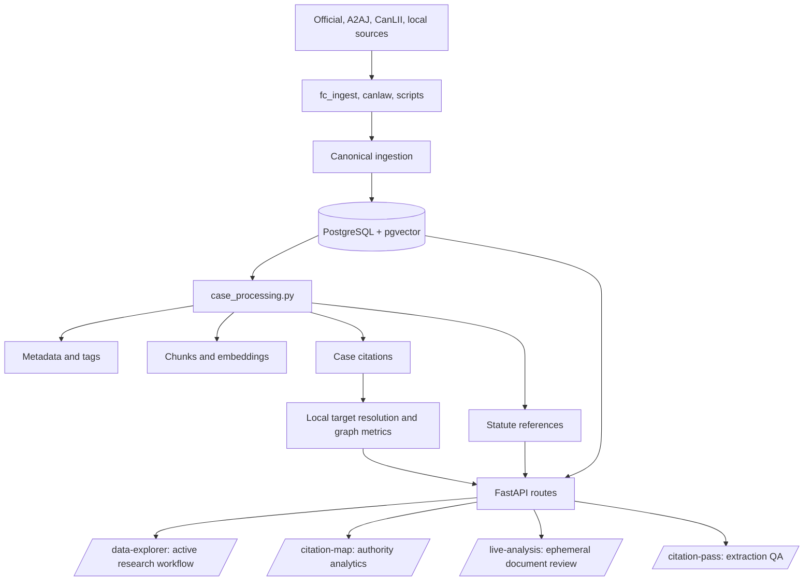

# AI CaseLibrary Overview

AI CaseLibrary is a FastAPI-based Canadian legal research system focused on
immigration litigation. It preserves source provenance, enriches case records,
and exposes search, reading, citation, statute, metadata, and Federal Court
activity workflows.

## Start Here

| Area | Entry point | Responsibility |
| --- | --- | --- |
| Application | `backend/main.py` | FastAPI startup, health, and route registration |
| API and UI | `backend/routes.py` | Route contracts, query orchestration, and generated research UI |
| Database | `backend/database.py` | SQLAlchemy engine, models, and PostgreSQL/pgvector access |
| Ingestion | `backend/ingestion.py` | Provenance-aware canonical writes and source merge rules |
| Processing | `backend/case_processing.py` | Ordered metadata, chunk, citation, and statute stages |
| Extraction | `backend/citations.py` | Case citations, statutes/instruments, offsets, and resolution |
| Operations | `scripts/run_overnight.py` | Bounded, resumable enrichment and acquisition jobs |

## Runtime Flow

## Refactoring Boundaries

- Keep case citations, statute references, and metadata as separate layers.
- Preserve backend-owned source spans and offsets; the browser must not infer replacements.
- Keep source staging distinct from canonical PostgreSQL data.
- Treat `/data-explorer` as the active research surface; `/case-reader` is a compatibility redirect.
- Keep side-project datasets outside canonical case tables and routes.
- Use `SYSTEM_REFERENCE.md` for current architecture and `DOCS_INDEX.md` for document authority.

## Next Walkthroughs

1. **System map**: trace `backend/main.py` into `backend/routes.py`.
2. **Research request**: trace search from the route through database queries to the inline reader.
3. **Processing pipeline**: trace `backend/case_processing.py` and its five ordered stages.
4. **Source-to-canonical flow**: trace staging adapters through `backend/ingestion.py`.
5. **Citation evidence**: trace extraction, offsets, target resolution, and QA.
6. **Database map**: connect `backend/database.py` to `alembic/` and generated schema docs.
7. **Operational run**: connect `scripts/run_overnight.py` to `OVERNIGHT.md`.
8. **Active UI**: connect `/data-explorer` to `docs/RESEARCH_UI_GUIDE.md`.

## Refactor Control Point

Before changing a module, identify its owning boundary, read the linked
walkthrough and canonical document, state one falsifiable behavior expectation,
and run the narrowest validation that can disprove it. Record the evidence in
the relevant walkthrough and update the canonical documentation in the same
checkpoint.

<SwmMeta version="3.0.0" repo-id="Z2l0aHViJTNBJTNBTGl0SW50ZWxwcm9qZWN0JTNBJTNBZ3JleXN0b25lLWRhbg==" repo-name="LitIntelproject">Powered by [Swimm](https://app.swimm.io/)</SwmMeta>
