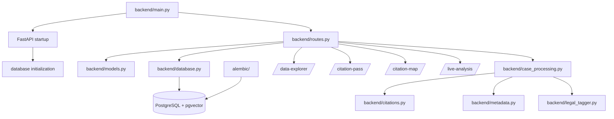

&nbsp;
 
# System Map

This walkthrough describes the active runtime path of AI CaseLibrary and the
ownership boundaries that must remain visible during refactoring.

## Runtime Overview



## Component Roles

| Component | Role | Refactoring constraint |
| --- | --- | --- |
| `backend/main.py` | Creates the FastAPI application, registers routes, handles startup and health behavior | Keep startup concerns separate from route implementation |
| `backend/routes.py` | Owns the public API contract, query orchestration, and generated HTML/CSS/JavaScript research interfaces | Treat API and embedded UI as a coupled artifact until browser coverage exists |
| `backend/models.py` | Defines Pydantic request and response contracts | Change external contracts with route tests and generated API documentation |
| `backend/database.py` | Loads environment configuration, creates SQLAlchemy sessions, and declares ORM models | Preserve database precedence, provenance fields, and vector dimensions |
| `alembic/` | Holds deployment schema migrations | Migrations are authoritative for schema evolution; regenerate schema reference after model changes |
| `backend/case_processing.py` | Coordinates the ordered processing stages for a case, including the active V3 tag stage | Preserve stage separation, ordering, and taxonomy boundaries |
| `backend/citations.py` | Extracts case citations and statutes/instruments, validates spans, resolves targets, and computes citation metrics | Never merge case citations with statute references or replace backend offsets in the UI |
| `backend/metadata.py` | Extracts structured case metadata and exact evidence spans | Preserve confidence, provenance, and review signals |
| `backend/legal_tagger_v3.py` | Applies the active deterministic V3 core mention taxonomy with exact evidence and offsets | Preserve repeated occurrences, rule IDs, evidence roles, and taxonomy version; V1/V2 remain legacy comparison layers |

## Request And Data Flow

1. `backend/main.py` creates the application and invokes database startup behavior.
2. A client calls a route registered by `backend/routes.py`.
3. Request data is validated using contracts from `backend/models.py`.
4. The route selects database reads or delegates to processing and extraction helpers.
5. SQLAlchemy reads or writes the canonical PostgreSQL database through
	`backend/database.py`.
6. Processing writes derived layers in order: metadata, overall chunks, heading
	chunks, case citations, statutes, and V3 tag occurrences.
7. The route returns API data or renders the active research UI.
8. The UI displays backend-owned text, citations, statutes, tags, provenance,
	and offsets without calculating substitute evidence locations.

## Processing Contract

The canonical processing order is:

1. `full_case`
2. `heading_chunks`
3. `metadata`
4. `outcome`
5. `case_citations`
6. `statutes`
7. `tags_v3`

Case-to-case target resolution is a separate local pass after citation
extraction. IRPA/IRPR references remain a separate statute layer; nested forms
such as `34(1)(f)` are release-sensitive regression cases. V3 tags preserve
every occurrence and are mention evidence only; contextual tags and outcome
signals remain separate follow-up layers. The one-case V2 Pipeline smoke test
confirmed that source-link HTML reacquisition precedes replacement chunking and
that the later derived layers overwrite only that case's rows.
Citation extraction stores same-document short-form anchor provenance when
available, but leaves target-case resolution to the later local pass after case
loading.
The medium-long validation case also showed that replacement can change citation
and statute counts, so cohort rollout requires comparison/adjudication gates.
Very large documents may require a more scalable HTML alignment strategy before
they are admitted to the same bulk path.

The rollout quality gate now has a deterministic case snapshot/comparator for
chunks, citations, statutes, V3 tags, outcomes, and source HTML state. Cohort
execution must preserve before/after reports and stop on unexplained large
deltas or unmapped evidence. The large-document bounded lookup now completes
the previously blocked 731K-character case; count deltas remain a review gate.

The full V2 Pipeline launch also requires a separate source-HTML acquisition
checkpoint before rechunking. Unsupported or malformed source links must be
quarantined with an explicit disposition, not silently treated as complete.
The cohort runner must be resumable by stage and case, exclude embeddings, and
retain before/after evidence for adjudication.
The prepared implementation is `scripts/run_v2_pipeline.py` plus
`scripts/acquire_case_html.py`; it is designed for a bounded stratified trial
before cohort scale.
The approved overnight run is tracked under
`data/overnight_runs/v2-pipeline-20260904` with isolated stage workers,
900-second watchdogs, quarantine, and embeddings excluded. Its durable state is
the recovery authority while it runs.

That run was paused for efficiency redesign after 1,786 cases. The next
execution architecture must separate concurrent bounded source acquisition from
local enrichment, reuse persistent workers, batch commits, sample detailed
before/after reports, and isolate very-large cases so ordinary cases are not
held behind pathological alignment work.
Citation-heavy cases also require resolver optimization: current extraction
performs a database lookup for each neutral citation occurrence. A per-case
cache or batch resolution pass is required before cohort execution.
The compact baseline for all 61,241 cases is stored separately at
`data/eval/reports/v2-pipeline-before-all.jsonl`; it is the comparison anchor
for the optimized runner, while detailed row snapshots remain sampled.
HTML is being used as a calibration reference rather than assumed to be
required for every case. The parity harness measures whether text-only section
and paragraph rules preserve structure and content; current FC/SCC outliers
remain open until their family-specific signals are improved or accepted.
The main V2 run excludes SCC and forces text-only section/paragraph chunking for
non-SCC cases, even where HTML exists. SCC HTML retrieval is a separate slow
calibration path for later use.

The completed `v2-text-only-full-20260905` run processed 50,327 records and
completed 43,598 cases with zero quarantines; 6,729 records were excluded for
missing parseable allowed hosts. The completed cohort gained 12% more chunks,
30% more case citations, 65% more statute references, and 23.1x more V3 tag
occurrences versus its compact baseline. Read-only offset auditing found no
malformed citation/statute spans or missing tag offsets. All extracted citations
remain unresolved and lack chunk association by design until the separate local
resolution/layer-association pass, and only 17 completed-cohort records have
stored HTML in this text-only run.

The SCC HTML follow-up is isolated from enrichment writes. The current inventory
has 10,889 SCC source URLs and 27 stored HTML snapshots; the first five-case
dry-run probe returned five ready responses with zero quarantines and zero
applied rows. The next batch should remain bounded and resumable under the
existing host limiter and source-content validator.

The source-refresh boundary now includes a missing-HTML selector. The initial
25-case batch refreshed existing snapshots and did not increase coverage. A
follow-up five-case missing-HTML probe found one valid response and four
`login.openathens.net` redirects without decision content. Bulk SCC acquisition
is therefore blocked until an approved alternate source or URL mapping is
available.

The SCC path is now isolated in `scripts/run_scc_text_only.py`. It selects SCC
cases with canonical full text without requiring source HTML or a parseable host,
then runs the seven deterministic enrichment stages without embeddings. Its
chunker preserves numbered/bracketed paragraphs, Roman sections, and older
unnumbered body lines; the stored 27-case sample passed exact chunk-text
containment and the five-case dry run performed no writes.
The final policy dry run examined 50,327 non-SCC full-text cases without writes;
SCC and malformed/unsupported source-link cases were excluded before execution.
The first six-case stratified trial completed five cases and quarantined one
SCC source mismatch; one case also produced a major citation delta. These are
review gates, not failures to hide or bypass.
Each V2 Pipeline stage now runs in an isolated worker with a hard timeout and
quarantine path, preventing a pathological case from idling the cohort runner.

## Active And Legacy Boundaries

- `/data-explorer` is the active research workflow and contains the inline case reader.
- `/case-reader` is a compatibility redirect for legacy bookmarks.
- `/citation-pass` is an extraction QA surface, not the normal research workflow.
- `/live-analysis` reads DOCX and text-based PDF uploads in memory and does not persist them.
- `side_projects/` remains outside the canonical case workflow.
- `legacy/`, `backend/legacy/`, and `docs/history/` are reference-only areas.

## Cross-Cutting Contracts

- Source text and provenance enter through ingestion and remain traceable after
	processing and API rendering.
- The database is the persistence boundary; page code must not create or repair
	canonical data as a side effect of rendering.
- Case citations, statutes/instruments, metadata, tags, and embeddings are
	separate derived products even when they use the same text.
- A chunk ID identifies context, while backend-owned offsets identify evidence.
- Route responses may contain incomplete enrichment, unresolved targets, or
	empty results; those states must remain explicit.

## Refactoring Seams

The most useful seams are application startup versus route registration,
route-family handlers versus query services, API payload mapping versus page
rendering, source adapters versus canonical merge policy, and extraction versus
resolution/persistence. Each seam should first gain a focused contract test or
characterization fixture. Avoid moving ORM declarations or changing response
models in the same checkpoint as a route split.

## Validation Checkpoint

For changes to this path, start with the narrowest applicable check:

```powershell
.\venv\Scripts\python.exe -m py_compile backend\main.py backend\routes.py backend\database.py backend\case_processing.py backend\citations.py
.\venv\Scripts\python.exe -m pytest tests\test_api.py -q
```

For UI changes, also run `tests/test_feature_tabs.py` and a manual browser
check. For citation or statute changes, run the focused citation tests with
exact-span assertions, including IRPA/IRPR nested provisions.

## Refactoring Rule

Before moving or splitting a module, identify its current owner above, trace
all callers, preserve the public contract, and run the validation checkpoint.
Update this walkthrough and `SYSTEM_REFERENCE.md` when the ownership or runtime
flow changes.

<SwmMeta version="3.0.0" repo-id="Z2l0aHViJTNBJTNBTGl0SW50ZWxwcm9qZWN0JTNBJTNBZ3JleXN0b25lLWRhbg==" repo-name="LitIntelproject"><sup>Powered by [Swimm](https://app.swimm.io/)</sup></SwmMeta>
