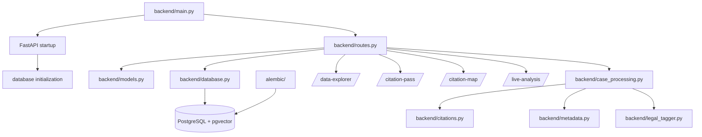

&nbsp;
 
# System Map

This walkthrough describes the active runtime path of AI CaseLibrary and the
ownership boundaries that must remain visible during refactoring.

## Runtime Overview



## Component Roles

| Component | Role | Refactoring constraint |
| --- | --- | --- |
| `backend/main.py` | Creates the FastAPI application, registers routes, handles startup and health behavior | Keep startup concerns separate from route implementation |
| `backend/routes.py` | Owns the public API contract, query orchestration, and generated HTML/CSS/JavaScript research interfaces | Treat API and embedded UI as a coupled artifact until browser coverage exists |
| `backend/models.py` | Defines Pydantic request and response contracts | Change external contracts with route tests and generated API documentation |
| `backend/database.py` | Loads environment configuration, creates SQLAlchemy sessions, and declares ORM models | Preserve database precedence, provenance fields, and vector dimensions |
| `alembic/` | Holds deployment schema migrations | Migrations are authoritative for schema evolution; regenerate schema reference after model changes |
| `backend/case_processing.py` | Coordinates the ordered processing stages for a case | Preserve stage separation and ordering |
| `backend/citations.py` | Extracts case citations and statutes/instruments, validates spans, resolves targets, and computes citation metrics | Never merge case citations with statute references or replace backend offsets in the UI |
| `backend/metadata.py` | Extracts structured case metadata and exact evidence spans | Preserve confidence, provenance, and review signals |
| `backend/legal_tagger.py` | Applies deterministic legal taxonomy rules | Keep taxonomy/version behavior explicit and test-backed |

## Request And Data Flow

1. `backend/main.py` creates the application and invokes database startup behavior.
2. A client calls a route registered by `backend/routes.py`.
3. Request data is validated using contracts from `backend/models.py`.
4. The route selects database reads or delegates to processing and extraction helpers.
5. SQLAlchemy reads or writes the canonical PostgreSQL database through
	`backend/database.py`.
6. Processing writes derived layers in order: metadata, overall chunks, heading
	chunks, case citations, and statutes.
7. The route returns API data or renders the active research UI.
8. The UI displays backend-owned text, citations, statutes, tags, provenance,
	and offsets without calculating substitute evidence locations.

## Processing Contract

The canonical processing order is:

1. `metadata`
2. `overall_chunks`
3. `heading_chunks`
4. `case_citations`
5. `statutes`

Case-to-case target resolution is a separate local pass after citation
extraction. IRPA/IRPR references remain a separate statute layer; nested forms
such as `34(1)(f)` are release-sensitive regression cases.

## Active And Legacy Boundaries

- `/data-explorer` is the active research workflow and contains the inline case reader.
- `/case-reader` is a compatibility redirect for legacy bookmarks.
- `/citation-pass` is an extraction QA surface, not the normal research workflow.
- `/live-analysis` reads DOCX and text-based PDF uploads in memory and does not persist them.
- `side_projects/` remains outside the canonical case workflow.
- `legacy/`, `backend/legacy/`, and `docs/history/` are reference-only areas.

## Validation Checkpoint

For changes to this path, start with the narrowest applicable check:

```powershell
.\venv\Scripts\python.exe -m py_compile backend\main.py backend\routes.py backend\database.py backend\case_processing.py backend\citations.py
.\venv\Scripts\python.exe -m pytest tests\test_api.py -q
```

For UI changes, also run `tests/test_feature_tabs.py` and a manual browser
check. For citation or statute changes, run the focused citation tests with
exact-span assertions, including IRPA/IRPR nested provisions.

## Refactoring Rule

Before moving or splitting a module, identify its current owner above, trace
all callers, preserve the public contract, and run the validation checkpoint.
Update this walkthrough and `SYSTEM_REFERENCE.md` when the ownership or runtime
flow changes.

<SwmMeta version="3.0.0" repo-id="Z2l0aHViJTNBJTNBTGl0SW50ZWxwcm9qZWN0JTNBJTNBZ3JleXN0b25lLWRhbg==" repo-name="LitIntelproject"><sup>Powered by [Swimm](https://app.swimm.io/)</sup></SwmMeta>
