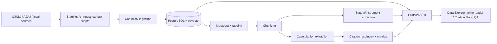

# AI CaseLibrary System Reference

Last updated: 2026-09-01

## Purpose And Authority

This is the canonical description of the active AI CaseLibrary system. It consolidates the current-purpose material formerly spread across `README.md`, `SYSTEM_OVERVIEW.txt`, `AI_HANDOFF.md`, `GUIDANCE.md`, and related runbooks.

Use this document for current architecture, functionality, data flow, repository ownership, operations, validation posture, and known limitations. `CHANGELOG.md` remains the chronological record; `ROADMAP.md` and `MASTER_IDEAS.md` remain forward-looking; `OVERNIGHT.md` is the repository atlas and bounded overnight operations guide; `docs/EXTRACTION_35K_RUNBOOK.md` remains a focused procedural runbook. Files under `docs/history/` are historical snapshots and must not be used for live counts or API contracts.

For a chronological account of retained project work and a reproducible five-minute-capped estimate of Copilot-assisted effort, see [WORK_HISTORY.md](WORK_HISTORY.md). It is generated from the reviewable local-session export at `docs/work_history_sessions.json`.

## Project Effort And Delivery History

The retained local VS Code history covers 22 project sessions and 18 active calendar days from 2026-07-31 through 2026-09-01. Using a fixed five-minute cap for each observed gap between consecutive turns, it estimates 3,463.7 minutes, or approximately 57.7 hours, of Copilot-assisted active work. This is a reproducible planning proxy rather than a complete timesheet: it excludes unrecorded reading, browser inspection, terminal-only work, work outside retained history, and the first observed turn of every session.

The work history shows the largest recorded effort clusters in deterministic citation/research intelligence (approximately 19.9 session-attributed hours), Federal Court activity intelligence (approximately 16.8 hours), and documentation/architecture (approximately 9.8 hours). The detailed daily ledger records the feature milestones, artifacts, and session evidence behind those totals. Do not use the effort figure to infer project cost, billable time, or individual productivity.

AI CaseLibrary is a research aid, not legal advice. All legal conclusions and critical source details must be verified against authoritative materials.

### How To Use This Handbook

Read the product, architecture, data model, operations, validation, and review sections here for the current system picture. Use the linked appendices for complete route, schema, configuration, source, script, recovery, UI, metric, testing, and change-process detail. Where a live count matters, query the corresponding API or database rather than relying on a dated document snapshot.

## Product Scope

AI CaseLibrary is a Canadian legal research system, currently optimized for immigration litigation. It preserves judicial decisions and supporting sources, enriches them with deterministic legal structure, and provides searchable case, citation, statute, judge, and Federal Court activity views.

The central operating principle is:

> Preserve source records first, enrich them second, and keep every derived signal traceable to stored source material.

The system intentionally separates three kinds of derived information:

1. Case-law references are stored in `citations` and can form graph edges to target cases.
2. Statute and instrument references are stored in `statute_references`; they are not case-citation rows.
3. Metadata extraction, legal tags, outcomes, and scores are research signals with provenance and confidence where available.

## What Is Implemented

### Primary Research Workflows

`/data-explorer` is the main research surface. It contains these tabs:

1. **About**: live inventory and coverage information from `/api/about/stats`.
2. **Case Search**: filtered research search with an inline decision reader.
3. **Site Architecture**: live data-layer and feature-to-table explanation.
4. **Citation Intelligence**: citation-network summaries for a selected case.
5. **Judge Outcomes**: aggregate outcome reporting by judge.
6. **Judge Profile**: canonical judge profiles and linked cases.
7. **Data Explorer**: inventory-oriented case and source inspection.
8. **FC History**: Federal Court procedural/activity lookup by IMM or other docket context where available.
9. **Legal Themes & Statutes**: live theme catalog, statute-tag affinity matrix, and thematic precedent clustering.

The case reader embedded in Case Search supports full decision text, source-preserved HTML where available, chunk breakdown, citation and statute highlighting, linked-authority navigation, compact panes, independently scrollable linked context, and hover previews for linked authority text.

### Supporting Interfaces

| Route | Role | Status |
| --- | --- | --- |
| `/data-explorer` | Primary research interface | Active |
| `/case-reader` | Compatibility redirect for legacy bookmarks | Redirects to the active Data Explorer case reader |
| `/live-analysis` | Ephemeral DOCX/text-PDF reader with citation and statute highlights | Active prototype |
| `/citation-map` | Citation graph workbench and authority analytics | Active |
| `/citation-pass` | Deterministic extraction/offset QA surface | QA only |
| `/quick-search` | Lightweight lexical/semantic search interface | Supporting |
| `/testing` | API/search testing UI | Test/support |
| `/prototype` | Earlier cohort explorer | Legacy/test |
| `/research` | Research/RAG experiment surface | Experimental; not a production legal-answer workflow |

Compatibility redirects such as `/about`, `/citation-intelligence`, and `/judges` point into the active Data Explorer workflow where applicable.

### Search And Retrieval

The API supports case-level, chunk-level, and grouped-chunk retrieval.

- `semantic` search uses stored vectors when available.
- `lexical` search avoids embedding generation and searches text/metadata predicates.
- `hybrid` search combines semantic and lexical scores with validated weights.
- `metadata` search emphasizes structured filters and text predicates.
- Chunk search can group passages under their parent case.
- Local BGE-M3 chunk embeddings are stored separately from OpenAI-compatible 1536-dimensional case vectors.

Case Search supports query, title, court, jurisdiction, dates, source details, citation variants, party/minister presets, cited authority, legal tags, language, processing status, cited/citing data, decision outcome, government outcome, judge, and full-text opt-in matching. Court abbreviations `FC`, `FCA`, and `SCC` expand to canonical court names for filtering.

By default, active Case Search uses title/citation matching. Full decision text and summary matching are added only when the explicit full-text search control is enabled.

### Citation, Statute, And Metadata Processing

`backend/citations.py` is the deterministic extraction layer. It recognizes neutral citations, reported decisions, named cases, bounded short forms, and source-specific aliases. It normalizes and resolves case citations against local data, then marks unresolved rows explicitly. Citation rows retain source case, optional target case, optional chunk, exact offsets, normalized form, provenance, and unresolved state.

Statute and instrument extraction is independent. It supports IRPA and IRPR names and abbreviations, nested provisions including forms such as `34(1)(f)`, plural provision syntax, Charter and Criminal Code references, selected international instruments, and bounded generic statute forms. The current priority is clean IRPA/IRPR extraction; broadening statute coverage should not reduce precision.

### Live Analysis

`/live-analysis` is a separate, ephemeral document-reading workflow. It accepts
`.docx` and text-based `.pdf` files up to 10 MB, extracts text in memory, and
returns source text plus deterministic case-citation and statute-reference rows.
Rows retain character offsets, paragraph locations, and PDF page numbers where
applicable. The UI presents a temporary Case Reader with in-place highlights and
an evidence inspector.

`POST /live-analysis/analyze` accepts a multipart `file` and performs extraction
only. A separate `POST /live-analysis/resolve` request performs a batched,
read-only lookup of neutral, named, and short-form references against existing
case title, citation, and secondary-citation fields. Neither request creates
cases, citation rows, chunks, embeddings, workspaces, or uploaded-file records.
Local resolution intentionally does not call external services. Scanned PDFs are
outside the prototype because they require OCR.

`backend/metadata.py` and Federal Court scrapers derive the deterministic source metadata — case name, date, docket, court, judge, place/date of hearing, counsel, and parties. Extraction carries field confidence, source evidence, quality flags, and a review indicator. The derived intelligence fields (decision outcome, government role/result, case type/challenge/issue/topic) are owned by `backend/intelligence.py`, which composes the outcome helpers in `backend/metadata_outcomes.py` and the subject helpers in `backend/metadata_subjects.py`; `backend/metadata.py` composes that intelligence layer into the stored `metadata_json->'reader_extracted'` payload so downstream analytics and the reader read a single payload. Reader metadata adds display-oriented normalized fields such as tribunal, court type, docket/case number, style of cause, respondent, and language.

`backend/legal_tagger.py` applies the deterministic `ca_legal_v2` taxonomy. Coverage includes immigration/refugee law, proceedings, tribunals, agencies, ministers, refugee doctrine, inadmissibility, CBSA enforcement, remedies, outcomes, legal standards, IRPA/IRPR and other instruments, countries, organizations, and evidence-bearing rule matches.

### Citation Intelligence

`backend/citation_map.py` provides read-oriented graph calculations and bounded outputs. The current analytical surface includes authority ranking, incoming/outgoing relationships, case authority maps, graph summaries, authority signals, citation surprises, hidden bridges, inheritance chains, missing-authority suggestions, lifecycle trends, position profiles, completion suggestions, issue shifts, and cross-court authority flow. Relevant JSON endpoints have CSV export companions where the feature requires export.

Citation metrics include in-degree, out-degree, and PageRank. Metrics are derived from resolved case-to-case edges and are recomputed after extraction rather than inferred in the browser.

Definitions, scopes, formulas, and interpretation cautions for search, citation, graph, outcome, metadata, and work-history measures are in [docs/METRICS_DICTIONARY.md](docs/METRICS_DICTIONARY.md).

### Federal Court Activity

Federal Court activity is a separate data layer, not a substitute for a judgment record. It stores normalized case/activity records and document-level entries from A2AJ/Federal Court activity sources, including docket-associated procedural material where available. Activity classifications can be generated and audited separately. A discovered Federal Court identifier does not prove that a full decision, PDF, or official judgment body was captured.

### Source Preservation And Provenance

The complete source-governance register is [docs/DATA_SOURCE_REGISTER.md](docs/DATA_SOURCE_REGISTER.md). It identifies every active source family, its canonical/staging/reference status, merge priority, storage path, provenance requirements, adapters, and known source limitations.

Canonical case ingestion records source type, source name, source identifier, source URL, source version, upstream licence, scrape timestamp, raw/full-text hash, and source-specific metadata. The `case_sources` table preserves one-to-many source provenance and identifies the primary source.

When available, `source_html` is sanitized before storage to preserve readable source formatting without retaining executable or unsafe markup. Scripts, styles, forms, embedded objects, event attributes, unsafe URL forms, SVG, and MathML are removed. The inline reader can use sanitized source HTML for faithful rendering while citation offsets remain tied to backend-owned plain text/chunk data.

Reference-library documents are deliberately separate from canonical cases. `data/reference_library/manifest.json` is authoritative; `inventory.csv` is generated. Downloads are MIME/signature validated, checksummed, and resumable.

## Architecture

### Runtime Components

| Component | Responsibility |
| --- | --- |
| `backend/main.py` | FastAPI application, root/health/access routes, response no-index headers, startup initialization |
| `backend/routes.py` | API contract, route dispatch, interface registration, and facade re-exports |
| `backend/search_service.py` | Case and chunk search, lexical tsvector ranking, cosine distance semantic scoring, hybrid combinations, and grouped chunk search |
| `backend/reader_service.py` | Unified reader data payload assembly, metadata pass formatting, HTML citation wrapping, and citation-pass details |
| `backend/analytics_service.py` | SQL aggregations for judge outcomes, yearly trends, data explorer cross-tabulations, judge profiles, and FC activity timelines |
| `backend/pages/` | Modular HTML page builders (`data_explorer.py`, `quick_search.py`, `research.py`, `citation_map.py`, `citation_pass.py`, `live_analysis.py`, `judge_outcomes.py`, `testing.py`, `prototype.py`) |
| `backend/database.py` | Environment loading, SQLAlchemy engine/session, ORM models, database initialization |
| `backend/models.py` | Pydantic request/response contracts |
| `backend/ingestion.py` | Canonical ingest, deduplication, source precedence, source HTML sanitization, provenance writes |
| `backend/citations.py` | Case and statute extraction, target resolution, citation rebuilds, metrics, A2AJ graph conversion |
| `backend/citation_map.py` | Citation graph and authority analytics |
| `backend/case_processing.py` | Explicit five-stage deterministic processing contract |
| `backend/metadata.py` | Deterministic source-metadata extraction facade and observations (composes the intelligence layer) |
| `backend/intelligence.py` | Derived intelligence fields: decision outcome, government role/result, case type/challenge/issue/topic |
| `backend/legal_tagger.py` | Deterministic legal taxonomy/tag rules |
| `backend/embedding_providers.py` | Embedding provider selection/wiring |
| `backend/fc_activity.py` | A2AJ Federal Court activity normalization |
| `backend/case_reader.py` | Legacy standalone reader UI; not the primary active workflow |

The active frontend pages are built by modular templates in `backend/pages/` and served via `backend/routes.py`. This ensures CSS, HTML, and JavaScript changes are cleanly separated from API route definitions while maintaining full contract compatibility.

The researcher-facing guide to tabs, filters, reader controls, highlights, linked authorities, analytics, and interpretation limits is [docs/RESEARCH_UI_GUIDE.md](docs/RESEARCH_UI_GUIDE.md).

### Startup And Configuration

The application loads `.env` from the repository root and `backend/.env`. Explicit `POSTGRES_*` settings take precedence over an inherited `DATABASE_URL`, avoiding accidental connection to a stale shell database. Typical local configuration includes PostgreSQL credentials/database, optional OpenAI credentials for OpenAI-dependent workflows, and optional site-access settings.

`init_db()` is called during FastAPI startup. Alembic remains the authoritative schema migration path for reproducible environments:

```powershell
.\venv\Scripts\python.exe -m alembic upgrade head
```

The local application is commonly served at `http://127.0.0.1:8000`. To start
or refresh the website, run the canonical command from the repository root:

```powershell
.\scripts\refresh_site.ps1
```

It stops existing local Uvicorn/cloudflared processes and starts the configured
local server/tunnel workflow. Keep that terminal open; closing it stops the
tunnel and app it owns. The public site is normally `https://www.ilit.ca`.

The complete environment-variable, precedence, security, local-model, source-integration, and static-template reference is [docs/CONFIGURATION_REFERENCE.md](docs/CONFIGURATION_REFERENCE.md). It distinguishes settings actively consumed at runtime from legacy or aspirational values in `config.yaml` and `.env.example`.

### Canonical Processing Pipeline

`backend/case_processing.py` codifies the five deterministic layers:

1. `full_case`: replace the whole-case chunk for the case.
2. `heading_chunks`: generate section and paragraph chunks.
3. `metadata`: derive metadata and update the full-text hash.
4. `case_citations`: rebuild case-law citation rows.
5. `statutes`: rebuild statute/instrument references.

Each stage can be selected independently for a case. Chunk layers run before
metadata because caption and disposition fields live at the beginning and end
of the decision, and metadata runs before citations so downstream extraction
sees the normalized case state. The ordering prevents the reader and citation
extractor from inventing their own inconsistent text segmentation.

### Data Flow



## Data Model

### Canonical Case Tables

The generated, table-by-table schema appendix is [docs/SCHEMA_REFERENCE.generated.md](docs/SCHEMA_REFERENCE.generated.md). It includes the current ORM columns, types, nullability, defaults, keys, indexes, unique constraints, foreign-key delete behavior, and a Mermaid entity relationship diagram. Regenerate it after a model or migration change:

```powershell
.\venv\Scripts\python.exe scripts\generate_schema_reference.py
```

The appendix is generated from `backend.database.Base.metadata`. Alembic remains the deployment migration authority, and direct database inspection remains the final authority for an existing environment that may have drifted from code.

| Table | Purpose |
| --- | --- |
| `cases` | Canonical case record: identity, court/date/citation/docket, text, sanitized source HTML, metadata, provenance summary, hashes, status, case embedding |
| `case_sources` | One-to-many source provenance for canonical cases |
| `ingestion_runs` | Ingestion operation/audit tracking |
| `case_chunks` | Legacy, section, and paragraph text chunks with labels, paragraph bounds, hashes, token estimates |
| `case_chunk_embeddings` | Model-versioned local chunk vectors; unique per chunk/model |
| `citations` | Case-law citation occurrences, resolution target, offsets, chunk association, provenance, unresolved state |
| `citation_metrics` | Per-case in-degree, out-degree, PageRank |
| `statute_references` | Independent statute/instrument occurrences and offsets |
| `case_tags` | Evidence-backed deterministic legal tags |
| `case_tagging_status` | Taxonomy/version completion state |
| `judge_profiles` | Canonical judge identity and aliases |
| `case_judge_profiles` | Case-to-judge-profile links |

### Staging And Federal Court Tables

| Table/family | Purpose |
| --- | --- |
| `a2aj_cases`, `a2aj_citation_edges`, `a2aj_case_map` | Separate A2AJ network provenance and conversion mapping |
| Federal Court activity tables | Normalized activity cases, document entries, classifications, and procedural context |
| SQLite/Parquet/JSONL artifacts | Source-specific staging; not automatically canonical |

### Key Invariants

1. A source record is never represented as official merely because it has been discovered or imported.
2. Canonical `full_text_hash` is calculated from stored full text rather than trusted from a client payload.
3. A source with higher configured priority can replace non-empty canonical fields; conflicts are retained in metadata instead of silently discarded.
4. Case citations and statute references remain separate tables and QA layers.
5. Citation offsets are source/chunk-relative backend data. Browser code must not calculate substitute offsets.
6. Side-project data must remain outside canonical case tables unless a deliberate bridge is created.

## Migrations

Alembic migrations currently run from `0001_case_metadata` through `0016_case_source_html`.

| Revision | Main change |
| --- | --- |
| `0001` | Initial case/provenance/retrieval metadata |
| `0002` | Raw ingestion, source fields, hashes, processing status |
| `0003` | Processing-status backfill |
| `0004` | Case chunks |
| `0005` | Citation network and metrics |
| `0006` | A2AJ citation network provenance |
| `0007` | Federal Court procedural history |
| `0008` | Canonical source and ingestion tracking |
| `0009` | Local BGE-M3 chunk embeddings |
| `0010` | Legal tags and tagging status |
| `0011` | Named chunk sets and paragraph metadata |
| `0012` | Separate statute references |
| `0013` | Citation-kind support |
| `0014` | Judge profiles and links |
| `0015` | Federal Court activity classifications |
| `0016` | Sanitized source HTML on cases |

Apply migrations before running scripts that depend on their tables. Do not use `Base.metadata.create_all()` as a substitute for a deployment migration plan.

## API Surface

The FastAPI OpenAPI schema at `/docs` is the definitive machine-readable contract. The most important routes are summarized below.

The checked-in, reproducible endpoint appendix is [docs/API_REFERENCE.generated.md](docs/API_REFERENCE.generated.md). Regenerate it after route or Pydantic contract changes:

```powershell
.\venv\Scripts\python.exe scripts\generate_api_reference.py
```

The appendix is generated from `backend.main:app.openapi()` plus FastAPI routes intentionally hidden from OpenAPI. It describes every exposed operation's method, path, parameters, request body, response statuses, and schema references where declared. Hidden routes include handler signatures and an explicit note that their response contract is not in OpenAPI. It is intentionally generated rather than manually maintained so that the reference follows active route declarations.

### Core Case APIs

- `POST /ingest`: validates and creates/merges canonical cases with provenance.
- `GET /cases/{case_id}`: canonical case retrieval.
- `GET /cases/{case_id}/reader-data`: unified reader payload containing case, sources, preferred chunks, citations, tags, metadata, metrics, and optional formatted HTML.
- `GET /cases/{case_id}/citation-pass`: stored and live extraction evidence for QA.
- `POST /search`: case-level semantic, lexical, hybrid, or metadata search.
- `POST /search/chunks`: chunk-level search.
- `POST /search/chunks/grouped`: grouped matching passages per case.
- `POST /search/local-chunks`: local embedding-backed chunk search where populated.

### Ephemeral Document Analysis APIs

- `GET /live-analysis`: standalone temporary reader UI.
- `POST /live-analysis/analyze`: in-memory DOCX/text-PDF extraction.
- `POST /live-analysis/resolve`: separate batched local resolution for neutral,
  named, and short-form case references.

### Research And Analytics APIs

- `GET /analytics/search/cases`: filtered active Case Search API.
- `GET /analytics/search/cases/{case_id}`: inline reader/search case payload.
- `GET /analytics/search/ministers`: active government-party filter data.
- `GET /analytics/judge-outcomes`: judge aggregate statistics.
- `GET /analytics/outcomes-by-year`: outcome time series for About/analytics display.
- `GET /api/about/stats`: live aggregate counts for the About interface. Use this endpoint instead of documentation numbers for current inventory.
- `GET /api/judge-profiles` and `GET /api/judge-profiles/{slug}`: profile browse/detail.
- `GET /cases/{case_id}/activity`: Federal Court activity/procedural context.

### Citation Intelligence APIs

- `GET /api/citation-intelligence/search`
- `GET /api/citation-intelligence/{case_id}/overview`
- `GET /api/citation-intelligence/{case_id}/timeline`
- `GET /api/citation-intelligence/{case_id}/outcomes`
- `GET /api/citation-intelligence/{case_id}/courts`
- `GET /api/citation-intelligence/{case_id}/judges`
- `GET /api/citation-intelligence/{case_id}/statutes`
- `GET /api/citation-intelligence/{case_id}/table`

Citation-map endpoints under `/citation-map/*` include summaries, authority maps, issue/lifecycle/surprise/hidden-bridge/cross-court analysis and bounded CSV exports. They should be reviewed against route decorators when adding a feature because this surface is intentionally broad.

## Repository Guide

### `backend/`

The backend owns runtime behavior. Keep active logic out of `backend/legacy/`. `routes.py` is large because it owns both API routes and generated UI; avoid broad formatting changes there, preserve raw-string escaping in embedded JavaScript regular expressions, and validate browser behavior after edits.

### `scripts/`

Scripts are operational tools, not a single pipeline. Major families are:

- **Ingestion/source staging**: `ingest_a2aj_parquet.py`, `ingest_a2aj_api.py`, `ingest_canlii_seed_cases.py`, `import_fc_decisions.py`, `crawl_canlii.py`, `import_canlaw_staging.py`.
- **Federal Court collection/activity**: `fc_portal_collector.py`, `fetch_fc_procedural_history.py`, `ingest_hf_fc_activity.py`, `classify_fc_activity.py`, `backfill_case_metadata_outcomes.py`.
- **Enrichment**: `chunk_cases.py`, `tag_cases.py`, `extract_citation_network.py`, `extract_irpa_irpr_references.py`, `resolve_citation_targets.py`, `resolve_short_citation_targets.py`, `backfill_judge_profiles.py`.
- **Embedding/retrieval**: `embed_local_chunks.py`, `embed_openai_chunks.py`, `embed_a2aj_cases.py`, `quick_search_engine.py`, `evaluate_retrieval.py`.
- **Citation and metadata QA**: `verify_citation_extraction.py`, `evaluate_fc_citation_extraction.py`, `extract_fc_citation_evidence.py`, `audit_fc_metadata_extraction.py`, `adjudicate_fc_metadata.py`.
- **Cohort/evaluation builders**: `build_core_immigration_set.py`, `curate_a2aj_immigration_cases.py`, `build_fc_citation_seed.py`, `build_fc_activity_gold_template.py`.
- **Orchestration**: `run_overnight.py`.

Most scripts are intended to be started from the repository root with the project virtual environment. Before a large write job, use its dry-run/preflight option and inspect whether another PostgreSQL-writing process is active.

The generated per-script command catalog is [docs/SCRIPT_CATALOG.generated.md](docs/SCRIPT_CATALOG.generated.md). It records each active script's purpose, operational class, inferred write/network risk, and safe first command. Regenerate it after scripts are added or renamed:

```powershell
.\venv\Scripts\python.exe scripts\generate_script_catalog.py
```

### `fc_ingest/` And `canlaw/`

These are source-specific adapters and staging helpers. They preserve source-native details and should not bypass canonical provenance/validation rules when bridging records into `cases`.

The complete ownership and lifecycle map for these packages, `backend/pages/`,
`data/`, tests, side projects, legacy areas, generated documents, and all script
families is maintained in [OVERNIGHT.md](OVERNIGHT.md).

### `data/`

- `data/raw/`: local raw source material; generally not version-controlled.
- `data/eval/`: fixtures, gold templates, deterministic evaluations, and reports.
- `data/overnight_runs/`: run state/log output; operational, not source code.
- `data/reference_library/`: manifest-driven, provenance-preserving reference corpus.
- `data/static/`: static application/data support artifacts.

Generated large evaluation files may require Git LFS. Do not add backup archives or raw corpora to ordinary Git history.

### Tests

Tests cover routes, models, ingestion, citations, metadata, tagging, chunking, source pipelines, citation analytics, security helpers, and operational scripts. Prefer a focused test slice after a local edit, then run the full suite before a release checkpoint.

## Operations

### Local Setup

```powershell
python -m venv venv
.\venv\Scripts\Activate.ps1
pip install -r requirements.txt
.\venv\Scripts\python.exe -m alembic upgrade head
.\venv\Scripts\python.exe -m uvicorn backend.main:app --host 127.0.0.1 --port 8000
```

Set secrets only in ignored environment files or secure environment configuration. Do not put API keys, database passwords, tunnel credentials, or access passwords in documentation, tests, exports, or commits.

### Scheduled/Long Jobs

Use the overnight runner for coordinated work:

```powershell
.\venv\Scripts\python.exe scripts\run_overnight.py --profile safe --preflight
.\venv\Scripts\python.exe scripts\run_overnight.py --profile safe --continue-on-error
```

The safe profile is lock-protected, sequential for database writers, stateful, and resumable. It maintains timestamped run directories, per-job logs, atomic state updates, and a lock file. Do not run independent large PostgreSQL write jobs alongside it. Resume rather than restarting interrupted work:

```powershell
.\venv\Scripts\python.exe scripts\run_overnight.py --resume --continue-on-error
```

For a full citation/statute refresh, follow `docs/EXTRACTION_35K_RUNBOOK.md`. That runbook includes a bounded canary, baseline count query, resume instructions, and post-run checks.

For failure-specific response and recovery steps, use [docs/OPERATIONAL_RECOVERY_GUIDE.md](docs/OPERATIONAL_RECOVERY_GUIDE.md). It covers locks, interrupted jobs, database/migration errors, stale server/tunnel state, source blocks, extraction quality problems, generated documentation, and Git LFS recovery.

### Verification Commands

```powershell
.\venv\Scripts\python.exe -m pytest tests\test_feature_tabs.py -q
.\venv\Scripts\python.exe -m pytest tests\test_citations.py -q
.\venv\Scripts\python.exe -m pytest -q
.\venv\Scripts\python.exe -m py_compile backend\routes.py backend\citations.py
```

After generated-page changes, confirm both the API and rendered page:

```powershell
Invoke-WebRequest -UseBasicParsing "http://127.0.0.1:8000/data-explorer?tab=search"
Invoke-WebRequest -UseBasicParsing "http://127.0.0.1:8000/api/about/stats"
```

## Validation Status And Known Limitations

### Latest Verified Code Baseline

On 2026-09-01, the broad test suite produced `268 passed, 2 failed`.

The two remaining failures are stale contract expectations, not current runtime failures:

1. One expects IRPA statute rows in `citations`, while the active design correctly stores them in `statute_references`.
2. One expects retired copy from the standalone reader page.

Focused active-interface and citation rebuild checks passed (`18 passed`). Editor diagnostics found no errors in the recently changed route/citation modules. Python compilation succeeds with one existing `SyntaxWarning` from an embedded JavaScript `\s` escape in `routes.py`; use raw strings or double escaping when changing that generated script.

### Current Limitations

1. The corpus contains third-party and staged sources. Source provenance and official-status distinctions matter.
2. Semantic retrieval and local embedding coverage/quality require continued benchmark-based measurement; do not infer legal relevance solely from ranking.
3. Citation extraction is deterministic and improving, but it is not a substitute for legal citation validation. Short-form resolution can remain unresolved by design.
4. Federal Court discovery, activity, and decision capture are separate states. A discovered or activity-linked item is not automatically a captured judgment.
5. The generated inline frontend in `routes.py` is complex and has duplicate renderer/wrapper declarations. Consolidation requires browser regression coverage before refactoring.
6. The `/case-reader` compatibility redirect, `/testing`, and `/prototype` surfaces are not the primary product flow and may carry legacy assumptions.
7. The current FastAPI startup hook uses deprecated `@app.on_event("startup")`; migrate to a lifespan handler when doing runtime lifecycle work.
8. Documentation counts drift quickly. Use `/api/about/stats` and current database queries for live inventory rather than static prose.

## Code Review Findings: 2026-09-01

### High: Configured Private Access Is Not Enforced

`backend/main.py` contains password/cookie generation and login routes, but `private_access_and_noindex()` only calls the next handler and adds no-index headers. It does not check `CASELIBRARY_ACCESS_PASSWORD`, validate the access cookie, or redirect unauthenticated public requests. A Cloudflare-exposed instance is therefore publicly reachable unless Cloudflare or another external layer enforces access.

Required remediation: add an explicit allowlist for health/login/static routes, require a valid cookie for non-local requests when a password is configured, and test both anonymous denial and authenticated access. Until this is done, treat the tunnel as public.

### Medium: Large Generated UI Module Is Fragile

`backend/routes.py` contains API routes plus a large inline HTML/CSS/JavaScript application. It includes duplicate chunk-renderer declarations and wrapper-style overrides. This does not currently block the active interface, but it raises regression risk: later declarations silently win, and a syntax error can disable a complete browser surface while Python imports remain valid.

Recommended remediation: move the active page JavaScript and CSS into versioned static assets or templates, then consolidate renderer definitions under browser tests. Do this as a focused frontend refactor, not as incidental cleanup.

### Medium: Documentation Governance Was Previously Distributed

Multiple current-looking docs contain stale counts, endpoint lists, and test totals. This document is the corrective source of truth. Keep volatile inventory out of prose and update this document when architecture or active workflows change.

### Medium: LFS Publish Is Pending

The local Git checkpoint is one commit ahead of `origin/main`. It includes a large generated FC activity classification JSON artifact tracked through Git LFS. The ordinary GitHub push was halted pending LFS transfer. The local repository is stable, but the remote is not yet synchronized.

### Low: Tests Need Contract Cleanup

The two currently failing tests should be updated to reflect the separate statute table and the active reader language. This is maintenance work, not a reason to restore the older behavior.

## Documentation Maintenance Rules

1. Update this file whenever active routes, data-layer boundaries, migrations, deployment/security posture, or operating commands change.
2. Keep `README.md` concise and link here for depth.
3. Keep `CHANGELOG.md` factual and chronological; include tested commands and known non-green results.
4. Keep `OVERNIGHT.md` as the repository atlas and operational runbook; update
  it when ownership, lifecycle, or overnight runner semantics change.
5. Archive superseded handoffs under `docs/history/` with a clear historical label.
6. Do not state static corpus totals without a date and source. Prefer `/api/about/stats` for live totals.
7. Record citation pickup estimates in handoff/change documentation when extractor work changes measured coverage. Current rough indicators remain approximately 98.7% pickup on the 294-case FC-priority cohort and approximately 93.1% case-level cleanliness in the cited 480-case external audit; these are historical audit measurements, not guarantees for the full corpus.

## Immediate Priorities

1. Enforce configured private access before relying on any public tunnel for restricted research data.
2. Push the local checkpoint to GitHub when the Git LFS transfer is intentionally resumed.
3. Update the two stale tests so the full suite returns green under the active data model.
4. Add browser-level regression checks before consolidating the `routes.py` generated UI.
5. Continue bounded IRPA/IRPR extraction evaluation, especially nested provision forms such as `34(1)(f)`.
6. Use data-quality and retrieval benchmarks before expanding any generated research-answer workflow.

## Detailed System Semantics

### Canonical Case Lifecycle

The normal lifecycle of a case record is intentionally additive and traceable:

1. A source adapter reads source-native data from an official site, a staged
    artifact, an A2AJ source, or a manually prepared import record.
2. The adapter constructs `CaseIngestRequest`, which requires a non-empty title,
    court, date, and either summary or full text.
3. Canonical ingestion checks for an existing record by full-text hash, then
    normalized citation, then source identity. The first successful match is the
    record to merge; ingestion does not blindly duplicate a known decision.
4. The case record is created or merged, source provenance is upserted, and an
    `ingestion_runs` record can describe the write operation.
5. Deterministic enrichment can add metadata, tags, legacy chunks, section
    chunks, paragraph chunks, case citations, statute references, citation
    metrics, and embeddings.
6. Reader and analytics routes query the stored enrichment output. They should
    not silently persist data merely because a researcher opened a case.

The workflow is deliberately not "scrape, trust, and overwrite." Staged data is
allowed to be incomplete, and a later higher-priority source can improve the
canonical record while source conflicts remain inspectable.

### Source Precedence And Merge Rules

`backend/ingestion.py` defines the current source priority model.

| Source family | Typical priority | Intended meaning |
| --- | ---: | --- |
| `federal_court`, `fc_scraper`, `official_court` | 400 | Official or first-party court material |
| `canlii`, `canlii_html_seed` | 300 | High-value secondary legal source |
| A2AJ, Hugging Face, curated source families | 200 | Preserved third-party data or selected staging input |
| Fallback source variants | 200 or lower | Usable but explicitly less authoritative |
| `synthetic` | 10 | Demo/test data; should not control canonical fields |

For canonical scalar fields, a non-empty incoming value fills an empty stored
field. A non-empty incoming value replaces an existing value only when the
incoming source has a strictly higher priority. Arrays such as issues,
`cases_cited`, and `cases_citing` merge unique values case-insensitively. The
stored `citing_cases_count` is the maximum seen rather than the last value
received. Metadata is recursively merged and conflicts are retained under
`_source_conflicts` with the path, old value, incoming value, and source type.

When a higher-priority source becomes canonical, its `CaseSource` record becomes
primary and previous primary records are demoted. This explains why source-level
history and case-level current values must be considered together.

### Ingestion Safety Details

The ingest request may carry `full_text_hash`, but canonical ingestion calculates
its own SHA-256 hash from stored full text. A client cannot force a different
content identity. Source HTML is sanitized before writing. The sanitizer removes
executable/embedded content and event attributes, limits retained links to
`http`, `https`, `mailto`, and fragment URLs, and returns document contents rather
than an untrusted complete source page.

New records begin with `processing_status="raw"`. Embedding status is a result of
actual processing, not a claim an importer can make. A record can be readable and
searchable through lexical/metadata paths while it remains unembedded.

### Text, Chunk, And Offset Semantics

The project uses three canonical chunk sets because research display and
processing need different segmentations:

| Chunk set | Intended use |
| --- | --- |
| `full_case` | One complete case-text row for whole-document context, hashing, and fallback |
| `section` | Heading-aware decision segments, preferred for reader context and many citation workflows |
| `paragraph` | Fine-grained paragraph segments for passage retrieval and evidence display |

The standalone chunk writer creates all three layers for each processed case.
The older `legacy` fixed-size set remains recognized for compatibility with
previous inventory rows but is no longer the canonical overall layer.

Each chunk has an index, text, text hash, estimated token count, creation time,
and where applicable a readable label and paragraph start/end fields. Chunk
rebuilds replace only the selected chunk set for one case; they do not mutate
unrelated cases.

Offsets have an important scope:

1. A citation/statute row associated with a chunk uses offsets relative to that
    chunk's text.
2. A row with no chunk association uses offsets relative to the case text from
    which it was extracted.
3. The reader may search for a source span defensively for display, but the
    persisted extractor offsets remain the authoritative location data.
4. UI code must preserve source strings and not compute replacement offsets from
    formatted HTML, normalized whitespace, or browser text nodes.

Reader citation responses may include derived `layer_spans` for the same
occurrence: case-wide canonical offsets, containing section-relative offsets,
and paragraph-relative offsets. The original citation `offset_start` and
`offset_end` remain the stored source-layer values; `layer_spans` is navigation
metadata and must not replace them.

The source HTML reader mode and the chunk/citation evidence layer are therefore
related but not interchangeable. Formatted source rendering supports legal
reading; chunk-backed plain text supports stable extraction evidence.

`backend/document_structure.py` provides the source-preserving structure layer:
sanitized display HTML, structural blocks, canonical text, and HTML-to-canonical
ranges. Mapping confidence must be checked before HTML-derived boundaries are
used for production chunking or evidence rendering; unmapped or low-confidence
blocks remain fallback-only.

Chunk generation uses the mapped HTML structure when document confidence is at
least `0.98` and mapped blocks meet the block confidence threshold. It uses
top-level HTML headings for larger `section` chunks and mapped leaf blocks for
`paragraph` chunks, while preserving canonical `full_text` as chunk content.
Cases without usable HTML continue through the deterministic text-heading and
numbered-paragraph fallback.

Canonical inventory ingestion and live user-document analysis use separate input
adapters but must converge on the same structural document contract. Stored HTML
and live DOCX/text-PDF inputs should both expose headings, paragraphs, sections,
formatting metadata, canonical text ranges, and downstream evidence mappings.
Live analysis remains ephemeral by default and must not write to canonical case
tables as a side effect.

Official FC, FCA, and SCC item pages currently expose decision content through
the same-origin `?iframe=true` variant. Their wrappers and metadata layouts are
not identical: FCA mapped cleanly in the initial canary, FC varied by case, and
SCC included substantial navigation and metadata structure. Source-specific body
scoping and paragraph rules are required before expanding HTML-informed rebuilds.

SCC decision pages use `.documentcontent` with nested `div.SectionN` containers
and numbered `p` elements. The SCC parser starts at the first numbered decision
block, treats Roman-numeral divisions as larger sections, and preserves numbered
and textual child paragraphs as fine-grained chunks. SCC uses a source-specific
mapping gate of `0.85`; FC and FCA retain the stricter `0.98` gate.

### Citation Extraction And Resolution Rules

Extraction produces occurrences, not a declaration that the law has been
correctly interpreted. A single decision can contain multiple occurrences of the
same authority; each occurrence may have different chunk location and context.

The extractor handles these broad forms:

- Neutral citations such as `2024 FC 100` and recognized Canadian court codes.
- CanLII-style citations where supported by the current pipeline.
- Case names paired with a neutral/report citation.
- Reported citations and reporter/pinpoint variants.
- Short-form or named-case references only where the form is sufficiently
  grounded to avoid treating ordinary narrative words as authority names.
- Selected treatise and international-law forms where the deterministic patterns
  can identify them safely.

Resolution is a separate local lookup phase. It first attempts locally stored
canonical identity forms and may use the configured citation pipeline/client only
where the relevant code path is enabled. A row that has no target remains a
valid stored citation occurrence with `unresolved=true`; unresolved does not mean
the source text was invalid.

Case-text rebuilds may resolve suitable aliases. Chunk-scoped rebuilds preserve
their extraction-only behavior so that chunk location processing remains bounded
and does not unexpectedly turn a large rebuild into a target-resolution sweep.
After extraction, `compute_citation_metrics()` recalculates degrees for every
case from resolved edges. Run metrics after a full extraction refresh rather than
assuming row inserts update graph values automatically.

### Statute And Instrument Extraction Rules

Statute extraction writes `StatuteReference`, never a `Citation` row. This is a
core contract reflected in the reader, citation pass, scripts, tests, and
documentation. Treating statutes as case graph edges would pollute authority
metrics and make case citation QA less trustworthy.

High-value supported forms include:

- `IRPA s. 72(1)` and `IRPR section 11`.
- Full Act/Regulation names with associated section references.
- Nested forms such as `paragraph 34(1)(f) of IRPA`, `IRPA paragraph 34(1)(f)`,
  and `34(1)(f) of the Immigration and Refugee Protection Act`.
- Bounded lists/ranges of provisions where the extraction rule can identify the
  controlling statute.
- Charter, Criminal Code, selected regulations, rules, orders, conventions, and
  selected international instruments.

Precision takes precedence over indiscriminate matching. In particular, generic
paragraph numbers, unanchored section numbers, and free narrative language must
not be converted into statute references merely because they resemble legal
provisions. IRPA/IRPR nested provision forms are a continuing correctness gate.

### Metadata And Outcome Semantics

Metadata extraction is deterministic first. It combines text and source-table
signals where available, records field-level confidence, and sets quality flags
when a critical field is missing, malformed, conflicting, or low confidence.
The `_needs_review` flag identifies fields needing human verification; it does
not make the entire decision unusable.

The reader presents two distinct concepts:

1. **Canonical fields**: the case's stored title, court, date, citation, docket,
    source, and status.
2. **Extracted or normalized display fields**: text-derived judge, respondent,
    location, written date, court type, case number, style of cause, language, and
    related evidence.

Outcome and government-outcome classifications support aggregate research views.
They are derived research labels, not a substitute for reading the disposition
and reasons. The UI should show them as classifications, not legal advice or
final disposition validation.

### Legal Tagging Semantics

Tags use `category:value` identity, an evidence excerpt, a deterministic score,
source label, and taxonomy version. The search request accepts tag filters in
the explicit `category:value` format; malformed filters are rejected at request
validation time.

The taxonomy's purpose is faceted discovery, not legal adjudication. A case can
have several tags in multiple independent dimensions. For example, a decision
can be tagged as immigration/refugee, judicial review, procedural fairness,
reasonableness, IRPA, and a particular government actor. A tag is an evidence
signal; it does not establish that the issue was dispositive.

## Request And Response Contracts

### `CaseIngestRequest`

The canonical ingest model includes case identity (`title`, `court`, `date`,
citations, docket), content (`summary`, `full_text`, `source_html`), source
provenance, metadata, language, and relationship fields. `summary` or
`full_text` is required. Field length limits protect the common identifiers and
URLs; callers should use source metadata for additional unbounded source detail.

The request does not promise an embedding will be created. It represents an
ingestion record, while later enrichment controls status and vector population.

### `CaseSearchRequest`

Search requests require a non-empty query and permit `semantic`, `lexical`,
`hybrid`, and `metadata` modes. Hybrid requests require positive combined
semantic and lexical weights. Pagination is bounded to page sizes from 1 to 50;
the candidate pool is bounded from 10 to 500. This is a practical protection
against accidental unbounded result work in an interactive UI.

Filters include title, court, jurisdiction, source identifiers and provenance,
date/scrape ranges, status, language, cited/citing text, exact cited authority,
citation strings, party terms, tag filters, and citation-count bounds. Routes
are responsible for applying compatible filters across the search mode and
returning stable response models rather than raw ORM objects.

### Reader Payload

`GET /cases/{case_id}/reader-data` is the preferred API for a detailed case view.
It returns one coherent payload:

- Canonical `case` fields.
- Ordered source records.
- Preferred chunk rows with labels and paragraph bounds.
- Stored case-citation occurrences with optional resolved target title, citation,
  target paragraph, and target text preview.
- Evidence-backed tags.
- Extracted reader metadata.
- Optional citation metrics.
- Optional sanitized formatted HTML.

The reader must handle any enrichment layer being absent. A raw case may have no
chunks, no citations, no tags, no metrics, and no formatted HTML. The UI should
show an empty/partial state rather than failing on a missing optional collection.

### Citation Map Contract

Citation-map API inputs are intentionally bounded. Case search, authority maps,
path exploration, common-citer queries, contextual evidence, and export routes
should cap limits in the route layer before heavy queries execute. Most map
calculations use resolved citation edges only. The optional
`CASELIBRARY_FOCUS_MASTER_300` setting restricts applicable map queries to IDs in
the configured evaluation map; the default is full-corpus behavior.

Map-derived scores such as surprise, gravity, originality, lifecycle velocity,
replacement likelihood, and completion priority are ranking aids. They are not
findings about precedent status, validity, or legal correctness.

## UI Behavior And Ownership

### Data Explorer

The Data Explorer shell is the active product interface. Its About counters are
live API values, not numbers embedded in the client. Case Search has collapsed
advanced filters so the frequent path stays compact. Search results are loaded
as records with contextual counts; opening a result replaces the search panel
with a reader panel and retains a clear path back to search.

The reader's display modes are:

- **Chunk breakdown**: grouped text segments with exact citation/statute markers
  and linked authority controls.
- **Full text**: sanitized source HTML where present, otherwise highlighted
  normalized full text.

Linked citations can populate a separate linked-authority context pane. The
reader uses bounded pane height and independently scrollable panes so a long
authority does not force the main decision body to the same location. Scrollbars
are visually quiet when idle but remain usable. Hover previews use fixed
viewport positioning so a preview is not clipped by the text chunk that owns the
highlight.

### Case Reader Compatibility Route

`/case-reader` is retained as a compatibility redirect for legacy bookmarks.
The active unified case reader is embedded in `/data-explorer` and consumes the
unified reader-data payload with field, citation, evidence, QA, intelligence,
activity, tag, and acts/regulations panels. Do not revive outdated copy or test
assumptions merely to make the legacy route look current.

### Citation Pass

Citation Pass is an extractor QA surface. It compares stored citation rows with
live deterministic extraction, live statutes, and live metadata. It is designed
to expose offsets, normalization, resolution state, and missing/unexpected
matches. It is not a replacement for the research reader and should not be used
to drive normal user-facing legal analysis.

### Frontend Editing Rules

`routes.py` and `case_reader.py` contain Python strings with JavaScript regular
expressions. A backslash must be correctly escaped for both Python and JavaScript
layers. Prefer raw Python strings where appropriate; otherwise double escaping is
required. A seemingly harmless `\s` or `\n` change can become invalid JavaScript
in the generated page.

After a frontend change, validate all three levels:

1. Python imports/compilation.
2. Relevant route/API test slice.
3. The rendered browser page and its primary interaction.

## Operational Playbooks

### Before Any Large Write Job

1. Confirm the active database and environment variables are the intended ones.
2. Run the relevant script with `--help`; then use `--dry-run` or `--preflight`
    where provided.
3. Verify no overnight runner, importer, enrichment process, or manual database
    writer is already operating.
4. Record baseline counts for the tables the job will modify.
5. Confirm enough disk space exists for raw artifacts, logs, checkpoints, and
    temporary data.
6. Choose a bounded batch size and a resume point.

### After a Large Write Job

1. Inspect the script output and the persisted run state/logs.
2. Compare before/after counts; an increase alone is not a quality proof.
3. Run focused extractor/tag/chunk checks for the changed layer.
4. Spot-check real source text and stored offsets in the QA reader.
5. Recompute metrics if citation targets changed.
6. Record the run date, scope, command, counts, and observed quality in
    `CHANGELOG.md` or a purpose-built report.

### Citation Refresh Playbook

Use `docs/EXTRACTION_35K_RUNBOOK.md` for the exact full-corpus procedure. The
high-level sequence is:

1. Run citation preflight through the overnight runner.
2. Use a small tail-range canary before full execution.
3. Rebuild case citations, chunk citations, statute references, then metrics.
4. Resume using stateful runner support if interrupted.
5. Audit known IRPA/IRPR cases and verify `34(1)(f)`-style nested forms.
6. Track both row counts and sampled precision/recall. More rows can indicate
    either better coverage or worse overmatching.

### Reference Library Playbook

The reference library is a protected separate corpus. Its manifest identifies
each item, source, local path, content type, dates, topics, status, checksums,
and error state. The downloader uses a controlled user agent, redirect-aware
HTTP requests, timeout controls, PDF MIME/signature validation, HTML markup
validation, atomic writes, and checksum-based skip/retry behavior.

Never ingest a reference-library file into `cases` merely because it is useful
background material. A deliberate, provenance-preserving bridge would be a new
product/data-model decision.

### Federal Court Acquisition Playbook

Federal Court collection has discovery, detail acquisition, document capture,
procedural history, and canonical import stages. They can succeed or fail
independently. Automated source responses can be blocked by anti-bot controls or
embedded endpoint restrictions. Preserve the discovered identifier and error
state, then resume through the supported collector/checkpoint mechanism; do not
mislabel missing body text as a captured decision.

### Embedding Playbook

OpenAI-compatible case vectors and local BGE-M3 chunk vectors serve different
retrieval paths. Local BGE-M3 work is model-versioned and generally CPU-based.
The first run may download model data. Before launching a corpus-scale embedding
job, confirm the selected model, vector dimension, batch size, storage capacity,
and whether paid external API calls are enabled. Keep cost-bearing jobs distinct
from deterministic extraction runs.

## Security, Privacy, And Deployment

### Current Access Posture

The app sends `X-Robots-Tag: noindex, nofollow, noarchive` for responses and
serves a restrictive `robots.txt`. Those measures reduce indexing signals; they
do not create authentication or confidentiality.

The code has a password/cookie access design using a timestamped HMAC signature,
HTTP-only cookie, `SameSite=Lax`, and HTTPS-only secure-cookie behavior. However,
the current middleware does not enforce that design. Treat this as a security
gap, not a completed feature. Until enforced and tested, do not place sensitive
or restricted research material behind the Cloudflare tunnel on the assumption
that the login route protects it.

### Deployment Rules

1. Bind development services to loopback by default.
2. Use a dedicated reverse proxy/tunnel access-control policy before public
    exposure.
3. Set a strong independent session secret rather than allowing a site password
    to become the signing secret.
4. Keep `.env`, tunnel credentials, database passwords, API keys, raw source
    files, and backup archives out of Git.
5. Apply Alembic migrations in a controlled deployment step.
6. Avoid multiple unmanaged Uvicorn instances on different ports; mismatched code
    versions produce misleading route/UI behavior.
7. Preserve no-index headers as defense-in-depth, not access control.

### Git And Artifact Handling

The repository contains source code, fixtures, selected evaluation artifacts, and
migrations. It intentionally excludes raw corpora, backups, overnight logs, and
secrets. Generated artifacts above GitHub's ordinary file limit must use Git LFS
or remain outside Git. The current local checkpoint uses Git LFS for the large
FC activity classification JSON; the pending LFS object must be uploaded before
the remote branch can match local `main`.

Do not rewrite or reset a dirty worktree to make a push convenient. Inspect the
scope, stage deliberate changes, run `git diff --check`, commit a coherent
checkpoint, then push. A failed/prevented LFS push leaves the local commit intact
but does not synchronize GitHub.

## Troubleshooting Guide

### The UI Shows Older Behavior Than the Source

Confirm which Uvicorn process owns the port. Stop stale local server processes
and refresh through `scripts/refresh_site.ps1`. A parent virtual-environment
process can start a child Python process that owns the port; this can be normal,
but multiple independently started servers are not.

### Startup Uses the Wrong Database

Check inherited `DATABASE_URL` and explicit `POSTGRES_*` variables. The database
module intentionally prefers explicit project PostgreSQL settings. Inspect the
effective host/database without printing passwords, and run a simple `SELECT 1`
through the configured engine before destructive maintenance work.

### The Reader Has No Highlights Or Linked Context

Check, in order:

1. The reader-data endpoint returns chunks and citations for the selected case.
2. Citation rows have a valid chunk ID and offsets inside that chunk's text.
3. The citation is resolved if linked authority navigation is expected.
4. The displayed reader mode corresponds to stored formatted HTML or chunk text.
5. Browser console errors have not prevented inline script initialization.

Do not "fix" a missing highlight by inventing a browser-only offset. Repair the
stored extractor data or the renderer's handling of valid data.

### Citation Counts Are Unexpected

Determine whether the count refers to case citations, statute references,
resolved targets, unique targets, citation occurrences, or aggregated edges.
These are intentionally different metrics. Check the table and provenance before
comparing values across Data Explorer, Citation Pass, Citation Map, and external
audit reports.

### A Bulk Job Appears Stalled

Inspect the active process, per-job log, and atomic `state.json`. Do not launch a
second copy. If the run was interrupted, stop the active process cleanly where
possible and use the runner's resume mode. Use force-unlock only after confirming
the recorded owner process is no longer running.

### A Test Fails After an Architecture Change

First identify whether the test asserts an active contract or an obsolete design.
For example, statute references now belong in `statute_references`, and the
primary reader is the inline Data Explorer reader rather than retired standalone
copy. Update stale tests to express the active contract; do not reintroduce old
runtime behavior only to satisfy historical wording.

## Quality Framework

### What Is Measured

The project uses several complementary quality signals:

- Unit and route tests for deterministic behavior.
- Source/fixture citation extraction comparisons, including exact span checks.
- External/sampled audits for missed or mischaracterized authority forms.
- Metadata coverage and confidence audits.
- Tag, chunk, citation, source, and metric inventory counts.
- Retrieval evaluation with expected-case fixtures and ranking metrics.
- Browser/API smoke checks for active UI paths.

No individual measurement proves legal research quality. A high citation row
count does not prove precision; a high embedding coverage count does not prove
retrieval relevance; a successful scraper request does not prove a judgment was
captured; and a low-confidence metadata field should not be silently promoted to
fact.

### Citation Pickup Tracking

The documented historical measurement is approximately 98.7% deterministic
citation pickup on a 294-case FC-priority cohort, with a more conservative
approximately 93.1% case-level cleanliness signal in a 480-case external audit.
These are scoped audit results, not global performance guarantees. Future
extractor work must record its cohort, source, expected/matched/missing/
unexpected counts, exact-span failures, and the distinction between case and
statute layers.

### Release Readiness Minimums

Before calling a change stable for the active research workflow:

1. Run the relevant focused test slice.
2. Compile/import the touched Python modules.
3. Check editor diagnostics for touched files.
4. Exercise the affected API route and browser flow.
5. Run the full suite or explicitly record why a known failure remains.
6. Update this reference, `CHANGELOG.md`, and any affected runbook.
7. Confirm migrations, large-file handling, and deployment configuration if the
    change touches any of those surfaces.

The complete module-to-test coverage matrix, known gaps, and minimum validation by change type are in [docs/TESTING_MATRIX.md](docs/TESTING_MATRIX.md). The required engineering process for schema, source, extractor, API, UI, operational, security, documentation, artifact, and release changes is in [docs/CHANGE_MANAGEMENT.md](docs/CHANGE_MANAGEMENT.md).

## Documentation Map

| Document | Role |
| --- | --- |
| `SYSTEM_REFERENCE.md` | Canonical current system handbook |
| `WORK_HISTORY.md` | Generated chronological work ledger and five-minute-capped session-time estimate |
| `README.md` | Concise repository entrypoint and quick-start guide |
| `DOCS_INDEX.md` | Document authority map and documentation update checklist |
| `docs/API_REFERENCE.generated.md` | Generated FastAPI route and contract appendix |
| `docs/SCHEMA_REFERENCE.generated.md` | Generated ORM schema reference and entity relationship diagram |
| `docs/CONFIGURATION_REFERENCE.md` | Complete runtime and static configuration reference |
| `docs/DATA_SOURCE_REGISTER.md` | Source families, trust status, adapters, provenance, and storage boundaries |
| `docs/SCRIPT_CATALOG.generated.md` | Generated catalog of active scripts, operational classes, and safe first commands |
| `docs/OPERATIONAL_RECOVERY_GUIDE.md` | Failure classification, recovery actions, and escalation record |
| `docs/RESEARCH_UI_GUIDE.md` | Researcher-facing active interface and interpretation guide |
| `docs/METRICS_DICTIONARY.md` | Metric definitions, formulas, scopes, and cautions |
| `docs/TESTING_MATRIX.md` | Test coverage map, current baseline, gaps, and change-specific validation |
| `docs/CHANGE_MANAGEMENT.md` | Required process and release criteria for all change types |
| `CHANGELOG.md` | Chronological implementation and verification record |
| `OVERNIGHT.md` | Detailed overnight-run semantics and commands |
| `docs/EXTRACTION_35K_RUNBOOK.md` | Citation/statute full-corpus refresh procedure |
| `SETUP.md` | Workstation/environment setup details |
| `LEGAL_TAGGING.md` | Taxonomy guidance and legal-source hierarchy |
| `ROADMAP.md` | Prioritized forward plan and quality gates |
| `MASTER_IDEAS.md` | Broader product ideas/backlog |
| `SYSTEM_OVERVIEW.txt` | Supplemental plain-language snapshot; some figures are historical |
| `GUIDANCE.md` | Long-term product/architecture direction |
| `AI_HANDOFF.md` | Time-bound working context for a developer/agent |
| `docs/history/` | Archived historical snapshots only |

## Glossary

| Term | Meaning in this project |
| --- | --- |
| Canonical case | The current merged PostgreSQL case record used by active product routes |
| Staging | Source-specific SQLite, Parquet, JSONL, or other material not automatically promoted to canonical tables |
| Provenance | Source identity, URL, version, licence, retrieval time, raw hash, and related evidence explaining where data came from |
| Primary source | The `CaseSource` record currently selected as controlling based on merge priority |
| Case citation | A case-law authority occurrence stored in `citations`, optionally resolved to a target case |
| Statute reference | An Act, regulation, code, rule, order, or instrument occurrence stored in `statute_references` |
| Resolved citation | A citation occurrence whose target case was matched locally |
| Unresolved citation | A valid extracted occurrence without a matched local target |
| Aggregated edge | A graph edge combining multiple case-citation occurrences between one source and target case |
| Chunk set | A named segmentation of one decision's text (`legacy`, `section`, or `paragraph`) |
| Reader metadata | Display-oriented extracted fields with source/evidence, distinct from canonical case columns |
| Citation Pass | QA interface that compares stored extraction with live deterministic results |
| Focus mode | Optional master-300 cohort restriction for selected citation-map operations |
| Full-text hash | SHA-256 digest of stored full text used in deduplication and integrity checks |
| Research signal | A tag, score, metric, classification, or ranked result that assists research but is not legal advice |

## Embedded Appendices

This section makes this file self-contained. The companion files remain the maintainable sources, and generated appendices must still be regenerated from their owning code before embedding.

### Appendix Source: `WORK_HISTORY.md`

*The text below is synchronized from the companion file. Update the source file or its generator, then rerun `scripts/embed_documentation_appendices.py`.*

### Appendix: AI CaseLibrary Work History

Last generated: 2026-09-01T14:30:33.997660+00:00

This is the project work ledger derived from retained local VS Code session history. It complements `CHANGELOG.md`: the changelog records repository changes, while this document records the larger work narrative and an estimated Copilot-assisted effort timeline.

## Measurement Method

- Scope: sessions whose working directory contains `AI CaseLibrary`.
- Active-time rule: consecutive turns in the same session contribute no more than 5 minutes each.
- A session's first turn contributes zero minutes because there is no observed preceding activity interval.
- The estimate includes recorded user/assistant turn intervals, not unrecorded reading, terminal work, browser work, or work performed outside retained VS Code history.
- It is therefore a reproducible proxy, not a payroll-grade timesheet.

## Coverage

- Retained period: 2026-07-31 through 2026-09-01
- Retained sessions: 22
- Retained active dates: 18
- Recorded turns: 1528
- Five-minute-capped active time: 57.7 h (3463.7 minutes)
- Session-level cross-check: 57.7 h (3460.8 minutes across 1527 turns)
- The small difference between daily and session totals comes from sessions that crossed midnight; the daily total is the primary calendar-day estimate.

## Workstream Breakdown

| Workstream | Sessions | Turns | Estimated active time |
| --- | ---: | ---: | ---: |
| Citation extraction and research intelligence | 3 | 489 | 19.9 h |
| Federal Court activity intelligence | 4 | 486 | 16.8 h |
| Documentation and architecture | 2 | 258 | 9.8 h |
| Research UI and search | 2 | 72 | 3.2 h |
| Foundation | 2 | 76 | 2.7 h |
| Research UI and documentation | 1 | 73 | 2.5 h |
| Reliability and deployment | 2 | 36 | 1.6 h |
| Project operations | 5 | 35 | 1.2 h |
| Citation intelligence | 1 | 2 | 0.0 h |

## Day-By-Day Delivery Ledger

### 2026-07-31

- Recorded activity: 187 turns; estimated active time: 6.0 h
- Supporting sessions: `a8df3076-72b2-442b-b322-abc49cfbeb7c`, `ac140b51-6db7-4178-bc1b-f06024189dcb`, `585034e2-e1c9-4e92-9de2-ef78fbe90df1`

**Major milestones**

- Initial application foundation and project direction established.
- First durable documentation and system-planning checkpoint created.

**Feature and system work**

- Created the FastAPI backend structure around `backend/main.py`, `backend/database.py`, `backend/models.py`, and `backend/routes.py`.
- Established PostgreSQL plus pgvector as the canonical storage and retrieval foundation.
- Defined the early case ingestion, semantic search, provenance, and test strategy.
- Created or updated early architecture, handoff, changelog, setup, and guidance documentation.
- Established bounded tool/token usage as an operating preference.

**Verified deliverables and artifacts**

- **Canonical backend foundation**: Created the initial FastAPI, SQLAlchemy, Pydantic, PostgreSQL, and pgvector structure; established raw ingestion, case retrieval, semantic retrieval, metadata filters, and status/hash integrity rules.
  Artifacts: `backend/main.py`, `backend/database.py`, `backend/models.py`, `backend/routes.py`, `alembic/versions/0001_case_metadata.py`, `alembic/versions/0002_raw_ingestion.py`.
- **Initial corpus/retrieval tooling**: Added A2AJ Parquet ingestion, curated immigration selection, chunk storage, grouped passage retrieval, retrieval evaluation fixtures, and staged Federal Court collection/import tooling.
  Artifacts: `scripts/ingest_a2aj_parquet.py`, `scripts/curate_a2aj_immigration_cases.py`, `scripts/chunk_cases.py`, `scripts/evaluate_retrieval.py`, `scripts/fc_portal_collector.py`, `data/eval/research_questions.starter25.json`.
- **Early citation graph**: Added citations, citation metrics, A2AJ provenance/mapping, and the initial interactive prototype/citation-map capability.
  Artifacts: `backend/citations.py`, `backend/citation_map.py`, `alembic/versions/0005_citation_network.py`, `alembic/versions/0006_a2aj_citation_network.py`, `scripts/ingest_a2aj_citation_network.py`.

### 2026-08-01

- Recorded activity: 46 turns; estimated active time: 2.0 h
- Supporting sessions: `585034e2-e1c9-4e92-9de2-ef78fbe90df1`, `5317935a-7fe1-4e92-9de2-ef78fbe90df1`

**Major milestones**

- Early corpus and overnight-processing direction documented.
- Cost-control pause and project-state checkpoint recorded.

**Feature and system work**

- Clarified staged versus canonical data and the intended resumable enrichment direction.
- Documented safe operation boundaries before larger corpus processing.

**Verified deliverables and artifacts**

- **Resumable enrichment operations**: Established lock-protected overnight orchestration with per-job logs, atomic state, preflight, resume behavior, tagging, chunking, citation extraction, local embeddings, and reference-library verification.
  Artifacts: `scripts/run_overnight.py`, `OVERNIGHT.md`, `scripts/tag_cases.py`, `scripts/embed_local_chunks.py`.
- **Legal taxonomy and reference corpus**: Added evidence-bearing `ca_legal_v2` tagging and a separate checksum-validated reference-library workflow.
  Artifacts: `backend/legal_tagger.py`, `LEGAL_TAGGING.md`, `scripts/download_reference_library.py`, `data/reference_library/manifest.json`.

### 2026-08-02

- Recorded activity: 71 turns; estimated active time: 2.8 h
- Supporting sessions: `200912d8-bee9-45be-a681-cd1235130c3e`

**Major milestones**

- Forward roadmap and master ideas workstream created.

**Feature and system work**

- Defined phased priorities for research quality, citation intelligence, workbench workflows, testing, and release readiness.
- Established retrieval benchmarks, quality gates, and evidence-based RAG as future work rather than unverified product claims.

**Verified deliverables and artifacts**

- **Direct Federal Court ingestion**: Added A2AJ-driven Federal Court item retrieval, canonical item URL normalization, and metadata-preserving SQLite PDF staging upgrades.
  Artifacts: `fc_ingest`, `tests/test_fc_ingest_db.py`.
- **Roadmap and quality planning**: Captured the staged product roadmap for citation intelligence, research workflows, quality gates, performance baselines, and eventual grounded research answers.
  Artifacts: `ROADMAP.md`, `MASTER_IDEAS.md`.

### 2026-08-03

- Recorded activity: 79 turns; estimated active time: 3.4 h
- Supporting sessions: `200912d8-bee9-45be-a681-cd1235130c3e`, `d751bbdc-d3a6-4a95-a7ee-e48b46d506af`, `e98b50fa-cb71-4284-b84e-bf18061d1110`

**Major milestones**

- Citation graph and source-provenance work accelerated from baseline retrieval into research intelligence.

**Feature and system work**

- Expanded citation extraction, normalization, local target resolution, and graph metrics.
- Added or advanced citation-map analysis, source staging, reference-library separation, and unified case-detail planning.
- Strengthened the distinction between source preservation, derived signals, and legal conclusions.

**Verified deliverables and artifacts**

- **Citation analytics expansion**: Added surprise feeds, doctrine shifts, hidden bridge paths, inheritance chains, missing-authority detection, lifecycle tracking, cross-court flow, position profiles, completion suggestions, issue dashboards, and associated CSV exports.
  Artifacts: `backend/citation_map.py`, `backend/routes.py`, `tests/test_citations.py`.
- **Case reader and issue workbench**: Added the standalone case reader, name-first citation labels, issue/statute/legal-area graph workbench, common-citer comparison, and chunk-backed citation context capability.
  Artifacts: `backend/case_reader.py`, `backend/citation_map_workbench_v2.py`, `backend/routes.py`.
- **Source and provenance hardening**: Established the separate reference-library manifest/checksum workflow and clarified source staging versus canonical case data.
  Artifacts: `scripts/download_reference_library.py`, `data/reference_library`, `docs/history/PROJECT_NOTES.md`.

### 2026-08-04

- Recorded activity: 19 turns; estimated active time: 0.8 h
- Supporting sessions: `e98b50fa-cb71-4284-b84e-bf18061d1110`

**Major milestones**

- Citation intelligence and provenance workflow continued.

**Feature and system work**

- Continued deterministic extraction and analytics implementation across the citation and case-reader workstream.
- Maintained focus on auditable source-to-derived-data relationships.

### 2026-08-05

- Recorded activity: 45 turns; estimated active time: 1.7 h
- Supporting sessions: `e98b50fa-cb71-4284-b84e-bf18061d1110`

**Major milestones**

- Federal Court citation rebuild and dual chunk-set work established.

**Feature and system work**

- Added FC citation seed, mapping, gold-template, evidence-extraction, and evaluation workflows.
- Activated named `section` and `paragraph` chunk sets alongside compatibility chunks.
- Improved reader-data preference for structured sections and preserved paragraph bounds for evidence work.
- Added metadata reliability/audit/backfill and adjudication support around Federal Court source material.

**Verified deliverables and artifacts**

- **FC citation rebuild toolkit**: Added seed normalization, seed-to-local mapping, gold templates, evidence extraction, and extractor evaluation for Federal Court citation work.
  Artifacts: `scripts/build_fc_citation_seed.py`, `scripts/map_fc_seed_to_local_cases.py`, `scripts/build_fc_citation_gold_template.py`, `scripts/extract_fc_citation_evidence.py`, `scripts/evaluate_fc_citation_extraction.py`.
- **Dual text segmentation**: Added section and paragraph chunk sets with labels and paragraph bounds, allowing reader context and extraction work to use more structured segments than fixed-size chunks.
  Artifacts: `alembic/versions/0011_case_chunk_sets.py`, `scripts/chunk_cases.py`, `backend/database.py`.
- **FC metadata reliability**: Added consensus metadata confidence, source evidence, quality flags, audit, gold-set, backfill, and optional adjudication workflows.
  Artifacts: `fc_ingest/document_scraper.py`, `scripts/audit_fc_metadata_extraction.py`, `scripts/build_fc_metadata_gold_set.py`, `scripts/backfill_fc_case_metadata.py`, `scripts/adjudicate_fc_metadata.py`.

### 2026-08-06

- Recorded activity: 69 turns; estimated active time: 2.6 h
- Supporting sessions: `e98b50fa-cb71-4284-b84e-bf18061d1110`

**Major milestones**

- Citation and statute precision rules were refined from audit feedback.

**Feature and system work**

- Hardened case-party plausibility and bounded short-form detection to reduce narrative false positives.
- Evaluated plural statute-section behavior and retained a precision-first approach.
- Recorded statute extraction guardrails and prioritized IRPA/IRPR reliability.

### 2026-08-07

- Recorded activity: 119 turns; estimated active time: 4.5 h
- Supporting sessions: `e98b50fa-cb71-4284-b84e-bf18061d1110`

**Major milestones**

- Five-layer processing contract and deterministic Citation Pass QA surface introduced.

**Feature and system work**

- Codified metadata, overall chunks, heading chunks, case citations, and statutes as separate processing layers.
- Added focus-mode controls and separated active runtime from legacy workbench code.
- Created Citation Pass for stored-versus-live case/statute/metadata extraction and exact-offset review.
- Recovered citation-pass JavaScript escaping/loading defects and recorded generated-page safeguards.
- Added deployment/tunnel guidance and clarified the citation verification proof-of-concept scope.

**Verified deliverables and artifacts**

- **Five-layer processing contract**: Made metadata, overall chunks, heading chunks, case citations, and statutes explicit deterministic stages with separately callable behavior.
  Artifacts: `backend/case_processing.py`, `SYSTEM_FOCUS_MODE.md`.
- **Citation Pass QA**: Added stored-versus-live case citation, statute, and metadata comparison with source offsets, resolution state, and color-separated evidence layers.
  Artifacts: `backend/routes.py`, `backend/citations.py`, `tests/test_api.py`.
- **Generated-page reliability safeguards**: Repaired Python-to-JavaScript escaping failures and documented raw-string/double-escape requirements for inline regular expressions and strings.
  Artifacts: `backend/routes.py`, `AI_HANDOFF.md`.

### 2026-08-10

- Recorded activity: 23 turns; estimated active time: 0.9 h
- Supporting sessions: `e98b50fa-cb71-4284-b84e-bf18061d1110`, `70186aaa-7bfd-496f-851d-b80cfbe8a194`, `56a70f9d-6cc7-49c7-9785-6991a7b953ab`

**Major milestones**

- Citation pinpoint and nested IRPA/IRPR provision coverage strengthened.

**Feature and system work**

- Applied trailing pinpoint/reporter capture directly to the active extraction path.
- Added dedicated nested-provision recognition for forms including `34(1)(f)` in running text, parentheticals, and headings.
- Recorded the rough citation pickup measurements used for extractor quality tracking.

**Verified deliverables and artifacts**

- **Nested IRPA/IRPR provision support**: Added deterministic recognition for forms such as `paragraph 34(1)(f) of IRPA`, `IRPA paragraph 34(1)(f)`, and `34(1)(f) of IRPA`.
  Artifacts: `backend/citations.py`, `scripts/extract_irpa_irpr_references.py`, `docs/EXTRACTION_35K_RUNBOOK.md`.
- **Repository/documentation consolidation**: Established explicit active-versus-legacy folders and documentation authority rules for citation stabilization work.
  Artifacts: `legacy/README.md`, `DOCS_INDEX.md`, `README.md`, `AI_HANDOFF.md`.

### 2026-08-11

- Recorded activity: 94 turns; estimated active time: 3.5 h
- Supporting sessions: `70186aaa-7bfd-496f-851d-b80cfbe8a194`, `56a70f9d-6cc7-49c7-9785-6991a7b953ab`

**Major milestones**

- Statute/citation architecture and operational state were consolidated.

**Feature and system work**

- Verified the separate statute-reference layer after continuity concerns.
- Continued test, deployment, and repository-stability work around citation processing.

### 2026-08-12

- Recorded activity: 96 turns; estimated active time: 4.6 h
- Supporting sessions: `56a70f9d-6cc7-49c7-9785-6991a7b953ab`, `2966a21f-f0ef-44b2-939c-907e8aebaf48`

**Major milestones**

- Research UX moved toward tabbed analytics and faster, name-first case discovery.

**Feature and system work**

- Defined requirements for tabbed analytics, search performance, and exact title/citation prioritization such as Vavilov.
- Continued repository checkpoint and delivery preparation work.

**Verified deliverables and artifacts**

- **Advanced Data Explorer**: Promoted `/data-explorer` into the research-facing UI with advanced filters, minister selection, outcome/judge/court/year controls, sort modes, and stored-citation decision reading.
  Artifacts: `backend/routes.py`, `tests/test_feature_tabs.py`.
- **Local target resolution**: Added batch local resolution for full and short citations, then completed a large stored-citation linkage pass.
  Artifacts: `scripts/resolve_citation_targets.py`, `scripts/resolve_short_citation_targets.py`, `backend/citations.py`.
- **Isolated LotD import**: Added the separate Luck of the Draw III import/export workflow in its own PostgreSQL schema, outside canonical case tables.
  Artifacts: `side_projects/luck_of_the_draw_iii`.

### 2026-08-13

- Recorded activity: 13 turns; estimated active time: 0.7 h
- Supporting sessions: `56a70f9d-6cc7-49c7-9785-6991a7b953ab`, `078fe6c2-f4e6-4490-babc-9228cd9cd4be`

**Major milestones**

- Full-corpus citation intelligence posture and live About inventory were clarified.

**Feature and system work**

- Set citation-map focus mode to full-corpus by default unless explicitly enabled.
- Corrected JSON query behavior for citation-intelligence outcomes and judge filters.
- Moved citation-intelligence search and Case Reader list queries to full-corpus sources.
- Added live About inventory statistics and labeled legacy/test interfaces explicitly.

**Verified deliverables and artifacts**

- **Full-corpus intelligence correction**: Changed citation-map behavior to use the full corpus by default, with master-300 focus mode only when explicitly enabled.
  Artifacts: `backend/citation_map.py`.
- **Live inventory and active-interface cleanup**: Added database-backed About statistics, full-corpus citation-intelligence/case-reader search behavior, and visible legacy/test labels for non-primary pages.
  Artifacts: `backend/routes.py`, `README.md`.

### 2026-08-17

- Recorded activity: 42 turns; estimated active time: 2.0 h
- Supporting sessions: `7b5ca50a-65f1-4884-a17f-4d03e147fce4`, `18bb9a04-08d0-4eee-850a-ab1abfc1ed08`, `7b658e41-ac1d-4ea6-9e24-36b80a91cc40`

**Major milestones**

- Active six-tab UI was recovered and service reliability was prioritized.

**Feature and system work**

- Restored the active Data Explorer functionality after a runtime/UI interruption.
- Stopped an unproductive debugging branch and returned the site to a working state.
- Validated active routes and documented the recovery lesson: a page shell can load while key tab behavior is broken.

**Verified deliverables and artifacts**

- **Six-tab interface recovery**: Recovered the active one-page research shell after an interruption and revalidated the primary tabs, route availability, and data-backed page behavior.
  Artifacts: `backend/routes.py`, `tests/test_feature_tabs.py`, `scripts/refresh_site.ps1`.

### 2026-08-18

- Recorded activity: 62 turns; estimated active time: 2.7 h
- Supporting sessions: `7b658e41-ac1d-4ea6-9e24-36b80a91cc40`

**Major milestones**

- Active research UI and local tunnel workflow were unified.

**Feature and system work**

- Standardized the Data Explorer and Case Reader visual language around the active iLIT research interface.
- Set active Case Search to title/citation matching by default with explicit opt-in for full decision text search.
- Added/recovered the Case Reader case-list API and verified active reader/search routes.
- Hardened the refresh script around Uvicorn/cloudflared process ownership and documented short startup 502 behavior.

**Verified deliverables and artifacts**

- **Unified active research experience**: Aligned Data Explorer and Case Reader with the iLIT research visual language and restored the supporting case-list API.
  Artifacts: `backend/routes.py`, `backend/case_reader.py`.
- **Search and refresh reliability**: Changed active Case Search to title/citation-first matching unless full text is explicitly requested, and hardened local Uvicorn/cloudflared restart behavior.
  Artifacts: `backend/routes.py`, `scripts/refresh_site.ps1`.

### 2026-08-19

- Recorded activity: 85 turns; estimated active time: 3.3 h
- Supporting sessions: `7b658e41-ac1d-4ea6-9e24-36b80a91cc40`, `4fc71c74-5672-494d-844b-9d0d81539fde`

**Major milestones**

- Federal Court activity became a separate structured intelligence layer.

**Feature and system work**

- Designed normalization for activity cases and document-level entries from source data.
- Started deterministic activity classification, review artifacts, and supporting migration/test work.
- Kept FC activity distinct from canonical judicial decision capture and citation-graph semantics.

**Verified deliverables and artifacts**

- **Docket field and linkage**: Added canonical `docket_number`, backfilled it across the corpus, and correlated eligible docket values with Federal Court activity records.
  Artifacts: `backend/database.py`, `backend/models.py`, `backend/ingestion.py`, `scripts/backfill_case_metadata_outcomes.py`, `CHANGELOG.md`.
- **FC activity classification**: Added the separate activity case, document, and classification layer with deterministic normalization, classification scripts, sample outputs, and tests.
  Artifacts: `backend/fc_activity.py`, `scripts/classify_fc_activity.py`, `alembic/versions/0015_fc_activity_classifications.py`, `tests/test_classify_fc_activity.py`.

### 2026-08-20

- Recorded activity: 207 turns; estimated active time: 6.4 h
- Supporting sessions: `4fc71c74-5672-494d-844b-9d0d81539fde`, `9a9ed1f9-678d-41e6-9b04-7d6473b311a1`, `5a49277d-f92a-486d-93fd-b292275a71e2`

**Major milestones**

- Federal Court activity classification and derived-field workflow expanded materially.

**Feature and system work**

- Built classification rules and storage for activity-derived intelligence.
- Added batch-oriented classification/backfill scripts, gold-template generation, sample outputs, and tests.
- Prepared reproducible evaluation artifacts for activity records and their document entries.

**Verified deliverables and artifacts**

- **Activity-derived intelligence**: Expanded rule-based Federal Court activity classification, batch processing, reviewable sample outputs, and gold-template workflows.
  Artifacts: `scripts/classify_fc_activity.py`, `scripts/build_fc_activity_gold_template.py`, `data/eval/fc_activity_classification_sample_500.json`.

### 2026-08-21

- Recorded activity: 197 turns; estimated active time: 7.3 h
- Supporting sessions: `9a9ed1f9-678d-41e6-9b04-7d6473b311a1`, `5a49277d-f92a-486d-93fd-b292275a71e2`, `3a7a37be-cf83-45d6-9fb4-106f18967388`

**Major milestones**

- Derived case type, issue, and challenge signals were designed for the FC activity corpus.

**Feature and system work**

- Combined early numbered paragraphs, citations, statutes, keywords, and tags as inputs to derived activity/case intelligence.
- Continued classification workflow implementation, evidence outputs, and QA coverage.
- Prepared the substantial FC activity migration, scripts, tests, and evaluation artifact checkpoint.

**Verified deliverables and artifacts**

- **Case type/issue/challenge derivation**: Designed and extended derived intelligence using early decision text, citation/statute signals, tags, and activity documents as evidence inputs.
  Artifacts: `scripts/classify_fc_activity.py`, `backend/fc_activity.py`, `tests/test_classify_fc_activity.py`.

### 2026-09-01

- Recorded activity: 74 turns; estimated active time: 2.6 h
- Supporting sessions: `27f5c3f9-0e10-4898-993f-926258f2b42f`

**Major milestones**

- Inline reader UX, code review, system documentation, and reproducible reference generation completed.

**Feature and system work**

- Improved reader scrolling, idle scrollbar behavior, viewport-safe hover previews, source formatting, linked-case context, and live About data.
- Ran a broad code review and repaired high-confidence court-filter, reader-metadata, and citation-rebuild defects.
- Created the canonical `SYSTEM_REFERENCE.md`, generated API reference, generated schema/ERD reference, and this work-history ledger.
- Captured the local repository checkpoint/LFS synchronization status and documented the pending remote transfer.

**Verified deliverables and artifacts**

- **Inline decision-reader usability**: Improved scroll containment, quiet idle scrollbars, viewport-safe authority hover previews, source-format rendering, linked-case context, and live About statistics.
  Artifacts: `backend/routes.py`, `alembic/versions/0016_case_source_html.py`, `backend/ingestion.py`.
- **Stability review and repair**: Reviewed active paths, repaired court abbreviation filtering, metadata-pass compatibility, docket extraction, and citation-rebuild alias handling; recorded remaining stale-test expectations.
  Artifacts: `backend/routes.py`, `backend/citations.py`, `tests/test_api.py`, `tests/test_citations.py`.
- **Documentation system**: Created the canonical system handbook, generated OpenAPI appendix, generated schema/ERD appendix, and this retained-session work ledger.
  Artifacts: `SYSTEM_REFERENCE.md`, `WORK_HISTORY.md`, `docs/API_REFERENCE.generated.md`, `docs/SCHEMA_REFERENCE.generated.md`.

## Refresh Procedure

1. Query the local Chronicle session store for this workspace and calculate per-session active minutes using the fixed 5-minute cap.
2. Update `docs/work_history_sessions.json` with new retained session rows, `docs/work_history_days.json` with calendar-day turn/minute totals and session IDs, and `docs/work_history_milestones.json` with verified deliverables/artifacts for the affected dates.
3. Regenerate this file:

```powershell
.\venv\Scripts\python.exe scripts\generate_work_history.py
```

4. Review the generated chronological entries, then record implementation-level changes and validation results in `CHANGELOG.md` as appropriate.

The generator deliberately does not read a private VS Code session database directly. The session store is accessed through Chronicle, then exported as a reviewable project artifact. This prevents the system documentation generator from depending on VS Code internal storage paths or secrets.

### Appendix Source: `docs/API_REFERENCE.generated.md`

*The text below is synchronized from the companion file. Update the source file or its generator, then rerun `scripts/embed_documentation_appendices.py`.*

### Appendix: Generated API Reference

This file is generated from `backend.main:app.openapi()` by `scripts/generate_api_reference.py`. Do not edit it manually.

Generated: 2026-09-01T14:18:17.728860+00:00
OpenAPI title: FastAPI
OpenAPI version: 0.1.0
OpenAPI operations: 76 across 76 paths
Hidden operations: 34 excluded from OpenAPI

The live OpenAPI UI is available at `/docs`. This appendix records the route contract present when it was generated. Request/response component definitions remain available in the live schema. Routes deliberately hidden from OpenAPI are appended with their handler signature.

## Operations

### `GET /`

Root

**Responses**

- `200`: Successful Response; `application/json`: `unspecified`

### `GET /a2aj/cases/{a2aj_case_id}`

Get A2Aj Case

**Parameters**

- `a2aj_case_id` (path, required; string)

**Responses**

- `200`: Successful Response; `application/json`: `A2AJCaseResponse`
- `422`: Validation Error; `application/json`: `HTTPValidationError`

### `GET /a2aj/cases/{a2aj_case_id}/edges`

Get A2Aj Case Edges

**Parameters**

- `a2aj_case_id` (path, required; string)

**Responses**

- `200`: Successful Response; `application/json`: `array`
- `422`: Validation Error; `application/json`: `HTTPValidationError`

### `GET /a2aj/cases/{a2aj_case_id}/map`

Get A2Aj Case Map

**Parameters**

- `a2aj_case_id` (path, required; string)

**Responses**

- `200`: Successful Response; `application/json`: `A2AJCaseMapResponse`
- `422`: Validation Error; `application/json`: `HTTPValidationError`

### `POST /a2aj/citation-network/build-map`

Build A2Aj Case Map Endpoint

**Responses**

- `200`: Successful Response; `application/json`: `object`

### `POST /a2aj/citation-network/convert`

Convert A2Aj Edges Endpoint

**Responses**

- `200`: Successful Response; `application/json`: `object`

### `GET /analytics/explorer`

Get Data Explorer

**Parameters**

- `group_by` (query, optional; string, default `"judge"`)
- `split_by` (query, optional; string, default `"government_outcome"`)
- `limit` (query, optional; integer, default `50`)

**Responses**

- `200`: Successful Response; `application/json`: `object`
- `422`: Validation Error; `application/json`: `HTTPValidationError`

### `GET /analytics/judge-outcomes`

Get Judge Outcomes

**Parameters**

- `limit` (query, optional; integer, default `50`)
- `min_decisions` (query, optional; integer, default `0`)

**Responses**

- `200`: Successful Response; `application/json`: `object`
- `422`: Validation Error; `application/json`: `HTTPValidationError`

### `GET /analytics/outcomes-by-year`

Get Outcomes By Year

**Responses**

- `200`: Successful Response; `application/json`: `array`

### `GET /analytics/search/cases`

Search Analytics Cases

**Parameters**

- `query` (query, optional; string, default `""`)
- `cites` (query, optional; string, default `""`)
- `government_outcome` (query, optional; string, default `""`)
- `decision_outcome` (query, optional; string, default `""`)
- `minister` (query, optional; string, default `""`)
- `judge` (query, optional; string, default `""`)
- `court` (query, optional; string, default `""`)
- `year` (query, optional; string, default `""`)
- `search_full_text` (query, optional; boolean, default `false`)
- `sort_by` (query, optional; string, default `"relevance"`)
- `limit` (query, optional; integer, default `50`)
- `offset` (query, optional; integer, default `0`)

**Responses**

- `200`: Successful Response; `application/json`: `object`
- `422`: Validation Error; `application/json`: `HTTPValidationError`

### `GET /analytics/search/cases/{case_id}`

Get Analytics Search Case

**Parameters**

- `case_id` (path, required; integer)

**Responses**

- `200`: Successful Response; `application/json`: `object`
- `422`: Validation Error; `application/json`: `HTTPValidationError`

### `GET /analytics/search/ministers`

Get Analytics Search Ministers

**Responses**

- `200`: Successful Response; `application/json`: `object`

### `GET /cases/{case_id}`

Get Case

**Parameters**

- `case_id` (path, required; integer)

**Responses**

- `200`: Successful Response; `application/json`: `CaseResponse`
- `422`: Validation Error; `application/json`: `HTTPValidationError`

### `GET /cases/{case_id}/citation-metrics`

Get Case Citation Metrics

**Parameters**

- `case_id` (path, required; integer)

**Responses**

- `200`: Successful Response; `application/json`: `CitationMetricsResponse`
- `422`: Validation Error; `application/json`: `HTTPValidationError`

### `GET /cases/{case_id}/citation-pass`

Get Case Citation Pass

**Parameters**

- `case_id` (path, required; integer)

**Responses**

- `200`: Successful Response; `application/json`: `object`
- `422`: Validation Error; `application/json`: `HTTPValidationError`

### `GET /cases/{case_id}/citation-pass/detail`

Get Case Citation Pass Detail

**Parameters**

- `case_id` (path, required; integer)
- `layer` (query, required; string)
- `offset_start` (query, required; integer)
- `offset_end` (query, required; integer)

**Responses**

- `200`: Successful Response; `application/json`: `object`
- `422`: Validation Error; `application/json`: `HTTPValidationError`

### `GET /cases/{case_id}/citations/incoming`

Get Case Incoming Citations

**Parameters**

- `case_id` (path, required; integer)

**Responses**

- `200`: Successful Response; `application/json`: `array`
- `422`: Validation Error; `application/json`: `HTTPValidationError`

### `GET /cases/{case_id}/citations/outgoing`

Get Case Outgoing Citations

**Parameters**

- `case_id` (path, required; integer)

**Responses**

- `200`: Successful Response; `application/json`: `array`
- `422`: Validation Error; `application/json`: `HTTPValidationError`

### `GET /cases/{case_id}/citations/passages`

Get Case Citation Passages

**Parameters**

- `case_id` (path, required; integer)

**Responses**

- `200`: Successful Response; `application/json`: `array`
- `422`: Validation Error; `application/json`: `HTTPValidationError`

### `GET /cases/{case_id}/reader-data`

Get Case Reader Data

**Parameters**

- `case_id` (path, required; integer)

**Responses**

- `200`: Successful Response; `application/json`: `CaseReaderDataResponse`
- `422`: Validation Error; `application/json`: `HTTPValidationError`

### `GET /citation-map`

Citation Map Page

**Responses**

- `200`: Successful Response; `text/html`: `string`

### `GET /citation-map/authorities`

Get Citation Map Authorities

**Parameters**

- `limit` (query, optional; integer, default `50`)

**Responses**

- `200`: Successful Response; `application/json`: `array`
- `422`: Validation Error; `application/json`: `HTTPValidationError`

### `GET /citation-map/authorities/landmarks`

Get Citation Landmark Candidates

**Parameters**

- `limit` (query, optional; integer, default `20`)
- `recent_years` (query, optional; integer, default `3`)
- `baseline_years` (query, optional; integer, default `5`)
- `min_recent` (query, optional; integer, default `20`)

**Responses**

- `200`: Successful Response; `application/json`: `array`
- `422`: Validation Error; `application/json`: `HTTPValidationError`

### `GET /citation-map/authorities/landmarks.csv`

Export Citation Landmark Candidates

**Parameters**

- `limit` (query, optional; integer, default `20`)
- `recent_years` (query, optional; integer, default `3`)
- `baseline_years` (query, optional; integer, default `5`)
- `min_recent` (query, optional; integer, default `20`)

**Responses**

- `200`: Successful Response; `application/json`: `unspecified`
- `422`: Validation Error; `application/json`: `HTTPValidationError`

### `GET /citation-map/authorities/lifecycle`

Get Citation Authority Lifecycle

**Parameters**

- `category` (query, optional; string | null)
- `value` (query, optional; string | null)
- `start_year` (query, optional; integer | null)
- `end_year` (query, optional; integer | null)
- `limit` (query, optional; integer, default `25`)
- `recent_years` (query, optional; integer, default `3`)
- `prior_years` (query, optional; integer, default `3`)

**Responses**

- `200`: Successful Response; `application/json`: `array`
- `422`: Validation Error; `application/json`: `HTTPValidationError`

### `GET /citation-map/authorities/lifecycle.csv`

Export Citation Authority Lifecycle

**Parameters**

- `category` (query, optional; string | null)
- `value` (query, optional; string | null)
- `start_year` (query, optional; integer | null)
- `end_year` (query, optional; integer | null)
- `limit` (query, optional; integer, default `25`)
- `recent_years` (query, optional; integer, default `3`)
- `prior_years` (query, optional; integer, default `3`)

**Responses**

- `200`: Successful Response; `application/json`: `unspecified`
- `422`: Validation Error; `application/json`: `HTTPValidationError`

### `GET /citation-map/authorities/replacement`

Get Citation Replacement Trend

**Parameters**

- `old_case_id` (query, required; integer)
- `new_case_id` (query, required; integer)
- `start_year` (query, optional; integer | null)
- `end_year` (query, optional; integer | null)

**Responses**

- `200`: Successful Response; `application/json`: `CitationMapReplacementResponse`
- `422`: Validation Error; `application/json`: `HTTPValidationError`

### `GET /citation-map/authorities/{case_id}/co-cited`

Get Citation Map Co Cited Authorities

**Parameters**

- `case_id` (path, required; integer)
- `limit` (query, optional; integer, default `30`)

**Responses**

- `200`: Successful Response; `application/json`: `array`
- `422`: Validation Error; `application/json`: `HTTPValidationError`

### `GET /citation-map/authorities/{case_id}/inheritance`

Get Citation Inheritance Chains

**Parameters**

- `case_id` (path, required; integer)
- `max_depth` (query, optional; integer, default `3`)
- `limit` (query, optional; integer, default `20`)
- `per_node_limit` (query, optional; integer, default `20`)
- `min_occurrences` (query, optional; integer, default `1`)

**Responses**

- `200`: Successful Response; `application/json`: `array`
- `422`: Validation Error; `application/json`: `HTTPValidationError`

### `GET /citation-map/authorities/{case_id}/inheritance.csv`

Export Citation Inheritance Chains

**Parameters**

- `case_id` (path, required; integer)
- `max_depth` (query, optional; integer, default `3`)
- `limit` (query, optional; integer, default `20`)
- `per_node_limit` (query, optional; integer, default `20`)
- `min_occurrences` (query, optional; integer, default `1`)

**Responses**

- `200`: Successful Response; `application/json`: `unspecified`
- `422`: Validation Error; `application/json`: `HTTPValidationError`

### `GET /citation-map/cases`

Search Citation Map Cases

**Parameters**

- `q` (query, required; string)
- `limit` (query, optional; integer, default `12`)

**Responses**

- `200`: Successful Response; `application/json`: `array`
- `422`: Validation Error; `application/json`: `HTTPValidationError`

### `GET /citation-map/cases/review/fc-priority`

Review Fc Priority Cases

**Parameters**

- `limit` (query, optional; integer, default `300`)

**Responses**

- `200`: Successful Response; `application/json`: `array`
- `422`: Validation Error; `application/json`: `HTTPValidationError`

### `GET /citation-map/cases/{case_id}/authority-map`

Get Case Authority Map

**Parameters**

- `case_id` (path, required; integer)
- `limit` (query, optional; integer, default `5`)

**Responses**

- `200`: Successful Response; `application/json`: `CitationMapNeighborhoodResponse`
- `422`: Validation Error; `application/json`: `HTTPValidationError`

### `GET /citation-map/cases/{case_id}/authority-signals`

Get Citation Authority Signals

**Parameters**

- `case_id` (path, required; integer)
- `limit` (query, optional; integer, default `20`)
- `context_limit` (query, optional; integer, default `3`)

**Responses**

- `200`: Successful Response; `application/json`: `array`
- `422`: Validation Error; `application/json`: `HTTPValidationError`

### `GET /citation-map/cases/{case_id}/authority-signals.csv`

Export Citation Authority Signals

**Parameters**

- `case_id` (path, required; integer)
- `limit` (query, optional; integer, default `20`)
- `context_limit` (query, optional; integer, default `3`)

**Responses**

- `200`: Successful Response; `application/json`: `unspecified`
- `422`: Validation Error; `application/json`: `HTTPValidationError`

### `GET /citation-map/cases/{case_id}/completion-suggestions`

Get Citation Completion Suggestions

**Parameters**

- `case_id` (path, required; integer)
- `peer_limit` (query, optional; integer, default `40`)
- `limit` (query, optional; integer, default `20`)
- `min_peer_share` (query, optional; number, default `0.2`)
- `min_peer_citations` (query, optional; integer, default `2`)

**Responses**

- `200`: Successful Response; `application/json`: `array`
- `422`: Validation Error; `application/json`: `HTTPValidationError`

### `GET /citation-map/cases/{case_id}/completion-suggestions.csv`

Export Citation Completion Suggestions

**Parameters**

- `case_id` (path, required; integer)
- `peer_limit` (query, optional; integer, default `40`)
- `limit` (query, optional; integer, default `20`)
- `min_peer_share` (query, optional; number, default `0.2`)
- `min_peer_citations` (query, optional; integer, default `2`)

**Responses**

- `200`: Successful Response; `application/json`: `unspecified`
- `422`: Validation Error; `application/json`: `HTTPValidationError`

### `GET /citation-map/cases/{case_id}/missing-authorities`

Get Citation Missing Authorities

**Parameters**

- `case_id` (path, required; integer)
- `peer_limit` (query, optional; integer, default `40`)
- `limit` (query, optional; integer, default `20`)
- `min_peer_share` (query, optional; number, default `0.2`)
- `min_peer_citations` (query, optional; integer, default `2`)

**Responses**

- `200`: Successful Response; `application/json`: `array`
- `422`: Validation Error; `application/json`: `HTTPValidationError`

### `GET /citation-map/cases/{case_id}/missing-authorities.csv`

Export Citation Missing Authorities

**Parameters**

- `case_id` (path, required; integer)
- `peer_limit` (query, optional; integer, default `40`)
- `limit` (query, optional; integer, default `20`)
- `min_peer_share` (query, optional; number, default `0.2`)
- `min_peer_citations` (query, optional; integer, default `2`)

**Responses**

- `200`: Successful Response; `application/json`: `unspecified`
- `422`: Validation Error; `application/json`: `HTTPValidationError`

### `GET /citation-map/cases/{case_id}/neighborhood`

Get Citation Map Neighborhood

**Parameters**

- `case_id` (path, required; integer)
- `limit` (query, optional; integer, default `100`)

**Responses**

- `200`: Successful Response; `application/json`: `CitationMapNeighborhoodResponse`
- `422`: Validation Error; `application/json`: `HTTPValidationError`

### `GET /citation-map/cases/{case_id}/position-profiles`

Get Citation Position Profiles

**Parameters**

- `case_id` (path, required; integer)
- `limit` (query, optional; integer, default `30`)
- `min_occurrences` (query, optional; integer, default `1`)

**Responses**

- `200`: Successful Response; `application/json`: `array`
- `422`: Validation Error; `application/json`: `HTTPValidationError`

### `GET /citation-map/cases/{case_id}/position-profiles.csv`

Export Citation Position Profiles

**Parameters**

- `case_id` (path, required; integer)
- `limit` (query, optional; integer, default `30`)
- `min_occurrences` (query, optional; integer, default `1`)

**Responses**

- `200`: Successful Response; `application/json`: `unspecified`
- `422`: Validation Error; `application/json`: `HTTPValidationError`

### `GET /citation-map/cases/{case_id}/similar`

Get Citation Map Similar Cases

**Parameters**

- `case_id` (path, required; integer)
- `limit` (query, optional; integer, default `20`)
- `min_shared` (query, optional; integer, default `2`)

**Responses**

- `200`: Successful Response; `application/json`: `array`
- `422`: Validation Error; `application/json`: `HTTPValidationError`

### `GET /citation-map/cases/{case_id}/tags`

Get Citation Map Case Tags

**Parameters**

- `case_id` (path, required; integer)
- `limit` (query, optional; integer, default `100`)

**Responses**

- `200`: Successful Response; `application/json`: `array`
- `422`: Validation Error; `application/json`: `HTTPValidationError`

### `GET /citation-map/cases/{source_case_id}/citations/{target_case_id}/contexts`

Get Citation Contexts

**Parameters**

- `source_case_id` (path, required; integer)
- `target_case_id` (path, required; integer)
- `limit` (query, optional; integer, default `50`)

**Responses**

- `200`: Successful Response; `application/json`: `array`
- `422`: Validation Error; `application/json`: `HTTPValidationError`

### `GET /citation-map/cases/{source_case_id}/citations/{target_case_id}/contexts.csv`

Export Citation Contexts

**Parameters**

- `source_case_id` (path, required; integer)
- `target_case_id` (path, required; integer)

**Responses**

- `200`: Successful Response; `application/json`: `unspecified`
- `422`: Validation Error; `application/json`: `HTTPValidationError`

### `GET /citation-map/cases/{source_case_id}/citations/{target_case_id}/summary`

Get Citation Edge Summary

**Parameters**

- `source_case_id` (path, required; integer)
- `target_case_id` (path, required; integer)
- `context_limit` (query, optional; integer, default `3`)
- `variant_limit` (query, optional; integer, default `5`)

**Responses**

- `200`: Successful Response; `application/json`: `CitationMapEdgeSummaryResponse`
- `422`: Validation Error; `application/json`: `HTTPValidationError`

### `GET /citation-map/common-citers`

Get Common Citing Cases

**Parameters**

- `case_ids` (query, required; string)
- `limit` (query, optional; integer, default `50`)

**Responses**

- `200`: Successful Response; `application/json`: `array`
- `422`: Validation Error; `application/json`: `HTTPValidationError`

### `GET /citation-map/courts/flow`

Get Citation Cross Court Flow

**Parameters**

- `start_year` (query, optional; integer | null)
- `end_year` (query, optional; integer | null)
- `limit` (query, optional; integer, default `40`)

**Responses**

- `200`: Successful Response; `application/json`: `array`
- `422`: Validation Error; `application/json`: `HTTPValidationError`

### `GET /citation-map/courts/flow.csv`

Export Citation Cross Court Flow

**Parameters**

- `start_year` (query, optional; integer | null)
- `end_year` (query, optional; integer | null)
- `limit` (query, optional; integer, default `40`)

**Responses**

- `200`: Successful Response; `application/json`: `unspecified`
- `422`: Validation Error; `application/json`: `HTTPValidationError`

### `GET /citation-map/issues/dashboard`

Get Citation Shift Dashboard

**Parameters**

- `category` (query, required; string)
- `value` (query, required; string)
- `start_year` (query, optional; integer | null)
- `end_year` (query, optional; integer | null)
- `replacement_limit` (query, optional; integer, default `8`)
- `lifecycle_limit` (query, optional; integer, default `40`)
- `surprise_limit` (query, optional; integer, default `25`)

**Responses**

- `200`: Successful Response; `application/json`: `CitationMapShiftDashboardResponse`
- `422`: Validation Error; `application/json`: `HTTPValidationError`

### `GET /citation-map/issues/dashboard.csv`

Export Citation Shift Dashboard

**Parameters**

- `category` (query, required; string)
- `value` (query, required; string)
- `start_year` (query, optional; integer | null)
- `end_year` (query, optional; integer | null)
- `replacement_limit` (query, optional; integer, default `8`)
- `lifecycle_limit` (query, optional; integer, default `40`)
- `surprise_limit` (query, optional; integer, default `25`)

**Responses**

- `200`: Successful Response; `application/json`: `unspecified`
- `422`: Validation Error; `application/json`: `HTTPValidationError`

### `GET /citation-map/issues/graph`

Get Citation Issue Map

**Parameters**

- `category` (query, required; string)
- `value` (query, required; string)
- `limit` (query, optional; integer, default `50`)

**Responses**

- `200`: Successful Response; `application/json`: `CitationIssueMapResponse`
- `422`: Validation Error; `application/json`: `HTTPValidationError`

### `GET /citation-map/issues/shifts`

Get Citation Doctrine Shifts

**Parameters**

- `category` (query, required; string)
- `value` (query, required; string)
- `limit` (query, optional; integer, default `10`)
- `candidate_limit` (query, optional; integer, default `12`)
- `start_year` (query, optional; integer | null)
- `end_year` (query, optional; integer | null)

**Responses**

- `200`: Successful Response; `application/json`: `array`
- `422`: Validation Error; `application/json`: `HTTPValidationError`

### `GET /citation-map/issues/shifts.csv`

Export Citation Doctrine Shifts

**Parameters**

- `category` (query, required; string)
- `value` (query, required; string)
- `limit` (query, optional; integer, default `10`)
- `candidate_limit` (query, optional; integer, default `12`)
- `start_year` (query, optional; integer | null)
- `end_year` (query, optional; integer | null)

**Responses**

- `200`: Successful Response; `application/json`: `unspecified`
- `422`: Validation Error; `application/json`: `HTTPValidationError`

### `GET /citation-map/paths`

Get Citation Paths

**Parameters**

- `source_case_id` (query, required; integer)
- `target_case_id` (query, required; integer)
- `max_hops` (query, optional; integer, default `3`)
- `limit` (query, optional; integer, default `5`)
- `per_node_limit` (query, optional; integer, default `40`)

**Responses**

- `200`: Successful Response; `application/json`: `array`
- `422`: Validation Error; `application/json`: `HTTPValidationError`

### `GET /citation-map/paths/contextual`

Get Contextual Citation Paths

**Parameters**

- `source_case_id` (query, required; integer)
- `target_case_id` (query, required; integer)
- `max_hops` (query, optional; integer, default `3`)
- `limit` (query, optional; integer, default `5`)
- `per_node_limit` (query, optional; integer, default `40`)
- `hop_context_limit` (query, optional; integer, default `1`)

**Responses**

- `200`: Successful Response; `application/json`: `array`
- `422`: Validation Error; `application/json`: `HTTPValidationError`

### `GET /citation-map/paths/hidden`

Get Hidden Citation Bridges

**Parameters**

- `source_case_id` (query, required; integer)
- `target_case_id` (query, required; integer)
- `max_hops` (query, optional; integer, default `4`)
- `path_limit` (query, optional; integer, default `20`)
- `per_node_limit` (query, optional; integer, default `60`)
- `limit` (query, optional; integer, default `15`)

**Responses**

- `200`: Successful Response; `application/json`: `array`
- `422`: Validation Error; `application/json`: `HTTPValidationError`

### `GET /citation-map/paths/hidden.csv`

Export Hidden Citation Bridges

**Parameters**

- `source_case_id` (query, required; integer)
- `target_case_id` (query, required; integer)
- `max_hops` (query, optional; integer, default `4`)
- `path_limit` (query, optional; integer, default `20`)
- `per_node_limit` (query, optional; integer, default `60`)
- `limit` (query, optional; integer, default `15`)

**Responses**

- `200`: Successful Response; `application/json`: `unspecified`
- `422`: Validation Error; `application/json`: `HTTPValidationError`

### `GET /citation-map/summary`

Get Citation Map Summary

**Responses**

- `200`: Successful Response; `application/json`: `CitationMapSummaryResponse`

### `GET /citation-map/surprises`

Get Citation Surprises

**Parameters**

- `category` (query, optional; string | null)
- `value` (query, optional; string | null)
- `start_year` (query, optional; integer | null)
- `end_year` (query, optional; integer | null)
- `limit` (query, optional; integer, default `50`)
- `min_occurrences` (query, optional; integer, default `1`)

**Responses**

- `200`: Successful Response; `application/json`: `array`
- `422`: Validation Error; `application/json`: `HTTPValidationError`

### `GET /citation-map/surprises.csv`

Export Citation Surprises

**Parameters**

- `category` (query, optional; string | null)
- `value` (query, optional; string | null)
- `start_year` (query, optional; integer | null)
- `end_year` (query, optional; integer | null)
- `limit` (query, optional; integer, default `50`)
- `min_occurrences` (query, optional; integer, default `1`)

**Responses**

- `200`: Successful Response; `application/json`: `unspecified`
- `422`: Validation Error; `application/json`: `HTTPValidationError`

### `GET /citation-map/topics`

Get Citation Map Topics

**Parameters**

- `q` (query, optional; string, default `""`)
- `limit` (query, optional; integer, default `100`)

**Responses**

- `200`: Successful Response; `application/json`: `array`
- `422`: Validation Error; `application/json`: `HTTPValidationError`

### `POST /citation-metrics/recompute`

Recompute Citation Metrics

**Responses**

- `200`: Successful Response; `application/json`: `object`

### `GET /health`

Health

**Responses**

- `200`: Successful Response; `application/json`: `unspecified`

### `POST /ingest`

Ingest Case

**Request body (required)**

- `application/json`: `CaseIngestRequest`

**Responses**

- `201`: Successful Response; `application/json`: `CaseResponse`
- `422`: Validation Error; `application/json`: `HTTPValidationError`

### `POST /ingest/merge`

Merge Ingest Case

**Request body (required)**

- `application/json`: `CaseIngestRequest`

**Responses**

- `200`: Successful Response; `application/json`: `CaseMergeResponse`
- `422`: Validation Error; `application/json`: `HTTPValidationError`

### `GET /inventory`

Get Inventory

**Responses**

- `200`: Successful Response; `application/json`: `InventoryResponse`

### `GET /prototype/cases`

Prototype Cases

**Parameters**

- `q` (query, optional; string | null)
- `topic` (query, optional; string | null)
- `page` (query, optional; integer, default `1`)
- `page_size` (query, optional; integer, default `20`)

**Responses**

- `200`: Successful Response; `application/json`: `object`
- `422`: Validation Error; `application/json`: `HTTPValidationError`

### `GET /prototype/graph`

Prototype Graph

**Parameters**

- `max_nodes` (query, optional; integer, default `160`)
- `topic` (query, optional; string | null)

**Responses**

- `200`: Successful Response; `application/json`: `object`
- `422`: Validation Error; `application/json`: `HTTPValidationError`

### `GET /prototype/summary`

Prototype Summary

**Responses**

- `200`: Successful Response; `application/json`: `object`

### `POST /research`

Research

**Request body (required)**

- `application/json`: `ResearchRequest`

**Responses**

- `200`: Successful Response; `application/json`: `ResearchResponse`
- `422`: Validation Error; `application/json`: `HTTPValidationError`

### `POST /search`

Search Cases

**Request body (required)**

- `application/json`: `CaseSearchRequest`

**Responses**

- `200`: Successful Response; `application/json`: `array`
- `422`: Validation Error; `application/json`: `HTTPValidationError`

### `POST /search/chunks`

Search Chunks

**Request body (required)**

- `application/json`: `CaseSearchRequest`

**Responses**

- `200`: Successful Response; `application/json`: `array`
- `422`: Validation Error; `application/json`: `HTTPValidationError`

### `POST /search/chunks/grouped`

Search Chunks Grouped

**Request body (required)**

- `application/json`: `ChunkGroupSearchRequest`

**Responses**

- `200`: Successful Response; `application/json`: `GroupedChunkSearchResponse`
- `422`: Validation Error; `application/json`: `HTTPValidationError`

### `POST /search/chunks/local`

Search Chunks Local

**Request body (required)**

- `application/json`: `LocalChunkSearchRequest`

**Responses**

- `200`: Successful Response; `application/json`: `array`
- `422`: Validation Error; `application/json`: `HTTPValidationError`

## Hidden Operations

### `GET /about`

**Hidden from OpenAPI.**

Handler: `backend.routes.about_page`

**Responses**

- Not declared in OpenAPI; inspect the route handler or exercise the endpoint for the current response contract.

### `GET /access`

**Hidden from OpenAPI.**

Handler: `backend.main.access_page`

**Responses**

- Not declared in OpenAPI; inspect the route handler or exercise the endpoint for the current response contract.

### `POST /access/login`

**Hidden from OpenAPI.**

Handler: `backend.main.access_login`

**Handler parameters**

- `request` (Request; required)
- `password` (str; default `Form(PydanticUndefined)`)

**Responses**

- Not declared in OpenAPI; inspect the route handler or exercise the endpoint for the current response contract.

### `GET /api/about/stats`

**Hidden from OpenAPI.**

Handler: `backend.routes.about_stats`

**Handler parameters**

- `db` (Session; default `Depends(get_db)`)

**Responses**

- Not declared in OpenAPI; inspect the route handler or exercise the endpoint for the current response contract.

### `GET /api/citation-intelligence/cases`

**Hidden from OpenAPI.**

Handler: `backend.routes.citation_intelligence_cases`

**Handler parameters**

- `title` (str; default `''`)
- `limit` (int; default `12`)
- `db` (Session; default `Depends(get_db)`)

**Responses**

- Not declared in OpenAPI; inspect the route handler or exercise the endpoint for the current response contract.

### `GET /api/citation-intelligence/search`

**Hidden from OpenAPI.**

Handler: `backend.routes.citation_intelligence_search`

**Handler parameters**

- `q` (str; default `''`)
- `limit` (int; default `12`)
- `db` (Session; default `Depends(get_db)`)

**Responses**

- Not declared in OpenAPI; inspect the route handler or exercise the endpoint for the current response contract.

### `GET /api/citation-intelligence/{case_id}/companions`

**Hidden from OpenAPI.**

Handler: `backend.routes.citation_intelligence_companions`

**Handler parameters**

- `case_id` (int; required)
- `limit` (int; default `20`)
- `db` (Session; default `Depends(get_db)`)

**Responses**

- Not declared in OpenAPI; inspect the route handler or exercise the endpoint for the current response contract.

### `GET /api/citation-intelligence/{case_id}/courts`

**Hidden from OpenAPI.**

Handler: `backend.routes.citation_intelligence_courts`

**Handler parameters**

- `case_id` (int; required)
- `db` (Session; default `Depends(get_db)`)

**Responses**

- Not declared in OpenAPI; inspect the route handler or exercise the endpoint for the current response contract.

### `GET /api/citation-intelligence/{case_id}/judges`

**Hidden from OpenAPI.**

Handler: `backend.routes.citation_intelligence_judges`

**Handler parameters**

- `case_id` (int; required)
- `limit` (int; default `30`)
- `db` (Session; default `Depends(get_db)`)

**Responses**

- Not declared in OpenAPI; inspect the route handler or exercise the endpoint for the current response contract.

### `GET /api/citation-intelligence/{case_id}/outcomes`

**Hidden from OpenAPI.**

Handler: `backend.routes.citation_intelligence_outcomes`

**Handler parameters**

- `case_id` (int; required)
- `db` (Session; default `Depends(get_db)`)

**Responses**

- Not declared in OpenAPI; inspect the route handler or exercise the endpoint for the current response contract.

### `GET /api/citation-intelligence/{case_id}/overview`

**Hidden from OpenAPI.**

Handler: `backend.routes.citation_intelligence_overview`

**Handler parameters**

- `case_id` (int; required)
- `db` (Session; default `Depends(get_db)`)

**Responses**

- Not declared in OpenAPI; inspect the route handler or exercise the endpoint for the current response contract.

### `GET /api/citation-intelligence/{case_id}/statutes`

**Hidden from OpenAPI.**

Handler: `backend.routes.citation_intelligence_statutes`

**Handler parameters**

- `case_id` (int; required)
- `limit` (int; default `25`)
- `db` (Session; default `Depends(get_db)`)

**Responses**

- Not declared in OpenAPI; inspect the route handler or exercise the endpoint for the current response contract.

### `GET /api/citation-intelligence/{case_id}/table`

**Hidden from OpenAPI.**

Handler: `backend.routes.citation_intelligence_table`

**Handler parameters**

- `case_id` (int; required)
- `page` (int; default `1`)
- `page_size` (int; default `50`)
- `year` (int | None; default `None`)
- `court` (str | None; default `None`)
- `judge` (str | None; default `None`)
- `gov_outcome` (str | None; default `None`)
- `min_mentions` (int; default `1`)
- `db` (Session; default `Depends(get_db)`)

**Responses**

- Not declared in OpenAPI; inspect the route handler or exercise the endpoint for the current response contract.

### `GET /api/citation-intelligence/{case_id}/timeline`

**Hidden from OpenAPI.**

Handler: `backend.routes.citation_intelligence_timeline`

**Handler parameters**

- `case_id` (int; required)
- `db` (Session; default `Depends(get_db)`)

**Responses**

- Not declared in OpenAPI; inspect the route handler or exercise the endpoint for the current response contract.

### `GET /api/fc-activity/analytics`

**Hidden from OpenAPI.**

Handler: `backend.routes.fc_activity_analytics`

**Handler parameters**

- `x` (str; default `'year'`)
- `group_by` (str; default `'full_history_resolution'`)
- `year_from` (int | None; default `None`)
- `year_to` (int | None; default `None`)
- `city` (str; default `''`)
- `db` (Session; default `Depends(get_db)`)

**Responses**

- Not declared in OpenAPI; inspect the route handler or exercise the endpoint for the current response contract.

### `GET /api/fc-activity/timeline`

**Hidden from OpenAPI.**

Handler: `backend.routes.fc_activity_timeline`

**Handler parameters**

- `city` (str; default `''`)
- `db` (Session; default `Depends(get_db)`)

**Responses**

- Not declared in OpenAPI; inspect the route handler or exercise the endpoint for the current response contract.

### `GET /api/fc-history`

**Hidden from OpenAPI.**

Handler: `backend.routes.fetch_fc_history`

**Handler parameters**

- `imm` (str; required)
- `db` (Session; default `Depends(get_db)`)

**Responses**

- Not declared in OpenAPI; inspect the route handler or exercise the endpoint for the current response contract.

### `GET /api/judge-profiles`

**Hidden from OpenAPI.**

Handler: `backend.routes.judge_profiles`

**Handler parameters**

- `q` (str; default `''`)
- `limit` (int; default `50`)
- `db` (Session; default `Depends(get_db)`)

**Responses**

- Not declared in OpenAPI; inspect the route handler or exercise the endpoint for the current response contract.

### `GET /api/judge-profiles/{slug}`

**Hidden from OpenAPI.**

Handler: `backend.routes.judge_profile`

**Handler parameters**

- `slug` (str; required)
- `db` (Session; default `Depends(get_db)`)

**Responses**

- Not declared in OpenAPI; inspect the route handler or exercise the endpoint for the current response contract.

### `GET /case-reader`

**Hidden from OpenAPI.**

Handler: `backend.routes.case_reader_page`

**Responses**

- Not declared in OpenAPI; inspect the route handler or exercise the endpoint for the current response contract.

### `GET /case-reader/cases`

**Hidden from OpenAPI.**

Handler: `backend.routes.case_reader_cases`

**Handler parameters**

- `limit` (int; default `300`)
- `db` (Session; default `Depends(get_db)`)

**Responses**

- Not declared in OpenAPI; inspect the route handler or exercise the endpoint for the current response contract.

### `GET /cases/{case_id}/activity`

**Hidden from OpenAPI.**

Handler: `backend.routes.get_case_activity`

**Handler parameters**

- `case_id` (int; required)
- `db` (Session; default `Depends(get_db)`)

**Responses**

- Not declared in OpenAPI; inspect the route handler or exercise the endpoint for the current response contract.

### `GET /citation-intelligence`

**Hidden from OpenAPI.**

Handler: `backend.routes.citation_intelligence_page`

**Responses**

- Not declared in OpenAPI; inspect the route handler or exercise the endpoint for the current response contract.

### `GET /citation-pass`

**Hidden from OpenAPI.**

Handler: `backend.routes.citation_pass_page`

**Responses**

- Not declared in OpenAPI; inspect the route handler or exercise the endpoint for the current response contract.

### `GET /data-explorer`

**Hidden from OpenAPI.**

Handler: `backend.routes.data_explorer_page`

**Responses**

- Not declared in OpenAPI; inspect the route handler or exercise the endpoint for the current response contract.

### `GET /fc-history`

**Hidden from OpenAPI.**

Handler: `backend.routes.fc_history_page`

**Responses**

- Not declared in OpenAPI; inspect the route handler or exercise the endpoint for the current response contract.

### `GET /judge-outcomes`

**Hidden from OpenAPI.**

Handler: `backend.routes.judge_outcomes_page`

**Responses**

- Not declared in OpenAPI; inspect the route handler or exercise the endpoint for the current response contract.

### `GET /judges`

**Hidden from OpenAPI.**

Handler: `backend.routes.judges_page`

**Responses**

- Not declared in OpenAPI; inspect the route handler or exercise the endpoint for the current response contract.

### `GET /judges/{slug}`

**Hidden from OpenAPI.**

Handler: `backend.routes.judge_profile_page`

**Handler parameters**

- `slug` (str; required)

**Responses**

- Not declared in OpenAPI; inspect the route handler or exercise the endpoint for the current response contract.

### `GET /prototype`

**Hidden from OpenAPI.**

Handler: `backend.routes.prototype_interface`

**Responses**

- Not declared in OpenAPI; inspect the route handler or exercise the endpoint for the current response contract.

### `GET /quick-search`

**Hidden from OpenAPI.**

Handler: `backend.routes.quick_search_interface`

**Responses**

- Not declared in OpenAPI; inspect the route handler or exercise the endpoint for the current response contract.

### `GET /research`

**Hidden from OpenAPI.**

Handler: `backend.routes.research_interface`

**Responses**

- Not declared in OpenAPI; inspect the route handler or exercise the endpoint for the current response contract.

### `GET /robots.txt`

**Hidden from OpenAPI.**

Handler: `backend.main.robots`

**Responses**

- Not declared in OpenAPI; inspect the route handler or exercise the endpoint for the current response contract.

### `GET /testing`

**Hidden from OpenAPI.**

Handler: `backend.routes.testing_interface`

**Responses**

- Not declared in OpenAPI; inspect the route handler or exercise the endpoint for the current response contract.

### Appendix Source: `docs/SCHEMA_REFERENCE.generated.md`

*The text below is synchronized from the companion file. Update the source file or its generator, then rerun `scripts/embed_documentation_appendices.py`.*

### Appendix: Generated Database Schema Reference

This file is generated from `backend.database.Base.metadata` by `scripts/generate_schema_reference.py`. Do not edit it manually.

Generated: 2026-09-01T14:21:12.648856+00:00
Tables: 19

The reference documents the ORM schema declared in this repository. Apply Alembic migrations for deployment changes; use database inspection as the final authority for an already-running environment.

## Entity Relationship Diagram

```mermaid
erDiagram
    a2aj_case_map {
        TEXT a2aj_case_id PK FK
        Integer local_case_id  FK
    }
    a2aj_cases {
        Integer id PK
        TEXT a2aj_case_id
        TEXT neutral_citation
        TEXT court
        DATE decision_date
        JSON cases_cited
        JSON cases_citing
        Integer citing_cases_count
    }
    a2aj_citation_edges {
        Integer id PK
        TEXT source_a2aj_case_id
        TEXT target_a2aj_case_id
        TEXT normalized_citation
    }
    case_chunk_embeddings {
        Integer id PK
        Integer chunk_id  FK
        String(255) model_name
        Integer dimensions
        VECTOR(1024) embedding
        DATETIME created_at
    }
    case_chunks {
        Integer id PK
        Integer case_id  FK
        String(50) chunk_set
        Integer chunk_index
        String(255) chunk_label
        Integer paragraph_start
        Integer paragraph_end
        TEXT text
        String(64) text_hash
        Integer token_estimate
        VECTOR(1536) embedding
        String(100) embedding_model
        DATETIME created_at
    }
    case_judge_profiles {
        Integer id PK
        Integer case_id  FK
        Integer judge_profile_id  FK
        String(255) raw_name
        DATETIME created_at
    }
    case_sources {
        Integer id PK
        Integer case_id  FK
        String(100) source_type
        String(255) source_name
        String(255) source_id
        String(2048) source_url
        String(100) dataset_version
        TEXT upstream_license
        DATETIME scraped_at
        BOOLEAN is_primary
        String(64) raw_hash
        JSON metadata_json
        DATETIME created_at
        DATETIME updated_at
    }
    case_tagging_status {
        Integer id PK
        Integer case_id  FK
        String(100) taxonomy_version
        Integer tags_count
        DATETIME tagged_at
    }
    case_tags {
        Integer id PK
        Integer case_id  FK
        String(100) category
        String(255) value
        FLOAT score
        TEXT evidence
        String(50) source
        String(100) taxonomy_version
        DATETIME created_at
    }
    cases {
        Integer id PK
        String(255) title
        String(255) court
        String(100) jurisdiction
        DATE date
        String(255) citation
        String(255) docket_number
        String(255) secondary_citation
        TEXT summary
        TEXT full_text
        TEXT source_html
        JSON issues
        JSON metadata_json
        String(2048) source_url
        String(255) source_name
        String(255) source_id
        String(100) source_type
        String(100) dataset_version
        TEXT upstream_license
        DATETIME scraped_at
        String(10) language
        String(64) full_text_hash
        String(30) processing_status
        JSON cases_cited
        JSON cases_citing
        Integer citing_cases_count
        VECTOR(1536) embedding
        DATETIME created_at
    }
    citation_metrics {
        Integer case_id PK FK
        Integer in_degree
        Integer out_degree
        FLOAT pagerank
    }
    citations {
        Integer id PK
        Integer source_case_id  FK
        Integer target_case_id  FK
        String(20) citation_kind
        TEXT citation_text
        TEXT normalized_citation
        String(20) provenance
        Integer chunk_id  FK
        Integer offset_start
        Integer offset_end
        BOOLEAN unresolved
    }
    fc_activity_cases {
        Integer id PK
        String(255) source_key
        String(255) citation
        Integer year
        TEXT case_name
        DATE date_filed
        String(255) city_filed
        TEXT nature
        String(120) case_class
        String(120) track
        String(2048) source_url
        DATETIME scraped_timestamp
        JSON raw_payload
        DATETIME created_at
        DATETIME updated_at
    }
    fc_activity_classifications {
        Integer id PK
        Integer source_case_id  FK
        String(255) source_key
        String(255) imm_number
        Integer year
        TEXT case_name
        DATE date_filed
        String(255) city_filed
        TEXT nature
        String(120) case_class
        String(120) track
        String(2048) source_url
        DATETIME scraped_timestamp
        JSON classification_json
        String(80) classifier_version
        DATETIME classified_at
        DATETIME updated_at
    }
    fc_activity_documents {
        Integer id PK
        Integer case_id  FK
        String(50) re_no
        String(120) docno
        DATE doc_dt
        TEXT recorded_entry
        String(64) entry_hash
        JSON raw_document
        DATETIME created_at
    }
    fc_procedural_history {
        Integer id PK
        String(50) imm_number
        TEXT style_of_cause
        String(120) judge
        String(30) leave_decision
        DATE leave_date
        String(40) jr_decision
        DATE jr_decision_date
        String(40) case_status
        DATE latest_activity_date
        TEXT full_activity_text
        JSON entries_json
        BOOLEAN conflict_flag
        DATETIME fetched_at
    }
    ingestion_runs {
        Integer id PK
        String(100) source_type
        String(255) source_name
        String(50) run_type
        String(30) status
        DATETIME started_at
        DATETIME finished_at
        Integer records_seen
        Integer records_ingested
        Integer records_updated
        Integer records_failed
        JSON metadata_json
    }
    judge_profiles {
        Integer id PK
        String(255) slug
        String(255) display_name
        String(255) normalized_name
        String(255) primary_court
        JSON aliases
        DATETIME created_at
        DATETIME updated_at
    }
    statute_references {
        Integer id PK
        Integer source_case_id  FK
        Integer chunk_id  FK
        Integer offset_start
        Integer offset_end
        TEXT reference_text
        TEXT normalized_reference
        String(20) reference_kind
    }
    a2aj_cases ||--o{ a2aj_case_map : "a2aj_case_id"
    cases ||--o{ a2aj_case_map : "local_case_id"
    case_chunks ||--o{ case_chunk_embeddings : "chunk_id"
    cases ||--o{ case_chunks : "case_id"
    cases ||--o{ case_judge_profiles : "case_id"
    judge_profiles ||--o{ case_judge_profiles : "judge_profile_id"
    cases ||--o{ case_sources : "case_id"
    cases ||--o{ case_tagging_status : "case_id"
    cases ||--o{ case_tags : "case_id"
    cases ||--o{ citation_metrics : "case_id"
    case_chunks ||--o{ citations : "chunk_id"
    cases ||--o{ citations : "source_case_id"
    cases ||--o{ citations : "target_case_id"
    fc_activity_cases ||--o{ fc_activity_classifications : "source_case_id"
    fc_activity_cases ||--o{ fc_activity_documents : "case_id"
    case_chunks ||--o{ statute_references : "chunk_id"
    cases ||--o{ statute_references : "source_case_id"
```

## Table Summary

| Table | Columns | Primary key |
| --- | ---: | --- |
| `a2aj_case_map` | 2 | `a2aj_case_id` |
| `a2aj_cases` | 8 | `id` |
| `a2aj_citation_edges` | 4 | `id` |
| `case_chunk_embeddings` | 6 | `id` |
| `case_chunks` | 13 | `id` |
| `case_judge_profiles` | 5 | `id` |
| `case_sources` | 14 | `id` |
| `case_tagging_status` | 5 | `id` |
| `case_tags` | 9 | `id` |
| `cases` | 28 | `id` |
| `citation_metrics` | 4 | `case_id` |
| `citations` | 11 | `id` |
| `fc_activity_cases` | 15 | `id` |
| `fc_activity_classifications` | 17 | `id` |
| `fc_activity_documents` | 9 | `id` |
| `fc_procedural_history` | 14 | `id` |
| `ingestion_runs` | 12 | `id` |
| `judge_profiles` | 8 | `id` |
| `statute_references` | 8 | `id` |

## `a2aj_case_map`

### Columns

| Column | Type | Nullable | Constraints and defaults |
| --- | --- | --- | --- |
| `a2aj_case_id` | `TEXT` | no | PK; FK -> a2aj_cases.a2aj_case_id; NOT NULL |
| `local_case_id` | `Integer` | no | FK -> cases.id; NOT NULL |

### Indexes

- `ix_a2aj_case_map_local_case_id`: index on `local_case_id`

### Foreign Keys

- `a2aj_case_id` -> `a2aj_cases.a2aj_case_id`; on delete `CASCADE`
- `local_case_id` -> `cases.id`; on delete `CASCADE`

## `a2aj_cases`

### Columns

| Column | Type | Nullable | Constraints and defaults |
| --- | --- | --- | --- |
| `id` | `Integer` | no | PK; NOT NULL |
| `a2aj_case_id` | `TEXT` | no | NOT NULL |
| `neutral_citation` | `TEXT` | yes | - |
| `court` | `TEXT` | yes | - |
| `decision_date` | `DATE` | yes | - |
| `cases_cited` | `JSON` | yes | - |
| `cases_citing` | `JSON` | yes | - |
| `citing_cases_count` | `Integer` | yes | - |

### Indexes

- `ix_a2aj_cases_a2aj_case_id`: unique index on `a2aj_case_id`
- `ix_a2aj_cases_decision_date`: index on `decision_date`
- `ix_a2aj_cases_neutral_citation`: index on `neutral_citation`

## `a2aj_citation_edges`

### Columns

| Column | Type | Nullable | Constraints and defaults |
| --- | --- | --- | --- |
| `id` | `Integer` | no | PK; NOT NULL |
| `source_a2aj_case_id` | `TEXT` | no | NOT NULL |
| `target_a2aj_case_id` | `TEXT` | yes | - |
| `normalized_citation` | `TEXT` | yes | - |

### Indexes

- `ix_a2aj_citation_edges_normalized_citation`: index on `normalized_citation`
- `ix_a2aj_citation_edges_source_a2aj_case_id`: index on `source_a2aj_case_id`
- `ix_a2aj_citation_edges_target_a2aj_case_id`: index on `target_a2aj_case_id`

## `case_chunk_embeddings`

### Columns

| Column | Type | Nullable | Constraints and defaults |
| --- | --- | --- | --- |
| `id` | `Integer` | no | PK; NOT NULL |
| `chunk_id` | `Integer` | no | FK -> case_chunks.id; NOT NULL |
| `model_name` | `String(255)` | no | NOT NULL |
| `dimensions` | `Integer` | no | NOT NULL |
| `embedding` | `VECTOR(1024)` | no | NOT NULL |
| `created_at` | `DATETIME` | no | NOT NULL; default=now() |

### Indexes

- `ix_case_chunk_embeddings_chunk_id`: index on `chunk_id`
- `ix_case_chunk_embeddings_model_name`: index on `model_name`

### Unique Constraints

- `uq_chunk_embedding_model`: `chunk_id`, `model_name`

### Foreign Keys

- `chunk_id` -> `case_chunks.id`; on delete `CASCADE`

## `case_chunks`

### Columns

| Column | Type | Nullable | Constraints and defaults |
| --- | --- | --- | --- |
| `id` | `Integer` | no | PK; NOT NULL |
| `case_id` | `Integer` | no | FK -> cases.id; NOT NULL |
| `chunk_set` | `String(50)` | no | NOT NULL; default=legacy |
| `chunk_index` | `Integer` | no | NOT NULL |
| `chunk_label` | `String(255)` | yes | - |
| `paragraph_start` | `Integer` | yes | - |
| `paragraph_end` | `Integer` | yes | - |
| `text` | `TEXT` | no | NOT NULL |
| `text_hash` | `String(64)` | no | NOT NULL |
| `token_estimate` | `Integer` | no | NOT NULL |
| `embedding` | `VECTOR(1536)` | yes | - |
| `embedding_model` | `String(100)` | yes | - |
| `created_at` | `DATETIME` | no | NOT NULL; default=now() |

### Indexes

- `ix_case_chunks_case_id`: index on `case_id`
- `ix_case_chunks_chunk_set`: index on `chunk_set`
- `ix_case_chunks_text_hash`: index on `text_hash`

### Foreign Keys

- `case_id` -> `cases.id`; on delete `CASCADE`

## `case_judge_profiles`

### Columns

| Column | Type | Nullable | Constraints and defaults |
| --- | --- | --- | --- |
| `id` | `Integer` | no | PK; NOT NULL |
| `case_id` | `Integer` | no | FK -> cases.id; NOT NULL |
| `judge_profile_id` | `Integer` | no | FK -> judge_profiles.id; NOT NULL |
| `raw_name` | `String(255)` | no | NOT NULL |
| `created_at` | `DATETIME` | no | NOT NULL; default=now() |

### Indexes

- `ix_case_judge_profiles_case_id`: index on `case_id`
- `ix_case_judge_profiles_judge_profile_id`: index on `judge_profile_id`

### Unique Constraints

- `uq_case_judge_profile`: `case_id`, `judge_profile_id`

### Foreign Keys

- `case_id` -> `cases.id`; on delete `CASCADE`
- `judge_profile_id` -> `judge_profiles.id`; on delete `CASCADE`

## `case_sources`

### Columns

| Column | Type | Nullable | Constraints and defaults |
| --- | --- | --- | --- |
| `id` | `Integer` | no | PK; NOT NULL |
| `case_id` | `Integer` | no | FK -> cases.id; NOT NULL |
| `source_type` | `String(100)` | no | NOT NULL |
| `source_name` | `String(255)` | yes | - |
| `source_id` | `String(255)` | yes | - |
| `source_url` | `String(2048)` | yes | - |
| `dataset_version` | `String(100)` | yes | - |
| `upstream_license` | `TEXT` | yes | - |
| `scraped_at` | `DATETIME` | yes | - |
| `is_primary` | `BOOLEAN` | no | NOT NULL; default=False |
| `raw_hash` | `String(64)` | yes | - |
| `metadata_json` | `JSON` | yes | - |
| `created_at` | `DATETIME` | no | NOT NULL; default=now() |
| `updated_at` | `DATETIME` | no | NOT NULL; default=now() |

### Indexes

- `ix_case_sources_case_id`: index on `case_id`
- `ix_case_sources_raw_hash`: index on `raw_hash`
- `ix_case_sources_source_type`: index on `source_type`

### Foreign Keys

- `case_id` -> `cases.id`; on delete `CASCADE`

## `case_tagging_status`

### Columns

| Column | Type | Nullable | Constraints and defaults |
| --- | --- | --- | --- |
| `id` | `Integer` | no | PK; NOT NULL |
| `case_id` | `Integer` | no | FK -> cases.id; NOT NULL |
| `taxonomy_version` | `String(100)` | no | NOT NULL |
| `tags_count` | `Integer` | no | NOT NULL |
| `tagged_at` | `DATETIME` | no | NOT NULL; default=now() |

### Indexes

- `ix_case_tagging_status_case_id`: index on `case_id`
- `ix_case_tagging_status_taxonomy_version`: index on `taxonomy_version`

### Unique Constraints

- `uq_case_tagging_status`: `case_id`, `taxonomy_version`

### Foreign Keys

- `case_id` -> `cases.id`; on delete `CASCADE`

## `case_tags`

### Columns

| Column | Type | Nullable | Constraints and defaults |
| --- | --- | --- | --- |
| `id` | `Integer` | no | PK; NOT NULL |
| `case_id` | `Integer` | no | FK -> cases.id; NOT NULL |
| `category` | `String(100)` | no | NOT NULL |
| `value` | `String(255)` | no | NOT NULL |
| `score` | `FLOAT` | no | NOT NULL |
| `evidence` | `TEXT` | no | NOT NULL |
| `source` | `String(50)` | no | NOT NULL |
| `taxonomy_version` | `String(100)` | no | NOT NULL |
| `created_at` | `DATETIME` | no | NOT NULL; default=now() |

### Indexes

- `ix_case_tags_case_id`: index on `case_id`
- `ix_case_tags_category`: index on `category`
- `ix_case_tags_source`: index on `source`
- `ix_case_tags_taxonomy_version`: index on `taxonomy_version`
- `ix_case_tags_value`: index on `value`

### Unique Constraints

- `uq_case_tag_taxonomy`: `case_id`, `category`, `value`, `taxonomy_version`

### Foreign Keys

- `case_id` -> `cases.id`; on delete `CASCADE`

## `cases`

### Columns

| Column | Type | Nullable | Constraints and defaults |
| --- | --- | --- | --- |
| `id` | `Integer` | no | PK; NOT NULL |
| `title` | `String(255)` | no | NOT NULL |
| `court` | `String(255)` | no | NOT NULL |
| `jurisdiction` | `String(100)` | yes | - |
| `date` | `DATE` | no | NOT NULL |
| `citation` | `String(255)` | yes | - |
| `docket_number` | `String(255)` | yes | - |
| `secondary_citation` | `String(255)` | yes | - |
| `summary` | `TEXT` | yes | - |
| `full_text` | `TEXT` | yes | - |
| `source_html` | `TEXT` | yes | - |
| `issues` | `JSON` | yes | - |
| `metadata_json` | `JSON` | yes | - |
| `source_url` | `String(2048)` | yes | - |
| `source_name` | `String(255)` | yes | - |
| `source_id` | `String(255)` | yes | - |
| `source_type` | `String(100)` | yes | - |
| `dataset_version` | `String(100)` | yes | - |
| `upstream_license` | `TEXT` | yes | - |
| `scraped_at` | `DATETIME` | yes | - |
| `language` | `String(10)` | yes | - |
| `full_text_hash` | `String(64)` | yes | - |
| `processing_status` | `String(30)` | no | NOT NULL; default=raw |
| `cases_cited` | `JSON` | yes | - |
| `cases_citing` | `JSON` | yes | - |
| `citing_cases_count` | `Integer` | yes | - |
| `embedding` | `VECTOR(1536)` | yes | - |
| `created_at` | `DATETIME` | no | NOT NULL; default=now() |

### Indexes

- `ix_cases_citation`: index on `citation`
- `ix_cases_court`: index on `court`
- `ix_cases_date`: index on `date`
- `ix_cases_docket_number`: index on `docket_number`
- `ix_cases_full_text_hash`: index on `full_text_hash`
- `ix_cases_jurisdiction`: index on `jurisdiction`
- `ix_cases_processing_status`: index on `processing_status`
- `ix_cases_source_id`: index on `source_id`
- `ix_cases_title`: index on `title`

## `citation_metrics`

### Columns

| Column | Type | Nullable | Constraints and defaults |
| --- | --- | --- | --- |
| `case_id` | `Integer` | no | PK; FK -> cases.id; NOT NULL |
| `in_degree` | `Integer` | yes | - |
| `out_degree` | `Integer` | yes | - |
| `pagerank` | `FLOAT` | yes | - |

### Foreign Keys

- `case_id` -> `cases.id`; on delete `CASCADE`

## `citations`

### Columns

| Column | Type | Nullable | Constraints and defaults |
| --- | --- | --- | --- |
| `id` | `Integer` | no | PK; NOT NULL |
| `source_case_id` | `Integer` | no | FK -> cases.id; NOT NULL |
| `target_case_id` | `Integer` | yes | FK -> cases.id |
| `citation_kind` | `String(20)` | no | NOT NULL; default=unknown |
| `citation_text` | `TEXT` | yes | - |
| `normalized_citation` | `TEXT` | yes | - |
| `provenance` | `String(20)` | no | NOT NULL; default=local |
| `chunk_id` | `Integer` | yes | FK -> case_chunks.id |
| `offset_start` | `Integer` | yes | - |
| `offset_end` | `Integer` | yes | - |
| `unresolved` | `BOOLEAN` | no | NOT NULL; default=False |

### Indexes

- `ix_citations_chunk_id`: index on `chunk_id`
- `ix_citations_citation_kind`: index on `citation_kind`
- `ix_citations_normalized_citation`: index on `normalized_citation`
- `ix_citations_provenance`: index on `provenance`
- `ix_citations_source_case_id`: index on `source_case_id`
- `ix_citations_target_case_id`: index on `target_case_id`

### Foreign Keys

- `chunk_id` -> `case_chunks.id`; on delete `SET NULL`
- `source_case_id` -> `cases.id`; on delete `CASCADE`
- `target_case_id` -> `cases.id`; on delete `CASCADE`

## `fc_activity_cases`

### Columns

| Column | Type | Nullable | Constraints and defaults |
| --- | --- | --- | --- |
| `id` | `Integer` | no | PK; NOT NULL |
| `source_key` | `String(255)` | no | NOT NULL |
| `citation` | `String(255)` | yes | - |
| `year` | `Integer` | yes | - |
| `case_name` | `TEXT` | yes | - |
| `date_filed` | `DATE` | yes | - |
| `city_filed` | `String(255)` | yes | - |
| `nature` | `TEXT` | yes | - |
| `case_class` | `String(120)` | yes | - |
| `track` | `String(120)` | yes | - |
| `source_url` | `String(2048)` | yes | - |
| `scraped_timestamp` | `DATETIME` | yes | - |
| `raw_payload` | `JSON` | yes | - |
| `created_at` | `DATETIME` | no | NOT NULL; default=now() |
| `updated_at` | `DATETIME` | no | NOT NULL; default=now() |

### Indexes

- `ix_fc_activity_cases_citation`: index on `citation`
- `ix_fc_activity_cases_date_filed`: index on `date_filed`
- `ix_fc_activity_cases_source_key`: unique index on `source_key`
- `ix_fc_activity_cases_year`: index on `year`

### Unique Constraints

- `uq_fc_activity_case_citation`: `citation`
- `uq_fc_activity_case_source_key`: `source_key`

## `fc_activity_classifications`

### Columns

| Column | Type | Nullable | Constraints and defaults |
| --- | --- | --- | --- |
| `id` | `Integer` | no | PK; NOT NULL |
| `source_case_id` | `Integer` | no | FK -> fc_activity_cases.id; NOT NULL |
| `source_key` | `String(255)` | no | NOT NULL |
| `imm_number` | `String(255)` | yes | - |
| `year` | `Integer` | yes | - |
| `case_name` | `TEXT` | yes | - |
| `date_filed` | `DATE` | yes | - |
| `city_filed` | `String(255)` | yes | - |
| `nature` | `TEXT` | yes | - |
| `case_class` | `String(120)` | yes | - |
| `track` | `String(120)` | yes | - |
| `source_url` | `String(2048)` | yes | - |
| `scraped_timestamp` | `DATETIME` | yes | - |
| `classification_json` | `JSON` | no | NOT NULL |
| `classifier_version` | `String(80)` | no | NOT NULL |
| `classified_at` | `DATETIME` | no | NOT NULL; default=now() |
| `updated_at` | `DATETIME` | no | NOT NULL; default=now() |

### Indexes

- `ix_fc_activity_classifications_date_filed`: index on `date_filed`
- `ix_fc_activity_classifications_imm_number`: index on `imm_number`
- `ix_fc_activity_classifications_source_case_id`: unique index on `source_case_id`
- `ix_fc_activity_classifications_source_key`: index on `source_key`
- `ix_fc_activity_classifications_year`: index on `year`

### Foreign Keys

- `source_case_id` -> `fc_activity_cases.id`; on delete `CASCADE`

## `fc_activity_documents`

### Columns

| Column | Type | Nullable | Constraints and defaults |
| --- | --- | --- | --- |
| `id` | `Integer` | no | PK; NOT NULL |
| `case_id` | `Integer` | no | FK -> fc_activity_cases.id; NOT NULL |
| `re_no` | `String(50)` | yes | - |
| `docno` | `String(120)` | yes | - |
| `doc_dt` | `DATE` | yes | - |
| `recorded_entry` | `TEXT` | yes | - |
| `entry_hash` | `String(64)` | yes | - |
| `raw_document` | `JSON` | yes | - |
| `created_at` | `DATETIME` | no | NOT NULL; default=now() |

### Indexes

- `ix_fc_activity_documents_case_id`: index on `case_id`
- `ix_fc_activity_documents_doc_dt`: index on `doc_dt`
- `ix_fc_activity_documents_docno`: index on `docno`
- `ix_fc_activity_documents_entry_hash`: index on `entry_hash`
- `ix_fc_activity_documents_re_no`: index on `re_no`

### Unique Constraints

- `uq_fc_activity_document_identity`: `case_id`, `re_no`, `docno`
- `uq_fc_activity_document_fallback`: `case_id`, `re_no`, `docno`, `entry_hash`

### Foreign Keys

- `case_id` -> `fc_activity_cases.id`; on delete `CASCADE`

## `fc_procedural_history`

### Columns

| Column | Type | Nullable | Constraints and defaults |
| --- | --- | --- | --- |
| `id` | `Integer` | no | PK; NOT NULL |
| `imm_number` | `String(50)` | no | NOT NULL |
| `style_of_cause` | `TEXT` | yes | - |
| `judge` | `String(120)` | yes | - |
| `leave_decision` | `String(30)` | yes | - |
| `leave_date` | `DATE` | yes | - |
| `jr_decision` | `String(40)` | yes | - |
| `jr_decision_date` | `DATE` | yes | - |
| `case_status` | `String(40)` | yes | - |
| `latest_activity_date` | `DATE` | yes | - |
| `full_activity_text` | `TEXT` | yes | - |
| `entries_json` | `JSON` | yes | - |
| `conflict_flag` | `BOOLEAN` | no | NOT NULL; default=False |
| `fetched_at` | `DATETIME` | yes | - |

### Indexes

- `ix_fc_procedural_history_case_status`: index on `case_status`
- `ix_fc_procedural_history_imm_number`: unique index on `imm_number`
- `ix_fc_procedural_history_leave_decision`: index on `leave_decision`

## `ingestion_runs`

### Columns

| Column | Type | Nullable | Constraints and defaults |
| --- | --- | --- | --- |
| `id` | `Integer` | no | PK; NOT NULL |
| `source_type` | `String(100)` | no | NOT NULL |
| `source_name` | `String(255)` | yes | - |
| `run_type` | `String(50)` | no | NOT NULL |
| `status` | `String(30)` | no | NOT NULL; default=started |
| `started_at` | `DATETIME` | no | NOT NULL; default=now() |
| `finished_at` | `DATETIME` | yes | - |
| `records_seen` | `Integer` | yes | - |
| `records_ingested` | `Integer` | yes | - |
| `records_updated` | `Integer` | yes | - |
| `records_failed` | `Integer` | yes | - |
| `metadata_json` | `JSON` | yes | - |

### Indexes

- `ix_ingestion_runs_run_type`: index on `run_type`
- `ix_ingestion_runs_source_type`: index on `source_type`
- `ix_ingestion_runs_status`: index on `status`

## `judge_profiles`

### Columns

| Column | Type | Nullable | Constraints and defaults |
| --- | --- | --- | --- |
| `id` | `Integer` | no | PK; NOT NULL |
| `slug` | `String(255)` | no | NOT NULL |
| `display_name` | `String(255)` | no | NOT NULL |
| `normalized_name` | `String(255)` | no | NOT NULL |
| `primary_court` | `String(255)` | yes | - |
| `aliases` | `JSON` | yes | - |
| `created_at` | `DATETIME` | no | NOT NULL; default=now() |
| `updated_at` | `DATETIME` | no | NOT NULL; default=now() |

### Indexes

- `ix_judge_profiles_normalized_name`: unique index on `normalized_name`
- `ix_judge_profiles_primary_court`: index on `primary_court`
- `ix_judge_profiles_slug`: unique index on `slug`

## `statute_references`

### Columns

| Column | Type | Nullable | Constraints and defaults |
| --- | --- | --- | --- |
| `id` | `Integer` | no | PK; NOT NULL |
| `source_case_id` | `Integer` | no | FK -> cases.id; NOT NULL |
| `chunk_id` | `Integer` | yes | FK -> case_chunks.id |
| `offset_start` | `Integer` | yes | - |
| `offset_end` | `Integer` | yes | - |
| `reference_text` | `TEXT` | yes | - |
| `normalized_reference` | `TEXT` | yes | - |
| `reference_kind` | `String(20)` | no | NOT NULL |

### Indexes

- `ix_statute_references_chunk_id`: index on `chunk_id`
- `ix_statute_references_normalized_reference`: index on `normalized_reference`
- `ix_statute_references_reference_kind`: index on `reference_kind`
- `ix_statute_references_source_case_id`: index on `source_case_id`

### Foreign Keys

- `chunk_id` -> `case_chunks.id`; on delete `SET NULL`
- `source_case_id` -> `cases.id`; on delete `CASCADE`

### Appendix Source: `docs/CONFIGURATION_REFERENCE.md`

*The text below is synchronized from the companion file. Update the source file or its generator, then rerun `scripts/embed_documentation_appendices.py`.*

### Appendix: Configuration Reference

Last reviewed: 2026-09-01

This document describes configuration discovered from active Python environment-variable reads, the checked-in `.env.example`, and `config.yaml`. It contains no credential values. `SYSTEM_REFERENCE.md` is the broader system handbook.

## Configuration Sources And Precedence

1. `backend/database.py` loads repository-root `.env` and then `backend/.env`, both with `override=True`. Values in the latter file therefore win when both exist.
2. Process environment variables are present before those files are loaded, but the project `.env` files may override them because of `override=True`.
3. For database connection selection, explicit `POSTGRES_*` values take precedence over `DATABASE_URL` whenever any `POSTGRES_*` setting is set.
4. Command-line arguments generally override environment-backed defaults for scripts that expose both.
5. `config.yaml` is currently a checked-in static reference template. No active runtime module loads it, so changing it alone does not reconfigure FastAPI, SQLAlchemy, embedding providers, logging, or security behavior.

Never commit `.env`, `backend/.env`, database passwords, API keys, access passwords, tunnel credentials, or generated secret files. `.env.example` must contain placeholders only.

## Required Baseline

| Setting | Required for | Notes |
| --- | --- | --- |
| `POSTGRES_HOST`, `POSTGRES_PORT`, `POSTGRES_DB`, `POSTGRES_USER`, `POSTGRES_PASSWORD` or `DATABASE_URL` | Canonical database routes and write scripts | Prefer complete `POSTGRES_*` local configuration; see precedence above. |
| `OPENAI_API_KEY` | OpenAI embedding, research-answer, and OpenAI audit/adjudication paths | Not required for deterministic extraction, tag, chunk, or most local read paths. |
| `CASELIBRARY_ACCESS_PASSWORD` plus independent `CASELIBRARY_SESSION_SECRET` | Intended private-site login | Current middleware does not enforce this login design; do not treat merely setting these variables as access protection. |

## Application And Database Settings

| Variable | Default | Consumer | Purpose and validation |
| --- | --- | --- | --- |
| `POSTGRES_HOST` | `localhost` | `backend/database.py` | PostgreSQL host when building a connection URL. |
| `POSTGRES_PORT` | `5432` | `backend/database.py` | PostgreSQL TCP port; must parse as an integer. |
| `POSTGRES_DB` | `caselibrary` | `backend/database.py` | PostgreSQL database name. |
| `POSTGRES_USER` | `postgres` | `backend/database.py` | PostgreSQL user. |
| `POSTGRES_PASSWORD` | `postgres` fallback in URL construction | `backend/database.py` | PostgreSQL password. Use a real secret outside local throwaway environments. |
| `DATABASE_URL` | none | `backend/database.py` | Alternative complete SQLAlchemy URL. Ignored when any explicit `POSTGRES_*` variable is present. |
| `OVERNIGHT_PYTHON` | `venv/Scripts/python.exe`, else current interpreter | `scripts/run_overnight.py` | Interpreter used by scheduled jobs. Must point to an executable with project dependencies. |

The SQLAlchemy engine currently uses `pool_pre_ping=True`; pool size, timeout, recycle, and SQL echo values in `config.yaml` are not presently consumed by `create_engine()`.

## Access, Session, And Indexing Settings

| Variable | Default | Consumer | Purpose and safety notes |
| --- | --- | --- | --- |
| `CASELIBRARY_ACCESS_PASSWORD` | none | `backend/main.py` | Intended password for the private access page. A missing value makes `/access` return `503`. Current middleware does not enforce protected-route access. |
| `CASELIBRARY_SESSION_SECRET` | `SECRET_KEY`, then access password | `backend/main.py` | HMAC signing secret for access cookies. Set a separate strong random value; do not rely on the password fallback. |
| `SECRET_KEY` | none | `backend/main.py` | Fallback session signing secret only. It is not otherwise a general JWT/application-secret implementation. |
| `CASELIBRARY_SESSION_SECONDS` | `86400`, minimum `300` | `backend/main.py` | Cookie lifetime in seconds. Invalid values fall back to `86400`. |

The application adds `X-Robots-Tag: noindex, nofollow, noarchive` and serves a restrictive `robots.txt`. This is an indexing directive, not authentication. Configure tunnel/reverse-proxy access control before exposing restricted material.

## OpenAI And External Model Settings

| Variable | Default | Consumer | Purpose |
| --- | --- | --- | --- |
| `OPENAI_API_KEY` | none | `backend/routes.py`, embedding scripts, audit/adjudication scripts | Required wherever an OpenAI client is constructed. Missing keys should produce a controlled failure rather than a silent fallback. |
| `OPENAI_EMBEDDING_MODEL` | `text-embedding-3-small` | `backend/routes.py`, `scripts/embed_a2aj_cases.py`, `scripts/embed_openai_chunks.py`, cohort builders | Case/chunk embedding model name. The common vector dimension is 1536; change model and schema/index assumptions together. |
| `OPENAI_CHAT_MODEL` | `gpt-4o-mini` | `backend/routes.py` | Experimental `/research` answer-generation model. This route is not a production legal-answer system. |
| `OPENAI_EMBED_COST_PER_1M` | `0.02` | `scripts/embed_openai_chunks.py` | Planning estimate for embedding cost per million tokens; does not alter provider billing. |
| `OPENAI_METADATA_AUDIT_MODEL` | `gpt-4.1-nano` | `scripts/adjudicate_fc_metadata.py` | Model for optional low-confidence metadata adjudication. |
| `OPENAI_AUDIT_MODEL` | `gpt-4.1-nano` | `scripts/verify_citation_extraction.py` | Model for optional citation audit sampling. |
| `OPENAI_AUDIT_BUDGET_USD` | `0.10` | `scripts/verify_citation_extraction.py` | Audit budget ceiling used by the script. |
| `OPENAI_AUDIT_INPUT_COST_PER_1M` | `0.10` | `scripts/verify_citation_extraction.py` | Input-token cost estimate used for budget calculation. |
| `OPENAI_AUDIT_OUTPUT_COST_PER_1M` | `0.40` | `scripts/verify_citation_extraction.py` | Output-token cost estimate used for budget calculation. |
| `OPENAI_AUDIT_MAX_OUTPUT_TOKENS` | `300` | `scripts/verify_citation_extraction.py` | Maximum requested completion tokens per audit call. |
| `OPENAI_AUDIT_MAX_CHARS` | `5000` | `scripts/verify_citation_extraction.py` | Maximum source characters included in an audit prompt. |

The checked-in template also names `OPENAI_ORG_ID` and `OPENAI_MODEL`, but current application code does not read them. Do not assume setting them changes runtime behavior.

## Local Embedding Settings

| Variable | Default | Consumer | Purpose |
| --- | --- | --- | --- |
| `LOCAL_EMBEDDING_MODEL` | `BAAI/bge-m3` | `scripts/embed_local_chunks.py` | Local SentenceTransformer model used for model-versioned chunk vectors. |
| `LOCAL_EMBEDDING_DEVICE` | `cpu` | `backend/embedding_providers.py`, `scripts/embed_local_chunks.py` | SentenceTransformer device. Use a supported device string such as `cpu` or an intentionally configured accelerator. |
| `A2AJ_EMBED_LIMIT` | `25` | `scripts/embed_a2aj_cases.py` | Limits A2AJ embedding work for bounded pilot runs. |
| `A2AJ_EMBED_SOURCE_TYPE` | `a2aj_curated` | `scripts/embed_a2aj_cases.py` | Selects the canonical source type targeted by that embedding script. |

Local BGE-M3 vectors are expected to have 1024 dimensions. The provider validates returned dimension shape before storage. Do not point a 768- or 1536-dimensional model at the local chunk embedding workflow without an explicit schema/model change.

## Citation, Cohort, And Source Settings

| Variable | Default | Consumer | Purpose |
| --- | --- | --- | --- |
| `CASELIBRARY_CITATION_PIPELINE` | `v2` | `backend/citations.py` | Selects the citation pipeline implementation. Use supported values only; deterministic extraction remains the active expectation. |
| `CASELIBRARY_FOCUS_MASTER_300` | `false` | `backend/citation_map.py` | Restricts applicable citation-map operations to matched IDs in `data/eval/fc_priority_seed_case_map.csv` when true. Default behavior is full corpus. |
| `CANLII_API_KEY` | none | `backend/citation_pipeline/canlii.py` | Optional CanLII API bearer credential. Without it, the client factory returns `None`. |
| `CANLII_API_BASE_URL` | `https://api.canlii.org` | `backend/citation_pipeline/canlii.py` | CanLII API base URL. |
| `CANLII_API_USER_AGENT` | `AI-CaseLibrary/1.0` | `backend/citation_pipeline/canlii.py` | User-Agent for CanLII API requests. |
| `A2AJ_SOURCE_API_URL` | none | `scripts/ingest_a2aj_api.py` | Required unless supplied as `--api-url`. |
| `A2AJ_API_KEY` or value named by `--api-key-env` | none | `scripts/ingest_a2aj_api.py` | Optional API credential for direct A2AJ API ingestion. |
| `CASELIBRARY_INGEST_URL` | `http://127.0.0.1:8000/ingest` | A2AJ/CanLII seed import scripts | Destination for HTTP-based case ingestion. |
| `CASELIBRARY_MERGE_URL` | `http://127.0.0.1:8000/ingest/merge` | `scripts/import_canlaw_staging.py` | Destination for Canlaw staging merge. |
| `CANLAW_DB_PATH` | `canlaw.db` | `canlaw/config.py` | Separate Canlaw staging SQLite path. |
| `CANLAW_HF_DATASET` | `a2aj/canadian-case-law` | `canlaw/config.py` | Hugging Face dataset name for Canlaw tooling. |
| `CANLAW_HF_FC_DATA_DIR` | `FC` | `canlaw/config.py` | Federal Court dataset subset/directory. |
| `CANLAW_HF_RPD_DATA_DIR` | `RPD` | `canlaw/config.py` | RPD dataset subset/directory. |
| `CANLAW_HF_FCA_DATA_DIR` | `FCA` | `canlaw/config.py` | FCA dataset subset/directory. |
| `CANLAW_HF_SCC_DATA_DIR` | `SCC` | `canlaw/config.py` | SCC dataset subset/directory. |
| `CANLAW_EMBEDDING_MODEL` | `sentence-transformers/all-MiniLM-L6-v2` | `canlaw/config.py` | Separate Canlaw embedding model. |
| `CANLAW_SUMMARIZATION_MODEL` | `facebook/bart-large-cnn` | `canlaw/config.py` | Separate Canlaw summarization model. |

The CanLII API client enforces an in-process default ceiling of two requests per second and 1,000 requests per UTC day. Those values are currently dataclass defaults, not environment variables.

## Static Template Settings

`config.yaml` records non-secret aspirational/default settings for app identity, server, database pool, pgvector, AI behavior, logging, security, Copilot indexing, and common paths. It is not currently loaded by active application code.

Treat it as a planning template until a configuration loader is implemented. In particular, changing `server.host`, `server.port`, `database.pool_size`, `pgvector.index_type`, `ai.rollout`, `logging`, `security`, or `paths` in that file will not alter runtime behavior today. Use explicit Uvicorn flags, runtime environment variables, or code changes instead.

## Example Local Development Setup

Create a local ignored `.env` with placeholders replaced by actual local values:

```dotenv
POSTGRES_HOST=localhost
POSTGRES_PORT=5432
POSTGRES_DB=caselibrary
POSTGRES_USER=your_local_user
POSTGRES_PASSWORD=your_local_password
OPENAI_API_KEY=your_key_only_if_openai_workflows_are_required
LOCAL_EMBEDDING_DEVICE=cpu
CASELIBRARY_FOCUS_MASTER_300=false
```

For a local-only deterministic extraction/tagging/chunking session, omit `OPENAI_API_KEY` and do not start OpenAI-dependent scripts. For any tunnel or public deployment, configure access control outside the app until the access middleware is repaired and tested.

## Configuration Change Rules

1. Add a variable only when an active code path reads it or a documented deployment system consumes it.
2. State the default, consuming module, required condition, and safety/cost impact.
3. Add a placeholder to `.env.example` only for settings users are expected to configure.
4. Never add a literal token, password, DSN containing a password, or private endpoint to a tracked example or generated artifact.
5. When changing embedding models or dimensions, update the model contract, storage schema, index assumptions, and retrieval tests together.
6. When changing database settings, test both explicit `POSTGRES_*` and `DATABASE_URL` precedence.
7. When changing access settings, test anonymous, authenticated, local, HTTPS, and tunnel/reverse-proxy paths.

## Known Configuration Gaps

1. `config.yaml` is not a live configuration source and can drift from code.
2. The private-access variables are not enforced by current middleware.
3. The `.env.example` includes several legacy/aspirational names not read by active code.
4. There is no central typed settings object or startup validation report for all required configuration.
5. Cloudflare tunnel configuration is intentionally local and should be documented without committing credentials.

### Appendix Source: `docs/DATA_SOURCE_REGISTER.md`

*The text below is synchronized from the companion file. Update the source file or its generator, then rerun `scripts/embed_documentation_appendices.py`.*

### Appendix: Data Source Register

Last reviewed: 2026-09-01

This register describes sources represented in the active repository, their intended role, trust/provenance status, ingestion route, storage boundary, and operating constraints. It is a source-governance record, not a claim that every listed source is continuously available or completely imported.

## Source Classification

| Class | Meaning | Can populate canonical `cases`? |
| --- | --- | --- |
| Official/first-party | Court-origin or official government/court material | Yes, after validation and provenance capture |
| Secondary legal source | Reputable third-party legal publisher/service | Yes, with explicit source type/licence/provenance |
| Dataset/staging source | Bulk research dataset or source-specific archive | Only through canonical ingestion/merge workflow |
| Reference corpus | Legislation, guidance, policy, and background documents | No; intentionally separate |
| Synthetic/test source | Demo, fixture, or test data | Only for explicit test/demo use; must not control canonical data |
| Isolated side project | Independent data product in a separate schema/path | No, unless a deliberate bridge is added |

## Canonical Source Priority

`backend/ingestion.py` determines which source can replace a non-empty canonical field during a merge.

| Source type or family | Priority | Merge behavior |
| --- | ---: | --- |
| `federal_court`, `fc_scraper`, `official_court`, source types beginning `federal_court` or `official` | 400 | Can replace lower-priority non-empty canonical fields |
| `canlii`, `canlii_html_seed`, non-fallback types beginning `canlii` | 300 | Can replace A2AJ/Hugging Face/synthetic canonical fields |
| `a2aj_parquet`, `a2aj_api_seed`, `a2aj_curated`, `a2aj_immigration_core`, `huggingface`, `canlii_html_seed_fallback`, types beginning `a2aj` or `huggingface` | 200 | Fills gaps and can replace lower-priority fields |
| Unrecognized non-empty source type | 100 | Fills gaps; replaces only lower-priority source data |
| `synthetic` | 10 | Must not supersede real-source data |
| Missing source type | 0 | Lowest confidence/precedence |

Priority is not proof of legal accuracy. Conflicting source values are recorded in metadata rather than silently discarded. The active primary source is represented by `case_sources.is_primary`; historical source records remain attached to the case.

## Register

### Federal Court Official Decisions

| Attribute | Details |
| --- | --- |
| Class | Official/first-party acquisition and staging |
| Source type | `federal_court`, `fc_scraper`, or another explicit official-family source type |
| Primary adapters | `fc_ingest/`, `scripts/fc_portal_collector.py`, `scripts/import_fc_decisions.py`, `scripts/crawl_canlii.py` where applicable |
| Staging storage | Source-specific SQLite, JSONL, raw files, and `data/raw/fc/fc_decisions.db` |
| Canonical path | Validate/normalize a record, then pass through canonical ingestion/merge with source URL, identifier, metadata, and hash |
| Provenance requirement | Preserve official URL, source identifier, retrieval/scrape time, raw/text hash, and metadata evidence |
| Known limitation | Discovery, page retrieval, document/PDF capture, and canonical import are independent states. Automated source requests can be blocked or embedded endpoints can reject a request. |

Never call a discovered Federal Court item a captured judgment merely because an identifier exists in staging. Preserve the error/discovery state and resume the supported collector rather than fabricating text or URLs.

### Federal Court Procedural History

| Attribute | Details |
| --- | --- |
| Class | Official/procedural source layer |
| Tables | `fc_procedural_history` |
| Adapter | `scripts/fetch_fc_procedural_history.py` |
| Identity | IMM/file number, with style, judge, leave/JR status/date, latest activity, raw activity text, entries, conflict flag, and fetch timestamp |
| Canonical relationship | Separate from case decisions; linked context only where a reliable docket relation exists |
| Constraint | A procedural-history record is not itself a judgment and must not be represented as a decision-text source |

### Federal Court Activity Dataset

| Attribute | Details |
| --- | --- |
| Class | Dataset/staging intelligence layer |
| Source shape | A2AJ/Hugging Face Federal Court activity rows and document-level docket entries |
| Adapters | `backend/fc_activity.py`, `scripts/ingest_hf_fc_activity.py`, `scripts/classify_fc_activity.py`, `scripts/backfill_case_metadata_outcomes.py` |
| Tables | `fc_activity_cases`, `fc_activity_documents`, `fc_activity_classifications` |
| Identity | Stable source key, optional citation, date/year, case name, source URL, plus deduplicated document entries |
| Canonical relationship | Separate from canonical `cases`; can provide activity context or verified docket correlation |
| Classification | Deterministic classification JSON/version is stored separately from source activity data |
| Constraint | Activity records and classifications are research signals, not judicial reasons, outcomes, or canonical decision capture |

The dataset is particularly useful for IMM-focused procedural/activity analysis but has source-period and coverage limits. Keep date scope and correlation logic visible when presenting results.

### A2AJ Canadian Case Law

| Attribute | Details |
| --- | --- |
| Class | Third-party dataset/staging source |
| Source types | `a2aj_parquet`, `a2aj_api_seed`, `a2aj_curated`, `a2aj_immigration_core` |
| Source name | `A2AJ Canadian Legal Data` where emitted by importers |
| Adapters | `scripts/ingest_a2aj_parquet.py`, `scripts/ingest_a2aj_api.py`, `scripts/curate_a2aj_cases.py`, `scripts/curate_a2aj_immigration_cases.py` |
| Input forms | Local Parquet, direct paginated API, curated/immigration-selected subsets |
| Canonical path | `CaseIngestRequest` to `/ingest`; citation/hash deduplication and source provenance apply |
| Stored source fields | Bilingual citations/names/text where available, URLs, scrape timestamps, cited/citing lists, source licence metadata, and source identity |
| Trust status | Unofficial copy. Verify critical propositions, dates, citations, and dispositions against authoritative material. |

Importers support bounded `--limit` and dry-run workflows. A2AJ data may be broader than immigration and should be filtered/curated rather than assumed IMM-specific.

### A2AJ Citation Network

| Attribute | Details |
| --- | --- |
| Class | Separate provenance network from an external dataset |
| Tables | `a2aj_cases`, `a2aj_citation_edges`, `a2aj_case_map` |
| Adapter | `scripts/ingest_a2aj_citation_network.py` and helpers in `backend/citations.py` |
| Purpose | Preserve A2AJ-provided cited/citing relationships, map A2AJ records to canonical cases, optionally convert matched edges to local citation rows with `provenance="a2aj"` |
| Constraint | Mapping must be explicit; unmatched A2AJ IDs must not be treated as canonical case IDs |

This network supplements locally extracted citation occurrences. It must remain distinguishable through provenance and should not conceal uncertainty in the source mapping.

### CanLII

| Attribute | Details |
| --- | --- |
| Class | Secondary legal source/API or fallback seed source |
| Source types | `canlii`, `canlii_html_seed`, `canlii_html_seed_fallback` |
| Adapters | `scripts/ingest_canlii_seed_cases.py`, `scripts/crawl_canlii.py`, `backend/citation_pipeline/canlii.py` |
| Canonical path | Normalized source record through canonical ingest; records include source URL, source type, seed identity, and CanLII terms/licensing note |
| Credential | Optional `CANLII_API_KEY`; client has bounded in-process request rate/quota defaults |
| Constraint | Direct HTML requests can encounter anti-bot restrictions. Use the documented API/fallback/staging path; do not evade site controls. |

CanLII data has higher merge priority than A2AJ but remains a secondary source. Preserve its terms/licensing metadata and verify critical information against first-party records.

### Canlaw Hugging Face Staging Archive

| Attribute | Details |
| --- | --- |
| Class | Separate local staging archive |
| Package | `canlaw/` |
| Dataset default | `a2aj/canadian-case-law` |
| Courts | FC, RPD, FCA, SCC configurable through `CANLAW_HF_*_DATA_DIR` |
| Storage | Local `canlaw.db`, including raw payload, normalized metadata, source key, and optional staging embeddings |
| Commands | `python -m canlaw.cli ingest_courts`, `repair_staging`, `embed_courts`; bridge with `scripts/import_canlaw_staging.py` |
| Canonical relationship | Does not replace PostgreSQL directly. The bridge uses the established ingestion/merge endpoint. |
| Constraint | Full-decision staging embeddings are not a replacement for canonical passage/chunk retrieval. |

The archive is intended for resilient acquisition and source preservation. It is normally ignored by Git due to size.

### Reference Library

| Attribute | Details |
| --- | --- |
| Class | Separate reference corpus |
| Contents | Legislation, tribunal guidance, court procedure, program materials, and related legal reference documents |
| Authority record | `data/reference_library/manifest.json` |
| Generated index | `data/reference_library/inventory.csv` |
| Downloader | `scripts/download_reference_library.py` |
| Storage | `data/reference_library/documents/` organized by publisher/function |
| Validation | MIME type, PDF signature or recognizable HTML, atomic write, SHA-256 checksum, retrieval/final URL, status/error tracking |
| Canonical relationship | Must never be inserted into canonical judicial/administrative case tables |

The manifest records publisher, title, source type, document date, jurisdiction, topics, original/final URL, local path, MIME type, size, checksum, status, retrieval timestamp, and failure reason. HTML remains HTML; it is never relabeled as a PDF.

### Synthetic And Fixture Data

| Attribute | Details |
| --- | --- |
| Class | Test/demo source |
| Source type | `synthetic` |
| Adapter | `scripts/ingest_synthetic_cases.py` and test fixtures |
| Merge priority | 10 |
| Use | Pipeline demonstrations, deterministic test coverage, local UI testing |
| Constraint | Exclude from meaningful research evaluation where possible; synthetic records must not outrank or overwrite authoritative/real records. |

### Isolated Luck Of The Draw III Data

| Attribute | Details |
| --- | --- |
| Class | Isolated side project |
| Location | `side_projects/luck_of_the_draw_iii/` |
| Storage | PostgreSQL schema `lotd` and side-project outputs |
| Purpose | Independent imported dataset and workbook workflow |
| Canonical relationship | No direct use by canonical case tables or active legal-research routes |
| Constraint | Keep migrations, import paths, and exports isolated unless a future explicit integration decision is made. |

## Provenance Minimums For Canonical Import

Every canonical import should preserve as many of these fields as the source provides:

1. `source_type` and `source_name`.
2. Stable `source_id` and original `source_url`.
3. Dataset/version identifier and upstream licence/terms when available.
4. `scraped_at` or another retrieval timestamp.
5. Raw/full-text hash when text exists.
6. Source-specific metadata in `metadata_json`.
7. Whether the source is currently primary after merge precedence is applied.

Missing provenance is a data-quality defect, not an invitation to fabricate values. Preserve nulls and a clear source status when data cannot be verified.

## Source Handling Rules

1. Do not represent third-party, staged, discovered, or activity data as official judgment capture.
2. Do not merge reference-library documents into `cases`.
3. Do not run competing bulk writers against the same canonical PostgreSQL database.
4. Use dry-run, bounded limits, and resume support where offered.
5. Retain licence/terms metadata and respect source access controls.
6. Use source priority only for merge conflict resolution; it does not verify a legal proposition.
7. Record source type/provenance on derived citation, tag, and activity data where the model supports it.
8. Before adding a new source, define its class, licence, stable identity, raw/staging storage, canonical bridge, precedence, deduplication key, and validation plan.

## Known Source Risks

1. A2AJ and Canlaw source texts are valuable but unofficial copies.
2. CanLII and court sites can enforce access controls or change page structures.
3. Federal Court discovery and document capture completeness are distinct metrics.
4. Docket correlation can be strong without proving that two records are identical decisions.
5. Reference-library snapshots age; checksum validity proves local-file integrity, not current legal validity.
6. Dataset-wide statistics should identify source scope and extraction date before being used for research conclusions.

### Appendix Source: `docs/SCRIPT_CATALOG.generated.md`

*The text below is synchronized from the companion file. Update the source file or its generator, then rerun `scripts/embed_documentation_appendices.py`.*

### Appendix: Generated Script Catalog

This file is generated from active `scripts/*.py` modules by `scripts/generate_script_catalog.py`. Do not edit it manually.

Run every script from the repository root with the project virtual environment. For database/network writers, read `--help`, use dry-run/preflight/limit options where available, and confirm no other bulk PostgreSQL writer is active.

Active scripts documented: 56

## Catalog

| Script | Class | Risk | Safe first command |
| --- | --- | --- | --- |
| `adjudicate_fc_metadata.py` | Metadata adjudication | OpenAI and database writer | `.\venv\Scripts\python.exe scripts\adjudicate_fc_metadata.py --help` |
| `audit_fc_metadata_extraction.py` | Evaluation, audit, or build artifact | usually read-only/filesystem output | `.\venv\Scripts\python.exe scripts\audit_fc_metadata_extraction.py --help` |
| `backfill_case_metadata_outcomes.py` | Canonical enrichment or maintenance | database writer unless dry-run is documented | `.\venv\Scripts\python.exe scripts\backfill_case_metadata_outcomes.py --help` |
| `backfill_fc_case_metadata.py` | Canonical enrichment or maintenance | database writer unless dry-run is documented | `.\venv\Scripts\python.exe scripts\backfill_fc_case_metadata.py --help` |
| `backfill_judge_profiles.py` | Canonical enrichment or maintenance | database writer unless dry-run is documented | `.\venv\Scripts\python.exe scripts\backfill_judge_profiles.py --help` |
| `build_core_immigration_set.py` | Evaluation, audit, or build artifact | usually read-only/filesystem output | `.\venv\Scripts\python.exe scripts\build_core_immigration_set.py --help` |
| `build_fc_activity_gold_template.py` | Evaluation, audit, or build artifact | usually read-only/filesystem output | `.\venv\Scripts\python.exe scripts\build_fc_activity_gold_template.py --help` |
| `build_fc_batch_from_party.py` | Evaluation, audit, or build artifact | usually read-only/filesystem output | `.\venv\Scripts\python.exe scripts\build_fc_batch_from_party.py --help` |
| `build_fc_citation_gold_template.py` | Evaluation, audit, or build artifact | usually read-only/filesystem output | `.\venv\Scripts\python.exe scripts\build_fc_citation_gold_template.py --help` |
| `build_fc_citation_seed.py` | Evaluation, audit, or build artifact | usually read-only/filesystem output | `.\venv\Scripts\python.exe scripts\build_fc_citation_seed.py --help` |
| `build_fc_metadata_gold_set.py` | Evaluation, audit, or build artifact | usually read-only/filesystem output | `.\venv\Scripts\python.exe scripts\build_fc_metadata_gold_set.py --help` |
| `build_prototype_cohort.py` | Evaluation, audit, or build artifact | usually read-only/filesystem output | `.\venv\Scripts\python.exe scripts\build_prototype_cohort.py --help` |
| `chunk_cases.py` | Canonical enrichment or maintenance | database writer unless dry-run is documented | `.\venv\Scripts\python.exe scripts\chunk_cases.py --help` |
| `classify_fc_activity.py` | Canonical enrichment or maintenance | database writer unless dry-run is documented | `.\venv\Scripts\python.exe scripts\classify_fc_activity.py --help` |
| `crawl_canlii.py` | Source acquisition or canonical import | network and/or database writer | `.\venv\Scripts\python.exe scripts\crawl_canlii.py --help` |
| `cross_reference_seed_cases.py` | Evaluation, audit, or build artifact | usually read-only/filesystem output | `.\venv\Scripts\python.exe scripts\cross_reference_seed_cases.py --help` |
| `curate_a2aj_cases.py` | A2AJ curation and canonical import | database writer | `.\venv\Scripts\python.exe scripts\curate_a2aj_cases.py --help` |
| `curate_a2aj_immigration_cases.py` | A2AJ curation and canonical import | database writer | `.\venv\Scripts\python.exe scripts\curate_a2aj_immigration_cases.py --help` |
| `download_reference_library.py` | Reference acquisition | network and filesystem writer | `.\venv\Scripts\python.exe scripts\download_reference_library.py --help` |
| `embed_a2aj_cases.py` | Canonical enrichment or maintenance | database writer unless dry-run is documented | `.\venv\Scripts\python.exe scripts\embed_a2aj_cases.py --help` |
| `embed_local_chunks.py` | Canonical enrichment or maintenance | database writer unless dry-run is documented | `.\venv\Scripts\python.exe scripts\embed_local_chunks.py --help` |
| `embed_openai_chunks.py` | Canonical enrichment or maintenance | database writer unless dry-run is documented | `.\venv\Scripts\python.exe scripts\embed_openai_chunks.py --help` |
| `evaluate_fc_citation_extraction.py` | Evaluation, audit, or build artifact | usually read-only/filesystem output | `.\venv\Scripts\python.exe scripts\evaluate_fc_citation_extraction.py --help` |
| `evaluate_retrieval.py` | Evaluation, audit, or build artifact | usually read-only/filesystem output | `.\venv\Scripts\python.exe scripts\evaluate_retrieval.py --help` |
| `extract_a2aj_case_citations_resumable.py` | Citation extraction maintenance | database writer | `.\venv\Scripts\python.exe scripts\extract_a2aj_case_citations_resumable.py --help` |
| `extract_citation_network.py` | Canonical enrichment or maintenance | database writer unless dry-run is documented | `.\venv\Scripts\python.exe scripts\extract_citation_network.py --help` |
| `extract_fc_citation_evidence.py` | Evaluation, audit, or build artifact | usually read-only/filesystem output | `.\venv\Scripts\python.exe scripts\extract_fc_citation_evidence.py --help` |
| `extract_irpa_irpr_references.py` | Canonical enrichment or maintenance | database writer unless dry-run is documented | `.\venv\Scripts\python.exe scripts\extract_irpa_irpr_references.py --help` |
| `extract_seed_cases_from_transcript.py` | Utility | inspect implementation before execution | `.\venv\Scripts\python.exe scripts\extract_seed_cases_from_transcript.py --help` |
| `fc_portal_collector.py` | Federal Court source acquisition | network and filesystem writer | `.\venv\Scripts\python.exe scripts\fc_portal_collector.py --help` |
| `fetch_fc_procedural_history.py` | Source acquisition or canonical import | network and/or database writer | `.\venv\Scripts\python.exe scripts\fetch_fc_procedural_history.py --help` |
| `generate_api_reference.py` | Documentation generation | read-only | `.\venv\Scripts\python.exe scripts\generate_api_reference.py` |
| `generate_schema_reference.py` | Documentation generation | read-only | `.\venv\Scripts\python.exe scripts\generate_schema_reference.py` |
| `generate_script_catalog.py` | Documentation generation | read-only | `.\venv\Scripts\python.exe scripts\generate_script_catalog.py` |
| `generate_work_history.py` | Documentation generation | read-only | `.\venv\Scripts\python.exe scripts\generate_work_history.py` |
| `import_canlaw_staging.py` | Source acquisition or canonical import | network and/or database writer | `.\venv\Scripts\python.exe scripts\import_canlaw_staging.py --help` |
| `import_fc_decisions.py` | Source acquisition or canonical import | network and/or database writer | `.\venv\Scripts\python.exe scripts\import_fc_decisions.py --help` |
| `import_seed_cases_from_a2aj_api.py` | Source acquisition or canonical import | network and/or database writer | `.\venv\Scripts\python.exe scripts\import_seed_cases_from_a2aj_api.py --help` |
| `ingest_a2aj_api.py` | Source acquisition or canonical import | network and/or database writer | `.\venv\Scripts\python.exe scripts\ingest_a2aj_api.py --help` |
| `ingest_a2aj_citation_network.py` | Source acquisition or canonical import | network and/or database writer | `.\venv\Scripts\python.exe scripts\ingest_a2aj_citation_network.py --help` |
| `ingest_a2aj_parquet.py` | Source acquisition or canonical import | network and/or database writer | `.\venv\Scripts\python.exe scripts\ingest_a2aj_parquet.py --help` |
| `ingest_canlii_seed_cases.py` | Source acquisition or canonical import | network and/or database writer | `.\venv\Scripts\python.exe scripts\ingest_canlii_seed_cases.py --help` |
| `ingest_hf_fc_activity.py` | Source acquisition or canonical import | network and/or database writer | `.\venv\Scripts\python.exe scripts\ingest_hf_fc_activity.py --help` |
| `ingest_synthetic_cases.py` | Source acquisition or canonical import | network and/or database writer | `.\venv\Scripts\python.exe scripts\ingest_synthetic_cases.py --help` |
| `map_fc_seed_to_local_cases.py` | Evaluation, audit, or build artifact | usually read-only/filesystem output | `.\venv\Scripts\python.exe scripts\map_fc_seed_to_local_cases.py --help` |
| `populate_fc_gold_case_ids.py` | Evaluation artifact maintenance | filesystem writer | `.\venv\Scripts\python.exe scripts\populate_fc_gold_case_ids.py --help` |
| `quick_search_engine.py` | Evaluation, audit, or build artifact | usually read-only/filesystem output | `.\venv\Scripts\python.exe scripts\quick_search_engine.py --help` |
| `remove_self_case_citations.py` | Canonical enrichment or maintenance | database writer unless dry-run is documented | `.\venv\Scripts\python.exe scripts\remove_self_case_citations.py --help` |
| `report_a2aj_immigration_selection.py` | Evaluation, audit, or build artifact | usually read-only/filesystem output | `.\venv\Scripts\python.exe scripts\report_a2aj_immigration_selection.py --help` |
| `resolve_citation_targets.py` | Canonical enrichment or maintenance | database writer unless dry-run is documented | `.\venv\Scripts\python.exe scripts\resolve_citation_targets.py --help` |
| `resolve_short_citation_targets.py` | Canonical enrichment or maintenance | database writer unless dry-run is documented | `.\venv\Scripts\python.exe scripts\resolve_short_citation_targets.py --help` |
| `run_overnight.py` | Orchestration | database/network job runner | `.\venv\Scripts\python.exe scripts\run_overnight.py --list-jobs` |
| `tag_cases.py` | Canonical enrichment or maintenance | database writer unless dry-run is documented | `.\venv\Scripts\python.exe scripts\tag_cases.py --help` |
| `tag_prototype_topics.py` | Canonical enrichment or maintenance | database writer unless dry-run is documented | `.\venv\Scripts\python.exe scripts\tag_prototype_topics.py --help` |
| `verify_citation_extraction.py` | Evaluation, audit, or build artifact | usually read-only/filesystem output | `.\venv\Scripts\python.exe scripts\verify_citation_extraction.py --help` |
| `verify_fc_case_existence.py` | Source verification | network and filesystem output | `.\venv\Scripts\python.exe scripts\verify_fc_case_existence.py --help` |

## `scripts/adjudicate_fc_metadata.py`

**Purpose:** No module docstring; inspect this script before use.

**Operational class:** Metadata adjudication

**Write/network risk:** OpenAI and database writer

**Safe first command**

```powershell
.\venv\Scripts\python.exe scripts\adjudicate_fc_metadata.py --help
```

## `scripts/audit_fc_metadata_extraction.py`

**Purpose:** No module docstring; inspect this script before use.

**Operational class:** Evaluation, audit, or build artifact

**Write/network risk:** usually read-only/filesystem output

**Safe first command**

```powershell
.\venv\Scripts\python.exe scripts\audit_fc_metadata_extraction.py --help
```

## `scripts/backfill_case_metadata_outcomes.py`

**Purpose:** Apply the current metadata and outcome extractor to every case with full text.

**Operational class:** Canonical enrichment or maintenance

**Write/network risk:** database writer unless dry-run is documented

**Safe first command**

```powershell
.\venv\Scripts\python.exe scripts\backfill_case_metadata_outcomes.py --help
```

## `scripts/backfill_fc_case_metadata.py`

**Purpose:** No module docstring; inspect this script before use.

**Operational class:** Canonical enrichment or maintenance

**Write/network risk:** database writer unless dry-run is documented

**Safe first command**

```powershell
.\venv\Scripts\python.exe scripts\backfill_fc_case_metadata.py --help
```

## `scripts/backfill_judge_profiles.py`

**Purpose:** Create canonical judge profiles from existing extracted case metadata.

**Operational class:** Canonical enrichment or maintenance

**Write/network risk:** database writer unless dry-run is documented

**Safe first command**

```powershell
.\venv\Scripts\python.exe scripts\backfill_judge_profiles.py --help
```

## `scripts/build_core_immigration_set.py`

**Purpose:** Build a deterministic ~300-case immigration prototype set from A2AJ data. This script reads the local A2AJ Federal Court parquet source, applies transparent ranking rules, maps selected citations to local case IDs, and exports a CSV for prototype testing and embedding workflows.

**Operational class:** Evaluation, audit, or build artifact

**Write/network risk:** usually read-only/filesystem output

**Safe first command**

```powershell
.\venv\Scripts\python.exe scripts\build_core_immigration_set.py --help
```

## `scripts/build_fc_activity_gold_template.py`

**Purpose:** Build a stratified manual-adjudication template from an FC classification report.

**Operational class:** Evaluation, audit, or build artifact

**Write/network risk:** usually read-only/filesystem output

**Safe first command**

```powershell
.\venv\Scripts\python.exe scripts\build_fc_activity_gold_template.py --help
```

## `scripts/build_fc_batch_from_party.py`

**Purpose:** No module docstring; inspect this script before use.

**Operational class:** Evaluation, audit, or build artifact

**Write/network risk:** usually read-only/filesystem output

**Safe first command**

```powershell
.\venv\Scripts\python.exe scripts\build_fc_batch_from_party.py --help
```

## `scripts/build_fc_citation_gold_template.py`

**Purpose:** Generate a gold-annotation template from normalized FC seed links. This is a fixture-construction helper for citation QA. It does not perform extraction.

**Operational class:** Evaluation, audit, or build artifact

**Write/network risk:** usually read-only/filesystem output

**Safe first command**

```powershell
.\venv\Scripts\python.exe scripts\build_fc_citation_gold_template.py --help
```

## `scripts/build_fc_citation_seed.py`

**Purpose:** Build a normalized Federal Court seed list for citation-system rebuild. This script is intentionally extraction-only infrastructure. It normalizes a user-provided case list into canonical FC item URLs and produces deterministic artifacts: - accepted seeds - rejects with reason codes - summary stats Supported input formats: - .txt / .md: plain text with links - .csv: scans common URL columns and any cell text - .docx: extracts hyperlink targets and plain-text links

**Operational class:** Evaluation, audit, or build artifact

**Write/network risk:** usually read-only/filesystem output

**Safe first command**

```powershell
.\venv\Scripts\python.exe scripts\build_fc_citation_seed.py --help
```

## `scripts/build_fc_metadata_gold_set.py`

**Purpose:** No module docstring; inspect this script before use.

**Operational class:** Evaluation, audit, or build artifact

**Write/network risk:** usually read-only/filesystem output

**Safe first command**

```powershell
.\venv\Scripts\python.exe scripts\build_fc_metadata_gold_set.py --help
```

## `scripts/build_prototype_cohort.py`

**Purpose:** Build and operationalize prototype cohort for immigration case research. Pipeline: 1) Combine the 300-case core list with exact-matched seed/canon cases. 2) Embed cohort cases that are not yet embedded. 3) Export citation map edges restricted to cohort-internal citations.

**Operational class:** Evaluation, audit, or build artifact

**Write/network risk:** usually read-only/filesystem output

**Safe first command**

```powershell
.\venv\Scripts\python.exe scripts\build_prototype_cohort.py --help
```

## `scripts/chunk_cases.py`

**Purpose:** Create resumable text chunks for canonical cases without embedding calls.

**Operational class:** Canonical enrichment or maintenance

**Write/network risk:** database writer unless dry-run is documented

**Safe first command**

```powershell
.\venv\Scripts\python.exe scripts\chunk_cases.py --help
```

## `scripts/classify_fc_activity.py`

**Purpose:** Deterministically classify Federal Court activity milestones without writing to the database.

**Operational class:** Canonical enrichment or maintenance

**Write/network risk:** database writer unless dry-run is documented

**Safe first command**

```powershell
.\venv\Scripts\python.exe scripts\classify_fc_activity.py --help
```

## `scripts/crawl_canlii.py`

**Purpose:** Slowly crawl CanLII case pages for a configurable set of citations. Seed sources (choose one or both): --from-prototype Pull cases_cited from the local prototype cohort in the DB, ranked by citation frequency and filtered to exclude cases already present in the DB. --citations-file FILE CSV or JSONL file with a 'citation' column. Citation following: --depth 1 Hops of citation expansion beyond seeds (0 = seeds only). Expanded citations are also ranked by how often they appear. Rate / scale limits: --limit 50 Max total cases to attempt (across seeds + expanded). --delay-ms 5000 Base milliseconds to wait between HTTP requests. --jitter 0.3 Fractional random jitter applied to each delay (±30% default). --rest-every 10 After every N fetches, pause for --rest-seconds. --rest-seconds 45 Duration of the periodic rest pause. Persistence: --checkpoint FILE JSON file tracking already-fetched/failed citations (for resume). --output FILE JSONL output; records are appended so partial runs are safe. Dry run: --dry-run Resolve URLs and print plan without fetching anything.

**Operational class:** Source acquisition or canonical import

**Write/network risk:** network and/or database writer

**Safe first command**

```powershell
.\venv\Scripts\python.exe scripts\crawl_canlii.py --help
```

## `scripts/cross_reference_seed_cases.py`

**Purpose:** No module docstring; inspect this script before use.

**Operational class:** Evaluation, audit, or build artifact

**Write/network risk:** usually read-only/filesystem output

**Safe first command**

```powershell
.\venv\Scripts\python.exe scripts\cross_reference_seed_cases.py --help
```

## `scripts/curate_a2aj_cases.py`

**Purpose:** Select and import 25 transparent A2AJ refugee-risk evaluation cases.

**Operational class:** A2AJ curation and canonical import

**Write/network risk:** database writer

**Safe first command**

```powershell
.\venv\Scripts\python.exe scripts\curate_a2aj_cases.py --help
```

## `scripts/curate_a2aj_immigration_cases.py`

**Purpose:** Select and import a core A2AJ immigration dataset. This script builds a balanced immigration-focused seed set from the full A2AJ Federal Court parquet source. It prioritizes cases with immigration-party signals, immigration issue keywords, and case patterns commonly seen in Federal Court immigration review work.

**Operational class:** A2AJ curation and canonical import

**Write/network risk:** database writer

**Safe first command**

```powershell
.\venv\Scripts\python.exe scripts\curate_a2aj_immigration_cases.py --help
```

## `scripts/download_reference_library.py`

**Purpose:** Download a provenance-preserving reference corpus kept separate from cases.

**Operational class:** Reference acquisition

**Write/network risk:** network and filesystem writer

**Safe first command**

```powershell
.\venv\Scripts\python.exe scripts\download_reference_library.py --help
```

## `scripts/embed_a2aj_cases.py`

**Purpose:** Chunk and embed raw A2AJ cases. This is the first paid API operation.

**Operational class:** Canonical enrichment or maintenance

**Write/network risk:** database writer unless dry-run is documented

**Safe first command**

```powershell
.\venv\Scripts\python.exe scripts\embed_a2aj_cases.py --help
```

## `scripts/embed_local_chunks.py`

**Purpose:** Generate resumable local BGE-M3 embeddings for existing case chunks.

**Operational class:** Canonical enrichment or maintenance

**Write/network risk:** database writer unless dry-run is documented

**Safe first command**

```powershell
.\venv\Scripts\python.exe scripts\embed_local_chunks.py --help
```

## `scripts/embed_openai_chunks.py`

**Purpose:** Generate resumable OpenAI embeddings for existing case chunks with a hard budget cap.

**Operational class:** Canonical enrichment or maintenance

**Write/network risk:** database writer unless dry-run is documented

**Safe first command**

```powershell
.\venv\Scripts\python.exe scripts\embed_openai_chunks.py --help
```

## `scripts/evaluate_fc_citation_extraction.py`

**Purpose:** Evaluate citation extraction output against gold annotations. The gold file can be partially complete. Only rows with sufficient annotation fields are scored.

**Operational class:** Evaluation, audit, or build artifact

**Write/network risk:** usually read-only/filesystem output

**Safe first command**

```powershell
.\venv\Scripts\python.exe scripts\evaluate_fc_citation_extraction.py --help
```

## `scripts/evaluate_retrieval.py`

**Purpose:** No module docstring; inspect this script before use.

**Operational class:** Evaluation, audit, or build artifact

**Write/network risk:** usually read-only/filesystem output

**Safe first command**

```powershell
.\venv\Scripts\python.exe scripts\evaluate_retrieval.py --help
```

## `scripts/extract_a2aj_case_citations_resumable.py`

**Purpose:** Extract case-to-case citations for RPD/SCC A2AJ cases with per-case timeouts.

**Operational class:** Citation extraction maintenance

**Write/network risk:** database writer

**Safe first command**

```powershell
.\venv\Scripts\python.exe scripts\extract_a2aj_case_citations_resumable.py --help
```

## `scripts/extract_citation_network.py`

**Purpose:** Backfill the citation network from case texts and/or stored chunks.

**Operational class:** Canonical enrichment or maintenance

**Write/network risk:** database writer unless dry-run is documented

**Safe first command**

```powershell
.\venv\Scripts\python.exe scripts\extract_citation_network.py --help
```

## `scripts/extract_fc_citation_evidence.py`

**Purpose:** Extract citation evidence rows for FC-focused evaluation. This script is read-only against the main case DB. It does not write citation rows. Use it to produce transparent extraction evidence before pipeline integration changes.

**Operational class:** Evaluation, audit, or build artifact

**Write/network risk:** usually read-only/filesystem output

**Safe first command**

```powershell
.\venv\Scripts\python.exe scripts\extract_fc_citation_evidence.py --help
```

## `scripts/extract_irpa_irpr_references.py`

**Purpose:** Extract IRPA and IRPR references into the separate statute-reference layer.

**Operational class:** Canonical enrichment or maintenance

**Write/network risk:** database writer unless dry-run is documented

**Safe first command**

```powershell
.\venv\Scripts\python.exe scripts\extract_irpa_irpr_references.py --help
```

## `scripts/extract_seed_cases_from_transcript.py`

**Purpose:** No module docstring; inspect this script before use.

**Operational class:** Utility

**Write/network risk:** inspect implementation before execution

**Safe first command**

```powershell
.\venv\Scripts\python.exe scripts\extract_seed_cases_from_transcript.py --help
```

## `scripts/fc_portal_collector.py`

**Purpose:** No module docstring; inspect this script before use.

**Operational class:** Federal Court source acquisition

**Write/network risk:** network and filesystem writer

**Safe first command**

```powershell
.\venv\Scripts\python.exe scripts\fc_portal_collector.py --help
```

## `scripts/fetch_fc_procedural_history.py`

**Purpose:** Fetch Federal Court procedural history for a list of IMM numbers. Hits two FC API endpoints per IMM number: - proceedingQueriesCourtNumberList → style of cause - proceedingQueriesRE → all DOC_DT / RECORDED_ENTRY events Parses leave decision, JR decision, case status, judge, and full activity text using the same priority-based logic as the VBA original. Results are upserted into the fc_procedural_history table, tagged by IMM number. Input sources (choose one or more): --imm-numbers IMM-1234-19 IMM-5678-20 (space-separated on command line) --imm-file FILE CSV/text file, one IMM per line or 'imm_number' column --from-prototype Pull IMM numbers from prototype cohort (source_id field) Options: --update Re-fetch and overwrite entries that already exist --delay-ms Milliseconds between requests (default 1000) --dry-run Parse and print without writing to DB

**Operational class:** Source acquisition or canonical import

**Write/network risk:** network and/or database writer

**Safe first command**

```powershell
.\venv\Scripts\python.exe scripts\fetch_fc_procedural_history.py --help
```

## `scripts/generate_api_reference.py`

**Purpose:** Generate the checked-in API appendix from the FastAPI OpenAPI schema.

**Operational class:** Documentation generation

**Write/network risk:** read-only

**Safe first command**

```powershell
.\venv\Scripts\python.exe scripts\generate_api_reference.py
```

## `scripts/generate_schema_reference.py`

**Purpose:** Generate the checked-in schema reference and ERD from SQLAlchemy metadata.

**Operational class:** Documentation generation

**Write/network risk:** read-only

**Safe first command**

```powershell
.\venv\Scripts\python.exe scripts\generate_schema_reference.py
```

## `scripts/generate_script_catalog.py`

**Purpose:** Generate an operational script catalog from active script modules.

**Operational class:** Documentation generation

**Write/network risk:** read-only

**Safe first command**

```powershell
.\venv\Scripts\python.exe scripts\generate_script_catalog.py
```

## `scripts/generate_work_history.py`

**Purpose:** Generate the project work-history ledger from an exported session snapshot.

**Operational class:** Documentation generation

**Write/network risk:** read-only

**Safe first command**

```powershell
.\venv\Scripts\python.exe scripts\generate_work_history.py
```

## `scripts/import_canlaw_staging.py`

**Purpose:** Import Hugging Face staging records into the primary CaseLibrary database.

**Operational class:** Source acquisition or canonical import

**Write/network risk:** network and/or database writer

**Safe first command**

```powershell
.\venv\Scripts\python.exe scripts\import_canlaw_staging.py --help
```

## `scripts/import_fc_decisions.py`

**Purpose:** No module docstring; inspect this script before use.

**Operational class:** Source acquisition or canonical import

**Write/network risk:** network and/or database writer

**Safe first command**

```powershell
.\venv\Scripts\python.exe scripts\import_fc_decisions.py --help
```

## `scripts/import_seed_cases_from_a2aj_api.py`

**Purpose:** Import missing seed cases via A2AJ REST API /fetch. Designed for targeted backfill of known citations (not bulk scraping).

**Operational class:** Source acquisition or canonical import

**Write/network risk:** network and/or database writer

**Safe first command**

```powershell
.\venv\Scripts\python.exe scripts\import_seed_cases_from_a2aj_api.py --help
```

## `scripts/ingest_a2aj_api.py`

**Purpose:** Ingest A2AJ records from a paginated API into local /ingest. This complements parquet ingestion by allowing direct sync from a live A2AJ API.

**Operational class:** Source acquisition or canonical import

**Write/network risk:** network and/or database writer

**Safe first command**

```powershell
.\venv\Scripts\python.exe scripts\ingest_a2aj_api.py --help
```

## `scripts/ingest_a2aj_citation_network.py`

**Purpose:** Ingest A2AJ citation-network data into local provenance tables and graph edges.

**Operational class:** Source acquisition or canonical import

**Write/network risk:** network and/or database writer

**Safe first command**

```powershell
.\venv\Scripts\python.exe scripts\ingest_a2aj_citation_network.py --help
```

## `scripts/ingest_a2aj_parquet.py`

**Purpose:** Raw-ingest A2AJ case-law Parquet records without OpenAI calls.

**Operational class:** Source acquisition or canonical import

**Write/network risk:** network and/or database writer

**Safe first command**

```powershell
.\venv\Scripts\python.exe scripts\ingest_a2aj_parquet.py --help
```

## `scripts/ingest_canlii_seed_cases.py`

**Purpose:** Ingest seed immigration cases from CanLII by citation. Mode A: direct HTML fetch + parse from CanLII case pages. Notes: - CanLII may return anti-bot 403 pages for some requests. This script logs those failures and continues so you can still ingest whatever is accessible. - The script posts normalized payloads to the existing local /ingest endpoint.

**Operational class:** Source acquisition or canonical import

**Write/network risk:** network and/or database writer

**Safe first command**

```powershell
.\venv\Scripts\python.exe scripts\ingest_canlii_seed_cases.py --help
```

## `scripts/ingest_hf_fc_activity.py`

**Purpose:** Load the Hugging Face FC activity dataset into the canonical database tables.

**Operational class:** Source acquisition or canonical import

**Write/network risk:** network and/or database writer

**Safe first command**

```powershell
.\venv\Scripts\python.exe scripts\ingest_hf_fc_activity.py --help
```

## `scripts/ingest_synthetic_cases.py`

**Purpose:** No module docstring; inspect this script before use.

**Operational class:** Source acquisition or canonical import

**Write/network risk:** network and/or database writer

**Safe first command**

```powershell
.\venv\Scripts\python.exe scripts\ingest_synthetic_cases.py --help
```

## `scripts/map_fc_seed_to_local_cases.py`

**Purpose:** Map normalized FC/CanLII seed links to local case IDs. This creates a deterministic bridge from seed links to local DB cases so citation evidence extraction can run on a concrete case set.

**Operational class:** Evaluation, audit, or build artifact

**Write/network risk:** usually read-only/filesystem output

**Safe first command**

```powershell
.\venv\Scripts\python.exe scripts\map_fc_seed_to_local_cases.py --help
```

## `scripts/populate_fc_gold_case_ids.py`

**Purpose:** Populate local_case_id in FC gold template from seed-to-case mapping.

**Operational class:** Evaluation artifact maintenance

**Write/network risk:** filesystem writer

**Safe first command**

```powershell
.\venv\Scripts\python.exe scripts\populate_fc_gold_case_ids.py --help
```

## `scripts/quick_search_engine.py`

**Purpose:** Quick semantic search tester over chunk embeddings. Usage: python -m scripts.quick_search_engine "non-refoulement risk evidence"

**Operational class:** Evaluation, audit, or build artifact

**Write/network risk:** usually read-only/filesystem output

**Safe first command**

```powershell
.\venv\Scripts\python.exe scripts\quick_search_engine.py --help
```

## `scripts/remove_self_case_citations.py`

**Purpose:** Remove false-positive self-case short-form citation rows. Dry-run is the default. Use --apply only after reviewing the reported count.

**Operational class:** Canonical enrichment or maintenance

**Write/network risk:** database writer unless dry-run is documented

**Safe first command**

```powershell
.\venv\Scripts\python.exe scripts\remove_self_case_citations.py --help
```

## `scripts/report_a2aj_immigration_selection.py`

**Purpose:** Create a QA report for the immigration-core A2AJ selector output.

**Operational class:** Evaluation, audit, or build artifact

**Write/network risk:** usually read-only/filesystem output

**Safe first command**

```powershell
.\venv\Scripts\python.exe scripts\report_a2aj_immigration_selection.py --help
```

## `scripts/resolve_citation_targets.py`

**Purpose:** Resolve stored citation rows to locally available target cases. This intentionally does not extract citations again or call external services.

**Operational class:** Canonical enrichment or maintenance

**Write/network risk:** database writer unless dry-run is documented

**Safe first command**

```powershell
.\venv\Scripts\python.exe scripts\resolve_citation_targets.py --help
```

## `scripts/resolve_short_citation_targets.py`

**Purpose:** Link stored case names and shortened citations to unambiguous authorities.

**Operational class:** Canonical enrichment or maintenance

**Write/network risk:** database writer unless dry-run is documented

**Safe first command**

```powershell
.\venv\Scripts\python.exe scripts\resolve_short_citation_targets.py --help
```

## `scripts/run_overnight.py`

**Purpose:** Run resumable case acquisition and corpus maintenance jobs overnight.

**Operational class:** Orchestration

**Write/network risk:** database/network job runner

**Safe first command**

```powershell
.\venv\Scripts\python.exe scripts\run_overnight.py --list-jobs
```

## `scripts/tag_cases.py`

**Purpose:** Build deterministic text and metadata tags for canonical cases.

**Operational class:** Canonical enrichment or maintenance

**Write/network risk:** database writer unless dry-run is documented

**Safe first command**

```powershell
.\venv\Scripts\python.exe scripts\tag_cases.py --help
```

## `scripts/tag_prototype_topics.py`

**Purpose:** Tag prototype cohort cases with topic-keyword metadata. Writes `topic_keywords` and `topic_scores` into each case metadata_json.

**Operational class:** Canonical enrichment or maintenance

**Write/network risk:** database writer unless dry-run is documented

**Safe first command**

```powershell
.\venv\Scripts\python.exe scripts\tag_prototype_topics.py --help
```

## `scripts/verify_citation_extraction.py`

**Purpose:** No module docstring; inspect this script before use.

**Operational class:** Evaluation, audit, or build artifact

**Write/network risk:** usually read-only/filesystem output

**Safe first command**

```powershell
.\venv\Scripts\python.exe scripts\verify_citation_extraction.py --help
```

## `scripts/verify_fc_case_existence.py`

**Purpose:** No module docstring; inspect this script before use.

**Operational class:** Source verification

**Write/network risk:** network and filesystem output

**Safe first command**

```powershell
.\venv\Scripts\python.exe scripts\verify_fc_case_existence.py --help
```

### Appendix Source: `docs/OPERATIONAL_RECOVERY_GUIDE.md`

*The text below is synchronized from the companion file. Update the source file or its generator, then rerun `scripts/embed_documentation_appendices.py`.*

### Appendix: Operational Recovery Guide

Last reviewed: 2026-09-01

Use this guide when the application, source collection, enrichment, migration, test, tunnel, or Git publish workflow fails. It is deliberately conservative: identify the owner and persisted state first, then resume or repair the narrow failed layer. Do not start a second bulk database writer while the first may still be active.

## First Response

1. Stop and record the command, time, working directory, error, and affected dataset/table/route.
2. Determine whether the failed process is still active before rerunning anything.
3. Preserve logs, run state, source artifacts, and database error text. Do not delete them to clear a symptom.
4. Classify the failure: configuration, server, database, migration, source access, enrichment, browser/UI, test, tunnel, or Git/LFS.
5. Use the smallest relevant check before escalating to a full run.

## Overnight Runner And Bulk Jobs

### Lock Conflict Or Interrupted Run

Inspect `data/overnight_runs/<run-id>/state.json`, the per-job logs, and `data/overnight_runs/overnight.lock`. The runner changes a `running` job to `interrupted` when state is reloaded after interruption.

```powershell
.\venv\Scripts\python.exe scripts\run_overnight.py --resume --continue-on-error
```

Use `--force-unlock` only after confirming the PID recorded in `overnight.lock` is not running. A stale lock is recoverable; deleting a live lock permits concurrent writers and can corrupt/reconcile work unpredictably.

### Job Failed But Others Completed

Read `<job>.log`, then rerun only the failed job through `--jobs` or resume the run. Completed jobs are skipped on resume. Use `--continue-on-error` when independent source acquisition should not block deterministic enrichment.

### Bulk Writer Appears Stalled

Check whether log output/state timestamps advance and whether the owning Python process exists. Check database activity before terminating a process. If stopped, resume from the runner/state or documented `--start-after-id` position. Do not launch a duplicate `chunk_cases`, citation rebuild, tag, embedding, import, or backfill process.

## Database And Migration Failures

### Wrong Database Or Authentication Failure

Inspect `POSTGRES_*` and `DATABASE_URL` without printing secret values. `backend/database.py` prefers explicit `POSTGRES_*` whenever any is present. Confirm connectivity with a bounded query:

```powershell
.\venv\Scripts\python.exe -c "from sqlalchemy import text; from backend.database import engine; c=engine.connect(); c.execute(text('SELECT 1')); c.close(); print('ok')"
```

Correct the intended local `.env`/`backend/.env` settings, then retry the narrow command. Do not run migrations against an uncertain database target.

### Migration Error

Check current revision and the failing migration before retrying:

```powershell
.\venv\Scripts\python.exe -m alembic current
.\venv\Scripts\python.exe -m alembic heads
.\venv\Scripts\python.exe -m alembic upgrade head
```

Back up a production/shared database before repair. Do not manually mark a migration applied unless the schema matches its intended state. Compare the generated schema reference with direct database inspection when drift is suspected.

## Server, Browser, And Tunnel Failures

### UI Shows Old Code Or Routes Behave Inconsistently

Identify the process that owns the configured port. Multiple Uvicorn instances can serve different code revisions. Refresh the controlled local process/tunnel workflow:

```powershell
.\scripts\refresh_site.ps1
```

Then check the local route and a lightweight API route. For reader/UI failures, check browser console errors before changing backend logic: inline JavaScript escaping in `routes.py` can break the page while Python still imports.

### Local Service Works But Tunnel Returns 502/Unavailable

First verify `http://127.0.0.1:8000/health`. A short initial 502 can occur while the server process binds. If local health is good, inspect the active Cloudflare process/config and wait only for normal startup; otherwise restart with the controlled refresh script. Do not assume a tunnel provides authentication.

### Reader Highlights Or Linked Context Missing

Verify the reader-data or analytics case payload has chunks/citations, then check citation `chunk_id`, offsets, resolution target, and browser script errors. Offset repairs belong in extractors/stored data, not browser-only heuristics. Use `/citation-pass` to compare stored and live deterministic evidence.

## Source Acquisition Failures

### Federal Court Or CanLII Request Blocked

Record HTTP status and response evidence. Respect source access controls; do not bypass anti-bot protections. Preserve discovered IDs/staging state and use documented API, source fallback, bounded collector, or resume behavior. Discovery does not equal document capture.

### Reference Library Download Fails Validation

The downloader intentionally rejects invalid MIME/signature/content combinations. Inspect manifest entry URL, redirect target, content type, and error reason. Correct the manifest/source classification only when verified, then rerun the selected source with `--source-id`; do not force an HTML error page into a PDF snapshot.

### A2AJ/Canlaw Import Problem

Use `--dry-run` and small `--limit` first. Verify input schema, source URL/API configuration, court filter, and canonical ingest endpoint. Preserve staging data; bridge it through canonical ingestion so deduplication, source precedence, provenance rows, and ingestion-run records apply.

## Enrichment And Quality Failures

### Citation Or Statute Counts Change Unexpectedly

Identify whether the count is case citation occurrences, resolved targets, aggregated edges, statute references, or unique authorities. They are different layers. Use a bounded case/sample audit and `/citation-pass`; verify chunk offsets and provenance before changing patterns. Do not place statute rows in `citations` to satisfy an old expectation.

### IRPA/IRPR Provision Miss

Create a focused deterministic fixture containing the exact form, including punctuation and heading/running-text context. Run the statute-focused test slice, then inspect `extract_statute_reference_matches()`. Nested forms such as `34(1)(f)` are release-sensitive; broaden rules only with precision safeguards.

### Metadata, Tag, Or Docket Quality Problem

Run the relevant audit/build script with a small limit, inspect confidence/source/evidence fields, and correct the extractor or source mapping. Preserve `_quality_flags` and `_needs_review`; do not overwrite low-confidence source data with an untraceable display value.

### Embedding Failure Or Dimension Mismatch

Confirm model name, configured device, dependencies, available disk/memory, and expected vector dimension before retrying. BGE-M3 local chunk vectors expect 1024 dimensions; common OpenAI case vectors use 1536. A model change may require schema/index/retrieval changes, not just a new environment variable.

## Test And Documentation Failures

### Test Failure

Run the narrow test first. Determine whether it asserts the active contract or an obsolete design. Current known stale expectations include statutes being in `citations` and retired standalone-reader wording. Update the test only after confirming the active route/data model contract; do not regress runtime behavior to satisfy stale copy.

### Generated Documentation Is Stale

Regenerate the relevant appendix after source changes:

```powershell
.\venv\Scripts\python.exe scripts\generate_api_reference.py
.\venv\Scripts\python.exe scripts\generate_schema_reference.py
.\venv\Scripts\python.exe scripts\generate_work_history.py
.\venv\Scripts\python.exe scripts\generate_script_catalog.py
```

Then run link validation and `git diff --check`. Update human-maintained source registers and operational guides when a new integration or recovery path is introduced.

## Git And Git LFS Failures

### GitHub Rejects a Large File

Check file size before retrying. GitHub rejects ordinary Git blobs larger than 100 MB. Use Git LFS for deliberate large generated artifacts, or keep nonessential/generated bulk output outside Git. Do not rewrite/reset unrelated local work to make a push succeed.

### LFS Transfer Is Interrupted

The local commit and LFS pointer remain intact. Confirm `git status`, `git lfs status`, and remote tracking state, then resume `git push origin main` only when the transfer is intentional. A clean local worktree can still be ahead of `origin/main`.

### Dirty Worktree Before Recovery

Inspect `git status --short`, then preserve unrelated user changes. Stage/commit only deliberate work. Use `git diff --check` before committing. Never use destructive reset/checkout commands as a routine recovery mechanism.

## Escalation Record

When a problem cannot be repaired locally, capture:

1. Command and exact arguments.
2. Environment category, not secret values.
3. Current Git commit and migration revision.
4. Source/case/job/run identifiers.
5. Error output and relevant log path.
6. Before/after table counts if a write was attempted.
7. Whether the process remains active.
8. The smallest reproducing fixture or route request.

This record is sufficient for a later developer or agent to continue without repeating an unsafe broad operation.

### Appendix Source: `docs/RESEARCH_UI_GUIDE.md`

*The text below is synchronized from the companion file. Update the source file or its generator, then rerun `scripts/embed_documentation_appendices.py`.*

### Appendix: Research UI Guide

Last reviewed: 2026-09-01

This guide explains the active iLIT research interfaces, their controls, and how to interpret what they display. The application is a research aid. Source text, source status, and legal propositions must be verified independently.

## Start Here: Data Explorer

Open `/data-explorer`. This is the active research workspace. It has eight top-level tabs:

| Tab | Primary purpose | Main data layer |
| --- | --- | --- |
| About | Live system inventory and coverage | `/api/about/stats`, outcome series |
| Case search | Find and read decisions | `cases`, citations, chunks, metadata |
| Site Architecture | Explain live tables and derived views | Documentation/UI explanation |
| Citation Intelligence | Examine authority use for a selected case | citations, metrics, tags |
| Judge outcomes | Compare recorded outcome classifications by judge | cases, judge profiles, metadata |
| Judge Profile | Inspect canonical judge identity and linked decisions | judge profiles/links |
| Data explorer | Inspect source/case inventory views | cases, sources, metadata |
| FC History | Look up procedural/activity context by IMM number | FC procedural/activity tables |

The tab labels are navigation, not proof that every data layer is complete for every case. Empty states mean the relevant source, enrichment, or linkage is absent from the current database.

## About

About shows live counts rather than hard-coded documentation figures. It describes cases, chunks, citation rows, resolved case links, judge profiles, Federal Court activity records/documents, and coverage-style status labels.

Use it to understand available inventory, not legal relevance. A populated layer means records exist; it does not establish extraction precision, source authority, or complete corpus coverage. The outcome chart uses classified decisions only. Hover a point to see the classified count behind a rate before comparing years.

## Case Search

### Basic Search

Enter a case name or citation, for example `Vavilov` or `2019 SCC 65`. The default path favors title/citation matching. This is intentional: it keeps the common authority-lookup workflow fast and avoids broad full-text matches unless requested.

Choose a result count and sort order:

- **Newest decision**: date-first ordering.
- **Most cited / newest**: relevance-oriented ordering with citation context and recency behavior.
- **Oldest decision**: date-first ascending ordering.
- **Minister / government party (A-Z)**: alphabetical government-actor ordering where recorded.

### Advanced Controls

Open Advanced options to narrow the candidate set. Available filters include cited authority, government outcome, decision outcome, judge, court, date/year, minister/government party, source type, and other metadata-oriented constraints. Court abbreviations such as `FC`, `FCA`, and `SCC` expand to their canonical court names.

Enable **Search full decision text** only when the research question requires text passages rather than named authorities. Full-text matching broadens results and can be slower or noisier than title/citation lookup.

### Reading Result Metadata

Search result cards can show case identity, court/date, source context, outcome labels, and citation counts. A citation count is an occurrence count, not a count of legally controlling authorities. A resolved link means the system matched the citation to a case in the local library; it does not verify the proposition for which it was cited.

## Inline Decision Reader

Open a result to enter the reader. The reader replaces the search panel until closed, preserving an explicit return to search.

### Reader Layout

| Pane | Content | Research use |
| --- | --- | --- |
| Case information | Canonical fields, extracted metadata, tags, citation metrics, source/provenance, and related panels | Confirm identity, source, and enrichment state |
| Decision text | Chunk breakdown or full formatted text | Read the decision and inspect evidence spans |
| Case context | Selected linked authority and related context | Compare cited authority without losing the source decision |

The side panes are resizable on larger screens and can stack on smaller displays. Case information can be collapsed. Reader panes scroll independently so linked authority context does not force the decision text away from its current position.

### Reader Modes

- **Chunk breakdown**: displays stored decision chunks with labels/paragraph context. This is the evidence-oriented mode for inspecting citation and statute spans.
- **Full text**: uses sanitized source HTML when available to preserve source formatting; otherwise uses stored normalized decision text with citation highlights.

Source formatting supports reading, while stored chunk text and offsets remain the evidence location of record. A visual source paragraph is not a substitute for the persisted chunk/offset reference.

### Highlight Types And Linked Authorities

- Case-citation highlights identify stored case-law references.
- Statute/instrument highlights identify independently stored law references.
- A citation with a resolved target is interactive. Selecting it loads the matched authority into the context pane.
- Hover text can show a target-authority preview. It is deliberately viewport-positioned so it does not get clipped by the chunk containing the citation.

No highlight means one of several things: the case may have no stored rows, its relevant enrichment may not have been run, its offsets may not validate against the displayed text, or the source formatting mode may not map directly to chunk evidence. Use Citation Pass before changing extraction logic.

### Case Information Panels

Reader panels can expose case details, citation rows, evidence/provenance, quality/QA context, citation intelligence, Federal Court activity, legal tags, and Acts/Regulations. The Acts/Regulations panel is backed by the separate statute-reference layer; it is not a case-citation graph view.

## Citation Intelligence

Citation Intelligence starts with a title search or a case selected from Case Search. It provides bounded views over resolved case-citation data:

- **Overview**: citing decisions, total mentions, average/max mentions, and related high-level authority signals.
- **Timeline**: year-based use over time.
- **Outcomes**: classifications among citing decisions where available.
- **Courts/Judges**: attributed citation use by court or canonical judge data where available.
- **Statutes**: statute references appearing alongside authority use.
- **Evidence/table views**: stored citation rows, offsets, and target context.

Interpret these views as navigation and prioritization aids. A citation increase can reflect corpus coverage, extraction changes, or genuine usage change. An outcome association does not show that an authority caused an outcome.

## Judge Outcomes And Profiles

Judge Outcomes aggregates stored classifications. It shows decisions, government wins, individual wins, unclassified rows, and a government-win percentage among classified decisions. Use minimum-decision thresholds before making comparisons; unclassified cases and source/classification gaps matter.

Judge Profile resolves a canonical judge identity, aliases, primary court, linked cases, and available outcome/year information. It is intended to reduce name variation, not to claim a complete judicial record or infer individual bias.

## Data Explorer And FC History

Data Explorer is an inventory-oriented research tool. It supports inspection of case/source records and aggregate group/split views. Use it to understand coverage, source composition, processing state, and structured field availability.

FC History accepts an IMM number such as `IMM-1234-19` and presents stored/proxied Federal Court procedural history and available activity context. Treat it as procedural/activity context, not official judgment reasons. A matching IMM number alone does not prove all linked records are the same proceeding.

## Supporting Interfaces

| Route | When to use it | Caution |
| --- | --- | --- |
| `/case-reader` | Compatibility redirect for legacy bookmarks | Redirects to the active Data Explorer case reader |
| `/citation-map` | Explore maps, paths, authority relationships, and CSV exports | Graph relationships are derived from resolved rows and bounded queries |
| `/citation-pass` | QA extraction spans, normalization, and stored-versus-live results | QA interface, not normal legal research workflow |
| `/quick-search` | Lightweight search experimentation | Not the full advanced research workspace |
| `/testing`, `/prototype` | Testing/legacy exploration | Do not treat their UI copy or behavior as the active product contract |

## Research Workflow

1. Start with Case Search using a citation or authority name.
2. Add court/date/source/outcome/judge filters only when they answer a real inclusion question.
3. Open a decision and confirm title, court, date, citation, source, and available text.
4. Read chunks/full text and inspect highlighted citations/statutes in context.
5. Open linked authorities only after checking that the link is resolved and the target identity is plausible.
6. Use Citation Intelligence/Citation Map to find relationships, context, and potential follow-up authorities.
7. Verify critical propositions against authoritative sources before relying on them in legal work.

## Common Interpretation Errors

1. Do not treat a similarity score as a legal relevance judgment.
2. Do not treat a citation link as confirmation of a legal proposition or treatment status.
3. Do not compare outcome rates without checking classified counts and source coverage.
4. Do not mix statute-reference counts with case-citation counts.
5. Do not assume a missing highlight proves a source text lacks a citation.
6. Do not call a staged/discovered record an official captured decision.
7. Do not use generated labels, tags, or analytics as legal advice.

### Appendix Source: `docs/METRICS_DICTIONARY.md`

*The text below is synchronized from the companion file. Update the source file or its generator, then rerun `scripts/embed_documentation_appendices.py`.*

### Appendix: Metrics Dictionary

Last reviewed: 2026-09-01

This dictionary defines the research metrics shown or computed by the active system. Metrics are evidence-navigation signals. They do not determine legal authority, correctness, outcome causation, or legal advice.

## Inventory Metrics

| Metric | Definition | Source | Interpretation |
| --- | --- | --- | --- |
| Decision cases | Count of canonical `cases` rows | `/api/about/stats` | Library inventory, not official-source or full-text completeness |
| Cases with full text | Canonical cases with non-empty `full_text` | `/api/about/stats` | Text availability; text may still be unofficial or incomplete |
| Searchable chunks | Count of `case_chunks` rows | `/api/about/stats` | Segmented text inventory; chunk sets can represent the same decision at different granularities |
| Citation records | Count of `citations` rows | `/api/about/stats` | Case-law citation occurrences, not unique authorities |
| Resolved citations | Citation rows with a non-null `target_case_id` | `/api/about/stats` | Local target match count; not legal proposition validation |
| Unique linked authorities | Distinct local target-case IDs among resolved citations | search/reader analytics | Breadth of local resolved authority use |
| Statute references | Count of `statute_references` rows | inventory/statute APIs | Independent law/instrument occurrences; never add directly to case-citation totals |
| Judge profiles | Count of canonical `judge_profiles` | `/api/about/stats` | Known normalized judge identities, not complete judicial coverage |
| FC activity cases/documents | Counts in `fc_activity_cases` and `fc_activity_documents` | `/api/about/stats` | Separate procedural/activity dataset inventory |

## Search And Retrieval Metrics

| Metric | Definition | Formula/behavior | Caution |
| --- | --- | --- | --- |
| Semantic similarity | Vector similarity displayed for semantic/hybrid search | $\max(0, \min(1, 1-d))$ from pgvector cosine distance $d$ | Model- and corpus-dependent; not a probability of relevance |
| Lexical similarity | Relative lexical match score | Raw lexical score divided by maximum candidate score | Relative to returned candidate set; not comparable across unrelated searches |
| Hybrid similarity | Combined semantic and lexical score | $w_sS+w_lL$ using request weights | Meaning changes with weights and candidate pool |
| Graph boost | Small popularity tie-breaker | $\min(0.05, \log(1+in\_degree)/100)$ | At most 0.05; should not dominate text relevance |
| Best chunk similarity | Highest final matching chunk score for a grouped case | Greatest grouped chunk score | One strong passage can rank a case highly |
| Candidate pool | Pre-pagination candidates before hybrid reranking | Request-bounded, normally 10-500 | Affects rank quality and work performed |

## Citation Occurrence And Graph Metrics

| Metric | Definition | Source | Caution |
| --- | --- | --- | --- |
| Citation mention / occurrence | One stored case-law reference in a source case | `citations` row | Multiple mentions of one authority count separately |
| Total occurrences | Number of citation rows/mentions in scope | citation table/analytics | Do not confuse with distinct citing cases or edges |
| Unique cited authorities | Distinct normalized/resolved target authorities cited by one case | reader/search analytics | Unresolved forms and normalization affect the count |
| Unique citing cases | Distinct source cases citing an authority | citation-intelligence overview | Breadth signal; depends on corpus coverage |
| Max mentions in one decision | Largest occurrences from one source case to one authority | citation-intelligence overview | Repeated discussion, not necessarily authority weight |
| Average mentions per decision | Total occurrences divided by distinct citing cases | citation-intelligence overview | Sparse denominators can exaggerate values |
| Resolved occurrence | Citation row mapped to a canonical target | `target_case_id IS NOT NULL` | Matching is local-library dependent |
| Unresolved occurrence | Valid extracted citation with no local match | `unresolved=true` | Could indicate absence, naming variation, or resolution gap |
| Aggregated edge | Resolved occurrences grouped by source/target case | `(source_case_id, target_case_id)` | Edge strength is occurrence count, not doctrinal strength |
| In-degree | Resolved occurrences targeting a case | `citation_metrics.in_degree` | Counts occurrences, not necessarily distinct citing cases |
| Out-degree | Resolved occurrences made by a case | `citation_metrics.out_degree` | Counts resolved outgoing occurrences only |
| PageRank | Resolved-graph centrality value | `citation_metrics.pagerank` | Relative signal; changes with corpus/resolution coverage |

## Citation Intelligence Scores

| Metric | Definition | Interpretation limit |
| --- | --- | --- |
| Gravity share | Local citation intensity relative to a source case's citation distribution | Relative attention within one decision, not legal force |
| Surprise score | Signal balancing local intensity against global authority ubiquity | Review aid; sparse coverage can distort it |
| Originality score | Signal emphasizing less ubiquitous authorities in a case's citations | Not novelty of legal reasoning |
| Rarity-weighted score | Shared-authority similarity inversely weighted by authority frequency | Depends on resolved graph completeness |
| Missing-authority priority | Peer coverage, occurrences, rarity boost, and priority for an absent authority | Suggestion to investigate, not a required citation |
| Completion recommendation score | Peer-derived authority signal for a focus case | Not an automated filing recommendation |
| Replacement score | Time-series overlap/transition signal between authorities | Not proof of overruling/replacement |
| Lifecycle velocity/decay | Recent versus prior citing-case change | Time-window/corpus sensitive |
| Lifecycle stage | Emerging, dominant, declining, foundational, or transitional label | Heuristic categorization only |
| Hidden-bridge support | Frequency/weight of intermediate case on citation paths | Network navigation, not legal mediation |
| Inheritance chain depth | Downstream hops in authority-adoption path | Graph path length, not causal influence |
| Cross-court flow | Citing case count/occurrences grouped by source/target court | Court/source coverage matters |

## Outcome, Metadata, And Quality Metrics

| Metric | Definition | Formula/behavior | Caution |
| --- | --- | --- | --- |
| Classified decisions | Decisions with recognized stored outcome classification | count of classified rows | Coverage varies by source/text quality |
| Government wins | Classified rows labelled government won | count | Not a merits or judge-bias finding |
| Individual wins | Classified rows labelled individual won | count | May not capture mixed/remittal nuances |
| Unclassified | Decisions lacking usable classification | total minus classified | Inspect before comparing rates |
| Government win rate | Government-won share among classified decisions | $100 \times government\_wins/classified$ | Low denominators and excluded rows matter |
| Individual win rate | Individual-won share among classified decisions | $100 \times individual\_wins/classified$ | Use only with classification coverage context |
| Metadata confidence | Deterministic field extraction confidence | Source/extraction agreement signal | Not legal certainty |
| Quality flag | Missing, malformed, conflicting, or low-confidence field signal | Review-queue indicator | Not necessarily a source error |
| Needs review | Critical metadata needs verification | case-level flag | Does not invalidate all fields |
| Tag score | Rule-defined strength for legal tag/evidence match | deterministic tag rule | Not issue dispositiveness |
| Citation pickup | Audit-derived share of expected citations found | Report expected/matched/missing/unexpected/span errors | Always report cohort and source scope |

## Work-History Metrics

| Metric | Definition | Caution |
| --- | --- | --- |
| Recorded turns | Stored local VS Code project turns | Excludes offline/terminal/browser work |
| Five-minute-capped active time | Sum of inter-turn gaps capped at five minutes | Reproducible proxy, not payroll time |
| Session-level cross-check | Same capped logic grouped by session | May differ slightly from day grouping across midnight |

## Reporting Rules

1. Name the metric scope: case, chunk, source, cohort, date range, court, tag, or full corpus.
2. State whether values are occurrences, distinct cases, distinct authorities, or aggregated edges.
3. For rates, report the denominator and unclassified/missing population.
4. For extraction quality, report precision/recall-style counts and exact-span errors, not only total rows.
5. For graph signals, state that they derive from resolved local citations and can change as coverage improves.
6. Preserve source links and avoid presenting a score as legal advice or legal conclusion.

### Appendix Source: `docs/TESTING_MATRIX.md`

*The text below is synchronized from the companion file. Update the source file or its generator, then rerun `scripts/embed_documentation_appendices.py`.*

### Appendix: Testing Matrix

Last reviewed: 2026-09-01

This matrix maps current automated coverage to active system surfaces. It distinguishes deterministic unit-style tests from route, source-pipeline, and operational tests. It does not claim browser end-to-end coverage where none exists.

## Current Baseline

Latest broad run: `268 passed, 2 failed`.

The two failures are stale expectation mismatches, not known active-path defects:

1. A test expects IRPA statute data in `citations`, while the current architecture correctly stores it in `statute_references`.
2. A test expects retired wording from the standalone reader instead of the active inline research reader.

Focused active UI/citation regression checks most recently passed with `18 passed`. Always rerun the relevant slice after a change; do not treat this historical count as a substitute for current validation.

## Coverage Matrix

| System surface | Primary tests | Coverage focus | Main gaps |
| --- | --- | --- | --- |
| Core API, ingest, search, reader payloads | `test_api.py` | Request validation, filtering, ranking, reader/citation-pass responses, metadata compatibility | No live PostgreSQL/pgvector performance suite |
| Active Data Explorer UI contract | `test_feature_tabs.py` | Tab presence, hidden route behavior, live stats contract, search controls, panel markup | No browser interaction/screenshot test |
| Citation extraction and resolution | `test_citations.py`, `test_citation_pipeline.py` | Case forms, aliases, pinpoints, offsets, statutes/instruments, rebuild semantics, graph bounds | Real-corpus precision/recall remains sampled rather than continuous |
| Citation audit tooling | `test_verify_citation_extraction.py`, `test_build_fc_citation_seed.py`, `test_map_fc_seed_to_local_cases.py` | Fixtures, spans, audit reports, seed normalization/mapping | External model audit calls are not run in normal tests |
| Metadata/outcomes/dockets | `test_metadata.py`, `test_api.py`, `test_fc_document_scraper.py` | Exact spans, outcome derivation, reader fields, scraper metadata | Limited real-world multilingual/format gold coverage |
| Legal tags | `test_legal_tagger.py` | Immigration/refugee, CBSA, IRPA/IRPR, French rules, metadata tags | Taxonomy recall/precision not continuously benchmarked by humans |
| Chunking | `test_chunk_cases.py` | Overlap, progress safety, section/paragraph chunks, fallback text | Large corpus timing and reconciliation tests absent |
| Ingestion/provenance merge | `test_ingestion_merge.py`, `test_ingest_a2aj_parquet.py`, `test_import_fc_decisions.py` | Source priority, conflicts, hashes, rich source metadata, import mapping | No concurrent-writer integration test |
| A2AJ/Canlaw staging | `test_a2aj_citation_network.py`, `test_canlaw_*.py`, `test_import_canlaw_staging.py`, `test_curate_a2aj_immigration_cases.py` | Staging identity, multi-court handling, embeddings, bridge/resume, curation | Live upstream API/dataset availability intentionally not tested |
| Federal Court ingestion | `test_fc_ingest_db.py`, `test_fc_ingest_pipeline.py`, `test_fc_portal_collector.py`, `test_fetch_fc_procedural_history_cli.py` | Page parsing, month bounds, resumability, direct mode, CLI no-op | Live anti-bot/source behavior intentionally excluded |
| FC activity intelligence | `test_hf_fc_activity_ingest.py`, `test_classify_fc_activity.py` | Normalization, stable keys, document dedupe, English/French activity classification | Human-adjudicated classification quality set remains limited |
| Embeddings/retrieval evaluation | `test_local_embeddings.py`, `test_openai_chunk_embeddings.py`, `test_evaluate_retrieval.py` | Dimension checks, batching, budgets, metric summaries | No production latency/SLO or provider integration test |
| Overnight operations | `test_run_overnight.py` | Profile composition, module-safe invocation, locks, stale-lock cleanup, resume state | No destructive full-run integration test |
| Reference library | `test_download_reference_library.py` | MIME/signature validation, checksum/provenance, failure cleanup | Live download availability intentionally excluded |
| Security helpers | `test_security.py`, relevant API tests | Cookie signature/expiry, robots headers | Access middleware enforcement is not implemented and therefore not tested as enforced |

## Test Types And Boundaries

### Deterministic Unit Tests

Most tests use fake sessions, temporary files, or mocked HTTP/model clients. They should be fast, repeatable, and safe to run without live network/API credentials. Use them for extractor rules, text offsets, normalizers, classifiers, data merge policy, and argument validation.

### Route/Contract Tests

Route tests verify response shape, validation, parameter bounds, helper delegation, and generated UI contract markers. They do not prove browser JavaScript executes or that PostgreSQL query plans meet performance goals.

### Source-Pipeline Tests

Source collectors and importers are tested against controlled HTML, mock responses, temporary SQLite databases, and fixtures. They intentionally do not bypass access controls or depend on a live court/CanLII page remaining stable.

### Operational Tests

The overnight runner tests locks, job selection, state transitions, and command construction. They do not run full corpus writes. A full operational run needs preflight, bounded canary, state/log review, before/after counts, and sampled QA.

## Required Validation By Change Type

| Change | Minimum test/check |
| --- | --- |
| Citation/statute rule | Relevant `test_citations.py` slice plus exact-span fixture; verify IRPA/IRPR nested forms when touched |
| Reader/UI markup or behavior | `test_feature_tabs.py`, route/compile check, and manual browser interaction |
| Search/ranking/filter | Relevant `test_api.py` slice; inspect query semantics and result ordering |
| Metadata/outcome/docket logic | `test_metadata.py` plus relevant `test_api.py` cases |
| Tag taxonomy | `test_legal_tagger.py` with focused new rule fixture |
| Migration/ORM model | Schema generator, migration check, affected route/model tests, test database inspection |
| Ingestion/source merge | `test_ingestion_merge.py` and importer-specific tests |
| FC activity classifier | `test_classify_fc_activity.py` with English/French and negative example when applicable |
| Script/orchestration | Script `--help`, relevant test module, dry-run/preflight for writers |
| Documentation generator | Run generator, check output, local-link validation, `git diff --check` |

## Browser And Performance Gap

The most important missing layer is browser end-to-end coverage for the active Data Explorer. The generated UI is embedded in `backend/routes.py`; a Python route returning HTML does not prove the JavaScript initializes, tabs switch, searches render, linked citations open, scroll/tooltip behavior works, or mobile stacking is readable.

Add a Playwright-based smoke suite for:

1. `/data-explorer` load and top-level tab switching.
2. Case search to reader opening.
3. Reader mode toggle, citation hover, linked-authority pane, and close/return behavior.
4. Citation Intelligence case selection and subtab load.
5. Mobile-width layout screenshot/no-overlap check.

Performance coverage should add representative PostgreSQL-backed timing and query-plan checks for active search, reader data, citation intelligence, and FC history routes. Keep fixed test datasets/scope and record p50/p95 targets before enforcing a release budget.

## Test Hygiene Rules

1. Tests must express the active data model, not obsolete UI copy or pre-separation statute behavior.
2. Add a regression fixture for every fixed extraction false positive/negative.
3. Keep source/network tests mocked unless an explicitly bounded manual integration run is requested.
4. Do not put real API keys, passwords, source credentials, or personal data into fixtures.
5. Use direct test paths after local changes; run the full suite before a release checkpoint.
6. Record known failures with reason and owner; do not call the suite green while failures remain.

### Appendix Source: `docs/CHANGE_MANAGEMENT.md`

*The text below is synchronized from the companion file. Update the source file or its generator, then rerun `scripts/embed_documentation_appendices.py`.*

### Appendix: Change Management Rules

Last reviewed: 2026-09-01

These rules keep AI CaseLibrary changes traceable, testable, and recoverable. They apply to code, schema, extraction, data acquisition, UI, documentation, operational jobs, and release checkpoints.

## Universal Change Loop

1. Identify the owning module and a falsifiable local behavior expectation.
2. Inspect the smallest relevant test, call site, schema, or live route.
3. Make the smallest coherent change.
4. Run the narrowest validation that can disprove the change.
5. Repair the same slice if validation fails; do not expand scope until it passes or is classified.
6. Run broader validation proportionate to blast radius.
7. Update generated/human documentation, changelog, and runbooks as needed.
8. Review `git diff --check`, preserve unrelated worktree changes, and create a coherent checkpoint.

## Schema Or Migration Change

1. Update ORM model and Pydantic/API contracts together where the field is exposed.
2. Create an Alembic migration with forward and rollback behavior appropriate to the data.
3. Consider existing data, indexes, nullability, uniqueness, foreign keys, and delete behavior.
4. Run `alembic current`, `alembic heads`, and a controlled upgrade in the intended environment.
5. Regenerate `docs/SCHEMA_REFERENCE.generated.md`.
6. Test affected ingestion, query, reader, and migration paths.
7. Document backfill plan, expected duration, lock/write contention, and recovery strategy before corpus-scale execution.

## New Or Changed Data Source

1. Add the source to `docs/DATA_SOURCE_REGISTER.md` before broad import.
2. Define source class, licence/terms, official/secondary/staging status, stable identity, source URL, and retrieval timestamp.
3. Define source type, merge priority, deduplication key, raw/staging storage, canonical bridge, and failure behavior.
4. Preserve provenance and source conflicts; do not silently overwrite superior source data.
5. Add mock/fixture tests and a bounded dry run.
6. Do not bypass court/site access controls or mislabel discovered/staged data as captured official material.

## Extractor Or Classifier Change

1. State which layer changes: case citations, statutes/instruments, metadata, tags, or FC activity classification.
2. Add a positive fixture, a negative/near-miss fixture, and exact offset assertions where text spans are stored.
3. Keep case citations and statute references separate.
4. For IRPA/IRPR work, test nested forms such as `34(1)(f)` with punctuation and heading/running-text variants.
5. Run focused tests, then a bounded real-case/sample audit before corpus-wide rebuild.
6. Record expected/matched/missing/unexpected rows and span errors; do not treat higher row count as automatic improvement.
7. Version taxonomy/classifier output where its semantics change.

## Search, API, Or Analytics Change

1. Update Pydantic request/response models and route validation when the external contract changes.
2. Bound limits, pagination, candidate pools, date ranges, and expensive graph traversals.
3. Preserve source/provenance and distinguish occurrence counts from unique entities.
4. Add route tests for happy path, invalid input, and upper-bound behavior.
5. Regenerate `docs/API_REFERENCE.generated.md` when FastAPI route/schema output changes.
6. Add CSV/export coverage when an analytical JSON route has a paired export contract.

## UI Or Reader Change

1. Treat `backend/routes.py` generated HTML/CSS/JavaScript as a coupled frontend artifact.
2. Preserve backend-owned citation/statute offsets; never use browser-only calculations to replace stored evidence locations.
3. For JavaScript regex/string changes inside Python strings, use correct raw/double escaping.
4. Run `py_compile`, `test_feature_tabs.py`, affected route tests, and manual browser checks.
5. Check desktop and mobile layout, long decision scrolling, hover clipping, linked authority navigation, empty states, and text overflow.
6. Do not refactor duplicate renderer/wrapper chains without browser regression coverage.

## Operational Script Or Bulk Data Change

1. Update the script catalog and recovery guide if invocation/risk/recovery changes.
2. Provide or preserve `--help`, bounded limit, dry-run, resume, and/or preflight behavior where appropriate.
3. Use keyset pagination, bounded batches, commits, state/log output, and idempotent keys for large writes.
4. Never run a competing PostgreSQL writer while `run_overnight.py` or another bulk writer may be active.
5. Record before/after counts, command, scope, timestamp, run ID, errors, and sampled verification.
6. Resume interrupted work where supported; do not restart blindly.

## Configuration Or Security Change

1. Update `docs/CONFIGURATION_REFERENCE.md` and `.env.example` with placeholders only.
2. Test environment precedence, missing/invalid values, and secure defaults.
3. Never commit secrets. Revoke/rotate any credential accidentally written to tracked history or shared output.
4. Treat no-index/robots headers as indexing controls, not authentication.
5. For access control changes, test anonymous denial, valid login/cookie access, expiration, local behavior, HTTPS cookie flags, and reverse-proxy/tunnel paths.

## Documentation Change

1. Put current system architecture/functionality in `SYSTEM_REFERENCE.md` or its linked canonical appendices.
2. Keep `CHANGELOG.md` chronological and test-backed; keep `WORK_HISTORY.md` as generated activity/delivery record.
3. Regenerate API, schema, script, or work-history documents after their sources change.
4. Validate local links and run `git diff --check`.
5. Move superseded snapshots to `docs/history/` and label them historical rather than editing history into a false current state.

## Large Artifacts And Git Checkpoints

1. Do not add raw corpora, backups, logs, or secrets to ordinary Git history.
2. Use Git LFS only for deliberate large tracked artifacts; confirm the LFS object transfers before calling GitHub synchronized.
3. Inspect `git status`, staged diff, and file sizes before committing.
4. Keep commits coherent by feature or release checkpoint.
5. Never reset/revert unrelated user work to make a commit or push convenient.
6. After a failed LFS push, retain the local commit, report remote divergence, and resume only when the transfer is intended.

## Release Checkpoint

Before declaring a change stable:

1. Focused tests pass for every touched behavior.
2. Touched Python modules compile and diagnostics are clean.
3. Relevant generated documentation is refreshed.
4. Browser/API smoke checks pass for user-facing changes.
5. Full-suite result is recorded honestly, including known failures.
6. Migrations have an applied/rollback/backfill plan if schema changed.
7. Source, security, configuration, large-file, and deployment implications are documented.
8. `git diff --check` is clean and the local/remote Git state is known.
