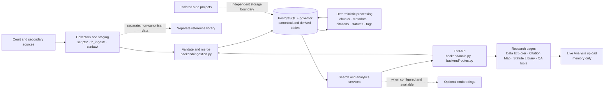

# iLit architecture overview

This document is a plain-language map for contributors and technical reviewers.
The implementation and generated references remain authoritative; the
[system reference](../SYSTEM_REFERENCE.md) explains current behavior in more
depth.

## At a glance

Collectors acquire or stage source material; validated case records enter
canonical ingestion and merge policy. PostgreSQL stores cases, source history,
and separate derived products. Deterministic processing creates chunks,
metadata, case citations, statute references, tags, and outcomes. Search and
analytics services read those records for API responses and pages. The Statute
Library serves imported legislation sections and point-in-time statute versions
where the versioned source data is available. Embeddings are an optional
retrieval aid, not a replacement for source text or evidence.

Live Analysis is a distinct path: the supplied DOCX or text-based PDF is read
in memory for analysis and is not written to the case database. Legislation and
other reference-library documents, staging collections, Federal Court activity
data, test data, and isolated side-project data remain distinct from canonical
judgment records.

## Where it runs

The live application and PostgreSQL/pgvector database run together on one
workstation. There is no cloud-hosted production database. GitHub stores the
source repository and runs CI; cloud development sessions do not connect to the
live database. A local contributor can run the API against their own configured
PostgreSQL/pgvector instance.

The application password gate and request audit log are disabled unless
explicitly configured. Upload and parsing limits are active by default and can
be adjusted with the `LITINTEL_MAX_*` environment variables. See
[README.md](../README.md) for the short setup/test instructions and
[SYSTEM_REFERENCE.md](../SYSTEM_REFERENCE.md) for configuration details.

## Main data tables

The generated [schema reference](SCHEMA_REFERENCE.generated.md) lists every
column, index, and relationship. These are the main groups in plain language:

| Table or group | What it represents |
| --- | --- |
| `cases` | Canonical decision records, including citation identity, text, and normalized metadata |
| `case_sources`, `ingestion_runs` | Source identity, provenance, hashes, merge history, and ingestion-run counts |
| `case_chunks` | Stored passages or structural chunks linked to a case |
| `case_chunk_embeddings`, `recent_case_chunk_embeddings` | Optional vector representations used for similarity retrieval |
| `citations`, `citation_metrics` | Case-citation occurrences, their evidence locations and resolution state, plus case-level metrics |
| `statute_references` | Separate statute or instrument mentions and their evidence locations |
| `statutes`, `statute_versions`, `statute_sections` | Imported federal statutes, their in-force versions, and the sections for each version |
| `legislation_documents`, `legislation_sections` | Separate reference-library authorities and indexed sections |
| `case_tags`, `case_tagging_status` | Evidence-backed legal tags and the processing status for tag layers |
| `case_outcomes` | Versioned outcome classifications with confidence and source evidence |
| `judge_profiles`, `case_judge_profiles` | Normalized judges and links from judges to decisions |
| `saved_searches`, `search_alerts` | User-configured searches and recorded alert state |
| `fc_activity_cases`, `fc_activity_documents`, `fc_activity_classifications`, `fc_activity_motions`, `fc_activity_summaries`, `fc_activity_alerts` | Federal Court procedural/activity data and derived classifications, separate from judgments |
| `fc_procedural_history` | Separate Federal Court docket/procedural-history records |
| `a2aj_cases`, `a2aj_citation_edges`, `a2aj_case_map` | External A2AJ citation-network records and explicit mappings to canonical cases |

Treat citations, statute references, metadata, tags, outcomes, source records,
and embeddings as distinct layers. A source record or activity event is not
itself a judgment.

## Data sources and use

The project preserves source identity and applicable terms as data is staged
and ingested. Broad source categories include official court material,
secondary legal services, third-party datasets such as A2AJ, government
legislation and guidance used as reference material, and synthetic test data.
Unofficial copies must not be treated as authoritative legal text, and
reference-library documents do not enter canonical case tables. Source
priority supports merge decisions; it is not proof of accuracy or permission
to reuse.

For the source-by-source status, known limits, source handling rules, and
licence/terms notes, see the
[Data Source Register](DATA_SOURCE_REGISTER.md). Verify critical legal
propositions against authoritative records and follow upstream terms.

## Repository map

| Location | Responsibility |
| --- | --- |
| `backend/` | Application, API, persistence, processing, retrieval, and page builders; full inventory below |
| `alembic/` | Deployable schema migrations |
| `scripts/` | Source acquisition, import, enrichment, evaluation, documentation generation, and operations |
| `fc_ingest/` | Federal Court source-specific staging and collection |
| `canlaw/` | Local source archive and staging tools |
| `data/` | Local source, evaluation, reference-library, and runtime artifacts |
| `docs/` | Architecture, source governance, setup, and generated references |
| `tests/` | Automated behavior and contract tests |
| `side_projects/` | Independent utilities and datasets outside the canonical case workflow |
| `legacy/` | Archived or reference-only materials |
| `.swm/` | Connected walkthroughs for system architecture and workflows |
| `.github/` | CI and repository automation |

## Backend file inventory

Each file currently under `backend/` is listed once. The documentation contract
test checks that these paths continue to exist.

| File | Responsibility |
| --- | --- |
| `backend/analytics_service.py` | Analytics, judge profiles, and Federal Court activity service |
| `backend/audit.py` | Optional metadata-only request audit middleware |
| `backend/batch_jobs.py` | Batch calculations and cache handling for discussion-unit work |
| `backend/case_comparison.py` | Read-only case facts, outcome provenance, and distinct shared/unique legal signals |
| `backend/case_formatter.py` | Deterministic formatting of stored decision text for the reader |
| `backend/case_summary.py` | Read-only stored quick-summary API projection with exact paragraph evidence |
| `backend/case_processing.py` | Coordinates ordered case-processing stages |
| `backend/case_reader_ui.py` | Builds the case reader with statute-reference integration |
| `backend/citation_map.py` | Citation graph and authority analytics |
| `backend/citation_intelligence_prompts.py` | Improved LLM prompts for citation intelligence analysis (unit-level issue assessment) |
| `backend/citation_pipeline/__init__.py` | Citation-extraction package exports |
| `backend/citation_pipeline/canlii.py` | CanLII source adapter for citation extraction |
| `backend/citation_pipeline/models.py` | Citation candidate and extraction data shapes |
| `backend/citation_pipeline/pipeline.py` | Runs citation rules, ranks, and filters overlaps |
| `backend/citation_pipeline/rules.py` | Deterministic citation extraction rules |
| `backend/citation_refine/__init__.py` | Second-pass citation and statute refinement package |
| `backend/citation_refine/cases.py` | Refines case-citation candidates |
| `backend/citation_refine/context.py` | Shared whole-document context for refinement |
| `backend/citation_refine/instruments.py` | Instrument registry for law-reference refinement |
| `backend/citation_refine/laws.py` | Refines statute and treaty references |
| `backend/citation_refine/models.py` | Shared refinement data shapes |
| `backend/citation_refine/pinpoints.py` | Parses structured citation pinpoints |
| `backend/citation_refine/resolution.py` | Links refined references to cases, paragraphs, and provisions |
| `backend/citations.py` | Extracts, validates, resolves, and measures citation evidence |
| `backend/contextual_authority/__init__.py` | Contextual-authority analysis package |
| `backend/contextual_authority/context_units.py` | Builds contextual text units for analysis |
| `backend/contextual_authority/discussion_units.py` | Deterministic paragraph features and discussion-unit boundaries |
| `backend/contextual_authority/models.py` | Contextual-authority data models and text hashing |
| `backend/contextual_authority/observations.py` | Observation and evidence structures for contextual analysis |
| `backend/contextual_authority/subthemes.py` | Groups discussion-unit subthemes |
| `backend/contextual_authority/teacher_contract.py` | Validates report-only teacher/evaluation outputs |
| `backend/contextual_authority/voting.py` | Voting helpers for contextual review |
| `backend/contextual_intelligence.py` | Contextual tag, statute, and citation intelligence service |
| `backend/database.py` | SQLAlchemy engine, sessions, ORM schema, and database setup |
| `backend/deidentify.py` | Reversible document de-identification |
| `backend/deidentify_names.py` | Finds personal names for the de-identification tool |
| `backend/discussion_units_sandbox.py` | Read-only cohort search for the discussion-unit experiment |
| `backend/document_structure.py` | Maps source HTML structure to plain text |
| `backend/embedding_providers.py` | Selects and configures embedding providers |
| `backend/fc_activity.py` | Normalizes Federal Court activity source records |
| `backend/fc_activity_insights.py` | Aggregates Federal Court activity summaries for display |
| `backend/ingestion.py` | Canonical create/merge policy and source provenance |
| `backend/intelligence.py` | Derives case outcomes, roles, issues, and related metadata |
| `backend/judge_issue_record.py` | Aggregates judge-linked issue outcomes with explicit denominators |
| `backend/legal_tagger.py` | Deterministic evidence-bearing legal tags |
| `backend/legal_tagger_v2.py` | High-precision whitelist tagging comparison layer |
| `backend/legal_tagger_v3.py` | V3 deterministic legal-tag matching layer |
| `backend/live_analysis.py` | In-memory uploaded-document analysis and citation resolution |
| `backend/main.py` | FastAPI app, startup, health, access middleware, and router inclusion |
| `backend/memo_authority_suggestions.py` | Bounded distinct-citation and stored-outcome suggestions for ephemeral memos |
| `backend/memo_citation_check.py` | Checks uploaded legal memos for citation completeness |
| `backend/memo_suggestion_models.py` | Additive descriptive memo-authority response contracts |
| `backend/metadata.py` | Facade for deterministic source-metadata extraction |
| `backend/metadata_outcomes.py` | Derives outcome and government-role metadata |
| `backend/metadata_subjects.py` | Derives subject metadata |
| `backend/models.py` | Pydantic request and response contracts |
| `backend/pages/__init__.py` | HTML page-builder package |
| `backend/pages/about_content.html` | Content template for the About and architecture surface |
| `backend/pages/case_compare.py` | Searchable side-by-side decision comparison page |
| `backend/pages/case_quick_summary.py` | Additive formatted-reader Quick summary renderer and verified paragraph links |
| `backend/pages/citation_map.py` | Citation Map page builder |
| `backend/pages/citation_pass.py` | Citation Pass QA page builder |
| `backend/pages/data_explorer.py` | Primary Data Explorer interface builder |
| `backend/pages/deidentify.py` | De-identification page builder |
| `backend/pages/discussion_units_sandbox.py` | Experimental discussion-unit page builder |
| `backend/pages/explorer_snapshots.css` | Styles for Explorer snapshot views |
| `backend/pages/explorer_snapshots.js` | Browser behavior for Explorer snapshot views |
| `backend/pages/fc_analytics.py` | Federal Court activity analytics page |
| `backend/pages/issue_brief.py` | Printable source-linked issue brief page |
| `backend/pages/judge_outcomes.py` | Judge outcomes page builder |
| `backend/pages/live_analysis.py` | Live Analysis page builder |
| `backend/pages/memo_authority_suggestions.py` | Escaped descriptive renderer for additive memo suggestions |
| `backend/pages/memo_citation_check.py` | Memo citation-check page builder |
| `backend/pages/prototype.py` | Prototype explorer page builder |
| `backend/pages/quick_search.py` | Lightweight search page builder |
| `backend/pages/research.py` | Experimental research page builder |
| `backend/pages/saved_searches.py` | Saved-search and alert page builder |
| `backend/pages/statute_viewer.py` | Statute Library page builder for statute versions and sections |
| `backend/pages/tag_analytics.py` | Legal-tag analytics page builder |
| `backend/pages/tag_finder.py` | Tag-based case similarity page builder |
| `backend/pages/testing.py` | API and search testing page builder |
| `backend/pages/theme_explorer.py` | Theme discovery page builder |
| `backend/paragraph_similarity.py` | Bounded paragraph matching using stored evidence |
| `backend/query_syntax.py` | Parses Case Search query operators and builds the interpretation echo |
| `backend/reader_service.py` | Case-reader, citation-pass, and metadata formatting services |
| `backend/resource_limits.py` | Upload and parsed-document size limits and validation |
| `backend/routes.py` | API contracts, request orchestration, and page integration |
| `backend/search_matching.py` | Whole-token identity matching shared by search queries |
| `backend/search_service.py` | Case and passage search/retrieval |
| `backend/statute_consideration.py` | Aggregates descriptive decision statistics for statutory sections |
| `backend/statute_versioning.py` | Selects statute versions by decision date and links references to versions |
| `backend/statutes.py` | Statute identity and citation parsing |
| `backend/text_generation_providers.py` | Optional hosted/local text-generation provider selection |
| `backend/theme_discovery.py` | Groups discussion-unit subthemes for theme discovery |
| `backend/unit_search.py` | Searches discussion units with semantic and keyword matching |

The test suite validates this inventory and the README route list against the
generated API reference. The generated references are rebuilt from code and
must not be edited by hand.
