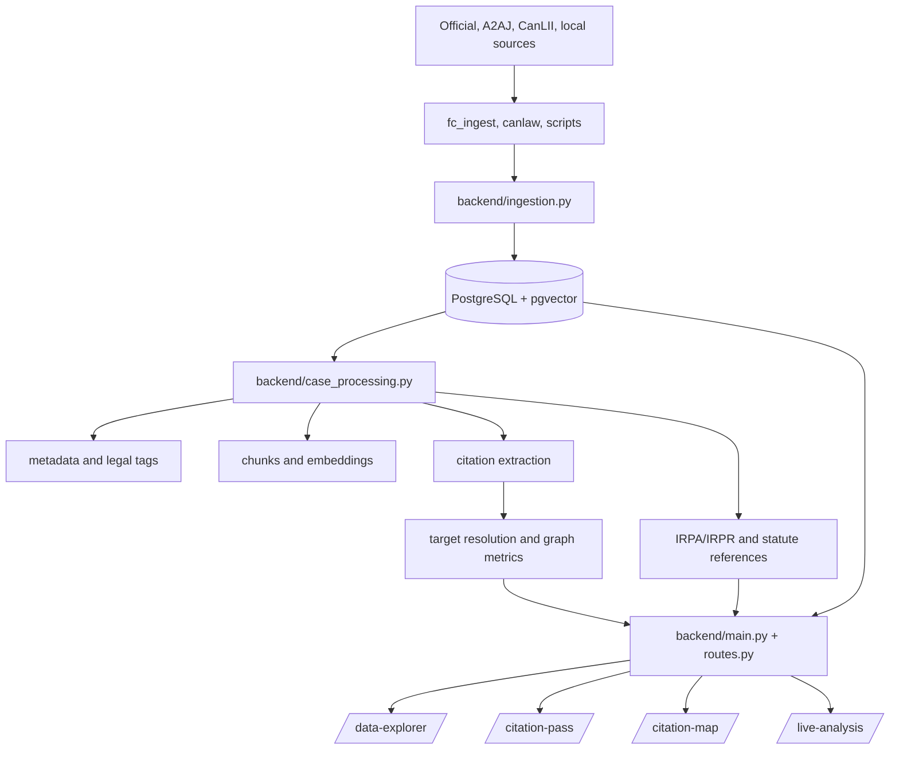

# Swimm Documentation And Project Manager Transition

Last reviewed: 2026-09-03

## Purpose

This document is the bridge between the current hand-maintained documentation
set, the Swimm workspace, and the workspace-level project-manager agent
workflow.

Swimm is the source of truth for connected explanation, architecture rationale,
ownership boundaries, and workflow context. It should document and connect the
implementation that exists. Source code, migrations, generated references, and
executable runbooks remain authoritative for exact implementation, live counts,
API contracts, database schema, and reproducibility; Swimm links to those
sources rather than duplicating their changing details.

### Automation boundary

The repository now runs `.github/workflows/documentation-sync.yml` on pushes and
pull requests. It checks generated API, schema, and script-catalog references
with `scripts/check_generated_docs.py` and fails on drift. This is a repository
consistency check only: it does not publish edits to Swimm or rewrite committed
documentation. Swimm walkthroughs remain manually updated at the same
checkpoint as behavior or ownership changes.

### Mandatory task checkpoint

Every task executed by the project manager or a delegated subagent must update
the relevant Swimm walkthrough and canonical repository document before it is
marked complete. The durable task record must name both updated paths and the
focused validation evidence. If no walkthrough exists for the owner surface,
the task is blocked until one is created or the documentation gap is explicitly
recorded.

## Recommended Swimm Pass

Create or import the following walkthroughs in this order. Keep each walkthrough
small enough that a future code change can update it without rewriting the
whole project map.

| Walkthrough | Starting point | What it should explain | Owner |
| --- | --- | --- | --- |
| System map | `backend/main.py` | Application startup, route registration, and health surface | Backend/runtime |
| Research request | `backend/routes.py` | Search request to query, reader payload, and UI response | API/research UI |
| Processing pipeline | `backend/case_processing.py` | Metadata, chunks, citations, and statutes as separate stages | Data quality |
| Source-to-canonical flow | `backend/ingestion.py` | Staging, provenance, merge priority, and canonical writes | Ingestion |
| Citation evidence | `backend/citations.py` | Extraction, offsets, resolution, metrics, and QA boundaries | Citation QA |
| Database map | `backend/database.py` and `alembic/` | ORM entities, migrations, and pgvector responsibilities | Data/platform |
| Operational run | `scripts/run_overnight.py` and `OVERNIGHT.md` | Locks, bounded jobs, resume behavior, and recovery | Operations |
| Active UI | `backend/routes.py` and `docs/RESEARCH_UI_GUIDE.md` | Data Explorer, inline reader, Citation Map, and legacy boundaries | Research UI |
| Technical debt register | Swimm: Technical Debt Register and Improvement Queue | Evidence-backed debt, opportunities, owners, and revisit triggers | Governance |
| Architecture decisions | Swimm: Architecture Decisions and Design Rationale | Durable rationale, options, consequences, and open decisions | Architecture |
| Evaluation framework | Swimm: Evaluation Framework and Quality Metrics | Metric definitions, benchmark structure, and release gates | Quality |

For every walkthrough, include: entry point, important files, data passed
between steps, invariants, failure modes, and the narrowest validation command.
Prefer links to source files and generated references over copied code blocks.

## Repository Map



### Ownership Boundaries

| Concern | Owning surface | Must remain true |
| --- | --- | --- |
| Application startup | `backend/main.py` | Startup and route behavior are validated independently of UI markup |
| API and generated UI | `backend/routes.py` | Browser-owned offsets are never substituted for backend evidence offsets |
| Case citations | `backend/citations.py` | Case citations stay separate from statutes and metadata |
| Statutes/instruments | `backend/citations.py` | IRPA/IRPR nested forms such as `34(1)(f)` remain release-sensitive |
| Canonical data | `backend/database.py`, `backend/ingestion.py` | Provenance, source priority, and hashes are preserved |
| Schema evolution | `alembic/` | Migrations are authoritative for deployment changes |
| Operational jobs | `scripts/run_overnight.py`, `OVERNIGHT.md` | Bulk work is bounded, resumable, and lock-protected |
| Active research workflow | `/data-explorer` | `/case-reader` is a compatibility redirect; QA pages are not the primary product |
| Isolated data | `side_projects/` | Side-project tables and routes do not enter canonical case workflows |

## Improvement Queue For Managed Delivery

Use this queue as the initial Swimm-linked improvement board. Do not broaden
scope until each item has an owner, a test, and a documented acceptance check.

| Priority | Improvement | Evidence of completion |
| --- | --- | --- |
| P0 | Repair or reconcile the known FC document-scraper test collection error | Full suite collects and the result is recorded honestly |
| P0 | Add browser smoke coverage for Data Explorer and inline reader | Playwright checks load, search, reader open/close, highlights, and mobile layout |
| P0 | Establish a deterministic data-quality report | Orphans, malformed citations, duplicate edges, and null metadata are measured |
| P0 | Keep IRPA/IRPR extraction precise | Nested section forms, including `34(1)(f)`, have positive, negative, and offset fixtures |
| P1 | Add retrieval and endpoint performance baselines | Fixed corpus/sample reports p50/p95 and bounded query behavior |
| P1 | Add citation context evidence | Context windows are persisted, exposed, and covered by exact-span tests |
| P1 | Reduce documentation drift | Generated references are refreshed by a documented checkpoint command |
| P2 | Build a research workbench | Save/resume, notes, pinned authorities, and evidence exports have route and UI contracts |

## Project Manager Agent Framework

The workspace-level manager is implemented at
`.github/agents/project-manager.agent.md`. Select **AI CaseLibrary Project
Manager** in VS Code chat for a bounded outcome that should be planned,
implemented, validated, documented, and handed off with minimal chat steering.

Use `.github/prompts/managed-task.prompt.md` to start a structured task from
the prompt picker. The agent creates durable multi-step task records beneath
`.github/project-manager/tasks/` using
`.github/project-manager/TASK_TEMPLATE.md`. Workflow status, escalation, and
completion standards are in `.github/project-manager/README.md`.

The framework does not replace this transition document, the canonical docs,
or domain ownership. It operationalizes them by requiring an owner, a
falsifiable check, evidence, rollback/recovery, and documentation updates for
each completed task.

For open-ended or explicitly strategic requests, the manager also translates
the product goal into bounded requirements, compares viable approaches for
major changes, and ranks improvement opportunities by value, cost, risk, and
maintainability. Routine maintenance remains lightweight. Prompt and workflow
recommendations belong under `.github/project-manager/improvements/` and need
evidence before adoption.

For eligible multi-step work, the manager coordinates rather than doing all
grunt work directly: the lowest-cost capable delegate handles bounded inventory,
search, mechanical analysis, and routine evidence gathering, while the manager
retains decisions, risk ownership, synthesis, and final validation.

## Handoff Contract For The Project Manager Agent

The future manager agent should coordinate work, not silently redefine domain
truth. Every proposed task should carry this compact record:

```text
Task:
Why now:
Owner surface:
Dependencies:
Risk boundary:
Smallest falsifiable check:
Acceptance criteria:
Docs or generated references to refresh:
Rollback or recovery:
Evidence:
```

The manager loop is:

1. Read `SYSTEM_REFERENCE.md`, `DOCS_INDEX.md`, `.github/copilot-instructions.md`,
   this document, and the relevant Swimm walkthrough before assigning work.
2. Choose one owning surface and state one falsifiable behavior expectation.
3. Assign the smallest implementation slice and its focused validation command.
   4. The manager also translates strategic goals into bounded product and technical
      work, evaluates alternatives for major changes, and reviews improvement
      opportunities when work is open-ended or explicitly strategic. These reviews
      are proportional: routine maintenance does not trigger broad analysis. Prompt
      or workflow recommendations belong under
      `.github/project-manager/improvements/` and require evidence before adoption.
4. Require evidence before marking the task complete: test output, generated
   documentation, or a bounded browser/API check as appropriate.
5. Update the relevant canonical document and Swimm walkthrough in the same
   checkpoint.
6. Keep unrelated worktree changes intact and record blockers rather than
   disguising them as completed work.

### Manager Guardrails

- Never treat generated API/schema/script documents as hand-edit targets.
- Never run competing bulk database writers.
- Never call staged, discovered, or activity data an official captured judgment.
- Never merge statute extraction into case-citation extraction.
- Never claim a full-suite or browser result that was not actually run.
- Never let an agent expand a task beyond its stated owner surface without a
  new acceptance check.

## Swimm Maintenance Rule

When a change crosses one of the ownership boundaries above, update the linked
walkthrough and the canonical repository document in the same change set. If a
walkthrough becomes stale, label the gap and point to the authoritative source;
do not preserve a visually complete but inaccurate diagram.

The current Swimm set includes the system, active UI, ingestion, citation,
database, operations, Federal Court, CanLaw, future-state, technical-debt,
architecture-decision, and evaluation walkthroughs.
Use the P0 queue to drive cleanup through the implemented manager framework.
Add a walkthrough when a new owner surface appears, rather than allowing the
agent to infer an undocumented boundary.