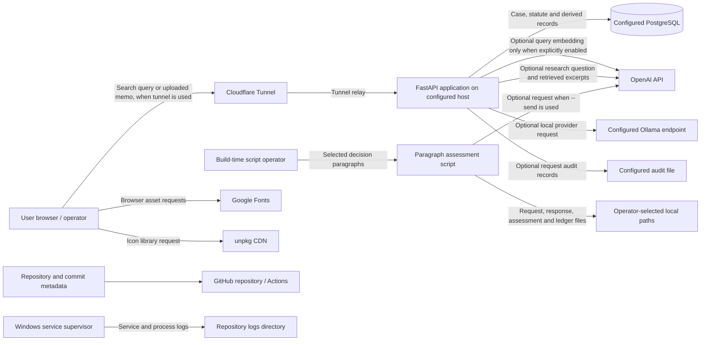

# Data flow

This diagram describes observed code paths, not the configuration of the
currently running machine. External provider region, contractual retention,
and deployment logging are not established here.

## Evidence table

| Flow or fact | What the code shows | What is stored or logged | Evidence |
| --- | --- | --- | --- |
| Decisions and statute text | Case fields and statute documents/sections are PostgreSQL ORM records. The application database URL is environment-selected. | Canonical and derived records in configured PostgreSQL. The actual host, region, backup, and encryption state are not determined by these declarations. | [backend/database.py:61-78](../../backend/database.py#L61-L78) [backend/database.py:85-119](../../backend/database.py#L85-L119) [backend/database.py:489-515](../../backend/database.py#L489-L515) |
| Search query embeddings | `QUERY_EMBEDDING_PROVIDER` defaults to `none`, so semantic/hybrid requests use lexical ranking without a model call. OpenAI query embedding is an explicit opt-in; `local` selects the configured local provider. | Case embeddings are database fields; the query itself is not written by this search operation. Explicit saved searches store the query locally. | [backend/query_embedding_providers.py](../../backend/query_embedding_providers.py) [backend/search_service.py](../../backend/search_service.py) [backend/routes.py](../../backend/routes.py) |
| Optional research generation | `/research` first retrieves local case excerpts, then sends the question and excerpts to the selected provider. The provider defaults to OpenAI; `TEXT_GENERATION_PROVIDER=local` selects configured Ollama. | The route returns an answer and source excerpts. This code does not persist the prompt or answer as a canonical case record. Provider-side retention is not established. | [backend/routes.py:3851-3903](../../backend/routes.py#L3851-L3903) [backend/text_generation_providers.py:77-95](../../backend/text_generation_providers.py#L77-L95) |
| Memo upload | The browser posts the selected file to the same-site `/memo-citation-check` route. The route invokes deterministic citation analysis and database lookups; it does not call the text-generation provider. | No application-managed upload record is created in the reviewed handler. The response contains analysis. The route does not add the explicit no-store headers used by the separate live-analysis routes. Temporary multipart spooling and upstream logging are not determined here. | [backend/pages/memo_citation_check.py:17-19](../../backend/pages/memo_citation_check.py#L17-L19) [backend/routes.py:1040-1054](../../backend/routes.py#L1040-L1054) [backend/memo_citation_check.py:102-129](../../backend/memo_citation_check.py#L102-L129) [backend/routes.py:998-1014](../../backend/routes.py#L998-L1014) |
| Build-time paragraph assessment | The script prepares paragraph-index/text prompts. It sends to OpenAI only when run in send mode; it writes generated request/response and Markdown files to caller-provided paths. | Local output paths and optional ledger are operator-selected. The script's model report sets canonical/contextual write counts to zero. | [scripts/package_discussion_units_llm.py:137-160](../../scripts/package_discussion_units_llm.py#L137-L160) [scripts/package_discussion_units_llm.py:391-405](../../scripts/package_discussion_units_llm.py#L391-L405) [scripts/package_discussion_units_llm.py:472-552](../../scripts/package_discussion_units_llm.py#L472-L552) [scripts/run_model_paragraph_experiment.py:132-143](../../scripts/run_model_paragraph_experiment.py#L132-L143) |
| Cloudflare Tunnel | The Windows supervisor starts the application on loopback and starts `cloudflared` with a local config path. When traffic uses that tunnel, application traffic is relayed through the configured Cloudflare service. | Tunnel stdout/stderr are redirected to local log files; Cloudflare-side traffic visibility, logging, and retention depend on external configuration/provider behavior and are unverified. | [scripts/service/run_site.ps1:12-15](../../scripts/service/run_site.ps1#L12-L15) [scripts/service/run_site.ps1:48-54](../../scripts/service/run_site.ps1#L48-L54) [docs/LOCAL_DEPLOYMENT_SETUP.md:101-117](../LOCAL_DEPLOYMENT_SETUP.md#L101-L117) |
| Google Fonts and unpkg | Browser pages request Google Fonts CSS and a Lucide JavaScript asset from unpkg. The asset URLs do not include search queries or uploaded document content. | The browser makes external asset requests; code does not establish provider-side request metadata, logging, or retention. | [backend/pages/memo_citation_check.py:10-11](../../backend/pages/memo_citation_check.py#L10-L11) [backend/pages/citation_map.py:10-12](../../backend/pages/citation_map.py#L10-L12) |
| GitHub | The repository has GitHub Actions workflows for pushes and pull requests; the workflows check out repository contents and produce CI results/logs. | Repository code, commit metadata, and workflow output are handled by GitHub when those workflows run. Repository visibility and Actions retention settings are not established by workflow code. | [.github/workflows/tests.yml:3-5](../../.github/workflows/tests.yml#L3-L5) [.github/workflows/tests.yml:15-37](../../.github/workflows/tests.yml#L15-L37) [.github/workflows/documentation-sync.yml:3-26](../../.github/workflows/documentation-sync.yml#L3-L26) |
| Audit and supervisor logging | Optional audit records contain selected request metadata. The service supervisor writes status messages and redirects app/tunnel stdout/stderr to files under the repository `logs` directory. | Audit rotation is defined in code; supervisor log rotation/retention is not defined in the shown script. See [logging and retention](logging-and-retention.md). | [backend/audit.py:26-43](../../backend/audit.py#L26-L43) [backend/audit.py:64-94](../../backend/audit.py#L64-L94) [scripts/service/run_site.ps1:12-20](../../scripts/service/run_site.ps1#L12-L20) [scripts/service/run_site.ps1:48-67](../../scripts/service/run_site.ps1#L48-L67) |

## Audit fields and omissions

When enabled, the request audit record has UTC time, generated request ID,
method, matched route template (or `<unmatched>`), status, duration in
milliseconds, and an HMAC-SHA256 client-address hash. A raw address is added
only when `CASELIBRARY_AUDIT_LOG_RAW_ADDRESS=true`. The middleware does not
include request bodies, filenames, query strings, headers, or cookies. This
describes only this audit middleware; it does not establish what Uvicorn,
Windows, Cloudflare, browser, or any other proxy/service logs. [backend/audit.py:49-83](../../backend/audit.py#L49-L83)
[docs/CONFIGURATION_REFERENCE.md:57-65](../CONFIGURATION_REFERENCE.md#L57-L65)

## Transfer boundary

The diagram's direct browser asset requests and the server-side OpenAI,
Cloudflare tunnel, and GitHub Actions flows are different paths. The code does
not establish the provider region, provider-side logging/retention, tunnel
account settings, or deployed environment. See [subprocessors](subprocessors.md)
and the [live-PC verification register](README.md#live-pc-verification-register).
